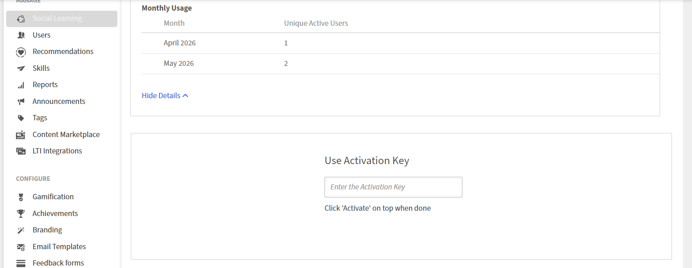
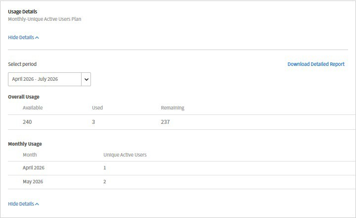

# 仮想コーチの使用の監視

Adobe Learning Managerでバーチャルコーチの使用状況データを表示し、月間アクティブユーザー(MAU)のクレジット使用量を追跡して、学習者のパフォーマンスレポートにアクセスできます。

## アカウントに対してバーチャルコーチを有効にする

バーチャルコーチは、Adobe Learning Managerのアドオンとして使用できます。 購入後、プロビジョニングによりアクティベーションキーが生成され、アカウント管理者に電子メールで送信されます。

1. Adobe Learning Managerに管理者としてログインします。
2. 左側のナビゲーションウィンドウから&#x200B;**請求**&#x200B;ページに移動します。
3. **仮想コーチ**&#x200B;セクションで、電子メールで受け取ったアクティベーションキーを入力します。
4. 「**適用**」を選択します。アカウントに対して仮想コーチが有効になっています。
   

有効化されると、機能が有効であることを確認するアプリ内通知が届きます。 4つのサンプルロールプレイシナリオがコンテンツライブラリに自動的に追加されるため、作成者はすぐに作業を開始できます。

>[!NOTE]
>
>アクティベーションキーは、プロビジョニング中に自動生成され、電子メールで共有されます。 アクティベーションキーがない場合は、Adobe Learning Managerカスタマーサクセスマネージャー(CSM)にお問い合わせください。

## MAUクレジット残高の表示

月間アクティブユーザー(MAU)クレジットは、各月にバーチャルコーチを使用した一意の学習者の数をカウントします。

1. **請求**&#x200B;ページに移動します。
2. **仮想コーチ**&#x200B;セクションで、**利用状況の詳細を表示**&#x200B;を選択します。
3. **期間の選択**&#x200B;ドロップダウンを使用して、確認する日付範囲を選択します。
   

   **全体的な使用量**&#x200B;のテーブルは次を示しています：

   a. **使用可能：**&#x200B;購入したMAUクレジットの合計\
   b. **使用済み：**&#x200B;これまでの使用済みクレジット\
   c. 残り&#x200B;**クレジット：**&#x200B;残りの契約期間で利用可能なクレジット

   **毎月の使用数**&#x200B;のテーブルには、アクティブな学習者の一意の数が暦月ごとに表示されます。

4. 完全な使用状況データをエクスポートするには、**詳細レポートのダウンロード**&#x200B;を選択します。

## MAUクレジットの消費方法

MAUクレジットは、学習者が暦月でバーチャルコーチセッションを完了した場合に消費されます。 同じ学習者が同じ月に追加のセッションを行った場合、追加のクレジットは消費されません。

| シナリオ | 消費されたMAU |
|----------|--------------|
| 1人の学習者が1月に5つのセッションを完了 | 1 |
| 同じ学習者が1月と2月の両方でバーチャルコーチを使用 | 2 （1か月あたり1） |
| 1月に1つのセッションを完了する学習者はそれぞれ100人 | 100 |

_MAUクレジットは、各学習者が完了するセッションの数に関係なく、暦月ごとに一意の学習者ごとにカウントされます。_

契約期間の終了時に未使用のクレジットは失効し、繰り越しはできません。

### 例1：学習者1人、セッションが複数ある場合

シナリオ：サラは、1月に5つのバーチャルコーチセッションを完了します。

* 1月のセッション： 5
* 使用済みMAU: 1
* 理由：サラは、何度も練習したにもかかわらず、1月の1人のユニークなユーザーとしてカウントされます。

### 例2：同じ学習者、複数月

シナリオ： Sarahは1月と2月の両方にバーチャルコーチを使用しています。

* 1月のセッション： 3
* 2月のセッション： 2
* 消費されたMAU: 2（1月は1 + 2月は1）
* 理由：暦月ごとにカウントされます。

### 例3：複数の学習者、同じ月

シナリオ： 1月に1回のバーチャルコーチセッションを完了した営業担当者は100人です。

* 合計セッション数： 100
* 使用済みMAU: 100
* 理由：一意の学習者は、その月に1つのMAUとしてカウントされます。

### 例4：時間の経過に伴うチームの練習

シナリオ： 50人のチームが1年間でバーチャルコーチを使用します。

| 月 | アクティブな学習者 | 今月消費されたMAU | 累積MAU |
|------|----------------|--------------------------|-----------------|
| anuary | 0 | 0 | 0 |
| ebruary | 5（5人は反応しなかった） | 5 | 5 |
| 3 月 | 0 （50の練習利得すべて） | 0 | 45 |
| 4 月 | 0 | 0 | 75 |

## バーチャルコーチレポートの表示

「**管理**」セクション/**レポート**」セクション/**AIレポート**&#x200B;ページには、組織全体のすべての仮想コーチアクティビティの使用状況とパフォーマンスに関するデータが表示されます。 **Virtual Coach**&#x200B;見出しの下には、2つのレポートがあります。

すべてのレポートがCSV形式で書き出されます。 レポートの生成には、データ・サイズに応じて数分かかる場合があります。

### 学習者の使用状況の概要

すべての学習者の毎月の使用状況データが含まれます。 このレポートを使用して、毎月バーチャルコーチを使用している学習者の数を追跡し、MAUのクレジット消費を監視し、時間の経過に伴うエンゲージメントのトレンドを特定します。

### セッションの詳細

過去90日間のすべての学習者に関するセッションレベルのデータが含まれます。 このレポートを使用して、学習者全体の個々のセッションスコア、トピックのカバレッジ、スタイルメトリックをレビューし、追加のトレーニングやコンテンツを必要とするスキルギャップを特定します。

## レポートへのアクセスとダウンロード

1. Adobe Learning Managerに管理者としてログインします。
2. 左側のナビゲーションウィンドウで&#x200B;**レポート**&#x200B;を選択します。
3. **AIレポート**&#x200B;を選択します。
4. **仮想コーチ**&#x200B;セクションで、ダウンロードするレポート、**学習者の使用状況の概要**&#x200B;または&#x200B;**セッションの詳細**&#x200B;を選択します。
   
5. メッセージが表示されたら日付範囲を選択し、「**続行**」を選択します。
6. レポートはCSVファイルとして自動的にダウンロードされます。
