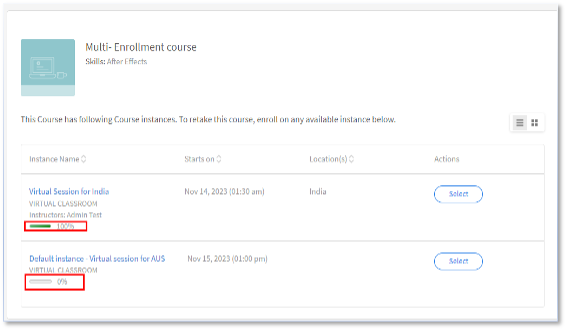

# Adobe Learning Manager の複数登録

Adobe Learning Manager では、コースに異なるインスタンスを個別に設定できます。 アカウント管理者の主な役割は、異なるタイムゾーンにまたがって VILT セッションのインスタンスを個別に作成し、場合によっては特定のユーザーグループに対してセッションを作成することです。

2023 年 7 月リリース以前は、管理者が学習者を登録する場合に登録できるインスタンスが 1 つのみでした。 学習者が別のインスタンスでコースを受講する場合、管理者はインスタンスごとにコースを 1 つずつ作成するため、たくさんのコースを作っていました。

管理者が Adobe Learning Manager の複数登録機能を利用することで、このような状況を回避できます。

## インスタンスの管理

>[!INFO]
>
>このトレーニングでは、インスタンスの詳細とインスタンスプロパティを編集する方法を学習します。    

トレーニングを起動できない場合は、<almacademy@adobe.com>に書き込んでください。

## 複数登録の仕組み

利用可能なインスタンスから学習者をコースに複数回登録することを複数登録と言います。  学習者は、登録済み、完了済み、または未開始の状態に関係なく、複数のコースインスタンスに登録できます。 作成者が[!UICONTROL 「複数登録」]トグルを有効にすると、学習者はコースの複数のインスタンスに登録できるようになります。

*設定から複数の登録を開始する*

インスタンスの進捗状況を個別に追跡できます。また、レポートを書き出して、インスタンスの進捗状況を個別に追跡できます。

## 重要なポイント

* 複数登録が適用されるのは、コースに複数のインスタンスが設定されている場合のみです。
* 複数登録オプションを有効にした状態でユーザーが複数のインスタンスに登録されると、学習者のトランスクリプトレポートのコースに新しい行が個別に作成されます（インスタンス別および学習者別で 1 行）。
* レポートの自動化設定で予測されるのが 1 コースにつき 1 行のみの場合、複数登録機能を有効にする前に、レポートの自動化設定を調整する必要があります。

## 複数登録を有効化する方法

1. 作成者としてAdobe Learning Managerアカウントにログインします。
1. 学習者が複数回登録するコースを選択します。
1. 左パネルで、**[!UICONTROL 設定]** > **[!UICONTROL 編集]** > **[!UICONTROL インスタンス構成]** > **[!UICONTROL 複数登録を有効にする]**&#x200B;を選択します。

*複数登録を有効にする*

>[!NOTE]
>
>作成者は、インスタンスの切り替えと複数登録を同時に有効にすることはできません。

## 学習者ビュー

学習者が教室や VC コースに登録したい場合、または別のコースに移動する前にコースを再度完了したい場合、複数登録機能を活用できます。

登録していない学習者がコースを選択すると、コースに関連する複数のインスタンスが画面に表示されます。 インスタンスを個別に選択して登録できます。

*インスタンスの表示*

1つのインスタンスに登録した後、右側のパネルで「すべてのインスタンスを表示」オプションを選択すると、他のインスタンスに登録できます。

*インスタンスへの登録*

インスタンスの進捗状況は、次の場所で個別に追跡できます。

*各インスタンスの進捗状況の追跡*

## 管理者による複数登録の変更

**登録：**

学習者を登録する際に、次のチェックボックスを有効にできます。

*「選択した学習者は、このコースの他のインスタンスに既に登録されている可能性があります。 これらの学習者がインスタンスに登録することも許可します」*

*管理者の登録オプション*

学習者が既に1つのインスタンスに登録されていて、管理者が別のコースインスタンスに登録しようとしている場合は、「はい」を選択します。

## 報告

同じコースの 2 つのインスタンスに登録している学習者の場合、2 つの行がコースインスタンスに個別に作成されます。 レポートには、インスタンスの進行状況も表示されます。
