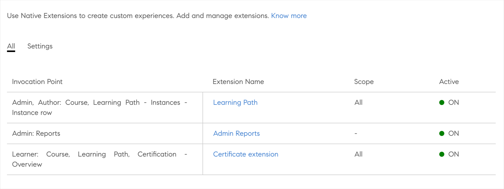

# ネイティブな拡張機能

Adobe Learning Manager のネイティブバージョンで、エクスペリエンスをカスタム設定できるようになりました。これにより、それほど複雑ではないユースケースでヘッドレスを使用する必要がなくなります。 アプリをカスタム作成し、学習者、マネージャー、管理者、作成者またはインストラクターのワークフローで、ネイティブバージョンのさまざまな場所に配置できるようにもなりました。

Adobe Learning Manager では、管理者、作成者、学習者、マネージャー、インストラクターのアプリで 15 個の起動ポイントがサポートされています。

## 拡張機能を作成する

1. 管理者として、左側のパネルから&#x200B;**[!UICONTROL 「ネイティブ拡張機能」]**&#x200B;を選択します。
1. 「拡張機能を追加」を選択します。
1. **[!UICONTROL Name]**&#x200B;フィールドに拡張機能の名前を入力します。
1. **[!UICONTROL 説明]**&#x200B;フィールドに拡張機能の説明を入力します。
1. 起動ポイントを選択します。 起動ポイントとは、Adobe Learning Manager でカスタムアプリにリンクやボタンを挿入する任意の場所です。 利用できる起動ポイントは次のとおりです。

   この例では、**[!UICONTROL 管理者]**、**[!UICONTROL 作成者：コース]**、**[!UICONTROL 学習パス]** - **[!UICONTROL インスタンス]** - **[!UICONTROL インスタンス行]**&#x200B;を選択します。

   
   *呼び出しポイントの選択*

1. UIの&#x200B;**[!UICONTROL Extension Label]**&#x200B;フィールドに表示する拡張ラベルを入力します。
1. 拡張機能をホストする URL を&#x200B;**[!UICONTROL 「URL」]**&#x200B;フィールドに入力します。
1. 開く場所ドロップダウンで、モーダルで拡張機能を起動するか、新しいタブで起動するかを選択します。
1. 画面サイズを選択します。 このオプションは、前の手順で&#x200B;*アプリ内*&#x200B;モーダルを選択した場合に使用できます。

   ポップアップ内でのアクセシビリティを維持するには、webサイトの最後のフォーカス可能な要素に移動した後で、拡張機能アプリをイベントに送信して、ユーザーがTABキーを選択する必要があります。 この手順は、ポップアップ内にフォーカスを維持して、アクセシビリティをサポートするために必要です。

   ```
   window.parent.postMessage({*}
   
   { type: 'ALM_EXTENSION_APP', eventType: 'trapFocusInModal' }
   
   ,{}'');
   ```

1. 拡張機能の範囲を設定します。 次の範囲に設定できます。

   * **[!UICONTROL すべてのコース、学習パス、資格認定]** ：この拡張はすべてのコース、学習パス、資格認定に対して有効になっています。 作成者は、管理者と一緒に、一部のコース、学習パス、資格認定で無効にすることができます。
   * **[!UICONTROL 選択したコース、学習パス、資格認定]** ：この拡張機能は、すべてのコース、学習パス、資格認定に対して無効になっています。 管理者と共に、作成者は一部のコース、学習パス、資格認定でこの機能を有効にすることができます。

1. **[!UICONTROL 「アクティブにする」]**&#x200B;トグルを選択して、拡張機能を有効化します。 アクティブになると、スコープに従って、指定した起動ポイントに拡張機能が表示されます。
1. ページ右上の&#x200B;**[!UICONTROL 「保存」]**&#x200B;をクリックして、拡張機能を作成します。

## 管理者として拡張機能にアクセスする

1. 管理者として、左側のツールバーで&#x200B;**[!UICONTROL 「学習パス」]**&#x200B;を選択します。
1. コースを選択してから&#x200B;**[!UICONTROL 「学習パスを表示」]**&#x200B;を選択します。
1. 左側のパネルから&#x200B;**[!UICONTROL 「インスタンス」]**&#x200B;を選択します。
1. インスタンスセクションで&#x200B;**[!UICONTROL 「その他」]**&#x200B;を選択します。 インスタンスセクションに拡張機能が表示されます。

   
   *拡張機能の選択*

   拡張機能を選択すると、モーダルに拡張機能が表示されます。

## 作成者として拡張機能にアクセスする

1. 管理者として、左側のツールバーで&#x200B;**[!UICONTROL 「学習パス」]**&#x200B;を選択します。
1. コースを選択してから&#x200B;**[!UICONTROL 「学習パスを表示」]**&#x200B;を選択します。
1. 左側のパネルから&#x200B;**[!UICONTROL 「インスタンス」]**&#x200B;を選択します。
1. インスタンスセクションで&#x200B;**[!UICONTROL 「その他」]**&#x200B;を選択します。 インスタンスセクションに拡張機能が表示されます。

   
   *作成者として拡張機能にアクセス*

   拡張機能を選択すると、モーダルに拡張機能が表示されます。

## 拡張機能をすべて表示する

管理者は、ネイティブ拡張機能ページですべての拡張機能を表示できます。 リストを表示するには、アプリの左側のパネルで「ネイティブ拡張機能」を選択します。


*すべての拡張機能を表示*

## 拡張機能を有効または無効にする

作成者は、コースの設定ページで、コース、資格認定、学習パスの拡張機能を有効または無効に設定できます。


*拡張機能を有効にする*

## アクセスキーを共有する

登録の拡張機能を構成する場合は、アクセスキーを共有する必要があります。

このキーが生成されず、他のユーザーと共有されていない場合、登録の認証に失敗し、学習者が自分でコースに登録できないため、この点が重要です。

コースまたは学習パスと証明書に登録するために、アクセスキーを共有する必要があります。

「設定」タブで、キーを生成します。


*アクセスキーの共有*

## 拡張機能レポートをダウンロードする

レポートは次の 2 つの方法でダウンロードできます。

**拡張機能構成レポート**

1. ネイティブ拡張機能ページで、**[!UICONTROL 「拡張機能の設定レポート」]**&#x200B;を選択します。

   
   *拡張機能レポートのダウンロード*

   レポートが生成されます。

1. 「 OK 」を選択します。

   
   *レポートを生成しています*

    レポートには、次のフィールドが含まれています。

   * 延長の名前
   * 起動ポイント
   * ラベル
   * URLで開く
   * スコープ
   * ライセンス認証
   * LO の一意 ID
   * トレーニング ID
   * トレーニングの種類
   * トレーニング名

**レポートページ**

1. **[!UICONTROL レポート]** > **[!UICONTROL カスタムレポート]**&#x200B;で、**[!UICONTROL 拡張機能構成レポート]**&#x200B;を選択します。

   
   *レポートページからレポートをダウンロードする*

登録状態の構成中は、状態を&#x200B;**0 ～ 4294967295**&#x200B;の範囲にする必要があります。
