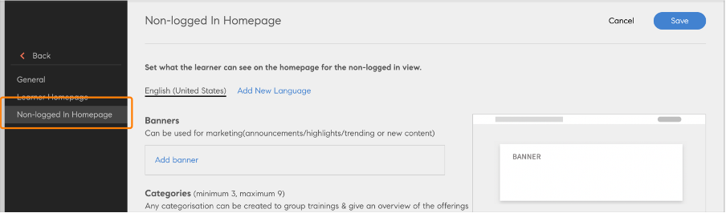
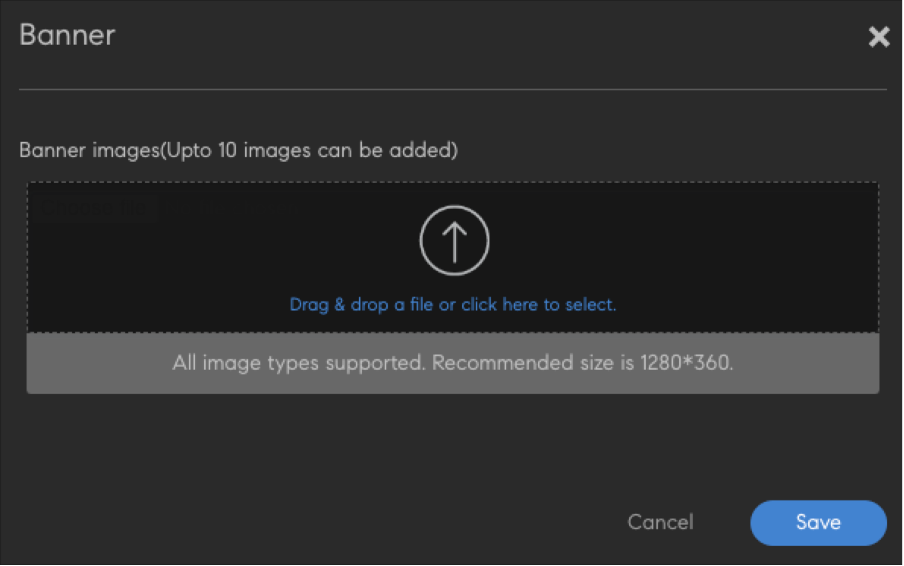
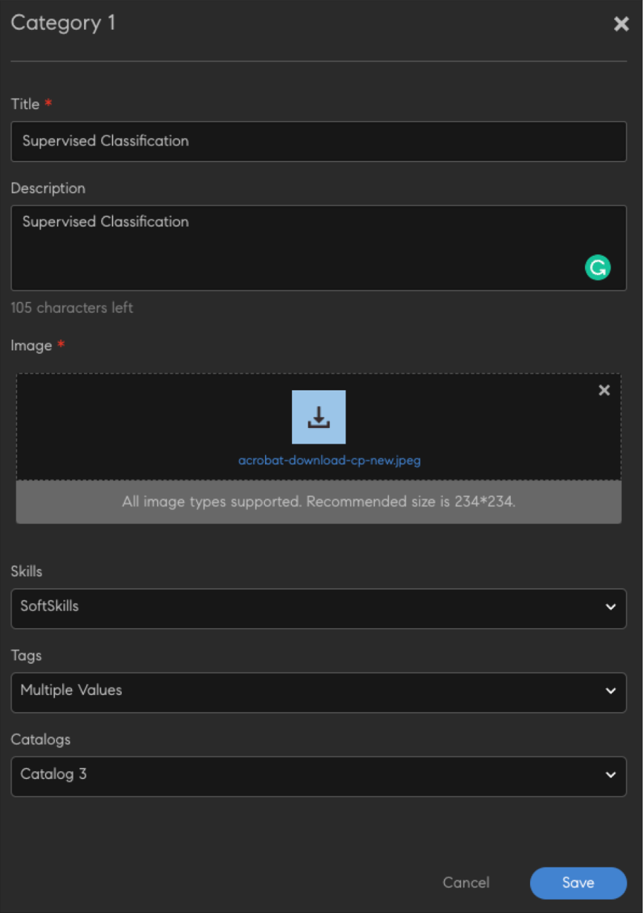

# ログインなしのエクスペリエンス（学習者向け）

Adobe Learning Managerネイティブポータルでは、ログを使用せずにトレーニングサイトにアクセスできます。 このモードを有効にすると、学習者はトレーニングサイトを検索してアクセスし、利用可能なさまざまなコースやコンテンツを確認できます。

学習者はログインなしのエクスペリエンスにより、ポータルにログインしなくてもコースを参照できます。

ログインしていないホームページを有効にするには、統合管理者が[トレーニングデータコネクター](/help/migrated/integration-admin/feature-summary/connectors.md#training-data-access)を有効にして、コネクターを設定する必要があります。

その後、コネクタからトレーニングを書き出すことができます。

>[!NOTE]
>
>「Native Learning Manager」オプションが選択されていることを確認します。

管理者は、ログインしていないユーザー向けのホームページを変更および設定できます。

## 学習者API

Adobe Learning Manager – 学習者APIを使用すると、ユーザーにカスタムの学習エクスペリエンスを提供できます。 これらのAPIを使用するには、有効なユーザートークンが必要です。このAPIは、完全にライセンスを取得し、登録された学習者が存在するワークフローの目的でのみ使用されます。

>[!IMPORTANT]
>
>ログインしていないユーザー/共有ユーザーやその他のケースをサポートするためのデータ取得には、そのまま使用しないでください。 ヘッドレスまたはAEMベースのログインなしのエクスペリエンスを構築する場合は、お問い合わせください。 お客様のご要望に応じて、適切なアプローチをご提案いたします。

ログインしていないユースケースでは、特別な処理が必要です。

**これらのAPIの適切な使用に関する質問がある場合に備えて、ソリューションアーキテクトに連絡してソリューションを確認してから、展開してください**。

## ホームページオプションの起動

Adobe Learning Managerホームページで、「**ブランディング**」を選択します。 次に、左ペインで「ホームページにログインしない」を選択します。

*[ホームページにログインしない]オプションを選択します*

## バナーの追加

マーケティングの発表に関するバナーを追加することや、その日のトレンドのトピックを特集することが可能です。 **[バナーの追加]**&#x200B;を選択します。

*バナーを追加*

バナーに使用する画像の場所を参照します。 次に、バナー画像のアクションボタンとしてリンクを指定します。

## カテゴリを追加

このコンポーネントを使用すると、タグ、スキル、カタログ別にカタログをフィルタリングできます。 このセクションには、各カテゴリのヘッダーと説明が含まれます。 クリックすると、フィルターが適用されたカタログページにリダイレクトされます。

**[!UICONTROL [カテゴリの追加]]**&#x200B;を選択します。 次に、カテゴリの詳細を入力します。

*カテゴリの追加*

カテゴリを保存します。 カテゴリがセクションに追加されます。

## カタログを追加

ログインしていないユーザーがプラットフォーム上のすべてのトレーニングを参照できるように、ユーザーのカタログを追加します。

*カタログの追加*

書き出されたすべてのトレーニングが表示されます。

## サポートされない機能

* 作業計画書は書き出されません。 ただし、学習者はログイン後に作業計画書を表示できます。
* カタログコンポーネント内の並べ替え。
* 管理アプリで使用されるデフォルトの表示設定（設定/一般/リストビュー）。
* 星評価/有効性。
* カードアイコンの設定
* 関連するスキルとタグの設定。
* カタログごとに表示される学習者アプリビュー。
* トレーニング概要ページ - カードをクリックすると「サインアップ」にリダイレクトされます。その後、トレーニング概要ページおよびインスタンスページにリダイレクトされます。
* 有効なカタログがすべて表示されます。 カタログにアクセスできない学習者には、ログインしてもカタログとトレーニングが表示されません。
* ネイティブオプションの場合、コースまたは学習パスへの変更は、リアルタイムではなく24時間後にのみ反映されます。一方、プレミアムプランの場合、変更は少なくとも3時間後に反映されます。
