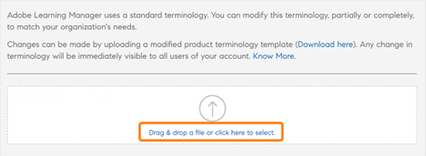
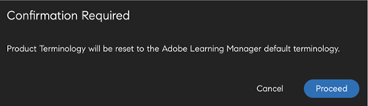

# 製品用語

>[!IMPORTANT]
>
>Adobe Learning Manager の製品用語を使用できるのは、英語版のみです。

## Adobe Learning Manager における製品用語について

Adobe Learning Manager では、ユーザーインターフェイスで標準的な用語を使用しています。 管理者は組織のニーズに合わせて、使用する用語を変更できます。

製品用語機能を使用すると、これらの用語の名前を変更して、組織の学習基準に合わせることができます。

## 用語の csv ファイルをダウンロード

用語を変更するには、以下の手順に従います。

1. 管理者として、 **[!UICONTROL 設定]** > **[!UICONTROL 一般]**.
1. を **[!UICONTROL 製品用語]**、選択 **[!UICONTROL 編集]**.

   
   _製品用語_

1. 選択 **[!UICONTROL こちらからダウンロード]** 用語のテンプレートをダウンロードします。

   
   _テンプレートのダウンロード_

## 用語の変更

1. CSV をダウンロードしてから、修正が必要な用語を 2 列目で変更します。 例えば、「モジュール」を「トレーニング」に、「リーダーボード」を「ランキング」に変更します。

   
   _CSVを編集_

1. 変更内容を保存します。

## 更新した CSV のアップロード

1. を **[!UICONTROL 製品用語]** セクションで、CSVをアップロードするためのリンクを選択します。

   
   _CSVをアップロード_

1. 更新した CSV をアップロードします。
1. 「**[!UICONTROL 保存]**」を選択します。

アカウントで作業する作成者、学習者、マネージャー、インストラクター、またはカスタム管理者に対して、用語の変更内容が適用されるようになりました。

## 用語のリセット

用語を変更した CSV をアップロードした後で、デフォルトの用語にリセットすることも可能です。

**[!UICONTROL 「製品用語をリセット」]**&#x200B;を選択します。

_製品用語のリセット_

リンクをクリックすると、確認のポップアップメッセージが表示されます。

_確認プロンプト_

変更した用語が元の名称に戻ります。

## 変更が適用されない要素

用語の変更は、以下の要素には適用されません。

* 電子メールテンプレート(**[!UICONTROL 管理者]** > **[!UICONTROL 電子メールテンプレート]**)

* レポート(**[!UICONTROL 管理者]** > **[!UICONTROL レポート]**)

