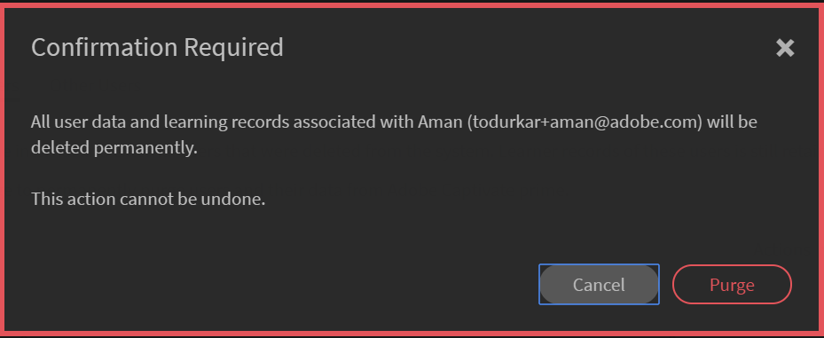

# ユーザーを消去

Learning Manager でのユーザーデータの消去について

## 概要 {#overview}

ユーザーを特定できる個人情報や学習記録を Learning Manager から削除する場合、ユーザーの消去機能を使用します。「ユーザーを削除」と「ユーザーを消去」は別個の機能です。 削除したユーザーは復元できますが、ユーザーを消去した場合、そのユーザーに関連付けられたすべてのユーザーデータと学習記録が消去されるため、復元できません。

ユーザーの消去を実行した場合：

* ユーザーを消去した場合、読み込みログのリンクは機能せず、古いCSVのダウンロードと、ユーザーデータのシステムへの再取り込みが回避されます。
* 作成者を消去すると、作成者の名前は、そのユーザーを消去した管理者の名前に置き換えられます。
* インストラクタを消去すると、セッションに表示されなくなります。 管理者はそのようなセッションのインストラクターを変更または追加する必要があります。
* Learning Manager でユーザーを消去しても、外部アプリケーション（サードパーティ製のシステムや自分で作成した他のアプリケーション）ではユーザーを削除できません。そのようなアプリケーションからユーザーを削除してもらうには、外部アプリケーションのオーナーに連絡してください。
* 消去されたユーザーをコネクタの構成設定で参照すると、そのコネクタは無効になります。 再開するには、管理者がコネクタを再構成する必要があります。

<!---### Manage users

In this training, you will learn how to assign and remove roles, send a welcome email, and delete and purge users. 

If you're unable to launch the training, write to <almacademy@adobe.com>.-->

## ユーザーを消去する方法

ユーザーを消去するには、次の手順に従います。

1. 管理者として、左側のペインから「**[!UICONTROL ユーザー]**」を選択します。 **[!UICONTROL 社内ユーザー]**&#x200B;ページが開きます。
1. 消去したいユーザーを削除します。 チェックボックスを使用して、削除するユーザーを選択します。一度に複数のユーザーを選択することも可能です。 「**[!UICONTROL アクション]**」ドロップダウンを開き、「**[!UICONTROL ユーザーを削除]**」を選択します。
1. 左側のペインで、「**[!UICONTROL ユーザークリーンアップ]**」を選択します。 **[!UICONTROL ユーザークリーンアップ]**&#x200B;ページが表示され、削除されたユーザーのリストが表示されます。 ラジオボタンを使用して、消去するユーザーを選択します。 一度に消去できるユーザーは 1 人だけです。

   

   *消去するユーザーを選択してください*

1. **[!UICONTROL アクション]**&#x200B;ドロップダウンメニューを開き、「**[!UICONTROL ユーザーを消去]**」を選択します。

   

   *[ユーザーの消去]オプションを選択する*

1. 確認のためのダイアログボックスが表示されます。 一度消去すると、選択したユーザーに関連付けられたすべてのユーザーデータと学習レコードは永久的に削除され、 操作を元に戻すことはできません。 確認するには、[**[!UICONTROL 消去]**]をクリックします。

   

   *ユーザーを削除した後の確認メッセージ*

1. 確認して「消去」をクリックすると、消去リクエストが承認されます。 操作が完了すると、通知が届きます。 また、消去リクエスト ID が送られます。 この ID を CSM に提供すると、リクエストを追跡できます。

>[!NOTE]
>
>削除されたユーザーがシステムに再度追加されると、以前の役割（管理者、マネージャー、作成者、インストラクターなど）は保持されません。これらの役割は学習者の役割とともに追加されます。

## ユーザーの一括消去

最初の 50 人のユーザーを選択し、そのユーザーをまとめて消去できます。 これにより管理者は一度に50人のユーザーを選択し、まとめて消去できます。 これにより、管理者がユーザーを一括で消去する際に役立ちます。 消去対象として選択されているユーザーを必ず確認することをお勧めします。 対象のユーザーのみが消去されるようにするには、この確認が重要です。

*ユーザーを一括消去*

## 削除する前に削除されたユーザーをフィルター

Adobe Learning Managerを使用すると、管理者はプラットフォームから既に削除されたユーザーを完全に削除できます。 このプロセス（削除）により、組織は学習者データベースをクリーンに維持し、データ保持ポリシーに準拠し、ユーザーデータへの不正アクセスを防止することができます。
これは、データハイジーンを維持し、古い未使用のユーザーデータをシステムから確実に削除する場合に特に便利です。
データプライバシーガイドラインに準拠したり、不要なレコードを削除して不要なデータストアを維持するには、ユーザーの消去が不可欠です。

### 削除されたユーザーを月でフィルター

特定の月を選択して削除されたユーザーをフィルターし、完全に削除することができます。

削除月を使用して削除されたユーザーをフィルタリングするには、次の手順を実行します。

1. 管理者ホームページで&#x200B;**[!UICONTROL ユーザー]**&#x200B;を選択し、**[!UICONTROL ユーザークリーンアップ]**&#x200B;を選択します。
2. **[!UICONTROL 削除月の選択]**&#x200B;日付ピッカーを選択し、日付を選択します。

   
   _ユーザーが削除された月を選択する_

   選択した月に削除されたユーザーのリストが表示されます。

   
   _選択した月に表示された削除されたユーザーの一覧_

### 削除されたユーザーを月で並べ替える

フィルターされたユーザーを、**[!UICONTROL 一意のユーザーID]**&#x200B;と&#x200B;**[!UICONTROL 削除日]**&#x200B;で並べ替えることができます。

1. 削除されたユーザーのリストで、ユーザーIDまたは削除日に従ってユーザーを並べ替えます。

   
   _一意のユーザーIDでフィルターされたユーザーリスト_

2. 1人または複数のユーザーを選択します。
3. **[!UICONTROL アクション]**&#x200B;を選択し、**[!UICONTROL ユーザーを消去]**&#x200B;を選択します。
4. 確認メッセージで「消去」を選択すると、ユーザーレコードがAdobe Learning Managerから完全に削除されます。

   
   _ユーザーを完全に削除する前の最終確認_

>[!NOTE]
>
>ユーザーを消去すると、そのデータが完全に削除されます。 先に進む前に、選択内容を再確認してください。

+++ユーザーの消去アクションの結果について読む

<table>
 <tbody>
  <tr>
   <th><strong>Learning Manager UI- Enterprise を使用した消去</strong></th>
   <th> </th>
  </tr>
  <tr>
   <td>リクエスト中のエンタープライズ版アカウントから選択したユーザーを削除する。 </td>
   <td>可</td>
  </tr>
  <tr>
   <td>選択したユーザー電子メールと adobe_id 電子メールが一致するすべての体験版アカウントから、ユーザーを全員削除する。</td>
   <td>可</td>
  </tr>
  <tr>
   <td>選択したユーザー電子メールと adobe_id 電子メールが一致するすべての体験版アカウントから、ユーザーを全員削除する。体験版アカウントの作成者も削除する。</td>
   <td>不可</td>
  </tr>
  <tr>
   <td>リクエスト中のエンタープライズ版アカウントとすべての体験版アカウントの他のすべてのフィールドから、ユーザーの電子メールを削除する。</td>
   <td>可</td>
  </tr>
  <tr>
   <td>削除確認のイニシエータに通知する。</td>
   <td>可</td>
  </tr>
  <tr>
   <td><strong>Learning Manager UI- Non-Enterpriseを使用した消去</strong></td>
   <td> </td>
  </tr>
  <tr>
   <td>リクエスト中の体験版アカウントから選択したユーザーを削除する。</td>
   <td>可</td>
  </tr>
  <tr>
   <td>選択したユーザー電子メールと adobe_id 電子メールが一致するすべての体験版アカウントから、ユーザーを全員削除する。</td>
   <td>可</td>
  </tr>
  <tr>
   <td>選択したユーザー電子メールと adobe_id 電子メールが一致するすべての体験版アカウントから、ユーザーを全員削除する。体験版アカウントの作成者も削除する。</td>
   <td>不可</td>
  </tr>
  <tr>
   <td>すべての体験版アカウントの他のすべてのフィールドからユーザーの電子メールを削除する。</td>
   <td>可</td>
  </tr>
  <tr>
   <td>削除確認のイニシエータに通知する。</td>
   <td>可</td>
  </tr>
  <tr>
   <td><strong>他のユーザーを消去する – Enterprise（社内ユーザーまたは外部のLearning Managerユーザーでない場合）</strong></td>
   <td> </td>
  </tr>
  <tr>
   <td>リクエスト中のエンタープライズ版アカウントとすべての体験版アカウントの他のすべてのフィールドから、選択したユーザーを削除する。</td>
   <td>可</td>
  </tr>
  <tr>
   <td>アカウントからのユーザーの削除。</td>
   <td>不可</td>
  </tr>
  <tr>
   <td>削除確認のイニシエータに通知する。 </td>
   <td>可</td>
  </tr>
  <tr>
   <td><strong>消去</strong> <strong>その他のユーザー – Enterprise以外のユーザー（社内ユーザーまたは外部のLearning Managerユーザーでない場合）</strong></td>
   <td> </td>
  </tr>
  <tr>
   <td>すべての体験版アカウントの他のすべてのフィールドから選択したユーザーを削除する。</td>
   <td>可</td>
  </tr>
  <tr>
   <td>アカウントからのユーザーの削除。</td>
   <td>不可</td>
  </tr>
  <tr>
   <td>削除確認のイニシエータに通知する。</td>
   <td>可</td>
  </tr>
  <tr>
   <td><strong>Adobe IMS- Enterprise を使用した消去</strong></td>
   <td> </td>
  </tr>
  <tr>
   <td>リクエストについてエンタープライズ管理者に通知します。</td>
   <td>可</td>
  </tr>
  <tr>
   <td>通知を送信する場合に、電子メールフィールドを確認する。</td>
   <td>不可</td>
  </tr>
  <tr>
   <td><strong>Adobe IMS- Non-Enterprise を使用した消去</strong></td>
   <td> </td>
  </tr>
  <tr>
   <td>提供された AdobeID/電子メールを持つユーザー全員を、すべての体験版アカウントから削除する。</td>
   <td>可</td>
  </tr>
  <tr>
   <td>提供された電子メール/Adobe ID がアカウントの作成者である場合に、体験版アカウントのユーザーを全員削除する。</td>
   <td>可</td>
  </tr>
  <tr>
   <td>すべての体験版アカウントの他のすべてのフィールドから選択した電子メールIDを削除する。</td>
   <td>可</td>
  </tr>
 </tbody>
</table>

+++

## よくある質問 {#frequentlyaskedquestions}

+++消去リクエストが完了するまでに何日かかりますか？

ユーザーの消去リクエストが完了するまでには、最大30日かかります。
+++

+++Adobe Learning Managerで一括消去できますか？

はい、一括消去を実行できます。ただし、一括消去を実行できるのは 50 ユーザーまでです。
+++

+++消去したユーザーを復元できますか？

掲示板で一度消去すると、すべてのユーザーデータは完全に削除され、復元することはできません。

+++
