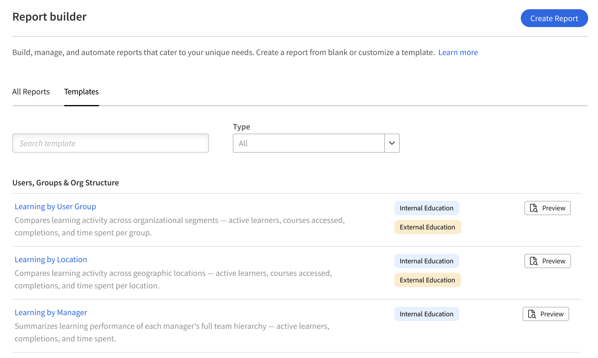
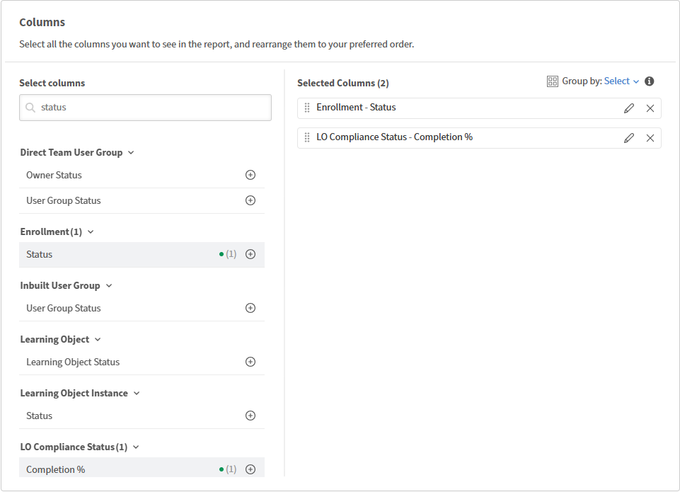

# Report Builder – コンセプトと用語

## テンプレートとレポート

**テンプレート**&#x200B;は、Adobe Learning Managerによって提供される事前定義済みのレポート構成です。 一般的なユースケース、登録と完了の追跡、コンプライアンスレポート、インストラクターのパフォーマンスのために設計されており、すぐにダウンロードできます。 テンプレートは読み取り専用です。編集や上書きはできません。

**レポート**&#x200B;は、独自に保存された構成です。 レポートを最初から作成することも、テンプレートを複製してコピーを編集することもできます。 テンプレートを複製すると、コピーは[**レポート**]タブのレポートになります。 テンプレートとレポートはどちらもReport Builderに表示されますが、別々のタブに表示されます。

## データセット

データセットは、Report Builder内の関連する列の名前付きグループです。 レポートに列を追加する場合は、これらのデータセットから選択します。 各データセットは、学習データの1つの側面に関する情報の表と考えてください。

次に、Report Builderで使用可能なデータセットの例を示します。

* **ユーザー** ：学習者プロファイルデータ（アクティブなフィールドを含む）
* **文字起こし**：登録と完了の記録
* **学習目標**:コース、学習パス、資格認定データ
* **学習目標インスタンス**:インスタンスレベルの詳細
* **カタログ**:カタログおよびカタログラベルデータ
* **ユーザーグループ**:ユーザーグループのメンバーシップと階層
* **モジュール** ：教室およびバーチャルセッションのデータ（eラーニングモジュールの詳細を含む）

>[!NOTE]
>
>データセットは選択的に結合可能です。 1つのレポートですべての組み合わせを使用できるわけではありません。

## 列と「追加」ボタン

追加した各列は、レポートカンバスでは行として表示され、ダウンロードされたファイルでは列になります。 同じ列を複数回追加できます。 これは、同じフィールドから2つの異なる値を測定する場合に便利です。 例えば、**Status**&#x200B;列を2回追加できます。1回は登録をカウントし、もう1回は集計する場合にカウントを使用して進行中の学習者をカウントします。

別名を入力して、任意の列の名前を変更することもできます。 エイリアスは、ダウンロードされたレポートの列ヘッダーとして表示されます。

## グループ化と集計

[グループ化]は、個々の行を表示する代わりに、選択したフィールドにデータを集約します。 例えば、インストラクター名でグループ化すると、登録ごとに1行ではなく、インストラクターごとに1行が与えられます。

Group byは、標準的なデータベースの動作に従います。1つの列にgroup byを適用すると、レポート内の他のすべての列に集計関数が適用されます。 個々の行データとグループ化されたデータを混在させることはできません。 使用可能な集計関数は、次のとおりです。

* **カウント**：合計行数
* **Count if**:フィールドが指定した値と一致する行数
* **合計**：数値フィールドの合計
* **Min**：数値フィールドの最小値
* **最大**：数値フィールドの最大値
* **平均**：数値フィールドの平均値

Excelでピボットテーブルを使用した場合、グループ化の機能は列レベルでも同じです。

## フィルター

フィルタは、レポートに表示される行を制限します。 複数のフィルターを適用し、ANDまたはORロジックと組み合わせることができます。

フィルタ演算子は、列のデータ型によって異なります。

* **文字列フィールド**：次の値を含み、等しい、で始まる（認識された値に対して先行入力による検索を実行できます）
* **数値フィールド**：より大きい、より小さい、等しい、その間
* **日付フィールド**：等しい、前、後、間、相対範囲（例：過去90日間）
* **列挙（リスト）フィールド**: （複数選択の値ピッカー）内にあり、にありません。

## AND / ORロジックおよびネストされたフィルタグループ

複数のフィルタのデフォルトはANDロジックです。行を表示するには、すべての条件がtrueである必要があります。 演算子は、任意の2つのフィルターをORに切り替えることができます。 **[グループとして追加]**&#x200B;を使用してフィルターをグループ化し、ブラケットを作成することもできます。 グループ内のフィルターは、グループ外のフィルターと組み合わされる前に一緒に評価されます。

これにより、次のような条件を構築できます。 （カタログ=安全またはカタログ=衛生管理）完了日は過去90日間です。

グループを他のグループ内にネストして、複雑なマルチレベルロジックをサポートできます。

## 並べ替え

1つ以上の列でソートできます。 最初に並べ替える列が最優先の並べ替えです。 プライマリ列のタイ内に追加のソートが適用されます。

一貫した出力が必要な場合は、常に1つ以上の並べ替えを適用してください。 レポートの生成は分散システムで実行されるため、ソートが適用されない限り、同じレポートの2回のダウンロードの間で行の順序が保証されることはありません。

## トレンド・データとスナップショット・データ

月次や週次などのトレンド集計を使用するレポートには、日付でグループ化された現在のスナップショット・データが反映されます。 過去の各日付におけるデータの履歴状態は反映されません。

たとえば、月ごとにグループ化された登録トレンドは、作成された月に分散した、現在の登録数を示します。 後でユーザーグループの登録を解除または変更した学習者は対象になりません。 これらの変更は、過去1か月にさかのぼって適用されることはありません。

## 削除された学習者とアクティブなフィールド

Report Builderでは、削除した学習者をレポートに含め、アクティブなフィールド値を取得することができます。

ユーザーデータセットの「削除日」列を使用して、レポートを作成します。

## ベストプラクティス

* 最初からレポートを作成する前に、使用可能なデータセット参照を読みます。 必要なフィールドがどのデータセットに含まれているかがわかるので、設定時間を大幅に節約できます。
* スケジュールされたレポートに登録する前に、並べ替えを適用します。 これにより、すべての配信で一貫した行順序が保証されます。
* 予期しない重複した行が表示された場合は、複数のインストラクターによるセッションのインストラクター名など、1行に複数の値を含めることができるフィールドがレポートに含まれているかどうかを確認してください。
