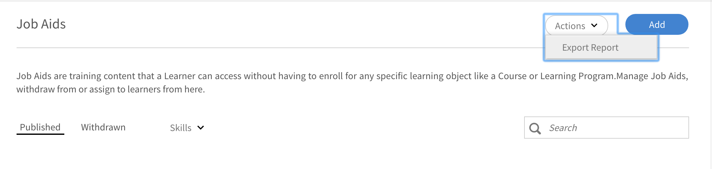
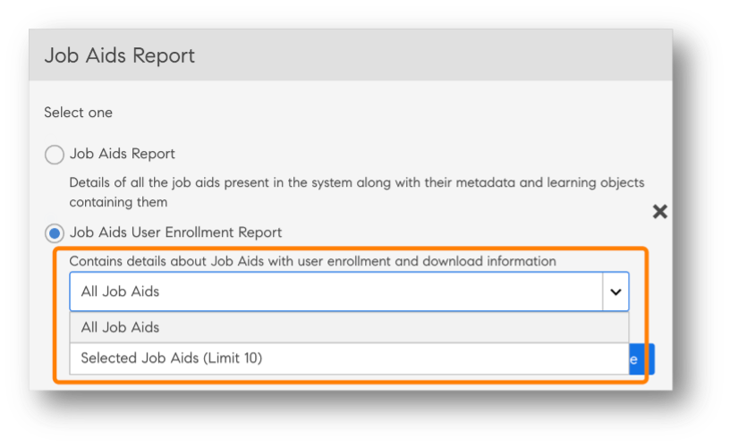

# レポート

ここでは、Learning Managerアプリケーションの「管理者」役割に関連するレポートについて説明します。

AdobeLearning Managerでは、さまざまなレポートを作成して、学習者のアクティビティを追跡、モニター、制御できます。 学習者のアクティビティは自動的に追跡され、データベースに取り込まれます。 マネージャーおよび管理者のレポートは、データベースから生成されます。

## 概要 {#overview}

レポート生成プロセスは、管理者とマネージャーの両方で同様です。 マネージャーは部下に対応するレポートを表示できますが、管理者はすべての組織全体のレポートを表示できます。

レポートはダッシュボードに集約されます。 レポートはダッシュボード内に存在する必要があります。 A **[!UICONTROL デフォルトダッシュボード]** は、デフォルトでレポートページに存在します。 自分が追加したレポートは、このデフォルトのダッシュボードに移動します。 個別のダッシュボードにレポートを追加するには、ドロップダウン矢印を使用して **[!UICONTROL レポートを追加]**. ダッシュボードの作成の詳細については、このページの「ダッシュボード」セクションを参照してください。

## 学習の概要ダッシュボード {#dashboards}

プラットフォーム内のすべての学習活動のサマリーレポートを表示します。 このページでは、選択したルートユーザーのグループ版プロファイルと社外プロファイルについて、次の概要情報を表示できます。 時間範囲を選択することもできます。

* 登録、ビューおよび完了の形式での学習サマリー
* トップスキル
* 準拠の概要

*サマリーチャート*

内部ルートレベルのマネージャーがある場合は、次々と表示されます。

すべての外部プロファイルは、内部プロファイル（内部ルートレベルのユーザー）の後に表示されます。

外部プロファイルにマネージャーが含まれている場合、マネージャーの階層が **[!UICONTROL データを表示中]** ドロップダウンリスト。  – ユーザーは、すべての詳細ページ（学習の概要、コンプライアンス、およびスキルステータス）のマネージャー階層にリストされます。

そうでない場合は、個々のユーザーのすべての詳細がリストに表示されます。

様々な内部チームの登録の詳細を表示するには、をクリックします。 **[!UICONTROL 学習の概要の詳細]**.

*学習の概要の詳細*

任意の登録をクリックすると、各マネージャーの学習者と、学習目標の登録を表示できます。 また、各学習者の進捗と完了の詳細も表示できます。

*マネージャーに割り当てられた学習者の確認*

任意のチームをクリックし、レポートをcsvとして書き出します。 管理者は、ユーザーグループまたは個々のユーザーを選択して、任意のユーザーグループまたは個々のユーザーのレポートを書き出し、アクションドロップダウンリストから詳細を書き出すことができます。

また、進行中で達成されたスキルのバーチャートビューを表示することもできます。 グラフに表示したいスキルを追加または削除できます。

*スキルステータス積み上げ棒グラフ*

最後のビジュアライゼーションでは、学習者の準拠ステータスを確認して、適切なアクションを実行できます。

また、管理者は準拠ダッシュボードで個々のトレーニングデータを表示することもできます。

例えば、管理者はコンプライアンスを追跡する3つのトレーニングを特定しました。 Learning Managerでは、3つのトレーニングすべてに対するコンプライアンスのスナップショットを一度に提供します。

管理者は任意のトレーニングをクリックして、選択したトレーニングのコンプライアンスをすばやく確認できます。

*準拠ダッシュボードを表示*

各内部チームのコンプライアンスステータスも表示できます。

リンクをクリック **[!UICONTROL 準拠ステータスの詳細]** ビジュアライゼーションの下部。

チームの場合、チームの学習者数が学習コンプライアンスに違反しているか、遵守しているかを確認できます。

*チームの準拠ステータス*

## マネージャーとのトレーニングの共有

Learning Managerでは、すべての管理者とマネージャーに準拠ダッシュボードを提供しています。 マネージャーは、特定のトレーニングについてチームメンバーのコンプライアンスを追跡すると非常に便利です。 また同時に、管理者はすべてのマネージャーがダッシュボードに準拠トレーニングを追加し、追跡できるようにすることを望んでいます。

Learning Managerで、 **[!UICONTROL マネージャーと共有]** ワークフローを使用すると、管理者はマネージャーとトレーニングを共有して、各自の準拠ダッシュボードにトレーニングを追加できます。 したがって、マネージャーは何らかのアクションを実行する必要はなく、コンプライアンスの追跡をすぐに開始できます。

管理者は、一連のトレーニングコースをマネージャーと個別に、またはグループと共有できます。 この共有により、マネージャーは指定されたトレーニングに対するチームのコンプライアンスを簡単に追跡できます。

管理者は、準拠トレーニングのデフォルトのリストを「プッシュ」して、マネージャーの準拠ダッシュボードに表示できます。

### トレーニングを共有

1. イン **[!UICONTROL レポート]** > **[!UICONTROL 学習の概要]**&#x200B;を選択し、下にスクロールして、 **[!UICONTROL マネージャーと共有]**.

   
   *マネージャーとのトレーニングの共有*

1. トレーニング（複数可）を追加するには、次をクリックします。 **[!UICONTROL さらに共有]**.

1. を **[!UICONTROL マネージャーと共有]** ダイアログで、トレーニングとマネージャーを選択します。

   
   *マネージャーと共有するトレーニングを選択*

1. クリック **[!UICONTROL 共有]**.

これで、指定したマネージャーとトレーニングが共有されます。

### トレーニングを表示

共有トレーニングのリストで、をクリックします。 **[!UICONTROL 表示]**. 1人または複数のマネージャーに割り当てられているトレーニングを表示できます。

### トレーニングを中止

1. マネージャーからトレーニングを撤回するには、 **[!UICONTROL 撤回]**.

1. クリック **[!UICONTROL 続行]**. これにより、マネージャーの準拠ダッシュボードから以前に共有していたトレーニングが撤回されます。

## ユーザーアクティビティダッシュボード {#useractivitydashboards}

一定期間のプラットフォーム上のすべてのユーザーアクティビティの概要を表示します。 ユーザーグループを設定し、フィルターを適用します。

ユーザーアクティビティダッシュボードには、アカウント内のユーザーのアクティビティが表示されます。 リストされている3つのレポートは次のとおりです。

* **登録済みユーザー：** このレポートでは、アカウントに登録されているユーザー数に関する情報が、週単位で提供されます。 月間アクティブ単位ライセンスのアカウントの場合、レポートには代わりにMAU単位が表示されます。

* **ユーザー訪問レポート：** このレポートでは、プラットフォームにアクセスするユーザー数に関する情報が日単位で提供されます。 月次レポートもご利用いただけます。

* **学習時間レポート：** このレポートでは、プラットフォームで費やされた学習時間に関する情報が日単位で提供されます。 月次レポートもご利用いただけます。

## 登録済みユーザー {#registeredusers}

Learning Managerでは、毎週システムに登録されたユーザー数が記録されます。 管理者はこのレポートを表示して、その曜日に登録されているユーザー数を確認できます。 1週間に一度保存された登録済みカウントは変更されません。 従って、過去の登録数は、システム内の現在の学習者セットとは関連しません。

このレポートでは、アカウントに登録されているユーザー数に関する情報が、週単位で提供されます。

月間アクティブ単位ライセンスのアカウントの場合、レポートには代わりにMAU単位が表示されます。

*登録済みユーザーレポート*

***月間アクセスユニットアカウントの場合：***

**月間アクティブユーザーレポート**

このレポートには、学習プラットフォームで毎月有効な学習者の数が表示されます。 ここに記載されている学習アクションのいずれかを実行した場合、ユーザーは月に対してアクティブと見なされます。 月間アクティブなユニット数のカウント方法と同じです。

月間にカウントおよび保存された月間アクティブ数は変更されません。 したがって、表示される過去のカウントは、システム内の現在の学習者セットとは関連しません。

## ユーザー訪問 {#uservisits}

このレポートには、1日または1か月の期間内にシステムにアクセスした学習者の合計が表示されます。 学習を消費せずに学習プラットフォームを参照することは、学習プラットフォームへの「アクセス」とも見なされます。 これにより、管理者はシステムにアクセスするユーザーの合計セットを把握できます。 Learning Managerでは月初に、前月プラットフォームにアクセスしたユーザーの合計数が記録されます。 また、これらのユーザーのユーザーグループ情報もキャプチャします。

管理者が設定したユーザーグループのみが記録されます。 これにより管理者は、過去の月次データについてもユーザーグループにフィルターを適用できます。 ユーザーグループの設定を変更したものの、Learning Managerによって以前の月のこのユーザーグループのデータが記録されていない場合、この新しく設定したユーザーグループの前月データをLearning Managerで表示できなくなります。

このレポートには、web、モバイルアプリ、ヘッドレスカスタムソリューションなど、すべての形式を使用してプラットフォームにアクセスするユーザーが含まれます。 デバイスアプリの使用状況グラフは、Learning Managerのデバイスアプリを使用してプラットフォームにアクセスしているユーザーのみに限定されます。 これにより、管理者はアカウントのモバイルアプリの使用状況を特定できます。

*ユーザー訪問レポート*

## 学習時間レポート {#learningtimespentreport}

ここでは、2軸の折れ線グラフを表示できます。このグラフでは、12か月間のすべての学習者に費やされた学習時間の合計が示されます。 2番目の軸は、個人の学習に費やされた時間の中央値を表します。

学習プログラムや資格認定など、様々な学習目標に費やされた時間は、次のように計算されます。

* 静的でインタラクティブなコンテンツを備えたセルフペースコース
* URLを使用したアクティビティコース
* 週末フラグが有効になっている週末のセッション。
* 出席が自動的にマークされるVC接続セッション。
* 学習プログラムや資格認定など、様々な学習目標に費やされた時間
* xAPIアクティビティコースのxAPIステートメント。

さらに、グラフをExcelスプレッドシートとして書き出すことができます。

異なるユーザーグループに対してデータを表示するのに役立つ、ユーザーグループ設定を選択するフィルターが提供されます。

選択した日付とユーザーグループのフィルターが、ダッシュボード内のすべての関連グラフに適用されます。

>[!NOTE]
>
>対象 **[!UICONTROL ユーザー訪問]** および **[!UICONTROL 学習時間]** レポートには、表示されるデフォルトのデータ（ユーザーグループが設定されていない場合）が、アカウント全体のデータです。

## トレーニングコンテンツダッシュボード {#trainingcontentdashboard}

トレーニングコンテンツダッシュボードには、プラットフォームで利用できるトレーニングに関する情報が表示されます。 人気のあるトレーニングを表示したり、利用可能なすべてのトレーニングを追跡したりできます。

## トレーニングレポート {#trainingsreport}

このレポートでは、プラットフォーム（公開済み状態）で利用可能なトレーニングの合計に関する情報が、1か月分にわたって提供されます。 これにより、提供されているトレーニングの数が時系列で示されます。

*トレーニングレポート*

## アクティブトレーニングレポート {#activetrainingsreport}

このレポートには、選択した時間範囲でアクティブなトレーニングに関する情報が表示されます。 アクティブトレーニングとは、所定の時間内に登録、プレーヤーで表示、または完了したトレーニングです。

アクティブトレーニングでは、ユーザーグループの設定が完了していない場合、すべてのルートユーザー（マネージャーの役割を持つ）の内部グループのデータを選択できます。 ルートユーザーグループとは別に、必要に応じて10個以上のユーザーグループを設定できます。

*アクティブトレーニングレポート*

>[!NOTE]
>
>次の場合にデータが正しく表示されません： **[!UICONTROL すべてのユーザー]** および **[!UICONTROL 12か月]** フィルタは選択されていますが、選択するとデータが表示されます **[!UICONTROL すべての内部ユーザーグループ].**

<table>
 <tbody>
  <tr>
   <td>
    
<b>参照</b>
</td>
   <td>
    
<b>メートル法</b>
</td>
   <td>
    
<b>説明</b>
</td>
  </tr>
  <tr>
   <td>
    
1
</td>
   <td>
    
開始比率(%)
</td>
   <td>
    
コースを開始した学習者の数と登録数の比率。
</td>
  </tr>
  <tr>
   <td>
    
2
</td>
   <td>
    
完了率(%)
</td>
   <td>
    
コースを完了したユーザーの合計とコースを開始したユーザーの合計の比率。 
</td>
  </tr>
  <tr>
   <td>
    
3
</td>
   <td>
    
学習者のフィードバック
</td>
   <td>
    
1から10のスケールで、受信したすべてのL1フィードバック回答の平均（最も近い整数に丸めたもの）。 
</td>
  </tr>
  <tr>
   <td>
    
4
</td>
   <td>
    
マネージャーのフィードバック
</td>
   <td>
    
1から5のスケールで、受信したすべてのL3フィードバック回答の平均（最も近い整数に丸めたもの） 
</td>
  </tr>
 </tbody>
</table>

トレーニングレポートには、次の2つの列が追加されています。

1. コースの平均星評価。
1. コースを評価した学習者の数
1. 埋め込みパス
1. 埋め込みパスのID
1. 埋め込みコースのID

>[!NOTE]
>
>開始率、完了率、学習者フィードバック、マネージャーフィードバックは、適用されたフィルターの影響を受けません。 フィルターは、登録、表示および完了にのみ影響します。

>[!NOTE]
>
>両方のレポート（トレーニングコンテンツ、ユーザーアクティビティ）で、最大10のユーザーグループを設定できます。 処理が完了し、新しく設定したフィルターが使用可能になるまでに、最大で24時間かかる場合があります。

## ダッシュボードレポート {#dashboardreports}

ダッシュボードは、レポートのコレクションです。 レポートは、選択に応じてダッシュボードにグループ化できます。

## サンプルレポート {#samplereports}

この **[!UICONTROL サンプルレポート]** タブをクリックして、サンプルデータポイントに基づく指標レポートを表示します。 これらのレポートを参照して、アカウントデータを使用して生成できる様々な種類の機能豊富なレポートについて確認してください。

## ダッシュボードレポート {#DashboardReports-1}

作成したすべての掲示板を表示するには、この掲示板タブをクリックします。 から **[!UICONTROL ダッシュボードの表示]** ドロップダウンリストでは、デフォルトの掲示板または作成したダッシュボードを選択できます。

## ダッシュボードの作成 {#createadashboard}

1. 独自のダッシュボードの作成を開始するには、ページの右側にある「ダッシュボードを追加」をクリックします。

   
   *ダッシュボードの追加*

1. ダッシュボードの名前と説明を入力します。
1. ダッシュボードをマネージャーと共有する場合は、 **[!UICONTROL 共有先]** フィールドに入力します。 この操作には、任意の標準の選択基準を使用できます。
1. クリック **[!UICONTROL 保存].**

最近作成した掲示板は、 **[!UICONTROL ダッシュボードレポート]** タブをクリックします。

掲示板にレポートを追加するには、掲示板ウィンドウの右上隅にあるドロップダウンをクリックし、 **[!UICONTROL レポートを追加]**. この方法で作成したレポートは、ダッシュボードに関連付けられます。

>[!NOTE]
>
>レポートページの右上隅の「追加」をクリックして作成したレポートは、デフォルトのダッシュボードに追加されます。

## 共有ダッシュボード {#shareddashboards}

共有掲示板は、組織内の他のユーザーによって共有されているレポートのコレクションです。 共有掲示板に追加したレポートは、その掲示板にアクセスできる他のユーザーと自動的に共有されます。

掲示板を共有するには、次の2つの方法があります。

* ユーザーを **[!UICONTROL 共有先]** ダッシュボードを共有しているユーザーのフィールド。
* ドロップダウンリストで「掲示板を編集」を選択し、ダッシュボードを共有するユーザーの詳細を入力します。

>[!NOTE]
>
>マネージャーは、共有ダッシュボードからのみチームメンバーのレポートを表示できます。

## ダウンロード {#downloads}

書き出されたダッシュボードレポートのシートには、レポートの概要ではなく、詳細情報が表示されます。 ダウンロードされたレポートは、学習者トランスクリプトの形式に従います。

## レポートの作成 {#report}

1. 左ペインで「レポート」をクリックします。 「レポートの概要」ページが表示されます。

   >[!NOTE]
   >
   >既定では、3つ以上のサンプルレポートが[サンプルボード]タブに表示されます。 サンプルレポートのみを表示して、作成およびカスタマイズの方法に関するアイデアを得ることができます。

1. ページの右上隅にあるをクリックします。 **[!UICONTROL 追加]**.
1. を **[!UICONTROL レポートを追加]** ダイアログの「タイプ」ドロップダウンリストで、あらかじめ定義されたレポートのいずれかを選択するか、次のいずれかを選択できます **[!UICONTROL カスタム]**. 定義済みレポートを選択した場合は、フォームが事前入力されていることを確認できます。 一部のフィールドにさらに変更を加えて、をクリックできます **[!UICONTROL 保存]**. これにより、レポートがデフォルトのダッシュボードに追加されます。

   
   *レポートを作成*

   イン **[!UICONTROL レポートタイプ]**&#x200B;を選択すると、事前に定義されたレポートセットを選択したり、カスタム値を選択したりできます。 事前定義されたレポートセットの一部として、次のレポートを表示できます。

   * 割り当てられ、達成されたスキル
   * 登録済みで完了したコース
   * コースの有効性
   * 登録および完了済みの学習プログラム
   * コースあたりの学習時間
   * 四半期あたりの学習時間
   * 資格認定の完了

1. を選択します **[!UICONTROL Y軸]** ドロップダウンオプションからレポートを表示できます。 選択した基準の中には、ステートオプションから1つまたは複数のステートを選択できるものがあります。 例えば、コース登録統計のプライマリ基準の場合、状態は完了、未完了、登録の順に選択できます。 プライマリ範囲データは、レポート内に棒グラフとして表示されます。

   
   *レポートの軸*

1. セカンダリを選択 **[!UICONTROL Y軸]** ドロップダウンオプションからのレポートの条件/範囲。 例えば、学習プログラムの登録オプションの場合、状態ドロップダウンから1つまたは複数の状態を選択します。 第2範囲データは、折れ線グラフの形式で表示されます。
1. ドロップダウンオプションから、レポートに適したX**軸**の条件を選択します。 X軸を日付として選択した場合は、x軸基準を日、月、四半期、年でグループ化するオプションを使用できます。
1. 「タイムスパン」セクションで、ドロップダウンから適切なオプションを選択します。 次のオプションを使用できます。

   * 過去1か月
   * Quarter
   * Year
   * QTD（過去90日間）
   * YTD（過去365日）
   * 日付範囲： に値を入力します **[!UICONTROL 共有元]** および **[!UICONTROL 宛先]** 日付フィールド。

   

1. **フィルターセクション**

   選択したレポートの種類に基づいて、下部のレポートを追加ダイアログにフィルターが表示されます。 主なフィルターの一部については、以下で説明します。

   * **マネージャー：** 階層に基づいて、任意のマネージャーを選択できます。 マネージャーによっては、下位マネージャーが存在し、各下位マネージャーに複数の従業員がレポートされている場合があります。
   * **プロファイル：** 従業員の名称を選択します。 プロファイル/名称に基づいて従業員のレポートを表示するのに役立ちます。 例えば、コンピューターサイエンティスト、エンジニア。
   * **ユーザーグループ：** レポートをフィルタリングするユーザーグループを選択します。 Learning Managerはユーザー機能からアカウントに定義されたユーザーグループを取得します。
   * **コンテンツ：** ドロップダウンから選択してコースに基づいてレポートのフィルターを設定できます。

   このセクションを展開し、必要なフィルターを選択します。

   
   *フィルターを選択*

1. クリック **[!UICONTROL 保存]** をクリックして、レポートの作成を完了します。

   
   *サンプルレポート*

## レポートの編集 {#editareport}

レポートで、ドロップダウン矢印をクリックし、オプションを選択します **[!UICONTROL レポートを編集]**.

*レポートの編集*

レポートに必要な変更を加えます。 変更を保存するには、 **[!UICONTROL 保存]**.

## レポートのダッシュボードへの移動 {#moveareporttoadashboard}

現在のレポートを既存のダッシュボードに移動するには、このオプションを選択します。 レポートを移動するには、 **[!UICONTROL ダッシュボードに移動]**.

*レポートのダッシュボードへの移動*

レポートの移動先のダッシュボードを選択し、 **[!UICONTROL 移動]**.

## レポートのコピーの作成 {#createacopyofareport}

レポートのコピーを作成するには、 **[!UICONTROL コピーを作成]**.

*レポートのコピーの作成*

レポートのコピー先のダッシュボードを選択します。 コピーを開始するには、 **[!UICONTROL コピー]**.

## レポートの削除 {#deleteareport}

レポートを削除するには、 **[!UICONTROL レポートを削除]**. レポートを削除した後は、レポートを復元することはできません。 このプロセスは元に戻すことができません。 レポートを削除する場合は注意が必要です。

*レポートの削除*

## レポートのダウンロード {#downloadareport}

レポートをダウンロードするには、オプションを選択します **[!UICONTROL レポートをダウンロード]**.

*レポートのダウンロード*

## レポートのサイズ変更 {#resizeareport}

レポートのサイズは1×1（中）および1×2（大）サイズで変更できます。 これにより、レポートを表示するための適切な不動産が提供されます。 また、これらのレポートを簡単にパンおよびズームできます。

## フィルター {#filters}

フィルターは **[!UICONTROL 追加]** 選択したレポートの種類に基づいて、下部にレポートダイアログが表示されます。 主なフィルターの一部については、以下で説明します。

**マネージャー** 階層に基づいて、任意のマネージャーを選択できます。 マネージャーによっては、下位マネージャーが存在し、各下位マネージャーに複数の従業員がレポートされている場合があります。

**プロフィール** 従業員の名称を選択します。 プロファイル/名称に基づいて従業員のレポートを表示するのに役立ちます。 例えば、コンピューターサイエンティスト、エンジニア。

**ユーザーグループ** レポートをフィルタリングするユーザーグループを選択します。 Learning Managerはユーザー機能からアカウントに定義されたユーザーグループを取得します。

**コース** ドロップダウンから選択してコースに基づいてレポートのフィルターを設定できます。

*レポートのフィルター*

グラフの凡例の上には、ズームボックスが表示されます。 カーソルをその上に移動し、クリックしてクロスバーをズームボックスのグラフ領域の任意の部分にドラッグすると、ズームインします。

第2 Y軸の値は、グラフバーを横切る線の形式で表示できます。 例えば、上のサンプルでは、グラフ全体のグレーの線に有効性の値が表示されます。

## ユーザーグループレポート {#user-group-reporting}

部門、外部パートナー、役割などのユーザーグループのパフォーマンスを、他のユーザーグループとの比較または他の学習目標との比較で追跡します。

### ユーザーグループ {#usergroups}

ユーザーグループに基づいてレポートを生成するには、 **[!UICONTROL ユーザーグループ]** 下のスクリーンショットに示すように、ドロップダウンオプションのリストからx軸を選択します。

*ユーザーグループレポート*

ユーザーグループを選択するには、グループ名を入力します。 入力した文字列に従って、表示される推奨グループを確認できます。 グループのリストが表示されたら、必要なユーザーグループを選択します。

また、先行入力検索を使用して、複数のユーザーグループを選択することもできます。

このレポートを保存して生成した後、複数のユーザーグループを選択した場合、レポートが生成され、すべてのユーザーグループが横棒グラフでx軸に並べて表示されます。

このユーザーグループのレポートでは、ある部門/部門/役割のパフォーマンスを他の部門/部門/役割と比較して、学習成果を評価できます。

### カスタムユーザーグループ/ユーザー属性 {#customusergroupsuserattributes}

また、Learning Managerのユーザー/ユーザーグループの追加機能を使用して、カスタマイズされたユーザーグループを作成することもできます。 ユーザーグループを作成したら、場所、分岐などの属性のリストを使用して、カスタマイズしたユーザーグループのレポートを生成できます。

X軸で、「ユーザー属性」オプションを選択し、属性を **選択** その横のドロップダウン。 これらの属性に基づいてカスタマイズされたユーザーグループのレポートを作成するには、フィルターで適切なユーザーグループを選択する必要もあります。

## レポートの種類 {#typesofreports}

AdobeのLearning Managerでは、4種類の主要なレポート（完了状況、学習時間、スキル、有効性など）をサポートしています。 次のレポートタイプを使用して、300以上のバリエーションのレポートを生成できます。

* 学習者のコース実施統計
* コースレポートの有効性
* 学習者のスキルベースのレポート
* 学習者の学習プログラム登録統計
* 学習者が費やした学習時間
* 学習者数
* 資格認定の完了

## レポートの表示 {#viewingreports}

レポートページでは、すべてのレポートを表示できます。 各レポートの右上隅にあるマイナス(-)アイコンをクリックすると、各レポートを最小化できます。 レポートをもう一度表示するには、(+)アイコンをクリックします。

## 異なる日付でのクイックビュー {#quickviewwithdifferentdates}

レポートの日付範囲や値を変更したり、レポートを変更して保存することなく、別の日付をすばやく表示したりできます。 QTDなど、過去1年間の日付範囲の横にある編集アイコン（以下のスナップショットに矢印で示されています）をクリックします。 変更を確認するには、ポップアップメニューから新しい値を選択し、チェックマークをクリックします。 Xマークをクリックすると、変更を取り消すことができます。

>[!NOTE]
>
>レポートの表示に使用する日付値は一時的なものです。 ダウンロードオプションを選択しても、レポートのこのビューはダウンロードされません。 このビューは一時的なビューです。

*学習者の数を表示*

## 様々なマネージャーでのクイックビュー {#quickviewwithdifferentmanagers}

複数のマネージャーから報告を受けている場合は、各マネージャーのレポートをすばやく表示できます。 各マネージャに固有のレポートを表示するには、ドロップダウン・リストからマネージャ名を選択します。

>[!NOTE]
>
>レポートの表示に使用するマネージャの値は、一時的なものです。 ダウンロードオプションを選択しても、レポートのこのビューはダウンロードされません。 このビューは一時的なビューです。

## コースレポートの表示 {#viewcoursereports}

以下の手順に従って、各コースに固有のレポートを表示できます。

1. クリック **[!UICONTROL コースレポートの表示]** [レポート]ページの[マイダッシュボード]タブにあるリンクです。\
   ポップアップダイアログが表示されます。 テキスト入力フィールドが表示され、必要なコースと提案されたコース名をドロップダウンリストに入力できます。 表示されたリストからコースを選択します。

   

   *コースレポートの表示*

1. ドロップダウンリストから任意のコースを選択し、「表示」をクリックします。
1. 選択したコースのクイズスコアの結果ページにリダイレクトされ、コース固有のレポートが表示されます。

**レポートの編集、ダッシュボードへの移動、コピーの作成、レポートの削除、レポートのサイズ変更**

編集/ダッシュボードに移動/コピーを作成/削除/サイズ変更などのドロップダウンオプションを表示するには、各レポートの右上隅にあるドロップダウン矢印をクリックします。

*レポートの編集、掲示板への移動、コピーの作成、レポートの削除、レポートのサイズ変更*

**[!UICONTROL 編集]** データの変更中に初期値に戻るには、[リセット]をクリックします。 値を変更した後、「保存」をクリックします。

**[!UICONTROL ダッシュボードに移動]** 現在のレポートを別のダッシュボードに移動できます。ダッシュボードはダッシュボードのリストから選択されます。

**[!UICONTROL コピーを作成]** ダッシュボードのリストから選択した同じダッシュボードまたは別のダッシュボードにレポートをコピーできます。

**[!UICONTROL 削除]** レポートを削除するには、「削除」をクリックします。 レポートを削除する前に、警告/確認メッセージが表示されます。

**[!UICONTROL サイズ変更]** レポートのサイズは1×1（中）および2×2（大）サイズで変更できます。

## ピアアカウントのレポートを生成および表示 {#generateandviewreportsforpeeraccount}

管理者は、アカウントのレポートを生成する以外に、設定したピアアカウントのレポートを生成および表示することもできます。

別のユーザーとのピアアカウントを確立した場合、そのピアアカウントのレポートを **[!UICONTROL レポート]** ページです。 レポートを作成すると、次の項目が表示されます **[!UICONTROL アカウントを選択]** フィールドに入力します。 関連付けられているすべてのピアアカウントがリストされたドロップダウンリストから、共有レポートを表示するアカウントを選択します。

ピアアカウントの作成時に「カタログを共有」オプションが選択されていない場合、このリストでそのピアアカウントを表示することはできません。

*ピアアカウントのレポートの管理*

1. このレポートのX軸とY軸を選択し、このレポートの日付を選択します。
1. フィルターフィールドでは、「共有カタログ」ボタンが自動的に有効になっています。 これは必須です。 共有カタログが有効になっていない場合は、ピアアカウントのレポートを生成または表示できないことを示します。
1. 共有カタログの下のドロップダウンリストから、レポートを表示する共有カタログを選択します。
1. クリック [!UICONTROL **保存**].

   
   *ピアアカウントの共有カタログを選択*

1. クリック後 **[!UICONTROL 保存]**&#x200B;デフォルトのダッシュボードでレポートのグラフィック表現を表示できます。 このダッシュボードから、特定のピアアカウントのマネージャーによってレポートをさらにフィルタリングできます。
1. カタログに対してユーザー側から変更が加えられると、その変更はピアによって生成されるレポートとダッシュボードにすぐに反映されます。 ただし、ピアがカタログを変更しても、変更はダッシュボードに自動的に表示されません。
1. ダッシュボードを自動的に更新するには、ピアから新しいピア要求を送信する必要があります。

   >[!NOTE]
   >
   >マネージャーは、ピアレポートを表示できません。

## 電子メールの購読 {#emailsubscriptions}

お気に入りのレポートを電子メールで取得するには、それらのレポートを購読します。

イン **[!UICONTROL レポート]** ページで、  **[!UICONTROL 定期購読]** タブをクリックします。 レポート購読ページが表示されます。

ドロップダウンリストからレポート名を選択するには、「レポート」フィールドにレポート名の入力を開始します。 ドロップダウンから電子メールの頻度を選択します。 電子メールの件名を追加し、代替の電子メールIDを指定できます。

購読を編集および削除できます。

## Excelレポート {#excelreports}

この **[!UICONTROL Excelレポート]** タブを使用すると、レポートをXLSファイル形式で書き出すことができます。

ダウンロード可能なレポートタイプは次のとおりです。

* コースレポート
* 学習者のトランスクリプト
* アナウンスレポート
* 作業計画書レポート
* コンテンツ監査証跡
* ユーザー監査追跡
* ログイン/アクセスレポート
* ゲーミフィケーションのトランスクリプト

## 学習者のトランスクリプト {#learnertranscripts}

学習者のトランスクリプトのExcelレポートには、必要単位と取得単位の列に10進数が表示されます。

## コースレポート {#coursereports}

管理者は、コースのレポートをダウンロードできます。 次の手順に従います。

1. 開く **[!UICONTROL レポート]** > **[!UICONTROL Excelレポート]** > **[!UICONTROL コースレポート]**.
1. この **[!UICONTROL コースレポート]** ダイアログが表示されます。 レポートを取得するコースを選択し、をクリックします。 **[!UICONTROL 表示]**.

   
   *コースレポート*

1. コースページにリダイレクトされます。 特定の登録タイプを選択して、ユーザー別や各登録に基づく質問別にクイズスコアを書き出すことができます。
1. 選択 **[!UICONTROL クイズスコアの書き出し]** をクリックして、レポートを書き出します。 A **[!UICONTROL レポート要求を生成中]** ダイアログボックスが表示されます。 クリック **[!UICONTROL OK]** をクリックして確定します。

   
   *レポート要求を生成中*

   >[!NOTE]
   >
   >モジュールに複数試行オプションが設定されている場合、書き出したクイズスコアのレポートには、各試行のスコアの詳細が含まれます。

## 学習者のトランスクリプト {#LearnerTranscripts-1}

Adobeの管理者は、Learning Managerで学習者に関連するトランスクリプトを作成できます。 学習者のトランスクリプトレポートには、次の情報が含まれます。

1. 学習者トランスクリプト：学習アクティビティダッシュボード
1. スキル：スキルダッシュボード
1. 準拠ダッシュボード

学習者のトランスクリプトのExcelレポートには、必要単位と取得単位の列に10進数が表示されます。

学習者のトランスクリプトレポートの生成および詳細については、「 [学習者のトランスクリプト](learner-transcripts.md).

## アナウンスレポート {#announcementsreports}

管理者は、送信したすべてのアナウンスのレポートを生成できます。 レポートには、次の項目に関する詳細が含まれています。

* 通知の種類
* アナウンス名
* 発表日
* 発表の状況
* 学習者名

レポートをダウンロードするには、次のいずれかの手順に従います。

1. 開く **[!UICONTROL レポート]** > **[!UICONTROL Excelレポート]** > **[!UICONTROL アナウンスレポート]**. この **[!UICONTROL レポート要求を生成中]** ダイアログボックスが開きます。 「OK」をクリックします。
1. [!UICONTROL **アナウンス**] > [!UICONTROL **アクション**] > [!UICONTROL **レポートを書き出し**].

   
   *アナウンスレポート*

1. 設定アイコンの下にある「レポートの書き出し」をクリックすると、特定のお知らせのレポートを抽出できます。

   
   *特定のお知らせに関するレポート*

## 作業計画書レポート {#jobaidsreport}

作業計画書とは、コースや学習プログラムなど、特定の学習目標に登録しなくても学習者がアクセスできるトレーニングコンテンツを指します。 管理者は、作業計画書レポートを抽出してダウンロードできます。

抽出されたレポートには、次の項目に関する情報が含まれています。

* 名前
* 作業計画書の種類
* 作業計画書のステータス（公開または取り消し）
* 登録日
* 完了日
* ダウンロード日
* 学習者名
* マネージャー名
* 作成者

レポートをダウンロードするには、次のいずれかの操作を行います。

* 開く  **[!UICONTROL レポート]** > **[!UICONTROL Excelレポート]** > **[!UICONTROL 作業計画書レポート]**. この **[!UICONTROL レポート要求を生成中]** ダイアログボックスが表示されます。 クリック **[!UICONTROL OK]**.
* 開く **[!UICONTROL 作業計画書]** > **[!UICONTROL アクション]** > **[!UICONTROL レポートを書き出し]**.

*作業計画書レポート*

* をクリックして、特定の作業計画書のレポートを抽出することもできます。 **[!UICONTROL レポートを書き出し]** 設定アイコンの下

*特定の作業計画書のレポート*

### 作業計画書レポート

選択後 **[!UICONTROL 作業計画書レポート]** リストには、次の2つのオプションが表示されます。

*作業計画書USer登録レポートのダウンロード*

**すべての作業計画書**：アカウントの作業計画書の数が1,000万未満の場合、生成されたレポートにはすべての作業計画書の登録情報が含まれます。 これがデフォルトの選択になります。 行数が1,000万行を超えるとエラーが表示され、必要な作業計画書を手動で選択する必要があります。

**選択した作業計画書**：このオプションを選択すると、レポートを生成する作業計画書を入力できます。 最大10個の作業計画書を選択できます。 Adobe版Learning Managerは、作業計画書の数が1000万件を超えるかどうかを確認します。

*作業計画書を選択*

**作業計画書レポート**

このオプションを選択すると、システムに存在するすべての作業計画書の詳細が、メタデータとトレーニングとともにダウンロードされます。

ダウンロードされたレポートには、次のフィールドが含まれます。

* 作業計画書の名前
* 言語
* ID
* 種類
* 期間（分）
* 状態
* 公開日（UTCタイムゾーン）
* 作成者の名前
* 電子メールで作成
* 作成者ユーザーの一意のID
* カタログ
* 学習パス
* コース
* タグ
* スキル

**作業計画書ユーザー登録レポート**

登録レポートには、ユーザー登録の詳細やその他の情報が含まれています。

ダウンロードされたレポートには、次のフィールドが含まれます。

* 作業計画書の名前
* 種類
* 状態
* 登録日（UTCタイムゾーン）
* 完了日（UTCタイムゾーン）
* ダウンロード日（UTCタイムゾーン）
* 学習者名
* 電子メール
* ユーザー固有ID
* マネージャー名
* マネージャーの電子メール
* マネージャーユーザーの一意のID
* 名前で割り当て
* 電子メールで割り当て
* 割り当て者の固有ID
* 作成者：名前
* 電子メールで作成
* 作成者ユーザーの一意のID
* ジョブコード
* 新しいフィールド
* プロフィール

### コンテンツ監査追跡レポート {#contentaudittrailreports}

次を使用します **[!UICONTROL コンテンツ監査証跡]** レポートジェネレータ：システム内でコースが使用されている間にコースに加えられたすべての変更および編集のレポートを生成します。 生成されたレポートには、次の情報が取得されます。

* オブジェクトID
* オブジェクト名
* オブジェクトタイプ
* 修正タイプ
* 説明
* 参照先オブジェクトID
* 参照先オブジェクト名
* 変更者（ユーザー名）
* 変更者ユーザーID
* 変更日（UTCタイムゾーン）

生成されたレポートで、メタデータに関する情報が取得されません。

コース追跡監査レポートを生成するには、次の手順に従います。

1. 選択 **[!UICONTROL 報告]** > **[!UICONTROL Excelレポート]** > **[!UICONTROL コース監査証跡]**. この **[!UICONTROL コンテンツ監査証跡]** ダイアログボックスが表示されます。

   
   *コース監査証跡*

1. レポートをダウンロードするコース、学習プログラム、資格認定を選択します。 指定しない場合、デフォルトですべてのレポートがダウンロードされます。
1. レポートの日付範囲を選択し、 **[!UICONTROL 描画]**.
1. レポートが生成され、コンテンツ監査レポートの準備ができたことが通知されます。 レポートをダウンロードできます。

## ユーザー監査追跡レポート {#useraudittrailreports}

ユーザー監査追跡は、ユーザー、ユーザーグループ、および自己登録プロファイルのライフサイクルをキャプチャします。 Managerでのユーザーの追加、削除、変更はすべてキャプチャされます。 セルフ登録プロファイルの作成と削除が記録されます。 また、セルフ登録を一時停止および再開することもできます。

社外プロファイルの追加、有効化、無効化、一時停止、再開を行うことができますが、セルフ登録の場合は、追加、削除、一時停止、再開を行うことができます。 CSVアップロードもキャプチャされます。

1. 選択  **[!UICONTROL レポート/Excelレポート/ユーザー追跡]**. [User Audit Trail]ダイアログ・ボックスが開きます。
1. [User Audit Trail]ダイアログ・ボックスが開きます。 ポップアップメニューから日付範囲を選択します。 過去1週間、過去1か月のレポートを生成するか、カスタム日付を選択できます。

   
   *ユーザー監査証跡*

1. クリック **[!UICONTROL 描画]** をクリックしてレポートを生成します。

には、次の2つのフィルターがあります **[!UICONTROL ユーザー監査追跡レポート]** ダイアログが表示されます。

**日付範囲フィルター：** レポートを生成する日付範囲を選択します。 次の3つのオプションがあります。

* 過去1週間
* 過去1か月
* カスタム日付

学習者を選択フィルター：ユーザーまたはユーザーグループを検索します。

書き出されたレポートには、指定された検索条件の両方を満たすユーザーのデータが含まれます。

*ユーザー監査証跡*

>[!NOTE]
>
>スキルが割り当てられたり削除されたりすると、ユーザー監査レポートでスキルが追跡され、割り当てられたり削除されたりします。

## ゲーミフィケーションレポート {#gamification}

管理者は、CSV形式のゲーミフィケーションのトランスクリプトをダウンロードできます。 個々のユーザーまたはユーザーグループのレポートをダウンロードできます。 ユーザー名、ユーザーの電子メール、ユーザーのUUID、得点した合計ユーザーポイント、収集したポイントの内訳、ユーザーが再生するグループの名前、マネージャーの名前、アクティブフィールドの値がすべてレポートに取得されます。 管理者はこのレポートを使用して、組織レベルまたは特定のグループのユーザーランキングを評価および理解できます。

1. レポート/Excelレポート/ゲーミフィケーションレポートの順に選択します。

   
   *ゲーミフィケーションレポート*

1. ゲーミフィケーショントランスクリプトダイアログボックスが表示されます。 名前、プロファイル、ユーザーグループ、電子メールID、またはUUIDを使用して、学習者を選択します。

   
   *ゲーミフィケーショントランスクリプトダイアログ*

1. クリック  **[!UICONTROL 描画]** をクリックしてレポートを生成します。

   学習者のレポートを生成した後、アカウント内のすべてのユーザー（内部、外部、削除済み）の現在の情報および達成レベルの情報をエクスポートできる必要があります。 学習者が達成したレベルの日付を確認することもできます。

   * ブロンズの達成日
   * シルバーの達成日
   * ゴールドの達成日
   * プラチナ達成日

   これらの列には、レベルが最初に達成された日付が表示されます。 列 **[!UICONTROL 現在のレベル]** 学習者の現在のレベルが表示されます。

   管理者がゲーミフィケーションをリセットすると、学習者のすべてのポイントがそれに応じてリセットされます。

## 登録と登録解除レポート {#enrollmentandunenrollmentreport}

管理者とマネージャーは、登録および登録解除された学習者のレポートを抽出できます。 管理者は、コース、学習プログラム、または資格認定のインスタンスに登録されたまたは登録を解除された学習者、管理者、マネージャーを表示して、レポートを書き出すことができます。 マネージャーは、チームメンバーのレポートのみを取得できます。 マネージャーは、削除された学習者や、マネージャーアプリケーション内の自分の名前を、登録済み学習者または未登録の学習者として表示することはできません。

レポートをダウンロードするには、次の手順に従います。  **[!UICONTROL コース/学習プログラム/資格認定]** > **[!UICONTROL 学習者]** > **[!UICONTROL 操作]** > **[!UICONTROL レポートを書き出し]**.

*登録解除レポート*

## フィードバックレポート {#feedback-report}

管理者は、指定した期間中に選択したトレーニングについて、学習者のフィードバック(L1)とマネージャーのフィードバック(L3)の両方を取得できるようになりました。

UIまたはPowerBIコネクターからデータを書き出して、より詳細な分析を行うことができます。

L1およびL3のフィードバックレポートには、選択したトレーニングについてL1およびL3回答の統合されたフィードバックレポートをダウンロードするオプションが用意されています **1年間** または任意の日付範囲で選択したトレーニングを最大10件対象とします。

管理者としてログインし、 **[!UICONTROL レポート]** > **[!UICONTROL カスタムレポート]**&#x200B;をクリックし、レポートのリストで **[!UICONTROL フィードバックレポート]**.

*フィードバックレポートをダウンロード*

フィルターを選択して「ダウンロード」をクリックすると、レポートをCSV形式でダウンロードする通知が表示されます。

ダウンロードされたレポートには、トレーニング名とタイプ、インスタンス名、学習者の名前とメールアドレス、フィードバックのタイプ：L1またはL3、新しいデータのために送信されたフィードバックの日付などの詳細が含まれます。

この機能の実装より前の既存データの場合、LO完了日、LO完了日、L1フィードバック質問のセルフペースの実際のテキストと教室のテキスト（異なる列）、L1フィードバックの各回答、マネージャーの名前と電子メール、L3フィードバックの値と送信日、アクティブフィールドが表示されます。

UIからデータまたはデータに書き出すこともできます。これにより、任意の日付範囲のすべてのトレーニングがサポートされ、より詳細なPower BI分析が可能になります

## トレーニングレポート {#training-report}

Learning Managerではトレーニングレポートをサポートしています。管理者はこの機能により、トレーニングの詳細や関連するメタデータ（作成者、公開日、スキル、カタログラベルなど）をダウンロードできます。

管理者アプリで、以下をクリックします。 **[!UICONTROL レポート]** > **[!UICONTROL カスタムレポート]** > **[!UICONTROL Excelレポート]** > **[!UICONTROL トレーニングレポート]**.

次のレポートをダウンロードできます。

* 選択したトレーニング（10個まで） – 任意のカタログから1つ以上のトレーニング（最大10個）を選択
* 選択したカタログのトレーニング（5個まで） – （最大5つのカタログを選択できます）
* すべてのトレーニング（アカウント内のすべてのトレーニング）

*トレーニングレポートをダウンロード*

「詳細オプション」セクションでは、次のオプションを使用できます。

* 学習プログラム/資格認定にコースマッピングを含める
* モジュールレベル情報を含める

フィルターを選択して「ダウンロード」をクリックすると、レポートをCSV形式でダウンロードする通知が表示されます。

レポートには次のフィールドが含まれます。

*カタログ名、トレーニングタイプ、トレーニングId、トレーニングの一意のID、トレーニング名、サブトレーニング、モジュール、トレーニングまたはモジュールの期間、形式、トレーニングのステータス、スキル、作成者、最終公開日、最終完了日、インストラクターの登録数、開始数、完了数、平均L1スコア、平均L2スコア、平均L3スコア、L1回答、受信L2回答、受信L3回答、受信L3回答、カタログラベルとタグ。*

*その他のオプション*

## セッションの概要レポート

セッションの概要レポートには、指定した日付内に学習者に対して計画されたすべてのセッションが含まれます。

これにより、管理者は、指定した日付範囲に該当するすべてのバーチャルおよびクラスルームセッションの詳細を書き出すことができます。 また、管理者は、特定のトレーニングやインストラクターに関するセッションレポートも書き出せます。

これにより、管理者は月単位で計画されているセッションを把握し、インストラクターのスケジュールと既に提供されているセッションを特定することもできます。

管理者として、次をクリックします。 **[!UICONTROL カスタムレポート]** > **[!UICONTROL セッションの概要レポート]**.

次のダイアログボックスで、日付範囲と、トレーニングまたはインストラクターを選択して、概要を表示します。

*セッションの概要レポート*

ダウンロードしたcsvには、次のフィールドが含まれています。

* 開始日時
* 終了日時

* モジュール名
* セッション期間（分）
* 席数
* 場所
* インスタンス名

* コース名
* コースID
* インストラクター名
* インストラクターの電子メール
* 登録数

* セッションタイプ
* キャンセル待ちの制限
* キャンセル待ちの数
* キャンセル待ちのユーザーメール

## インストラクターの利用状況レポート

このレポートには、インストラクターが割り当てられたセッションで毎日費やした時間（分単位）が記載されています。 レポートは、選択した開始日から3か月間ダウンロードできます。

レポートをダウンロードするには、 **[!UICONTROL レポート]** > **[!UICONTROL カスタムレポート]** > **[!UICONTROL インストラクターの利用状況レポート]**.

インストラクター1人または複数のインストラクターを選択し、日付の範囲を指定します。

*インストラクターの使用状況レポートのダウンロード*

ダウンロードされたレポートには、次のフィールドが含まれています。

* インストラクター名
* インストラクターID
* 能力レベル
* 日付を列として表示 インストラクターが特定の日付に使用されていた場合、セッション数が表示されます。 インストラクターが1日に利用されていない場合、値は0と表示されます。

レポートには、選択した月から3か月間のレコードが含まれます。

すべてのインストラクターのレコードを取得するには、「インストラクター」フィールドを空白のままにします。

また、レポートを生成する権限を持つカスタム管理者は、このレポートを取得できます。

## ユーザー監査追跡レポート

このレポートには、インスタンスを「インスタンスから」インスタンスに切り替えた学習者、時間や日付などで切り替えた学習者に関する情報が取り込まれます。

学習者またはユーザーグループを選択します。

レポートをダウンロードするには、 **[!UICONTROL レポート]** > **[!UICONTROL カスタムレポート]** > **[!UICONTROL ユーザー監査追跡レポート]**.

*ユーザー監査追跡レポートのダウンロード*

## 学習プランレポート

このレポートには、関連するユーザーグループ、ステータス、トリガー情報など、アカウント内のすべての学習プランの詳細が含まれます。

レポートには、次の内容が含まれます。

* 学習プランの名前
* 型（発生した場合）
* トレーニング（完了）
* スキル（達成）
* 日付（日付）
* 操作
* ステータス、作成者
* 作成日
* 最終変更日
* ユーザーグループ（適用対象）
* ユーザーグループ（追加先）
* 次の時間を過ぎてから登録
* 学習要素タイプ
* 学習要素
* 学習要素インスタンス
* 学習エレメント
* 完了日
* 学習要素のリマインダー
* Scope-Catalog
* Scope-Usergroup

## よくある質問 {#frequentlyaskedquestions}

+++カスタムダッシュボードをマネージャーと共有する方法

ダッシュボードの作成時に、名前と説明を入力します。 マネージャーと共有するには、 **[!UICONTROL 共有先]** フィールドに入力します。

*ダッシュボードの共有*
+++
