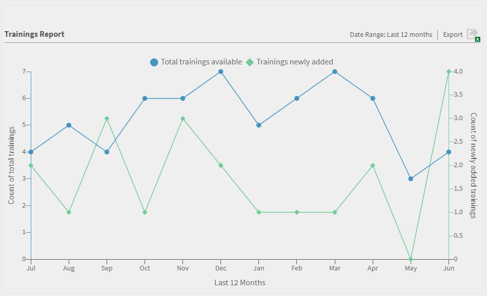
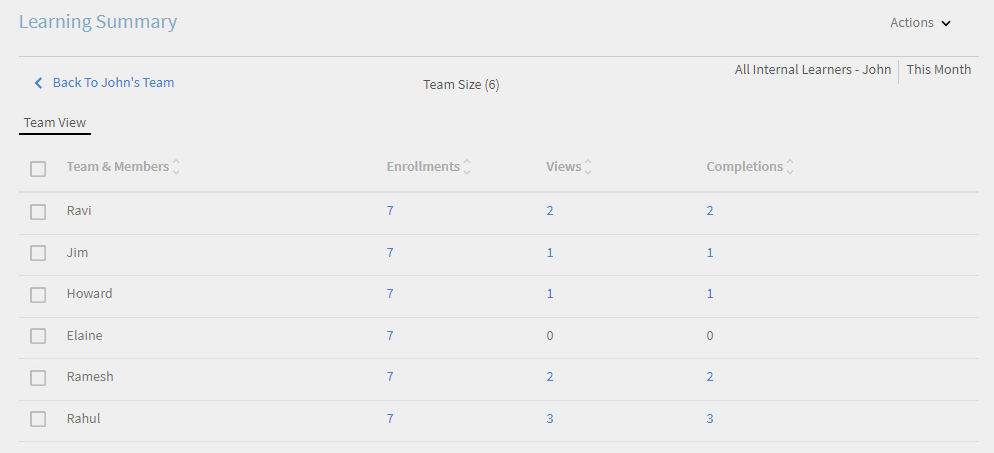
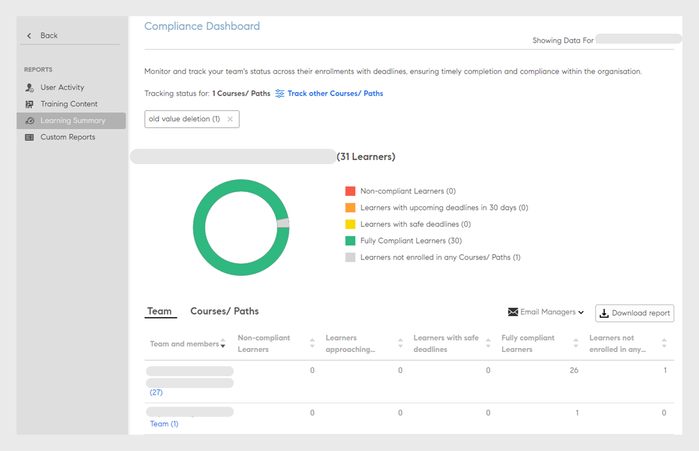
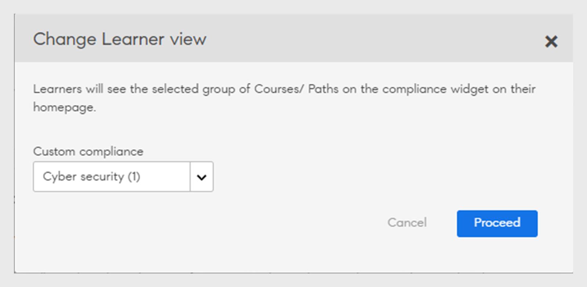
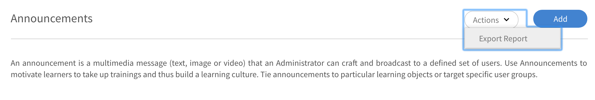
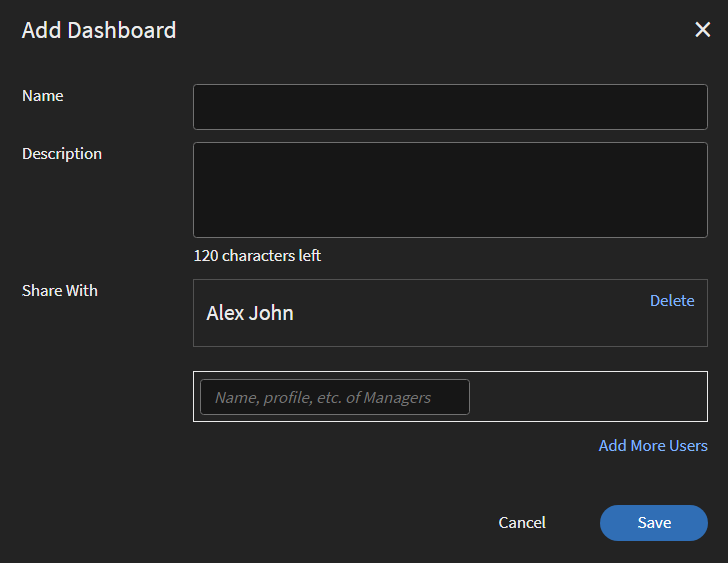

# レポート

この記事では、Learning Manager アプリケーションの「管理者」役割に関連するレポートについて説明します。

Adobe Learning Manager では、さまざまなレポートを作成して、学習者のアクティビティを追跡、監視、管理できます。学習者のアクティビティは追跡され、データベース内に自動的に登録されます。マネージャーおよび管理者のレポートは、データベースから生成されます。

## 概要 {#overview}

レポート生成プロセスは、管理者とマネージャーの両方でほぼ共通しています。マネージャーは部下に対応するレポートを表示できます。管理者は組織全体のすべてのレポートを表示できます。

レポートはダッシュボードに集計されます。レポートはダッシュボード内に存在している必要があります。**[!UICONTROL 既定のダッシュボード]**&#x200B;は、レポートページに既定で存在します。 ユーザーによって追加されたレポートは、このデフォルトのダッシュボードに移動します。個別のダッシュボードにレポートを追加するには、ドロップダウン矢印を使用して[**[!UICONTROL レポートの追加]**]を選択します。 ダッシュボードの作成方法の詳細については、このページの「ダッシュボード」セクションを参照してください。

## レポートのタイプ {#typesofreports}

Adobe Learning Manager では、4 つの主要なレポートタイプ（完了日、学習時間、スキル、有効性など）がサポートされています。次のレポートタイプを使用して、300以上のバリエーションのレポートを生成できます。

* 学習者のコースの配信の統計
* コースレポートの効果
* 学習者のスキルに基づくレポート
* 学習者の学習プログラム登録の統計
* 学習者の学習時間
* 学習者の人数
* 資格認定の完了

## ユーザーアクティビティダッシュボード {#useractivitydashboards}

プラットフォーム上のすべてのユーザーアクティビティの概要を時系列で確認します。 ユーザーグループを設定し、フィルターを適用します。

ユーザーアクティビティダッシュボードには、アカウント内のユーザーのアクティビティが表示されます。 リストされている3つのレポートは次のとおりです。

* **登録済みユーザー：**&#x200B;このレポートは、アカウントに登録されているユーザー数に関する情報を1週間単位で提供します。 月間アクティブ単位ライセンスのアカウントの場合、レポートには代わりに MAU 単位が表示されます。

* **ユーザー訪問レポート：**&#x200B;このレポートは、プラットフォームにアクセスしているユーザー数に関する情報を日単位で提供します。 月次レポートもあります。

* **学習時間レポート：**&#x200B;このレポートは、プラットフォームで費やされた学習時間に関する情報を日単位で提供します。 月次レポートもあります。

### 登録ユーザー {#registeredusers}

Learning Manager では、毎週システムに登録されたユーザー数が記録されます。管理者はこのレポートを表示して、その曜日に登録されたユーザーの数を把握することができます。 一度保存された 1 週間分の登録数は変更されません。 従って、過去の登録数は、システム内の現在の学習者数とは関連しません。

このレポートでは、アカウントに登録されたユーザー数に関する情報が週単位で提供されます。

月間アクティブ単位ライセンスのアカウントの場合、レポートには代わりに MAU 単位が表示されます。

*登録済みユーザーレポート*

***月間アクセス単位アカウントの場合：***

**月間アクティブユーザーレポート**

このレポートには、月単位の学習プラットフォームでのアクティブな学習者の数が表示されます。 ユーザーがここで説明される学習アクションを行うと、その月についてアクティブユーザーと見なされます。 これは、月間アクティブ単位のカウント方法と同じです。

一度カウントされて保存された 1 か月分の月間アクティブ数は変更されません。 従って、表示される過去のカウントは、システムの現在の学習者数とは関連しません。

### ユーザー訪問 {#uservisits}

このレポートには、1 日または 1 か月の間にシステムにアクセスした学習者の合計が表示されます。 学習を行わずに学習プラットフォームを参照した場合でも、学習プラットフォームへの「アクセス」と見なされます。 これにより、管理者はシステムにアクセスしたユーザーの合計を把握できます。 Learning Manager では月初に、前月プラットフォームにアクセスしたユーザーの合計数が記録されます。また、これらのユーザーのユーザーグループ情報もキャプチャします。

管理者が設定したユーザーグループのみが記録されます。 これにより、管理者はユーザーグループに月間の履歴データのフィルターを適用することもできます。 ユーザーグループの設定を変更したものの、Learning Managerによって以前の月のこのユーザーグループのデータが記録されていない場合、この新しく設定したユーザーグループの前月データをLearning Managerで表示できなくなります。

このレポートには、Web、モバイルアプリ、ヘッドレスカスタムソリューションなど、あらゆる形式を使用してプラットフォームにアクセスするユーザーが含まれます。 デバイスアプリの使用状況グラフは、Learning Manager のデバイスアプリを使用してプラットフォームにアクセスするユーザーのみに限定的に表示されます。このレポートは、管理者がアカウント内のモバイルアプリの使用状況を特定するのに役立ちます。

*ユーザーアクセスレポート*

### 学習時間レポート {#learningtimespentreport}

ここでは、12 か月間に全学習者の学習時間の合計を示す二重軸の折れ線グラフを表示できます。 2 番目の軸は、個人の学習時間の中間値を表します。

学習プログラムや認定など、様々な学習対象に費やされた時間は、次の項目について計算されます。

* 静的コンテンツとインタラクティブコンテンツを使用したセルフペースコース
* URLを使用したアクティビティコース
* 週末フラグを有効にした週末セッション
* 出席が自動的にマークされる VC 接続セッション
* 学習プログラムや認定など、様々な学習対象に費やされた時間
* xAPIアクティビティコースのxAPIステートメント。

さらに、グラフを Excel スプレッドシートとして書き出すことができます。

様々なユーザーグループに関するデータを表示する際に役立つ、ユーザーグループ構成を選択するフィルターが用意されています。

選択した日付とユーザーグループのフィルターが、ダッシュボード内の関連するすべてのグラフに適用されます。

>[!NOTE]
>
>**[!UICONTROL ユーザー訪問]**&#x200B;レポートおよび&#x200B;**[!UICONTROL 学習時間]**&#x200B;レポートで、表示されるデフォルトのデータ（ユーザーグループが設定されていない場合）は、アカウント全体のデータです。

## トレーニングコンテンツダッシュボード {#trainingcontentdashboard}

トレーニングコンテンツダッシュボードでは、プラットフォーム上で利用できるトレーニングに対するインサイトを提供します。 人気のあるトレーニングを確認したり、利用可能なすべてのトレーニングを追跡したりできます。

### トレーニングレポート {#trainingsreport}

このレポートでは、プラットフォームで（「公開済み」状態の）利用可能なトレーニングの合計に関する情報が月単位で提供されます。 そのように、提供されているトレーニングの数を時系列で示しています。

*トレーニングレポート*

### アクティブトレーニングレポート {#activetrainingsreport}

このレポートでは、アクティブなトレーニングに関する情報が選択した時間範囲で提供されます。 アクティブトレーニングとは、登録済みのトレーニング、プレーヤーで表示されるトレーニング、または所定の時間内に修了したトレーニングのことです。

アクティブトレーニングでは、ユーザーグループ構成が行われていない場合に、すべてのルートユーザー（マネージャーの役割を持つ）の内部グループのデータを選択できます。 ルートユーザーのユーザーグループとは別に、必要に応じて 10 個以上のユーザーグループを設定できます。

*アクティブなトレーニングレポート*

>[!NOTE]
>
>**[!UICONTROL すべてのユーザー]**&#x200B;と&#x200B;**[!UICONTROL 12か月]**&#x200B;のフィルターを選択すると、データは正しく表示されませんが、**[!UICONTROL すべての内部ユーザーグループ]を選択すると、データが表示されます。**

<table>
 <tbody>
  <tr>
   <td>
    
<b>参照</b>
</td>
   <td>
    
<b>指標</b>
</td>
   <td>
    
<b>説明</b>
</td>
  </tr>
  <tr>
   <td>
    
1
</td>
   <td>
    
開始率（%）
</td>
   <td>
    
コースを開始した学習者数と登録数の比率。
</td>
  </tr>
  <tr>
   <td>
    
2
</td>
   <td>
    
完了率（%）
</td>
   <td>
    
コースを修了したユーザーの合計とコースを開始したユーザーの合計の比率。 
</td>
  </tr>
  <tr>
   <td>
    
3
</td>
   <td>
    
学習者フィードバック
</td>
   <td>
    
1 から 10 のスケールで、受信したすべての L1 フィードバック回答の平均（最も近い整数に丸めたもの）。 
</td>
  </tr>
  <tr>
   <td>
    
4
</td>
   <td>
    
マネージャーフィードバック
</td>
   <td>
    
1 から 5 のスケールで、受信したすべての L3 フィードバック回答の平均（最も近い整数に丸めたもの）。 
</td>
  </tr>
 </tbody>
</table>

トレーニングレポートには、次の 2 つの列が追加されています：

1. コースの星評価の平均
1. コースを評価した学習者の数
1. 埋め込みパス
1. 埋め込みパスの ID
1. 埋め込みコースの ID

>[!NOTE]
>
>開始率、完了率、学習者フィードバック、マネージャーフィードバックは、適用されたフィルターの影響を受けません。 フィルターは、登録、表示、完了にのみ影響します。

>[!NOTE]
>
>両方のレポート（トレーニングコンテンツ、ユーザーアクティビティ）で、最大 10 のユーザーグループを設定できます。 処理が完了し、新しく設定したフィルターが使用可能になるまでに、最大で 24 時間かかる場合があります。

## 学習の概要ダッシュボード {#dashboards}

### ダッシュボードレポートの生成

>[!INFO]
>
>このトレーニングでは、データベースからダッシュボードレポートを生成する方法について説明します。    

トレーニングを起動できない場合は、<almacademy@adobe.com>に書き込んでください。

プラットフォーム内のすべての学習活動のサマリーレポートを表示します。 このページでは、選択したルートユーザーのグループ版プロファイルと社外プロファイルについて、次の概要情報を表示できます。 時間範囲を選択することもできます。

* 登録、表示および完了の形での学習状況
* 上位のスキル
* 準拠の概要

*サマリーチャート*

内部ルートレベルのマネージャーがある場合は、次々と表示されます。

すべての外部プロファイルは、内部プロファイル（内部ルートレベルのユーザー）の後に表示されます。

外部プロファイルにマネージャーが含まれている場合は、[**[!UICONTROL データの表示]**]ボックスにマネージャーの階層が表示されます。 ユーザーは、すべての詳細ページ（学習の概要、コンプライアンス、スキルステータス）のマネージャー階層に一覧表示されます。

そうでない場合は、個々のユーザーのすべての詳細がリストに表示されます。

様々な社内チームの登録の詳細を表示するには、**[!UICONTROL 学習の概要の詳細]**&#x200B;をクリックします。

*学習の概要の詳細*

任意の登録をクリックすると、各マネージャーの学習者と、学習目標の登録を表示できます。 また、各学習者の進捗と完了の詳細も表示できます。

*マネージャーに割り当てられた学習者*

任意のチームをクリックし、レポートを csv として書き出します。 管理者は、ユーザーグループまたは個々のユーザーを選択して、任意のユーザーグループまたは個々のユーザーのレポートを書き出し、**[!UICONTROL アクション]**&#x200B;のドロップダウンリストから詳細を書き出すことができます。

また、進行中で達成されたスキルのバーチャートビューを表示することもできます。 グラフに表示するスキルは追加または削除できます。

*スキルステータスの積み上げ横棒グラフ*

### 準拠ダッシュボード

**Adobe Learning Manager**&#x200B;は、すべての管理者とマネージャーに準拠ダッシュボードを提供します。 管理者は、準拠ダッシュボードを作成し、それをマネージャーと共有できます。 マネージャーは、新しく共有されたダッシュボードをアプリで表示し、特定のトレーニングに関するチームメンバーのコンプライアンスを簡単に追跡できます。 準拠ダッシュボードでは、管理者はカスタム準拠コースを特定のカテゴリ（販売、マーケティング、法務など）に分類できます。 カスタム対応カテゴリは、**[!UICONTROL カタログラベル]**&#x200B;を利用しています。

_準拠ダッシュボード – 管理者ビュー_

管理者は、**[!UICONTROL 準拠ダッシュボードに移動]**&#x200B;を選択して、各マネージャーのチームの準拠ステータスを確認することもできます。 管理者は、一連のトレーニングコースをマネージャーと個別に、またはグループと共有できます。 これにより、マネージャーは指定したトレーニングについてチームメイトのコンプライアンスを簡単に追跡できます。

#### 管理ワークフロー

##### カスタム準拠ラベルの作成

準拠ラベルは、コース/学習パス/資格認定を準拠タイプとして分類するカタログラベルのタイプです。
カスタム準拠ラベルを作成するには、次の手順に従います。

1. 管理者アプリで、**[!UICONTROL 設定]**/**[!UICONTROL 一般]**&#x200B;に移動します。
1. カスタム準拠ラベルを有効にするには、**[!UICONTROL [カスタム準拠の種類]]**&#x200B;オプションを選択します。

   
   _カスタムコンプライアンスを有効にする_

   >[!NOTE]
   >
   >この新しいカタログラベルは、コース、学習パス、資格認定を準拠タイプとして分類するために導入されました。 **[!UICONTROL カスタムコンプライアンスの種類]**&#x200B;オプションを有効にするには、まず、同じページで&#x200B;**[!UICONTROL カタログラベルの表示]**&#x200B;オプションを有効にする必要があります。

1. **[!UICONTROL 設定]**/**[!UICONTROL カタログラベル]**&#x200B;に移動し、**[!UICONTROL コンプライアンスの種類]**&#x200B;を選択します。
1. 値（Legal、Salesなど）を「**[!UICONTROL 値]**」テキストボックスに入力し、「**[!UICONTROL 値の追加]**」を選択します。

   
   _カスタムコンプライアンスの値を追加する_

1. 「**[!UICONTROL 保存]**」を選択します。

>[!NOTE]
>
>作成者は、アプリでコースを作成/編集する際に、これらの準拠ラベルを追加する必要があります。 [コース/学習パス/資格認定への準拠ラベルの追加](/help/migrated/authors/feature-summary/courses.md#add-compliance-labels-to-courselearning-pathcertification)を参照してください。

##### 準拠ダッシュボードの作成と共有

準拠ダッシュボードを作成して共有するには、次の手順に従います。

1. **[!UICONTROL レポート]** > **[!UICONTROL 学習の概要]**&#x200B;に移動します。
1. **[!UICONTROL 準拠ダッシュボード]**&#x200B;セクションで、**[!UICONTROL マネージャーと共有]**&#x200B;を選択します。
1. **[!UICONTROL ダッシュボードの共有]**&#x200B;を選択し、**[!UICONTROL 準拠ラベルの選択]**&#x200B;ドロップダウンメニューから作成されたラベルを選択します。

   
   _コンプライアンスの種類を選択してください_

1. [**[!UICONTROL 共有相手]**]テキストボックスにマネージャーの名前を入力して選択します。
1. **[!UICONTROL 共有]**&#x200B;を選択して、選択したマネージャーにダッシュボードを送信します。

>[!NOTE]
>
>新しいダッシュボードを共有すると、選択したマネージャーアプリ内の既存のダッシュボードが上書きされます。 マネージャーは、管理者が新しく共有したダッシュボードを表示できるようになります。

#### 準拠ダッシュボードを管理者やカスタム管理者と共有する

管理者は、他の管理者やカスタム管理者とダッシュボードを共有して、すべての準拠ダッシュボードに即座にアクセスできます。

管理者およびカスタム管理者とダッシュボードを共有するには、次の手順に従います。

1. **[!UICONTROL 管理者]**&#x200B;としてログインします。
2. **[!UICONTROL レポート]**/**[!UICONTROL 学習の概要]**&#x200B;に移動します。
3. **[!UICONTROL 準拠ダッシュボード]**&#x200B;セクションで&#x200B;**[!UICONTROL 管理者ビュー]**&#x200B;を選択します。
4. **[!UICONTROL [ダッシュボードの共有]]**&#x200B;ボタンを選択します。

   
   _ダッシュボードの共有 – 管理者_

5. **[!UICONTROL [カスタムコンプライアンスの選択]]**&#x200B;ドロップダウンメニューからコンプライアンスラベルを選択します。 このオプションを選択すると、選択した準拠ラベルを持つすべてのコースが選択されます。
6. 管理者と共有する追加のコース、学習パス、または資格認定を選択します。

   
   _準拠ダッシュボードの共有_

7. ダッシュボードを共有するユーザーまたはユーザーグループを選択し、**[!UICONTROL 共有]**&#x200B;を選択します。

##### 準拠ダッシュボードの表示 – カスタム管理者とその他の管理者

すべてのカスタム管理者と、選択したユーザーグループの他の管理者は、アプリで準拠ダッシュボードを表示できます。

準拠ダッシュボードを表示するには、次の手順に従います。

1. **[!UICONTROL レポート]**/**[!UICONTROL 学習の概要]**/**[!UICONTROL 準拠ダッシュボード]**&#x200B;に移動します。
2. **[!UICONTROL 準拠ダッシュボード]**&#x200B;セクションで&#x200B;**[!UICONTROL 自分のビュー]**&#x200B;を選択します。
3. **[!UICONTROL 準拠ダッシュボードに移動]**&#x200B;オプションを選択すると、管理者によって共有されている新しい準拠ダッシュボードが表示されます。

   
   _準拠ダッシュボードを表示 – カスタム管理者_

#### ストアマネージャーと共有

管理者は、準拠ダッシュボードをストアマネージャーと共有することで、学習者の準拠の進捗状況を監視できます。

次の手順に従って、ダッシュボードをストアマネージャーと共有します。

1. **[!UICONTROL 管理者]**&#x200B;としてログインします。
2. **[!UICONTROL レポート]**/**[!UICONTROL 学習の概要]**/**[!UICONTROL 準拠ダッシュボード]**&#x200B;に移動します。
3. **[!UICONTROL 準拠ダッシュボード]**&#x200B;セクションの&#x200B;**[!UICONTROL マネージャービュー]**&#x200B;を選択します。
4. **[!UICONTROL [ダッシュボードの共有]]**&#x200B;ボタンを選択します。

   
   _準拠ダッシュボードをマネージャーと共有する_

5. **[!UICONTROL [カスタムコンプライアンスの選択]]**ドロップダウンメニューからコンプライアンスラベルを選択します。
このオプションを選択すると、選択した準拠ラベルを持つすべてのコースが選択されます。
6. 管理者と共有する追加のコース、学習パス、または資格認定を選択します。
7. ダッシュボードを共有するユーザーまたはユーザーグループを選択し、**[!UICONTROL 共有]**&#x200B;を選択します。

##### 準拠ダッシュボードを表示 – マネージャー

詳細については、この記事[コンプライアンスダッシュボードを表示](/help/migrated/managers/feature-summary/manager-dashboard.md#view-the-dashboard)を参照してください。

#### ダッシュボードの編集

準拠ダッシュボードを編集するには、次の手順に従います。

1. **[!UICONTROL 管理者]**&#x200B;としてログインします。
2. **[!UICONTROL レポート]**/**[!UICONTROL 学習の概要]**/**[!UICONTROL 準拠ダッシュボード]**&#x200B;に移動します。
3. **[!UICONTROL 準拠ダッシュボード]**&#x200B;セクションで&#x200B;**[!UICONTROL 管理者ビュー]**&#x200B;または&#x200B;**[!UICONTROL マネージャー表示]**&#x200B;を選択します。 このセクションには、準拠ダッシュボードが表示されます。
4. 準拠ダッシュボードで、編集する&#x200B;**[!UICONTROL 編集]**&#x200B;を選択します。

   
   _準拠ダッシュボードを編集する_

5. 必要な詳細を変更し、**[!UICONTROL 共有]**&#x200B;を選択してください。
6. 準拠ダッシュボードは、選択したマネージャーと共有されます。

#### ダッシュボードの削除 – 管理者

準拠ダッシュボードを取り消すには、次の手順に従います。

1. **[!UICONTROL 管理者]**&#x200B;としてログインします。
2. **[!UICONTROL レポート]**/**[!UICONTROL 学習の概要]**/**[!UICONTROL 準拠ダッシュボード]**&#x200B;に移動します。
3. **[!UICONTROL 準拠ダッシュボード]**&#x200B;セクションで&#x200B;**[!UICONTROL 管理者ビュー]**&#x200B;または&#x200B;**[!UICONTROL マネージャー表示]**&#x200B;を選択します。 このセクションには、準拠ダッシュボードが表示されます。
4. 削除する準拠ダッシュボードで「**[!UICONTROL 撤回]**」を選択し、「**[!UICONTROL 続行]**」を選択します。
5. このアクションにより、マネージャーアプリから共有準拠ダッシュボードが削除されます。

   
   _準拠ダッシュボードを取り消す_

#### 学習者のデフォルトの準拠ウィジェットの設定

学習者のデフォルトの準拠ウィジェットを設定するには、次の手順に従います。

1. **[!UICONTROL 管理者]**&#x200B;としてログインします。
2. **[!UICONTROL レポート]**/**[!UICONTROL 学習の概要]**/**[!UICONTROL 準拠ダッシュボード]**&#x200B;に移動します。
3. **[!UICONTROL 準拠ダッシュボード]**&#x200B;セクションで&#x200B;**[!UICONTROL 学習者ビュー]**&#x200B;を選択します。
4. 「**[!UICONTROL 学習者ビュー]**」セクションで「**[!UICONTROL 変更]**」を選択します。

   
   _学習者の既定の準拠ウィジェットを設定する_
5. **[!UICONTROL [カスタムコンプライアンス]]**&#x200B;ドロップダウンからコンプライアンスラベルを選択します。 このオプションを選択すると、選択した準拠ラベルを持つすべてのコースが選択されます。
6. 既定の準拠ウィジェットを設定するには、**[!UICONTROL 続行]**&#x200B;を選択します。

学習者は、ホームページの準拠ウィジェットで、選択したコースや学習パスを確認できます。 詳細については、[準拠ダッシュボードウィジェット](/help/migrated/learners/feature-summary/learner-home-page.md#compliance-dashboard-widget)を参照してください。

## カスタムレポート

管理者は、「**[!UICONTROL レポート]**」セクションで利用可能なカスタムテンプレートを使用して、特定のレポートを生成できます。

### サンプルレポート {#samplereports}

「**[!UICONTROL サンプルレポート]**」タブには、サンプルのデータポイントをベースとするいくつかのレポートが表示されます。これらのレポートを参照すると、アカウントデータを使用してどのようなレポートを作成できるのかを理解することができます。様々な機能が組み込まれたレポートを作成することができます。

### ダッシュボードレポート {#dashboardreports}

ダッシュボードは、レポートの集まりです。レポートは、選択に応じてダッシュボードにグループ化できます。 作成したすべての掲示板を表示するには、この掲示板タブをクリックします。 **[!UICONTROL [ダッシュボードの表示]]**&#x200B;ドロップダウンリストから、既定の掲示板または作成したダッシュボードを選択できます。

### Excel レポート {#excelreports}

「**[!UICONTROL Excel レポート]**」タブを使用して、XLS ファイル形式でレポートを書き出すことができます。

以下のレポートをダウンロードすることができます。

* コースレポート
* 学習者のトランスクリプトレポート
* アナウンスレポート
* 作業計画書レポート
* コンテンツ監査追跡レポート
* ユーザー監査追跡
* ログイン／アクセスレポート
* ゲーミフィケーショントランスクリプトレポート
* ゲーミフィケーション監査証跡

### 学習者のトランスクリプト {#learnertranscripts}

学習者のトランスクリプトの Excel レポートでは、必要な単位と獲得した単位の列に小数が表示されます。

### コースレポート {#coursereports}

管理者は、コース用のレポートをダウンロードすることができます。その場合、以下の手順を実行します。

1. **[!UICONTROL レポート]** > **[!UICONTROL カスタムレポート]** > **[!UICONTROL Excelレポート]** > **[!UICONTROL コースレポート]**&#x200B;を開きます。
1. **[!UICONTROL コースレポート]**&#x200B;ダイアログが表示されます。レポートの取得元となるコースを選択して「**[!UICONTROL 表示]**」をクリックします。

   
   *コースレポート*

1. コースページにリダイレクトされます。特定の登録タイプを選択して、ユーザー別や各登録に基づく質問別にクイズスコアを書き出すことができます。
1. 「**[!UICONTROL クイズスコアを書き出し]**」を選択してレポートを書き出します。「**[!UICONTROL レポートのリクエストを生成しています]**」というタイトルのダイアログボックスが表示されます。このダイアログボックスで「**[!UICONTROL OK]**」をクリックします。

   
   *レポート要求を生成しています*

   >[!NOTE]
   >
   >モジュールに対して複数回の試行オプションが設定されている場合、試行のたびに、書き出し後のクイズスコアレポートにスコアの詳細情報が追加されます。

### コースレポートの生成

>[!INFO]
>
>このトレーニングでは、コースレポートを書き出し、これらのレポートの電子メールサブスクリプションを設定する方法について説明します。    

トレーニングを起動できない場合は、<almacademy@adobe.com>に書き込んでください。

### 学習者のトランスクリプト {#LearnerTranscripts-1}

組織の管理者は Adobe Learning Manager を使用して、学習者に関連するトランスクリプトを生成できます。学習者のトランスクリプトレポートは、以下の要素から構成されています。

1. 学習者のトランスクリプト：学習活動ダッシュボード
1. スキル：スキルダッシュボード
1. 準拠ダッシュボード

学習者のトランスクリプトの Excel レポートでは、必要な単位と獲得した単位の列に小数が表示されます。

学習者のトランスクリプトレポートの生成および詳細については、[学習者のトランスクリプト](learner-transcripts.md)を参照してください。

### アナウンスレポート {#announcementsreports}

管理者は、自分が送信したすべてのアナウンスについて、レポートを生成することができます。このレポートには、以下の情報が表示されます。

* アナウンスタイプ
* アナウンス名
* アナウンス日
* アナウンスの状態
* 学習者名

レポートをダウンロードするには、以下に示すいずれかの操作を実行します。

1. **[!UICONTROL レポート]** > **[!UICONTROL カスタムレポート]** > **[!UICONTROL Excelレポート]** > **[!UICONTROL アナウンスレポート]**&#x200B;を開きます。 **[!UICONTROL レポート要求の生成]**&#x200B;ダイアログボックスが開きます。 「OK」をクリックします。
1. [!UICONTROL **通知**] > [!UICONTROL **アクション**] > [!UICONTROL **レポートのエクスポート**]。

   
   *アナウンスレポート*

1. 設定アイコンの下の[**[!UICONTROL レポートのエクスポート]**]をクリックすると、特定のお知らせのレポートを抽出できます。

   
   *特定のお知らせに関するレポート*

### 作業計画書レポート {#jobaidsreport}

作業計画書は、コース、学習プログラムなど、特定の学習目標に登録する必要なく学習者がアクセスできるトレーニングコンテンツです。管理者は、作業計画書レポートの書き出しとダウンロードを行うことができます。

書き出し後のレポートには、以下の情報が表示されます。

* 名前
* 作業計画書のタイプ
* 作業計画書の状態（「公開済み」または「撤回済み」）
* 登録日
* 完了日
* ダウンロード日
* 学習者名
* マネージャー名
* 作成ユーザー

レポートをダウンロードするには、以下に示すいずれかの操作を実行します。

* **[!UICONTROL レポート]** > **[!UICONTROL カスタムレポート]** > **[!UICONTROL Excelレポート]** > **[!UICONTROL 作業計画書レポート]**&#x200B;を開きます。 「**[!UICONTROL レポートのリクエストを生成しています]**」というタイトルのダイアログボックスが表示されたら、「**[!UICONTROL OK]**」をクリックします。
* **[!UICONTROL 作業計画書]** > **[!UICONTROL アクション]** > **[!UICONTROL レポートの書き出し]**&#x200B;を開きます。

*作業計画書レポート*

* 設定アイコンの「**[!UICONTROL レポートを書き出し]**」オプションをクリックして、特定の作業計画書のレポートを書き出します。

*特定の作業計画書のレポート*

### 作業計画書レポート

リストで&#x200B;**[!UICONTROL 作業計画書レポート]**&#x200B;を選択すると、次の2つのオプションが表示されます。

*作業計画書USer登録レポートのダウンロード*

**すべての作業計画書**:アカウント内の作業計画書の数が1,000万人未満の場合、生成されたレポートにはすべての作業計画書の登録情報が含まれます。 これがデフォルトの選択になります。 行数が1,000万行を超えるとエラーが表示され、必要な作業計画書を手動で選択する必要があります。

**選択した作業計画書**：このオプションを選択した場合、レポートを生成する作業計画書を入力できます。 最大10個の作業計画書を選択できます。 Adobe Learning Managerは、作業計画書の数が1000万を超えるかどうかを確認します。

*作業計画書を選択*

**作業計画書レポート**

このオプションを選択すると、システムに存在するすべての作業計画書の詳細が、メタデータとトレーニングとともにダウンロードされます。

ダウンロードされたレポートには、以下のフィールドが含まれています。

* 作業計画書名
* 言語
* ID
* タイプ
* 所要時間（分）
* ステート
* 発行日（UTC タイムゾーン）
* 作成者
* 作成者電子メール
* 作成者の一意のユーザー ID
* カタログ
* 学習パス
* コース
* タグ
* スキル

**作業計画書のユーザー登録レポート**

登録レポートには、ユーザー登録に関する詳細とその他の情報が含まれます。

ダウンロードされたレポートには、以下のフィールドが含まれています。

* 作業計画書名
* タイプ
* ステート
* 登録日（UTC タイムゾーン）
* 完了日（UTCタイムゾーン）
* ダウンロード日（UTCタイムゾーン）
* 学習者名
* 電子メール
* ユーザーの一意の ID
* マネージャーの名前
* マネージャーの電子メール
* マネージャーの一意の ID
* 割り当て済み（名前別）
* 割り当て済み（電子メール別）
* 割り当て済み（ユーザーの一意の ID 別）
* 作成者（名前別）
* 作成者（電子メール別）
* 作成者（一意のユーザー ID 別）
* 作業コード
* 新規フィールド
* プロファイル

### コンテンツ監査追跡レポート {#contentaudittrailreports}

**[!UICONTROL コンテンツ監査証跡]**&#x200B;レポートジェネレーターを使用して、システム内のコースの使用中にコースに加えられたすべての変更および編集のレポートを生成します。 このレポートには、以下の情報が表示されます。

* オブジェクト ID
* オブジェクト名
* オブジェクトタイプ
* 修正タイプ
* 説明
* 参照先オブジェクト ID
* 参照先オブジェクト名
* 変更者（ユーザー名）
* 修正を行ったユーザーの ID
* 修正日（UTC タイムゾーン）

**変更の種類**&#x200B;の列に、次の詳細が表示されます：

| 修正タイプ | 説明 |
| --- | --- |
| Create | 作成されたコース |
| 資格認定の追加 | カタログに追加された資格認定 |
| 資格認定の削除 | カタログから資格認定を削除 |
| コンテンツの追加 | モジュールに追加されたコンテンツ |
| コースの追加 | 学習パスに追加されたコース |
| コースを削除 | 学習パスから削除されたコース |
| カスタムラベルを追加 | カタログに追加されたカスタムラベル |
| カスタムラベルの削除 | カスタムラベルをカタログから削除 |
| 削除 | カタログを削除しました |
| 作業計画書の追加 | カタログに作業計画書を追加 |
| 作業計画書の削除 | カタログから作業計画書を削除 |
| 学習パスの追加 | カタログに追加された学習パス |
| 学習パスの削除 | カタログから学習パスを削除 |
| モジュールコンテンツの追加 | コースに追加されたモジュール（「コンテンツ」セクション） |
| モジュールの内容の削除 | モジュールがコースから削除されました（「コンテンツ」セクション） |
| 公開済み | コースまたは学習パスが公開され、デフォルトのカタログに追加されました |
| 再公開 | コースの再公開 |
| リソースの追加 | コースにリソースを追加 |
| リソースの削除 | リソースをコースから削除しました |
| 撤回済み | コースは廃止されました |
| 共有カタログの追加 | カタログがカタログに共有されました |
| 共有カタログの削除 | カタログ共有がカタログから削除されました |
| 共有カタログの更新 | カタログの共有状態：アクティブ |
| アップデート | コースまたは学習パスが更新されました |
| ユーザーグループ追加 | ユーザーグループをカタログに追加しました |
| ユーザーグループの削除 | ユーザーグループをカタログから削除しました |

生成されたレポートに、メタデータに関する情報が取り込まれることはありません。

コンテンツ監査追跡レポートを生成するには、以下の手順を実行します。

1. **[!UICONTROL レポート]** > **[!UICONTROL Excelレポート]** > **[!UICONTROL コース監査証跡]**&#x200B;を選択します。 **[!UICONTROL コンテンツ監査追跡]**&#x200B;ダイアログボックスが表示されます。

   
   *コース監査証跡*

1. レポートとしてダウンロードするコース、学習目標、認定資格を選択します。何も選択しなかった場合、すべてのレポートがデフォルトでダウンロードされます。
1. レポートの日付範囲を選択し、**[!UICONTROL [生成]]**&#x200B;をクリックします。
1. レポートが生成され、コンテンツ監査追跡の準備ができたことを知らせる通知が表示されます。この状態になったら、レポートをダウンロードすることができます。

### ユーザー監査追跡レポート {#useraudittrailreports}

ユーザー監査追跡は、ユーザー、ユーザーグループ、および自己登録プロファイルのライフサイクルをキャプチャします。 また、ユーザーの追加操作、削除操作、マネージャーの変更操作がすべて表示されます。 自己登録プロファイルの作成操作と削除操作も表示されます。自己登録処理を一時停止してから再開することもできます。

自己登録で、追加、削除、一時停止、または再開を行う際に、外部プロファイルに対して、追加、有効化、無効化、一時停止、または再開を実行することができます。CSV ファイルのアップロード操作も、レポートに表示されます。

1. **[!UICONTROL レポート/Excelレポート/ユーザー追跡]**&#x200B;を選択します。 [User Audit Trail]ダイアログ・ボックスが開きます。
1. ユーザー監査追跡ダイアログボックスが表示されます。ポップアップメニューで日付範囲を選択します。レポートの生成対象期間として、「最後の 1 週間」「最後の 1 ヶ月」「カスタム日付」のいずれかを選択することができます。

   
   *ユーザー監査追跡*

1. 「**[!UICONTROL 生成]**」をクリックしてレポートを生成します。

**[!UICONTROL ユーザー監査追跡レポート]**&#x200B;ダイアログには、2 つのフィルターがあります。

**日付範囲フィルター：**&#x200B;レポートを生成する日付範囲を選択します。 オプションは以下の 3 つです。

* 過去 1 週間
* 過去 1 か月
* カスタム日付

学習者を選択フィルター：ユーザーまたはユーザーグループを検索します。

書き出されたレポートには、指定された検索条件の両方を満たすユーザーのデータが含まれます。

*ユーザー監査証跡*

>[!NOTE]
>
>スキルが割り当てられたまたは削除された場合、割り当てられたスキルと削除されたスキルの両方のユーザー監査レポートでそのスキルを追跡できます。

### 拡張機能の設定に関するレポート

このレポートは、追加されたすべてのネイティブ拡張機能の構成の詳細（アクティベーション状態を含む）に関する情報を提供します。 拡張機能レポートをダウンロードする方法については、「[拡張機能レポートのダウンロード](native-extensibility.md#download-extension-report)」を参照してください。

### xAPI アクティビティレポート

このレポートは、xAPIアクティビティモジュール中に記録および生成されたすべてのxAPIステートメントのデータを提供します。

このレポートをダウンロードするには、次の手順に従います。

1. **[!UICONTROL レポート/Excelレポート/xAPIアクティビティレポート]**&#x200B;を選択します。 xAPIアクティビティレポートダイアログボックスが表示されます。
1. ポップアップメニューで日付範囲を選択します。レポートの生成対象期間として、「最後の 1 週間」「最後の 1 ヶ月」「カスタム日付」のいずれかを選択することができます。
1. ドロップダウンメニューから学習者とアクティビティを選択します。
1. **[!UICONTROL 生成]**&#x200B;を選択してレポートを生成します。

### ゲーミフィケーションレポート {#gamification}

管理者は、ゲーミフィケーショントランスクリプトレポートを CSV 形式でダウンロードすることができます。個々のユーザーまたはユーザーグループのレポートをダウンロードできます。 ユーザー名、ユーザーの電子メール、ユーザーのUUID、得点した合計ユーザーポイント、収集したポイントの内訳、ユーザーが再生するグループの名前、マネージャーの名前、アクティブフィールドの値がすべてレポートに取得されます。 管理者はこのレポートを使用して、組織レベルまたは特定のグループにおけるユーザーのランキングを確認することができます。

1. レポート/Excelレポート/ゲーミフィケーションレポートの順に選択します。

   
   *ゲーミフィケーションレポート*

1. ゲーミフィケーショントランスクリプトダイアログボックスが表示されます。学習者の名前、プロファイル、ユーザーグループ、電子メール ID、または UUID を使用して、目的の学習者を選択します。

   
   *ゲーミフィケーションのトランスクリプトダイアログ*

1. **[!UICONTROL [生成]]**&#x200B;をクリックして、レポートを生成します。

   学習者のレポートを生成した後、アカウント内のすべてのユーザー（内部、外部、削除済み）の現在の情報および達成レベルの情報をエクスポートできる必要があります。 また、以下のレベルについて、学習者がそのレベルを達成した日付を確認することもできます。

   * ブロンズ達成日
   * シルバー達成日
   * ゴールド達成日
   * プラチナ達成日

   これらの列には、そのレベルを最初に達成した日付が表示されます。 列&#x200B;**[!UICONTROL 現在のレベル]**&#x200B;には、学習者の現在のレベルが表示されます。

   管理者がゲーミフィケーションをリセットすると、学習者のすべてのポイントがリセットされます。

### ゲーミフィケーション監査追跡レポート {#gamification-audit-trail}

このレポートには、ルールごとに獲得した学習者のゲーミフィケーションポイントの履歴と理由が含まれます。

### レポートのダウンロード

1. ゲーミフィケーション監査追跡URLを選択します。
1. **ゲーミフィケーション監査追跡**&#x200B;ポップアップで、日付範囲を選択します。
1. 「**生成**」を選択します。

レポートはCSVファイルとしてダウンロードされます。 ファイルには次の列が含まれます。

* 名前
* メール/UUID、
* ステータス
* 操作
* 頂点、
* バランスポイント
* ルール/タスク
* ルール/タスクサブタスク、
* ルール/タスクの詳細
* 文字、
* 名前、
* インスタンス名取得日（UTCタイムゾーン）
* ルール/タスクの開始時刻
* ルール/タスク終了時刻

### 登録および登録解除レポート {#enrollmentandunenrollmentreport}

管理者とマネージャーは、登録および登録解除された学習者のレポートを抽出できます。 管理者は、コースインスタンス、学習プログラムインスタンス、または認定資格インスタンスに登録されている（またはこれらのインスタンスから登録解除された）学習者、管理者、またはマネージャーを表示して、レポートを抽出することができます。マネージャーは、チームメンバーのレポートのみを取得できます。 マネージャーは、削除された学習者や、マネージャーアプリケーション内の自分の名前を、登録済み学習者または未登録の学習者として表示することはできません。

レポートをダウンロードするには、次の手順に従います。**[!UICONTROL コース/学習プログラム/資格認定]** > **[!UICONTROL 学習者]** > **[!UICONTROL アクション]** > **[!UICONTROL レポートの書き出し]**&#x200B;を開きます。

*登録解除レポート*

### フィードバックレポート {#feedback-report}

管理者は、選択したトレーニングの指定した期間に対する学習者フィードバック（L1）とマネージャーフィードバック（L3）の両方を取得できるようになりました。

UIまたはPowerBIコネクターからデータを書き出して、より詳細な分析を行うことができます。

L1およびL3のフィードバックレポートには、**1年**&#x200B;の範囲で選択したトレーニングについて、または任意の日付範囲で最大10個の選択したトレーニングについて、L1およびL3回答の統合されたフィードバックレポートをダウンロードするオプションが用意されています。

管理者としてサインインして、**[!UICONTROL レポート]** > **[!UICONTROL カスタムレポート]**&#x200B;をクリックし、レポートの一覧で[**[!UICONTROL フィードバックレポート]**]をクリックします。

*フィードバックレポートのダウンロード*

フィルターを選択して「ダウンロード」をクリックすると、レポートをCSV形式でダウンロードする通知が表示されます。

ダウンロードされたレポートには、トレーニング名とタイプ、インスタンス名、学習者の名前とメールアドレス、フィードバックのタイプ：L1またはL3、新しいデータのために送信されたフィードバックの日付などの詳細が含まれます。

この機能の実装より前の既存データの場合、LO完了日、LO完了日、L1フィードバック質問のセルフペースの実際のテキストと教室のテキスト（異なる列）、L1フィードバックの各回答、マネージャーの名前と電子メール、L3フィードバックの値と送信日、アクティブフィールドが表示されます。

UIからデータまたはデータに書き出すこともできます。これにより、任意の日付範囲のすべてのトレーニングがサポートされ、より詳細なPower BI分析が可能になります

### トレーニングレポート {#training-report}

Learning Managerではトレーニングレポートをサポートしています。管理者はこの機能により、トレーニングの詳細や関連するメタデータ（作成者、公開日、スキル、カタログラベルなど）をダウンロードできます。

管理アプリで、**[!UICONTROL レポート]**/**[!UICONTROL カスタムレポート]**/**[!UICONTROL Excelレポート]**/**[!UICONTROL トレーニングレポート]**&#x200B;をクリックします。

次のレポートをダウンロードできます。

* 選択したトレーニング（10 個まで） - 任意のカタログから 1 つ以上のトレーニング（最大 10 個）を選択
* 選択したカタログ内のトレーニング（5 個まで） - （選択できるカタログは 5 つまで）
* すべてのトレーニング（アカウント内のすべてのトレーニング）

*トレーニングレポートのダウンロード*

「詳細オプション」セクションでは、次のオプションを使用できます。

* 学習プログラム／資格認定にコースマッピングを含める
* モジュールレベル情報を含める

フィルターを選択して「ダウンロード」をクリックすると、レポートをCSV形式でダウンロードする通知が表示されます。

レポートには次のフィールドが含まれます。

*カタログ名、トレーニングタイプ、トレーニングId、トレーニングの一意のID、トレーニング名、サブトレーニング、モジュール、トレーニングまたはモジュールの期間、形式、トレーニングのステータス、スキル、作成者、最終公開日、最終完了日、インストラクターの登録数、開始数、完了数、平均L1スコア、平均L2スコア、平均L3スコア、L1回答、受信L2回答、受信L3回答、受信L3回答、カタログのラベルとタグ。*

*追加のオプション*

### セッションの概要レポート {#session-summary-report}

セッションの概要レポートには、指定した日付内に学習者に対して計画されたすべてのセッションが含まれます。

これにより、管理者は、指定した日付範囲に該当するすべてのバーチャルおよびクラスルームセッションの詳細を書き出すことができます。 また、管理者は、特定のトレーニングやインストラクターに関するセッションレポートも書き出せます。

これにより、管理者は月単位で計画されているセッションを把握し、インストラクターのスケジュールと既に提供されているセッションを特定することもできます。

管理者として、**[!UICONTROL カスタムレポート]** > **[!UICONTROL セッションの概要レポート]**&#x200B;をクリックします。

次のダイアログボックスで、日付範囲と、トレーニングまたはインストラクターを選択して、概要を表示します。

*セッションの概要レポート*

ダウンロードした csv には、次のフィールドが含まれます：

* 開始日時
* 終了日時

* モジュール名
* セッション期間（分）
* 席数
* 場所
* インスタンス名
* コース名
* コース ID
* インストラクター名
* インストラクターの電子メール
* 登録数
* セッションタイプ
* キャンセル待ちの制限
* キャンセル待ちの数
* キャンセル待ちのユーザーの電子メール
* 場所情報
* 場所と地域

### インストラクター稼働率レポート

このレポートには、割り当てられたセッションで教えるためにインストラクターが 1 日に費やした時間が分単位で記録されます。 選択した開始日から 3 か月分のレポートをダウンロードできます。

レポートをダウンロードするには、**[!UICONTROL レポート]**/**[!UICONTROL カスタムレポート]**/**[!UICONTROL インストラクターの利用状況レポート]**&#x200B;をクリックします。

インストラクター（1 人または複数）と日付範囲を選択します。

*インストラクターの利用状況レポートのダウンロード*

ダウンロードしたレポートには、次のフィールドが含まれます。

* インストラクターの名前
* インストラクター ID
* コンピテンスレベル
* 日付の列。 インストラクターが特定の日付に稼働する場合は、セッション数が表示されます。 インストラクターがその日に稼働しない場合、値は 0 と表示されます。

レポートには、選択した月から 3 か月分のレコードが含まれます。

すべてのインストラクターの記録を取得するには、「インストラクター」フィールドを空白のままにします。

また、レポートを生成する権限を持つカスタム管理者は、このレポートを取得できます。

### ユーザー監査追跡レポート

このレポートには、インスタンスを「インスタンスから」インスタンスに切り替えた学習者、時間や日付などで切り替えた学習者に関する情報が取り込まれます。

学習者またはユーザーグループを選択します。

レポートをダウンロードするには、**[!UICONTROL レポート]** > **[!UICONTROL カスタムレポート]** > **[!UICONTROL ユーザー監査追跡レポート]**&#x200B;をクリックします。

*ユーザー監査追跡レポートのダウンロード*

### 学習プランレポート

このレポートには、関連するユーザーグループ、ステータス、トリガー情報など、アカウント内のすべての学習プランの詳細が含まれます。

レポートには次の情報が含まれます。

* 学習プランの名前
* タイプ（次の場合に発生）
* トレーニング（完了済み）
* スキル（達成済み）
* 日付
* 操作
* ステータス、作成者
* 作成日
* 最終変更日
* ユーザーグループ（対象先）
* ユーザーグループ（追加先）
* 後で登録
* 学習要素のタイプ
* 学習要素
* 学習要素のインスタンス
* 学習要素
* 完了日
* 学習要素のリマインダー
* カタログ範囲
* ユーザーグループ範囲

### カスタム役割の監査証跡

管理者は、カスタムの役割の監査レポートをダウンロードして、カスタムの役割と関連する機能アクセスの作成、変更、削除など、カスタムの役割に加えられたすべての変更を追跡することができます。

レポートをダウンロードするには、次の手順に従います。

1. 管理者としてログインします。
2. レポート/カスタムレポートを選択します。
3. 「カスタム役割監査追跡」を選択し、日付範囲を選択します。
4. 「生成」を選択してレポートをダウンロードします。

カスタム役割監査追跡レポートには、次のフィールドが含まれます。

* 役割 ID
* 役割名
* アクティビティタイプ
* 修正タイプ
* 説明
* 参照先オブジェクトタイプ
* 参照先オブジェクト ID
* 参照先オブジェクト名
* 参照先オブジェクト電子メール
* ユーザー名を修正
* 変更者ユーザーUUID
* ユーザーの電子メールを修正
* 変更日（UTCタイムゾーン）
* ソース

## 電子メールのサブスクリプション {#emailsubscriptions}

電子メールのサブスクリプション登録をすることにより、興味のあるレポートを電子メール経由で受け取ることができます。

### 電子メール購読の設定

>[!INFO]
>
>このトレーニングでは、ダッシュボードレポート用の電子メールサブスクリプションを設定する方法について説明します。    

トレーニングを起動できない場合は、<almacademy@adobe.com>に書き込んでください。

**[!UICONTROL レポート]**&#x200B;ページで、[**[!UICONTROL サブスクリプション]**]タブをクリックします。 レポートのサブスクリプションページが表示されます。

ドロップダウンリストからレポート名を選択するには、「レポート」フィールドにレポート名の入力を開始します。 次に、ドロップダウンで電子メールの受信頻度を選択します。電子メールの件名を追加して、別の電子メール ID を指定することができます。

電子メールのサブスクリプションは、編集することも削除することもできます。

## 履歴レポート

Adobe Learning Manager(ALM)の履歴レポートとは、学習プラットフォーム内の履歴データとアクティビティをキャプチャするレポートを参照します。 これらのレポートは、過去の学習者のアクティビティ、トレーニングコンテンツ、ユーザーグループのパフォーマンス、その他の関連データに関するインサイトを提供します。 履歴レポートを使用すると、管理者は学習イニシアチブの進捗状況と有効性を経時的に追跡、監視、分析できます。

### コースアクセスレポート

コースアクセスレポートには、各コースの再訪に関する情報が表示されます。

このレポートをダウンロードするには、次の手順に従います。

1. **[!UICONTROL レポート]**/**[!UICONTROL カスタムレポート]**/**[!UICONTROL 履歴レポート]**&#x200B;に移動します。
1. **[!UICONTROL コースアクセスレポート]**&#x200B;を選択します。 「レポートリクエストの生成」ダイアログボックスが開きます。
1. ドロップダウンメニューから年と四半期を選択します。
1. 「**[!UICONTROL 生成]**」を選択します。

### ログイン/アクセスレポート

ログイン/アクセスレポートは、ユーザーのログインとアクセスに関する情報を提供します。 一度に3か月のデータを含むレポートを生成できます。

このレポートをダウンロードするには、次の手順に従います。

1. **[!UICONTROL レポート]**/**[!UICONTROL カスタムレポート]**/**[!UICONTROL 履歴レポート]**&#x200B;に移動します。
1. **[!UICONTROL ログイン/アクセスレポート]**&#x200B;を選択します。 「レポートリクエストの生成」ダイアログボックスが開きます。
1. ドロップダウンメニューから年と四半期を選択します。
1. 「**[!UICONTROL 生成]**」を選択します。

## ダッシュボードを作成する {#createadashboard}

1. 独自のダッシュボードの作成を開始するには、ページの右側にある「ダッシュボードを追加」をクリックします。

   
   *ダッシュボードの追加*

1. ダッシュボードの名前と説明を入力します。
1. ダッシュボードを任意のマネージャーと共有する場合は、[**[!UICONTROL 共有先]**]フィールドでマネージャーを選択します。 この操作を行う場合は、通常の選択条件を使用することができます。
1. 「**[!UICONTROL 保存].**」をクリックします

「**[!UICONTROL ダッシュボードレポート]**」タブで、最近作成された掲示板を表示することができます。

レポートを掲示板に追加するには、掲示板ウィンドウの右上隅にあるドロップダウンをクリックし、[**[!UICONTROL レポートの追加]**]をクリックします。 この方法でレポートを作成すると、自分の掲示板にそのレポートが関連付けられます。

>[!NOTE]
>
>レポートページの右上隅の「追加」をクリックして作成したレポートは、デフォルトのダッシュボードに追加されます。

## 共有ダッシュボード {#shareddashboards}

共有ダッシュボードは、自分を含む組織内のユーザー間で共有されている各種のレポートから構成されています。共有ダッシュボードにレポートを追加すると、そのダッシュボードへのアクセス権を持っているユーザー間でそのレポートが自動的に共有されます。

掲示板を共有するには、次の2つの方法があります。

* ダッシュボードを共有している&#x200B;**[!UICONTROL 共有相手]**&#x200B;フィールドにユーザーを入力します。
* ドロップダウンリストで「掲示板を編集」ドロップダウンリストを選択し、ダッシュボードを共有するユーザーの詳細情報を入力する。

>[!NOTE]
>
>マネージャーが共有ダッシュボードで表示できるのは、自分が管理しているチームメンバーのレポートのみです。

## ダウンロード {#downloads}

書き出されたダッシュボードレポートのシートには、レポートの概要ではなく、詳細情報が表示されます。 ダウンロードされたレポートは、学習者のトランスクリプトの形式に従っています。

## レポートの作成 {#report}

1. 左ペインで「レポート」をクリックします。レポートサマリページが表示されます。

   >[!NOTE]
   >
   >デフォルトでは、3 つ以上のサンプルレポートがサンプルの掲示板タブに表示されます。これらのサンプルレポートを参照すると、レポートの作成方法とカスタマイズ方法について理解することができます。

1. ページの右上隅にある「**[!UICONTROL 追加]**」をクリックします。
1. **[!UICONTROL レポートの追加]**&#x200B;ダイアログボックスで、「タイプ」ドロップダウンリストで、事前定義されたレポートのいずれか、または&#x200B;**[!UICONTROL カスタム]**&#x200B;のどちらかを選択できます。事前定義されたレポートを選択すると、フォームに事前入力されていることがわかります。さらに、一部のフィールドに変更を加えて「**[!UICONTROL 保存]**」をクリックすることができます。これにより、デフォルトのダッシュボードにレポートが追加されます。

   
   *レポートの作成*

   「**[!UICONTROL レポートタイプ]**」フィールドで、事前に設定されている一連のレポートを選択することも、カスタムの値を選択することもできます。一連の事前定義レポートの一部として、以下の情報を示すレポートを表示することができます。

   * 割り当てられ、達成されたスキル
   * 登録され、修了したコース
   * コースの有効性
   * 登録され、修了した学習プログラム
   * コースあたりの学習時間
   * 四半期あたりの学習時間
   * 資格認定の完了

1. ドロップダウンオプションからレポートの **[!UICONTROL Y 軸]**&#x200B;を選択します。一部の条件については、「状態」オプションで 1 つ以上の状態を選択することができます。例えば、コース登録統計を最優先条件として選択した場合、「完了済み」「不完全」「登録済み」という状態を選択することができます。プライマリ範囲データは、レポートで棒グラフとして表示されます。

   
   *レポートの軸*

1. ドロップダウンオプションからレポートで 2 番目に優先される **[!UICONTROL Y 軸]**&#x200B;の条件または範囲を選択します。例えば、学習プログラムの登録オプションの場合、「状態」ドロップダウンで 1 つ以上の状態を選択します。セカンダリ範囲データは、折れ線グラフの形式で表示されます。
1. ドロップダウンオプションから、レポートに適したX**軸**の条件を選択します。 X 軸を日付として選択した場合、日、月、年単位で X 軸をグループ化するためのオプションを使用することができます。
1. 「期間」セクションで、ドロップダウンから適切なオプションを選択します。使用できるオプションは以下のとおりです。

   * 過去 1 ヶ月間
   * 四半期
   * 年
   * QTD（過去 90 日間）
   * YTD（過去 365 日間）
   * 日付範囲日付の「**[!UICONTROL 開始日]**」フィールドと「**[!UICONTROL 終了日]**」フィールドに値を入力します。

   

1. **フィルター**

   フィルターは、選択されたレポートのタイプに基づき、レポートの追加ダイアログの下部に表示されます。主なフィルターの一部を以下に示します。

   * **マネージャー：**&#x200B;階層に基づいてマネージャーのいずれかを選択できます。マネージャーによっては、下位マネージャーがいる場合や、各下位マネージャーに報告する複数の従業員がいる場合があります。
   * **プロファイル：**&#x200B;従業員の指定を選択します。これは自分のプロファイル／割り当てに基づいて従業員レポートを表示するのに役立ちます。例えば、コンピューターサイエンティストやエンジニアなどをプロファイルとして選択することができます。
   * **ユーザーグループ：**&#x200B;レポートのフィルタリングに使用するユーザーグループを選択します。Learning Manager はユーザー機能からアカウントに定義されたユーザーグループを取得します。
   * **コンテンツ：**&#x200B;ドロップダウンリストから任意のコースを選択して、そのコースに基づいてレポートのフィルターを設定できます。

   このセクションを展開し、必要なフィルターを選択します。

   
   *フィルターの選択*

1. **[!UICONTROL [保存]]**&#x200B;をクリックして、レポートの作成を完了します。

   
   *サンプルレポート*

## レポートの編集 {#editareport}

レポートで、ドロップダウン矢印をクリックし、[**[!UICONTROL レポートの編集]**]オプションを選択します。

*レポートを編集する*

レポートに必要な変更を行います。変更を保存するには、「**[!UICONTROL 保存]**」をクリックします。

## レポートをダッシュボードに移動 {#moveareporttoadashboard}

現在のレポートを既存のダッシュボードに移動するには、このオプションを選択します。レポートを移動するには、「**[!UICONTROL ダッシュボードに移動]**」オプションをクリックします。

*レポートをダッシュボードに移動する*

レポートの移動先のダッシュボードを選択し、「**[!UICONTROL 移動]**」をクリックします。

## レポートのコピーの作成 {#createacopyofareport}

レポートのコピーを作成するには、[**[!UICONTROL コピーを作成]**]オプションを選択します。

*レポートのコピーを作成する*

レポートのコピー先となるダッシュボードを選択します。コピーを開始するには、「**[!UICONTROL コピー]**」をクリックします。

## レポートの削除 {#deleteareport}

レポートを削除するには、「**[!UICONTROL レポートの削除]**」オプションを選択します。レポートを削除すると、レポートを復元できません。このプロセスは元に戻すことができません。レポートを削除するときは注意して続行してください。

*レポートを削除する*

## レポートのダウンロード {#downloadareport}

レポートをダウンロードするには、「**[!UICONTROL レポートのダウンロード]**」オプションを選択します。

*レポートのダウンロード*

## レポートのサイズ変更 {#resizeareport}

レポートのサイズを 1x1（中）および 1x2（大）にサイズ変更できます。レポートの表示を改善して、リアルタイムに状況を把握することができます。また、これらのレポートで簡単にパンおよびズーム操作を実行できます。

## フィルター {#filters}

フィルターは、選択されたレポートのタイプに基づき、レポートの&#x200B;**[!UICONTROL 追加]**&#x200B;ダイアログの下部に表示されます。主なフィルターの一部を以下に示します。

**マネージャー**：階層に基づいてマネージャーのいずれかを選択できます。マネージャーによっては、下位マネージャーがいる場合や、各下位マネージャーに報告する複数の従業員がいる場合があります。

**プロファイル**：従業員の指定を選択します。これは自分のプロファイル / 割り当てに基づいて従業員レポートを表示するのに役立ちます。例えば、コンピューターサイエンティストやエンジニアなどをプロファイルとして選択することができます。

**ユーザーグループ**：レポートをフィルタリングするユーザーグループを選択します。Learning Manager はユーザー機能からアカウントに定義されたユーザーグループを取得します。

**コース**&#x200B;ドロップダウンから選択してコースに基づいてレポートのフィルターを設定できます。

*レポートのフィルター処理*

グラフの凡例を選択すると、上部のズームボックスにその凡例が拡大表示されます。目的の凡例にマウスカーソルを置いてクリックし、ズームボックスのグラフ領域内の任意の位置に十字アイコンをドラッグすると、その凡例が拡大表示されます。

グラフバーにまたがる線の形式でセカンダリ Y 軸の値を表示できます。例えば、上記のサンプルでは、有効性値がグラフにまたがってグレーの線として表示されています。

## ユーザーグループレポート {#user-group-reporting}

部署、社外パートナー、役割などのユーザーグループの実績を、他のユーザーグループと比較して、または他の学習目標に対して追跡します。

### ユーザーグループ {#usergroups}

ユーザーグループに基づいてレポートを生成するには、以下のスクリーンショットに示すように、X軸の&#x200B;**[!UICONTROL ユーザーグループ]**&#x200B;をドロップダウンオプションのリストから選択します。

*ユーザーグループレポート*

ユーザーグループを選択するには、グループの名前を入力します。入力した文字列に従って表示される推奨グループを確認することができます。グループのリストが表示されたら、必要なユーザーグループを選択します。

また、先行入力検索を使用して複数のユーザーグループを選択することもできます。

このレポートの生成後に複数のユーザーグループを選択すると、新しいレポートが生成されます。この新しいレポートでは、すべてのユーザーグループが X 軸上に並んだ棒グラフが表示されます。

このユーザーグループレポートでは、部署／事業所／役割の実績を他と比較し、学習達成度を評価できます。

### カスタムユーザーグループ／ユーザー属性 {#customusergroupsuserattributes}

また、Learning Manager の「ユーザー / ユーザーグループの追加」機能を使用して、カスタムユーザーグループを作成できます。ユーザーグループの作成後に、場所や支店などの属性リストを使用して、カスタムユーザーグループのレポートを生成することができます。

X軸で、ユーザー属性オプションを選択し、その横にある&#x200B;**選択**&#x200B;ドロップダウンから属性を選択します。 これらの属性に基づいてカスタマイズされたユーザーグループのレポートを作成するには、フィルターで適切なユーザーグループを選択する必要もあります。

## レポートの表示 {#viewingreports}

「レポート」ページで、すべてのレポートを表示することができます。各レポート右上隅でマイナス「-」アイコンをクリックすると、各レポートを最小化できます。「+」アイコンをクリックすると、もう一度レポートが表示されます。

## 異なる日付でクイックビュー {#quickviewwithdifferentdates}

レポートの日付範囲や値を変更することにより、月の日付のレポートを簡単に表示することができます。レポートの内容を変更して保存する必要はありません。QTDなど、過去1年間の日付範囲の横にある編集アイコン（以下のスナップショットに矢印で示されています）をクリックします。 ポップアップメニューで新しい値を選択してチェックマークをクリックすると、変更内容が適用されます。X マークをクリックして変更を取り消すことができます。

>[!NOTE]
>
>レポートを表示する際に使用する日付値は一時的なものです。そのため、ダウンロードオプションを選択しても、そのレポートのビューがダウンロードされることはありません。これは、あくまでも一時的なビューです。

*学習者数を表示*

## 異なるマネージャーとクイックビュー {#quickviewwithdifferentmanagers}

自分に報告する複数のマネージャーがいる場合は、各マネージャーのレポートを簡単に表示できます。各マネージャー固有のレポートを表示するには、ドロップダウンリストで目的のマネージャーの名前を選択します。

>[!NOTE]
>
>レポートを表示する際に使用するマネージャーの値は、一時的なものです。そのため、ダウンロードオプションを選択しても、そのレポートのビューがダウンロードされることはありません。これは、あくまでも一時的なビューです。

## コースレポートを表示する {#viewcoursereports}

各コース固有のレポートを表示するには、以下の手順を実行します。

1. レポートページの[マイダッシュボード]タブで&#x200B;**[!UICONTROL コースレポートの表示]**&#x200B;リンクをクリックします。\
   ポップアップダイアログが表示されます。テキスト入力フィールドが表示され、必要なコースと提案されたコース名をドロップダウンリストに入力できます。 以下のリストで、目的のコースを選択します。

   

   *コースレポートの表示*

1. ドロップダウンリストで目的のコースを選択して「表示」をクリックします。
1. 選択したコースの「クイズスコア」ページにリダイレクトされ、そのコース固有のレポートが表示されます。

**レポートの編集、ダッシュボードへの移動、コピーの作成、レポートの削除、レポートサイズの変更**

各種のドロップダウンオプション（「レポートの編集」「ダッシュボードに移動」「コピーを作成」「レポートを削除」「1×2 にサイズ変更」など）を表示するには、各レポートの右上隅に表示されているドロップダウン矢印をクリックします。

*レポートの編集/掲示板への移動/コピーの作成/レポートの削除/サイズ変更*

**[!UICONTROL 編集]**&#x200B;データの変更中に初期値に戻るには、[リセット]をクリックします。 値を変更した後に「保存」をクリックします。

**[!UICONTROL ダッシュボードに移動]**&#x200B;現在のレポートを別のダッシュボードに移動できます。ダッシュボードはダッシュボードの一覧から選択されています。

**[!UICONTROL コピーの作成]**&#x200B;ダッシュボードの一覧から選択した同じダッシュボードまたは別のダッシュボードにレポートをコピーできます。

**[!UICONTROL 削除]**&#x200B;レポートを削除するには、[削除]をクリックします。 レポートを削除する前に、警告／確認メッセージが表示されます。

**[!UICONTROL サイズ変更]**&#x200B;レポートのサイズを1×1 （中）と2×2 （大）のサイズで変更できます。

## ピアアカウント用レポートの生成と表示 {#generateandviewreportsforpeeraccount}

管理者は、自分のアカウント用のレポートを生成できるばかりでなく、既に設定されているピアアカウント用のレポートを生成して表示することもできます。

別のユーザーとしてピアアカウントを作成すると、「**[!UICONTROL レポート]**」ページで、そのピアアカウントのレポートを表示できるようになります。レポートの作成時に、「**[!UICONTROL アカウントの選択]**」フィールドが表示されます。このドロップダウンフィールドには、自分に関連付けられているすべてのピアアカウントが一覧表示されます。このフィールドで、共有レポートを表示するアカウントを選択します。

ピアアカウントの作成時に「カタログを共有」オプションが選択されていない場合、このリストでそのピアアカウントを表示することはできません。

*ピアアカウントのレポートを管理する*

1. レポートの X 軸と Y 軸を選択し、次にレポートの日付を選択します。
1. 「フィルター」ページの「共有カタログ」ボタンは、自動的に有効になります。このボタンは、必ず有効にする必要があります。このボタンを有効にしないと、ピアアカウント用レポートの生成や表示を行うことはできません。
1. 「共有カタログ」ボタンの下に表示されているドロップダウンリストで、レポートを表示する共有カタログを選択します。
1. [!UICONTROL **「保存」**]&#x200B;をクリックします。

   
   *ピアアカウントの共有カタログを選択*

1. **[!UICONTROL [保存]]**&#x200B;をクリックすると、既定のダッシュボードにレポートのグラフィックス表現が表示されます。 特定のピアアカウントのマネージャーは、このダッシュボードで、レポートをさらにフィルタリングすることができます。
1. マネージャーがカタログを変更すると、そのマネージャーとピア関係にあるユーザー（ピアユーザー）が生成したレポートとダッシュボードに対して、その変更内容が即時に反映されます。ただし、ピアユーザーがカタログを変更した場合、マネージャーのダッシュボード上で、その変更内容が自動的に反映されることはありません。
1. こうした変更内容をダッシュボード上で自動的に反映させるには、新しいピア要求をピアユーザーから受け取る必要があります。

   >[!NOTE]
   >
   >マネージャーは、ピアレポートを表示することはできません。

## よくある質問 {#frequentlyaskedquestions}

+++カスタムダッシュボードをマネージャーと共有する方法

ダッシュボードを作成する際に、名前と説明を入力します。 マネージャーと共有するには、**[!UICONTROL 「共有相手」]**&#x200B;フィールドにマネージャーの名前を入力します。

*ダッシュボードの共有*
+++
