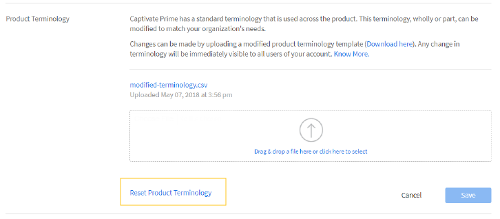

# 設定

管理者として構成可能なLearning Managerアカウント設定について説明します。

管理者プロファイルの設定を変更し、アカウント設定を更新できます。 プロフィール情報の表示、プロフィール写真の追加/変更、変更 **[!UICONTROL 自分について]** コンテンツ： 会社情報の更新、ユーザーのログイン方法の設定、アカウント設定を介した接続統合の設定を行います。

## アカウント設定 {#accountsettings}

組織のアカウント設定を更新するには、 **[!UICONTROL 設定]** をクリックします。

**基本情報（会社情報）**

クリック **[!UICONTROL 変更]** をクリックして、国、タイムゾーン、ロケール、会計年度に関する設定を編集します。

**管理者への問い合わせの設定**

組織のサポート管理者の電子メールアドレスを追加または変更する場合は、をクリックして設定できます。 **[!UICONTROL 一般]** をクリックします。 クリック **[!UICONTROL 変更]** ～に隣接する **[!UICONTROL サポート電子メールID]** 電子メールidを追加します。 学習者がクリックすると、これらの管理者にメールが送信されます **[!UICONTROL 管理者に連絡]** をクリックします。

セミコロンを区切り文字として使用して、電子メールIDを追加します。

**ログインメソッド**  – 管理者は、内部ユーザーと外部ユーザーがアカウントにアクセスする場合のモードを選択できます。

* **社内ユーザー：** 社内ユーザーの場合は、ログインモードとしてAdobe IDまたはシングルサインオンを設定できます。
* **社外ユーザー：** 社外ユーザーの場合は、Adobe ID、シングルサインオンまたはLearning Manager IDを設定できます。

Learning Manager IDを選択した場合、外部ユーザーは、Learning Managerのユーザー名とパスワードを作成した後で、このアカウントにログインできます。

>[!NOTE]
>
>複数の外部プロファイルが設定されている場合は、すべてのプロファイルに任意の1タイプのログインを設定できます。 例えば、ログインの種類がAdobe IDの場合、すべてのプロファイルはAdobe IDのみを使用してログインする必要があります。 各プロファイルは、個別のログインタイプを持つことができません。

Adobe IDまたはシングルサインオンを使用して、Learning Managerアプリケーションにアクセスできます。 シングルサインオンは、ユーザーが1回だけ認証を受け、複数のアプリケーションに何度もアクセスできるメカニズムです。 この設定は、組織に必須ではありません。 組織でSAML 2.0ベースのSSOプロバイダーを使用している場合は、このプロバイダーを使用してLearning Managerアプリケーションを設定できます。 この設定は、組織レベルとLearning Managerアプリケーションで必要です。 SSOを使用する場合は、設定手順をAdobeサポートに問い合わせてください

**フィードバック**

クリック **[!UICONTROL フィードバック]** コースの完了後に学習者からフィードバックを取得するためのアンケートを設定するには、左側のペインを使用します。 詳しくは、「 [コース機能のヘルプコンテンツ](courses.md) をクリックします。

**複数回の試行**

選択 **[!UICONTROL 設定]** > **[!UICONTROL 一般]** > **[!UICONTROL 複数回の試行]**.

「複数回の試行」チェックボックスをオンにすると、作成者は対話型eラーニングコースまたはモジュールに対して「複数回の試行」を設定できます。2番目のチェックボックスをオンにすると、管理者はデフォルトで、新しく作成した対話型eラーニングコースに対して「複数回の試行」を設定できます。

*「複数回の試行」チェックボックスをオンにします*

**コースの管理**

クリック **[!UICONTROL 一般]** 左ペインで、「コースの管理」オプションを選択してコースの管理の機能を有効にします。 この機能の詳細については、以下を参照してください。 [コースの管理](courses.md#main-pars_header_1879001177).

**ディスカッション掲示板**

「ディスカッションボード」チェックボックスをオンにすると、学習者とインストラクターは、学習者アプリの「コース」ページにある「ディスカッション」タブを使用して、コースに関するコメントを投稿できるようになります。 ただし、コースレベルの設定によってこの機能が選択されていないことが示される場合は、管理者による設定よりもコースレベルの設定の方が優先されます。

**学習者ダッシュボード**

左ペインで「学習者ダッシュボード」をクリックします。 このページでは、学習者ページに表示するウィジェットを選択できます。 「学習者」ページで、有効にするウィジェットを選択します。 選択されていないウィジェットは、学習者ページに表示されません。

**Adobe Connect**

クリック **[!UICONTROL Adobe Connect]** 左側のペインで、バーチャルクラスルームセッションをホストするためのAdobe Connectアカウントを設定します。 詳細については、を参照してください。  [Adobe Connect](adobeconnect-integration.md) 機能のヘルプ。

## 一般設定 {#general}

次の設定を有効または無効にします。

<table>
 <tbody>
  <tr>
   <th>
    
<b>名前</b>

    </th>
   <th>
    
<b>説明</b>

   </th>
  </tr>
  <tr>
   <td>コースの有効性を表示</td>
   <td>有効にすると、学習者は「コース」タイルで現在のコースの有効性を確認できます。 この機能は、コースでのみ使用できます。 星評価は、学習プログラムや資格認定ではサポートされていません。 コースと学習プログラムで使用できますが、資格認定では使用できません。</td>
  </tr>
  <tr>
   <td>コースの管理</td>
   <td>有効にすると、コースに対するすべての変更について、学習者にコースを表示する前に、管理者の承認が必要になります。</td>
  </tr>
  <tr>
   <td>ディスカッション掲示板</td>
   <td>「ディスカッションボード」チェックボックスをオンにすると、学習者とインストラクターは、学習者アプリの「コース」ページにある「ディスカッション」タブを使用して、コースに関するコメントを投稿できるようになります。 ただし、コースレベルの設定によってこの機能が選択されていないことが示される場合は、管理者による設定よりもコースレベルの設定の方が優先されます。</td>
  </tr>
  <tr>
   <td>複数回の試行</td>
   <td>有効にすると、作成者はコースモジュールに対して複数回の試行を設定できます。</td>
  </tr>
  <tr>
   <td>スキルオプションを検索</td>
   <td>有効にすると、学習者はピアおよびリーダーシップスキルを検索し、選択したスキルに登録できます。</td>
  </tr>
  <tr>
   <td>スキル/タグの表示</td>
   <td>学習者に対するすべてのスキルとタグを表示します。 すべてのスキルとタグを表示するか、割り当てられたスキルとタグを表示するか、学習者に表示されるカタログの一部であるスキルとタグを表示することができます。</td>
  </tr>
  <tr>
   <td>一意の学習目標Id</td>
   <td>有効にすると、管理者または作成者が各学習目標に対して一意のIDを追加できます。</td>
  </tr>
  <tr>
   <td>フィルターパネルを表示</td>
   <td>
    
学習者アプリケーションで検索結果を調整する場合に、ユーザーが使用できるフィルターパネルを制御します。 次のオプションがあります。

    <ul>
     <li>カタログ</li>
     <li>種類</li>
     <li>書式</li>
     <li>表示時間</li>
     <li>スキル</li>
     <li>スキルレベル</li>
     <li>タグ</li>
    </ul>
    
学習者が学習者アプリを起動すると、「学習状況」セクションと「カタログ」セクションで、学習者のパネルにフィルターが表示されます。

    
<b>注意： </b>フィルター <b>書式 </b>および <b>表示時間 </b>はデフォルトでオフになっており、リリースされた状態では学習者に表示されません。 管理者が有効にする必要があります。  
</td>
  </tr>
  <tr>
   <td>カタログリストを表示</td>
   <td>有効にすると、学習者は利用可能なすべてのカタログのリストを表示できます。 学習者はこれを使用して、学習目標の表示方法を調整できます。</td>
  </tr>
  <tr>
   <td>製品用語</td>
   <td>Learning Managerには、製品全体で使用される標準的な用語があります。 組織のニーズに合わせて用語を変更します。</td>
  </tr>
  <tr>
   <td>モジュールバージョンの更新</td>
   <td>コンテンツを更新するためのデフォルト設定を構成します。 各コンテンツの設定は、コースページから変更できます。</td>
  </tr>
  <tr>
   <td>ユーザーの自動登録</td>
   <td>有効にすると、新しく読み込んだユーザーが自動登録されます。 デフォルトでは、Learning Managerを使用するユーザーを手動で登録する必要があります。</td>
  </tr>
  <tr>
   <td>社内ユーザーの自動削除</td>
   <td>有効にすると、指定した日数の間システムにアクセスしなかった場合、社内ユーザーは自動的に削除されます。 この機能は、役割のみを持つユーザーに適用されます <b>学習者</b>. アクセスを復元するには、ユーザーは管理者に連絡する必要があります。 </td>
  </tr>
  <tr>
   <td>カタログラベルを表示</td>
   <td>これを有効にすると、管理者と作成者がカタログラベルと値を設定して学習目標にリンクできるようになります。</td>
  </tr>
  <tr>
   <td>学習者はスコアを表示できます</td>
   <td>有効にすると、学習者は学習者トランスクリプトにスコアを表示できます。</td>
  </tr>
  <tr>
   <td>ダイジェスト電子メール</td>
   <td>
    
管理者は、学習者への電子メールの送信を有効または無効にできます。 管理者は、送信する電子メールの頻度を制御することもできます。

    <ul>
     <li>対象 <b>アクティブなアカウント</b>ダイジェスト電子メールはデフォルトで無効になっていますが、管理者は手動で有効にすることができます。</li>
     <li>対象 <b>体験版アカウント</b>ダイジェスト電子メールのオプションは無効のままになり、管理者はこのオプションを有効にすることはできません。</li>
    </ul>
    
この機能が無効になっている場合：

    <ul>
     <li>オプション <b>ダイジェスト電子メール</b> は無効になります。</li>
     <li>学習者は、ダイジェスト電子メールの購読のユーザー設定を表示できません。</li>
    </ul>
    
 この機能が有効になっている場合は、次のようになります。

    <ul>
     <li>管理者は、「ダイジェスト電子メール」オプションを有効にして変更できます。</li>
     <li>から <b>プロファイル設定 </b>学習者アプリでは、学習者（DNDリストに含まれない）がダイジェスト電子メールの購読/購読解除を選択できます。</li>
    </ul></td>
  </tr>
  <tr>
   <td>トレーニングカードアイコンを有効にする </td>
   <td>有効にすると、学習者アプリのトレーニングカードにアイコンが表示されます。 </td>
  </tr>
  <tr>
   <td>フッターリンク</td>
   <td>
    
フッターとして表示するリンクや電子メールIDを追加します。 フッターリンクは最大3つまで追加できます。

    
フッターのリンクをカスタマイズするには、次の手順を実行します。

    <ol>
     <li>クリック <b>さらに追加</b>、名前とURLまたは電子メールIDを指定のフィールドに入力します。 URLの先頭にhttp://またはhttps://を付けます。</li>
     <li>すべてのロケールに変更を適用するには、 <b>複製</b>. これにより、すべての言語で名前とURLが取得されます。</li>
     <li>変更を保存するには、 <b>保存</b>. 変更を確認するポップアップメッセージが表示されます。 「OK」をクリックすると、新しく追加されたリンクがフッターに表示されます。</li>
    </ol>
    
また、次の操作も可能です。

    <ul>
     <li>「 <b>リセット</b> アイコンをクリックして、 <b>ヘルプ</b> および <b>管理者に連絡</b> フィールド。</li>
     <li>すべての言語のフッター上のリンクをカスタマイズします。 「 <b>言語</b> ドロップダウンリストで言語を選択し、 <b>名前</b> および <b>URL</b> 指定したフィールドに入力します。 変更を保存すると、更新されたリンクがフッターに表示されます。 </li>
    </ul></td>
  </tr>
  <tr>
   <td>レポートのタイムゾーン </td>
   <td>
    
次のタイムゾーンで学習トランスクリプトを書き出すように、アカウントレベルの設定を構成します。

    <ul>
     <li>UTC（デフォルト動作）</li>
     <li>アカウントレベルのタイムゾーン設定</li>
    </ul>
    
ジョブAPIを使用して学習者のトランスクリプトがダウンロードされると、選択したタイムゾーンのデータもダウンロードされます。

    
<b>注意： </b>リリースされた状態のデフォルトでは、学習者トランスクリプトに変更はありません。 管理者は、「管理者/設定/一般/レポートのタイムゾーン」から設定を構成できます。
</td>
  </tr>
 </tbody>
</table>

<table border="0" cellpadding="0" cellspacing="0" width="1709">
 <tbody>
  <tr>
   <td height="20" width="147">名前</td>
   <td>説明</td>
  </tr>
  <tr>
   <td height="20">コースの有効性を表示</td>
   <td>有効にすると、学習者は「コース」タイルで現在のコースの有効性を確認できます。</td>
  </tr>
  <tr>
   <td height="20">コースの管理</td>
   <td>有効にすると、コースに対するすべての変更について、学習者にコースを表示する前に、管理者の承認が必要になります。</td>
  </tr>
  <tr>
   <td height="20">ディスカッション掲示板</td>
   <td>「ディスカッションボード」チェックボックスをオンにすると、学習者とインストラクターは、学習者アプリの「コース」ページにある「ディスカッション」タブを使用して、コースに関するコメントを投稿できるようになります。 ただし、コースレベルの設定によってこの機能が選択されていないことが示される場合は、管理者による設定よりもコースレベルの設定の方が優先されます。</td>
  </tr>
  <tr>
   <td height="20">複数回の試行</td>
   <td>有効にすると、作成者はコースモジュールに対して複数回の試行を設定できます。</td>
  </tr>
  <tr>
   <td height="20">スキルオプションを検索</td>
   <td>有効にすると、学習者はピアおよびリーダーシップスキルを検索し、選択したスキルに登録できます。</td>
  </tr>
  <tr>
   <td height="20">スキル/タグの表示</td>
   <td>学習者に対するすべてのスキルとタグを表示します。 すべてのスキルとタグを表示するか、割り当てられたスキルとタグを表示するか、学習者に表示されるカタログの一部であるスキルとタグを表示することができます。</td>
  </tr>
  <tr>
   <td height="20">一意の学習目標Id</td>
   <td>有効にすると、管理者または作成者が各学習目標に対して一意のIDを追加できます。</td>
  </tr>
  <tr>
   <td rowspan="10" height="191">フィルターパネルを表示</td>
   <td>学習者アプリケーションで検索結果を調整する場合に、ユーザーが使用できるフィルターパネルを制御します。 次のオプションがあります。</td>
  </tr>
  <tr>
   <td height="19">カタログ</td>
  </tr>
  <tr>
   <td height="19">種類</td>
  </tr>
  <tr>
   <td height="19">書式</td>
  </tr>
  <tr>
   <td height="19">表示時間</td>
  </tr>
  <tr>
   <td height="19">スキル</td>
  </tr>
  <tr>
   <td height="19">スキルレベル</td>
  </tr>
  <tr>
   <td height="19">タグ</td>
  </tr>
  <tr>
   <td height="19">学習者が学習者アプリを起動すると、「学習状況」セクションと「カタログ」セクションで、学習者のパネルにフィルターが表示されます。</td>
  </tr>
  <tr>
   <td height="20">注意：形式および時間フィルターはデフォルトでオフになっており、リリースされた状態では学習者に表示されません。 管理者が有効にする必要があります。 </td>
  </tr>
  <tr>
   <td height="20">カタログリストを表示</td>
   <td>有効にすると、学習者は利用可能なすべてのカタログのリストを表示できます。 学習者はこれを使用して、学習目標の表示方法を調整できます。</td>
  </tr>
  <tr>
   <td height="20">製品用語</td>
   <td>Learning Managerには、製品全体で使用される標準的な用語があります。 組織のニーズに合わせて用語を変更します。</td>
  </tr>
  <tr>
   <td height="20">モジュールバージョンの更新</td>
   <td>コンテンツを更新するためのデフォルト設定を構成します。 各コンテンツの設定は、コースページから変更できます。</td>
  </tr>
  <tr>
   <td height="20">ユーザーの自動登録</td>
   <td>有効にすると、新しく読み込んだユーザーが自動登録されます。 デフォルトでは、Learning Managerを使用するユーザーを手動で登録する必要があります。</td>
  </tr>
  <tr>
   <td height="20">社内ユーザーの自動削除</td>
   <td>有効にすると、指定した日数の間システムにアクセスしなかった場合、社内ユーザーは自動的に削除されます。 この機能は、学習者の役割のみを持つユーザーに適用されます。 アクセスを復元するには、ユーザーは管理者に連絡する必要があります。</td>
  </tr>
  <tr>
   <td height="20">カタログラベルを表示</td>
   <td>これを有効にすると、管理者と作成者がカタログラベルと値を設定して学習目標にリンクできるようになります。</td>
  </tr>
  <tr>
   <td height="20">学習者はスコアを表示できます</td>
   <td>有効にすると、学習者は学習者トランスクリプトにスコアを表示できます。</td>
  </tr>
  <tr>
   <td rowspan="9" height="172">ダイジェスト電子メール</td>
   <td>管理者は、学習者への電子メールの送信を有効または無効にできます。 管理者は、送信する電子メールの頻度を制御することもできます。</td>
  </tr>
  <tr>
   <td height="19">アクティブなアカウントの場合、ダイジェスト電子メールはデフォルトで無効になっていますが、管理者は手動で有効にすることができます。</td>
  </tr>
  <tr>
   <td height="19">体験版アカウントの場合、ダイジェスト電子メールのオプションは無効のままになり、管理者はこのオプションを有効にすることはできません。</td>
  </tr>
  <tr>
   <td height="19">この機能が無効になっている場合：</td>
  </tr>
  <tr>
   <td height="19">「ダイジェスト電子メール」オプションは無効になります。</td>
  </tr>
  <tr>
   <td height="19">学習者は、ダイジェスト電子メールの購読のユーザー設定を表示できません。</td>
  </tr>
  <tr>
   <td height="19"> この機能が有効になっている場合は、次のようになります。</td>
  </tr>
  <tr>
   <td height="19">管理者は、「ダイジェスト電子メール」オプションを有効にして変更できます。</td>
  </tr>
  <tr>
   <td height="20">学習者アプリのプロファイル設定で、学習者（DNDリストに含まれない）は、ダイジェスト電子メールの購読/購読解除を選択できます。</td>
  </tr>
  <tr>
   <td height="20">トレーニングカードアイコンを有効にする</td>
   <td>有効にすると、学習者アプリのトレーニングカードにアイコンが表示されます。</td>
  </tr>
  <tr>
   <td rowspan="8" height="153">フッターリンク</td>
   <td>フッターとして表示するリンクや電子メールIDを追加します。 フッターリンクは最大3つまで追加できます。</td>
  </tr>
  <tr>
   <td height="19">フッターのリンクをカスタマイズするには、次の手順を実行します。</td>
  </tr>
  <tr>
   <td height="19">1. 「さらに追加」をクリックし、指定したフィールドに名前およびURLまたは電子メールIDを入力します。 URLの先頭にhttp://またはhttps://を付けます。</td>
  </tr>
  <tr>
   <td height="19">2.すべてのロケールに変更を適用するには、「複製」をクリックします。 これにより、すべての言語で名前とURLが取得されます。</td>
  </tr>
  <tr>
   <td height="19">3.変更を保存するには、「保存」をクリックします。 変更を確認するポップアップメッセージが表示されます。 「OK」をクリックすると、新しく追加されたリンクがフッターに表示されます。</td>
  </tr>
  <tr>
   <td height="19">また、次の操作も可能です。</td>
  </tr>
  <tr>
   <td height="19">リセットアイコンをクリックして、「ヘルプ」および「管理者に問い合わせる」フィールドでデフォルト値をリセットします。</td>
  </tr>
  <tr>
   <td height="20">すべての言語のフッター上のリンクをカスタマイズします。 言語ドロップダウンリストをクリックし、言語を選択して、指定されたフィールドに名前とURLを追加します。 変更を保存すると、更新されたリンクがフッターに表示されます。</td>
  </tr>
  <tr>
   <td rowspan="5" height="96">レポートのタイムゾーン</td>
   <td> 次のタイムゾーンで学習トランスクリプトを書き出すように、アカウントレベルの設定を構成します。</td>
  </tr>
  <tr>
   <td height="19">UTC（デフォルト動作）</td>
  </tr>
  <tr>
   <td height="19">アカウントレベルのタイムゾーン設定</td>
  </tr>
  <tr>
   <td height="19">ジョブAPIを使用して学習者のトランスクリプトがダウンロードされると、選択したタイムゾーンのデータもダウンロードされます。</td>
  </tr>
  <tr>
   <td height="20">注意：リリースされた状態のデフォルトでは、学習者トランスクリプトに変更はありません。 管理者は、「管理者/設定/一般/レポートのタイムゾーン」から設定を構成できます。</td>
  </tr>
  <tr>
   <td height="19">Badgrの統合</td>
   <td>これを有効にすると、学習者は、Badgrのwebサイトにバッジをアップロードできるようになります。 顧客教育のシナリオでは、組織は顧客を「証明」し、ソーシャルメディアを介してその資格情報を顧客が表示できるようにしたいと考えています。 これにより、学習者はトレーニングを受け、その成果を他の人と共有する必要があります。 </td>
  </tr>
  <tr>
   <td height="135">
    
評価を表示
</td>
   <td>
    <ul>
     <li>オプション <b>コースの有効性</b> 有効にすると、学習者はコースの有効性の値のみを確認できます。</li>
     <li>オプション <b>星評価</b> を有効にすると、学習者は星評価の平均とコースを評価した学習者の数のみを表示できます。 </li>
    </ul>
    
この機能は、コースでのみ使用できます。 星評価は、学習プログラムや資格認定ではサポートされていません。  <b>注意： </b>この変更は学習者アプリにのみ影響します。 

    
その他のすべてのアプリ（管理者、作成者、マネージャー、カスタム管理者、カスタム作成者）では、設定の変更（星評価/コースの有効性/評価を表示の無効化）は影響を受けません。 

    
新規アカウントの場合、 <b>評価を表示</b> セクションには次のオプションがあります <b>星評価</b> デフォルトで有効になっています。

    
既存のアカウントで、アカウントに以前に <b>コースの有効性</b> 有効にしてから、 <b>評価を表示</b> セクションが有効になり、「コースの有効性」オプションが選択されます。 オプション <b>コースの有効性</b>sが無効になっている場合、 <b>評価を表示</b> セクションも無効になります。 この場合 <b>評価を表示</b> セクションが有効になっている場合は、 <b>星評価</b> はデフォルトで有効になっています。
</td>
  </tr>
 </tbody>
</table>

<table>
 <tbody>
  <tr>
   <td>
    
学習パス
</td>
   <td>
    
オプション <b>学習パスの拡張機能を有効にする</b> を有効にすると、管理者は学習パス内に学習パスを含め、これらの学習パスをコースと組み合わせることができます。 このオプションは元に戻すことができません。 
</td>
  </tr>
  <tr>
   <td>
    
インストラクターの管理 
</td>
   <td>
    
この設定を有効にすると、教室/バーチャルクラスルームセッションの作成中に選択できるインストラクターのリストが制限されます。 インストラクター権限を持つすべてのユーザーは、どのセッションにもインストラクターとしてのみ割り当てることができます。 この制限は、移行ワークフローには適用されません。 
</td>
  </tr>
 </tbody>
</table>

## AIベースの推奨

Learning Managerには、学習者の好みに合わせてカスタマイズされた、現代的でまったく新しいコンテンツ重視の学習者ホームページが用意されています。 AIベースの学習推奨事項は、学習者のエンゲージメントを高め、学習のギャップを特定して対処することを目的としています。

推奨事項アルゴリズムは、Adobeがパートナーから提供した職務、肩書、説明に関する業界データなど、複数の入力ソースを取り込むように設計されています。 このデータは、AdobeのAIアルゴリズムをトレーニングするために使用されるため、Learning Managerでは、業界に合わせたスキルを役職や職務内容に結びつけるマップを提案できます。 これにより、推奨アルゴリズムへの入力が1つになります

次にLearning Managerでは、トピックモデリングアルゴリズムを使用して、アカウント内のトレーニングコンテンツを分析し、それらをスキルにマッピングします。

Learning Managerでは、パーソナライズされた方法で推奨アルゴリズムを駆動する別のシグナルとして、ピアアクティビティデータを使用します。 登録、完了、学習者から提供された明示的なフィードバックなどのアクティビティがここで使用されます。

さらに、Learning Managerでは、個々の学習者から収集された明示的および暗黙的な情報を使用して、推奨事項をさらにカスタマイズします。 学習者は、関心のある分野を登録時に明示的に示すことができます。Learning Managerでは、学習者がトレーニングを受ける方法に基づいて、この情報を暗黙的に受け取ります。

管理者は、ピアグループを定義するときにLearning Managerが参照する学習者属性を使用することや、実際に特定のユーザーグループにトレーニングを強調することで、推奨アルゴリズムを最終的にカスタマイズすることもできます。

## 学習目標の名前の変更 {#renaminglearningobjects}

この機能は英語でのみ利用できます。

管理者は、Learning Managerで学習目標の名前を変更できるようになりました。 以下に、名前を変更できる用語を示します。

モジュール\
コース\
学習プログラム\
資格認定\
学習プラン\
作業計画書\
カタログ\
スキル\
バッジ\
告知\
学習状況\
リーダーボード\
有効性\
前提条件\
事前作業\
コアコンテンツ\
Testout\
セルフペース\
ブレンド\
教室\
バーチャルクラスルーム\
活動性

用語の名前を変更するには、次の手順に従います。

1. 管理者として、次をクリックします。 **[!UICONTROL 設定]** > **[!UICONTROL 一般]** > **[!UICONTROL 製品用語]**. 製品用語オプションが開きます。

   

   *製品用語の名前の変更*

1. 変更を行うには、サンプルのCSVファイルをダウンロードして、変更した製品用語テンプレートをアップロードします。 サンプルのCSVファイルをダウンロードするには、 **[!UICONTROL こちらからダウンロード]** オプションです。
1. ダウンロードしたCSVファイルには、列Aのオブジェクトの名前が含まれています。列Bで、各オブジェクトに割り当てる名前を選択します。 (|)で区切られた単数形および複数形の名前を更新する必要があることに注意してください。
1. 1つまたは複数の行を変更できます。 変更されていない行を保持するか、CSVファイルから削除してからアップロードできます。
1. 変更したCSVファイルをアップロードし、 **[!UICONTROL 保存]**. Learning Managerが更新され、変更内容が反映されます。
1. 既定の用語にリセットするには、をクリックします **[!UICONTROL 製品用語のリセット]**.

   

   *製品用語のリセット*

## プロファイル設定 {#profilesettings}

1. 写真/アカウントの横の右上隅にあるドロップダウン矢印をクリックして、 **[!UICONTROL プロファイル設定]**.
1. ポップアップダイアログでマウスをポイントし、 **[!UICONTROL 編集]** をクリックします。
1. 追加/変更 **[!UICONTROL 概要]** クリックしたコンテンツ **[!UICONTROL 編集]** その横に
1. クリック **[!UICONTROL 保存].**

## コンテンツフォルダー {#content-folder}

Learning Managerはプライベートコンテンツフォルダーをサポートしています。 管理者は、プライベートコンテンツフォルダーを設定し、カスタムの役割を使用して特定のカスタム作成者にアクセスを許可することができます。 標準作成者（完全作成者とも呼ばれます）は、引き続きアカウントのすべてのコンテンツにアクセスできます。 したがって、フル作成者はすべてのフォルダーとすべてのコンテンツにアクセスできます。

コンテンツフォルダーは、管理者が設定できます。 一度設定すると、作成者はコンテンツフォルダーを表示して、1つまたは複数のフォルダーにコンテンツを配置できるようになります。

コンテンツフォルダーを追加するには、管理者アプリで、 **[!UICONTROL 設定]** > **[!UICONTROL コンテンツフォルダー]**.

*コンテンツフォルダーの設定を変更*

### フォルダー

フォルダーは、コンテンツのリポジトリです。これは、次のプロパティを持つアカウントで使用できるコンテンツライブラリ全体のサブセットです。

* フォルダーを作成、編集、削除できるのは管理者のみです。
* 管理者は、カスタム管理者のみに定義された役割の一部として、フォルダーへのアクセスを制御できます。
* 内容 **常に、少なくとも1つのフォルダーに関連付けられている必要があります**. まず、すべてのコンテンツがパブリックフォルダーに関連付けられ、このフォルダーは後で変更できます。
* コンテンツは作成時に複数のフォルダーに関連付けることができます。これは、コピー操作でも可能です
* すべてのフォルダー名はアカウント内で一意である必要があります。一意でない場合、フォルダー名を指定するとエラーが発生します。

フォルダーはコンテンツの表示のみを制御し、コンテンツのコピーは作成しません。 そのため、コンテンツの編集は、関連付けられているすべてのフォルダーに反映されます。

### パブリックフォルダー

パブリックフォルダーは常にアカウントに存在し、最初はすべてのコンテンツがこのフォルダーに含まれます。 作成者は、後でこのフォルダーから他のフォルダーにコンテンツを移動できます。 パブリックフォルダには次のプロパティがあります。

* デフォルトでは、このフォルダーに関連付けられたすべてのコンテンツは、あらゆる種類の作成者がアクセスできます。
* パブリックフォルダの一部であるコンテンツは、他のフォルダに含めることはできません。 その逆もまた真である。

このフォルダーは、構成可能なロール定義の一部にすることはできません。 したがって、構成可能な役割の定義にパブリックフォルダが含まれていないと、パブリックフォルダへのアクセスが制限されません。

### プライベートフォルダー

* 管理者が作成したフォルダーは、すべてプライベートフォルダーになります。

### フォルダー操作

**フォルダーを追加**

フォルダーを追加するには、 **[!UICONTROL 追加]** をクリックします。

**フォルダーの削除**

フォルダーを削除することもできます。 削除するフォルダーを選択し、「アクション」メニューの **[!UICONTROL フォルダーを削除]**.

>[!NOTE]
>
>フォルダーは、関連するすべてのコンテンツが他のフォルダーにも関連付けられている場合に削除できます。 削除するフォルダーにのみリンクされているコンテンツがある場合は、まずコンテンツを別のフォルダーに移動してから、フォルダーを削除します。

## 教室の場所

管理者はこの設定を教室の場所のライブラリの作成および設定に使用できます。 作成者は、事前設定された場所を選択して、教室イベントを設定できます。 ライブラリから場所を選択すると、場所情報、URL、人数制限が自動的に入力されます。

管理者は、次のいずれかを実行できます。

### 場所のCSVの読み込み

場所のCSVファイルをインポートして、アカウントに場所を追加します。 CSVファイルにはCity列が含まれている必要があります。

### 場所を追加

次を追加します。

1. 場所名：教室の名前を入力します。
2. 事業所情報：事業所に関する情報を入力します。
3. 「事業所」リージョン：入力した値が、学習者用の「研修事業所」フィルタとして表示されます。
4. 場所のURL：場所のURLを入力します。
5. 座席の上限：部屋の座席数を入力します。

*教室の場所を追加*

CSVを使用して場所を追加することもできます。 CSVには次のフィールドが含まれている必要があります。

* 名前
* 情報
* url
* 座席の上限
* 地域

<!---->

## よくある質問 {#frequentlyaskedquestions}

+++コンテンツライブラリ用に異なるフォルダーを作成する方法

クリック **[!UICONTROL 設定]** > **[!UICONTROL コンテンツフォルダー]**. フォルダーを追加するには、 **[!UICONTROL 追加]** 右上隅のダイアログで、フォルダの名前と説明を入力します。

コンテンツフォルダーは、管理者が設定できます。 一度設定すると、作成者はコンテンツフォルダーを表示して、1つまたは複数のフォルダーにコンテンツを配置できるようになります。

詳細については、のセクションを参照してください。 [コンテンツフォルダー](settings.md#content-folder).
+++

+++アカウントに会計年度を追加する方法

イン **[!UICONTROL 設定]** > **[!UICONTROL 基本情報]**、をクリック **[!UICONTROL 変更]**. から **[!UICONTROL 会計年度の開始月]** ドロップダウンリストで、月を選択します。
+++
