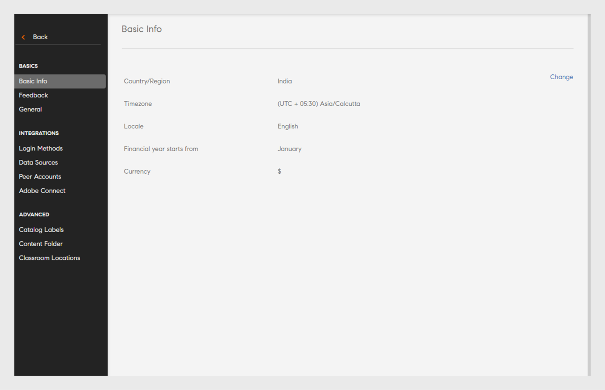

# 設定

この記事では、管理者として構成可能な Learning Manager アカウント設定について説明します。

管理者のプロファイル設定を変更したり、管理者のアカウント設定を編集したりすることができます。プロフィール情報の表示、プロフィール写真の追加/変更、**[!UICONTROL 自分について]**&#x200B;のコンテンツの変更を行います。 また、会社情報の更新、ユーザーのログイン方法の設定、アカウント設定を使用した接続統合のセットアップを行うこともできます。

## Adobe Learning Managerの設定

このトレーニングでは、アカウントレベルの設定に関する基本的な知識を習得します。

トレーニングを起動できない場合は、<almacademy@adobe.com>に書き込んでください。

## アカウント設定 {#accountsettings}

組織のアカウント設定を更新するには、左側のウィンドウで[**[!UICONTROL 設定]**]をクリックします。

**基本情報（会社情報）**

ページの[**[!UICONTROL 変更]**]をクリックし、国、タイムゾーン、ロケール、会計年度に関する設定を編集します。

**管理者への問い合わせの設定**

組織のサポート管理者のメールアドレスを追加または変更する場合は、左側のペインで「**[!UICONTROL 一般]**」をクリックします。「**[!UICONTROL サポート電子メールID]**」の横にある「**[!UICONTROL 変更]**」をクリックして、電子メールIDを追加します。 学習者がページのフッターで「**[!UICONTROL 管理者に問い合わせる]**」をクリックすると、これらの管理者に電子メールが送信されます。

セミコロンを区切り文字として使用して、電子メールIDを追加します。

**ログイン方法** – 管理者は、内部ユーザーと外部ユーザーがアカウントにアクセスする場合のログイン方法を選択できます。

* **社内ユーザー：**&#x200B;社内ユーザーの場合、Adobe IDまたはシングルサインオンをログインモードとして設定できます。
* **社外ユーザー：**&#x200B;社外ユーザーの場合、Adobe ID、シングルサインオンまたはLearning Manager IDを設定できます。

Learning Manager IDを選択した場合、外部ユーザーは、Learning Managerのユーザー名とパスワードを作成した後で、このアカウントにログインできます。

>[!NOTE]
>
>複数の外部プロファイルが設定されている場合は、すべてのプロファイルに任意の1タイプのログインを設定できます。 例えば、ログイン方法として Adobe ID を選択した場合、すべてのプロファイルで Adobe ID のみを使用してログインする必要があります。各プロファイルで異なるログイン方法を設定することはできません。

Adobe ID を使用して Learning Manager にアクセスすることも、シングルサインオン機能を使用してアクセスすることもできます。シングルサインオン（SSO）機能とは、ユーザー認証を 1 回実行するのみで、複数のアプリケーションに繰り返しアクセスできるようになるメカニズムのことです。この機能を組織全体で設定する必要はありません。組織内で SAML 2.0 ベースの SSO プロバイダーを使用している場合は、そのプロバイダーを使用して Learning Manager アプリケーションを設定することができます。この設定は、Learning Manager アプリケーションに対して組織レベルで行う必要があります。SSO 機能を使用する場合は、設定方法をアドビサポートに問い合わせてください。

**フィードバック**

コースを修了した学習者からフィードバックを受け取るためのアンケートを作成するには、左側のペインで「**[!UICONTROL フィードバック]**」をクリックします。L1およびL3フィードバックの作成方法については、[コース機能のヘルプコンテンツ](/help/migrated/administrators/feature-summary/courses.md#add-l1-and-l3-feedback)を参照してください。

「**複数回の試行**」オプション

**[!UICONTROL 設定]** > **[!UICONTROL 一般]** > **[!UICONTROL 複数回の試行]**&#x200B;を選択します。

「複数回の試行」チェックボックスをオンにすると、作成者は対話型eラーニングコースまたはモジュールに対して「複数回の試行」を設定できます。2番目のチェックボックスをオンにすると、管理者はデフォルトで、新しく作成した対話型eラーニングコースに対して「複数回の試行」を設定できます。

*[複数回の試行]チェックボックスをオンにする*

**コースのモデレート**

左ペインで&#x200B;**[!UICONTROL 一般]**&#x200B;をクリックし、コースの管理オプションを選択して、コースの管理の機能を有効にします。 この機能の詳細については、[コースの管理](courses.md#main-pars_header_1879001177)を参照してください。

**ディスカッションボード**

「ディスカッションボード」チェックボックスを選択すると、学習者とインストラクタは、学習者アプリケーションの「コース」ページの「ディスカッション」タブを使用して、コースに対するコメントを投稿することができます。ただし、コースレベルの設定によってこの機能を選択できないようになっている場合は、管理者による設定よりもコースレベルの設定の方が優先されます。

**学習者用ダッシュボード**

左側のペインで「学習者用ダッシュボード」をクリックします。「学習者用ダッシュボード」ページでは、「学習者」ページに表示するウィジェットを選択することができます。「学習者」ページで使用するウィジェットを選択してください。選択しなかったウィジェットは、「学習者」ページには表示されません。

**Adobe Connect**

左側のペインで&#x200B;**[!UICONTROL Adobe Connect]**&#x200B;をクリックして、バーチャルクラスルームセッションをホストするようにAdobe Connectアカウントを設定します。 詳細については、[Adobe Connect](adobeconnect-integration.md)の機能のヘルプを参照してください。

## 一般設定 {#general}

次の設定を有効または無効にします。

<table>
 <tbody>
  <tr>
   <th>
    
<b>名前</b>

    </th>
   <th>
    
<b>説明</b>

   </th>
  </tr>
  <tr>
   <td>コース受講により得られる効果の表示</td>
   <td>有効にすると、学習者は「コース」タイルで現在のコースの有効性を確認できます。 この機能は、コースでのみ使用できます。 星評価は、学習プログラムや資格認定ではサポートされていません。 コースと学習プログラムで使用できますが、資格認定では使用できません。</td>
  </tr>
  <tr>
   <td>コースの管理</td>
   <td>有効にした場合、コースに対するすべての変更について、学習者に表示される前に管理者の承認が必要になります。</td>
  </tr>
  <tr>
   <td>ディスカッションボード</td>
   <td>「ディスカッションボード」チェックボックスを選択すると、学習者とインストラクタは、学習者アプリケーションの「コース」ページの「ディスカッション」タブを使用して、コースに対するコメントを投稿することができます。ただし、コースレベルの設定によってこの機能を選択できないようになっている場合は、管理者による設定よりもコースレベルの設定の方が優先されます。</td>
  </tr>
  <tr>
   <td>複数回の試行</td>
   <td>これを有効にすると、作成者は、コースモジュールに対して複数回の試行を設定できます。</td>
  </tr>
  <tr>
   <td>スキルオプションの検索</td>
   <td>これを有効にすると、学習者は、ピアおよびリーダーシップスキルを検索し、任意のスキルに申し込むことができます。</td>
  </tr>
  <tr>
   <td>スキルとタグの表示</td>
   <td>すべてのスキルとタグを学習者に表示します。すべてのスキルとタグを表示するか、割り当てられたスキルとタグ、または学習者に表示されるカタログの一部であるスキルとタグを表示できます。</td>
  </tr>
  <tr>
   <td>一意の学習目標 ID</td>
   <td>有効にすると、管理者または作成者は各学習目標に一意の ID を追加できます。</td>
  </tr>
  <tr>
   <td>フィルターパネルを表示</td>
   <td>
    
学習者アプリケーションで検索結果を調整する場合に、ユーザーが使用できるフィルターパネルを制御します。 この設定のオプションは次のとおりです。

    <ul>
     <li>カタログ</li>
     <li>タイプ</li>
     <li>形式</li>
     <li>時間</li>
     <li>スキル</li>
     <li>スキルレベル</li>
     <li>タグ</li>
    </ul>
    
学習者が学習アプリを起動すると、「学習状況」セクションと「カタログ」セクションの各パネルでフィルターを表示することができます。

    
<b>注意：</b><b>形式</b>および<b>時間</b>フィルターはデフォルトでオフになっており、リリースされた状態では学習者に表示されません。管理者が有効にする必要があります。  
</td>
  </tr>
  <tr>
   <td>カタログリストの表示</td>
   <td>有効にすると、学習者は利用可能なすべてのカタログのリストを見ることができます。学習者はこれを使用して、学習目標の表示方法を調整できます。</td>
  </tr>
  <tr>
   <td>製品用語</td>
   <td>Learning Manager には、製品全体で使用される標準用語があります。組織のニーズに合わせて用語を変更します。</td>
  </tr>
  <tr>
   <td>モジュールバージョンの更新</td>
   <td>デフォルト設定を構成して、コンテンツを更新します。コースページで、各コンテンツの設定を変更することができます。</td>
  </tr>
  <tr>
   <td>ユーザーの自動登録</td>
   <td>有効にすると、新しく読み込まれたユーザーが自動登録されます。デフォルトでは、ユーザーは Learning Manager の使用を開始する前に手動で登録する必要があります。</td>
  </tr>
  <tr>
   <td>社内ユーザーの自動削除</td>
   <td>有効にすると、指定した日数の間システムにアクセスしていない社内ユーザーは自動的に削除されます。この機能は、<b>学習者</b>のみの役割を持つユーザーに適用されます。アクセスを回復するには、ユーザーは管理者に連絡する必要があります。 </td>
  </tr>
  <tr>
   <td>カタログラベルを表示</td>
   <td>これを有効にすると、管理者と作成者がカタログラベルと値を設定して学習目標にリンクできるようになります。 このオプションを選択すると、作成者はコース、学習パス、資格認定または作業計画書をカタログに追加することもできます。</td>
  </tr>
  <tr>
   <td>学習者が自分のスコアの表示</td>
   <td>これを有効にすると、学習者は、学習者トランスクリプトで自分のスコアを表示できるようになります。</td>
  </tr>
  <tr>
   <td>ダイジェスト電子メール</td>
   <td>
    
管理者は、学習者への電子メールの送信を有効または無効にできます。 管理者は、送信する電子メールの頻度を管理することもできます。

    <ul>
     <li><b>有効なアカウントの場合</b>、ダイジェスト電子メールはデフォルトで無効になっていますが、管理者は手動で有効にすることができます。</li>
     <li><b>体験版アカウントの場合</b>、ダイジェスト電子メールのオプションは無効のままになり、管理者はこのオプションを有効にすることができません。</li>
    </ul>
    
この機能が無効な場合

    <ul>
     <li><b>「ダイジェスト電子メール」</b>オプションは無効になります。</li>
     <li>学習者は、ダイジェスト電子メールサブスクリプションのユーザー設定を確認できません。</li>
    </ul>
    
 この機能が有効になっている場合は、次のようになります。

    <ul>
     <li>管理者は、「ダイジェスト電子メール」オプションを有効にして変更できます。</li>
     <li>学習者アプリの<b>「プロフィール設定」</b>で、学習者（DND リストに含まれない）は、ダイジェスト電子メールの購読／購読解除を選択できます。</li>
    </ul></td>
  </tr>
  <tr>
   <td>トレーニングカードのアイコンを有効化 </td>
   <td>有効にすると、学習者アプリのトレーニングカードにアイコンが表示されます。 </td>
  </tr>
  <tr>
   <td>フッターのリンク</td>
   <td>
    
フッターとして表示されるリンクまたは電子メール ID を追加します。最大 3 つのフッターリンクを追加できます。

    
フッターのリンクをカスタマイズするには、以下の手順を実行します。

    <ol>
     <li>「<b>さらに追加</b>」をクリックし、指定されたフィールドに名前、および、URL または電子メール ID を入力します。URL の前に http:// または https:// を付けます。</li>
     <li>すべてのロケールに変更を適用するには、「<b>複製</b>」をクリックします。これにより、すべての言語で名前と URL が取得されます。</li>
     <li>変更を保存するには、「<b>保存</b>」をクリックします。変更を確認するポップアップメッセージが表示されます。「OK」をクリックすると、フッターに新しく追加されたリンクが表示されます。</li>
    </ol>
    
さらに、以下を実行することも可能です。

    <ul>
     <li><b>リセット</b>アイコンをクリックして、<b>ヘルプ</b>および<b>管理者に問い合わせ</b>フィールドの既定値をリセットします。</li>
     <li>すべての言語のフッター上のリンクをカスタマイズします。「<b>言語</b>」ドロップダウンリストをクリックし、言語を選択して、指定されたフィールドに<b>名前</b>と <b>URL</b> を追加します。変更を保存すると、更新されたリンクがフッターに表示されます。 </li>
    </ul></td>
  </tr>
  <tr>
   <td>レポートのタイムゾーン </td>
   <td>
    
次のタイムゾーンで学習トランスクリプトを書き出すように、アカウントレベルの設定を構成します。

    <ul>
     <li>UTC（デフォルト動作）</li>
     <li>アカウントレベルのタイムゾーン設定</li>
    </ul>
    
ジョブAPIを使用して学習者のトランスクリプトがダウンロードされると、選択したタイムゾーンのデータもダウンロードされます。

    
<b>注意： </b>リリースされた状態のデフォルトでは、学習者トランスクリプトに変更はありません。 管理者は、「管理者/設定/一般/レポートのタイムゾーン」から設定を構成できます。
</td>
  </tr>
 </tbody>
</table>

<table border="0" cellpadding="0" cellspacing="0" width="1709">
 <tbody>
  <tr>
   <td height="20" width="147">名前</td>
   <td>説明</td>
  </tr>
  <tr>
   <td height="20">コース受講により得られる効果の表示</td>
   <td>有効にすると、学習者はコースタイルで現在のコースを受講した場合に得られる効果を確認できます。</td>
  </tr>
  <tr>
   <td height="20">コースの管理</td>
   <td>有効にした場合、コースに対するすべての変更について、学習者に表示される前に管理者の承認が必要になります。</td>
  </tr>
  <tr>
   <td height="20">ディスカッションボード</td>
   <td>「ディスカッションボード」チェックボックスを選択すると、学習者とインストラクタは、学習者アプリケーションの「コース」ページの「ディスカッション」タブを使用して、コースに対するコメントを投稿することができます。ただし、コースレベルの設定によってこの機能を選択できないようになっている場合は、管理者による設定よりもコースレベルの設定の方が優先されます。</td>
  </tr>
  <tr>
   <td height="20">複数回の試行</td>
   <td>これを有効にすると、作成者は、コースモジュールに対して複数回の試行を設定できます。</td>
  </tr>
  <tr>
   <td height="20">スキルオプションの検索</td>
   <td>これを有効にすると、学習者は、ピアおよびリーダーシップスキルを検索し、任意のスキルに申し込むことができます。</td>
  </tr>
  <tr>
   <td height="20">スキルとタグの表示</td>
   <td>すべてのスキルとタグを学習者に表示します。すべてのスキルとタグを表示するか、割り当てられたスキルとタグ、または学習者に表示されるカタログの一部であるスキルとタグを表示できます。</td>
  </tr>
  <tr>
   <td height="20">一意の学習目標 ID</td>
   <td>有効にすると、管理者または作成者は各学習目標に一意の ID を追加できます。</td>
  </tr>
  <tr>
   <td rowspan="10" height="191">フィルターパネルを表示</td>
   <td>学習者アプリケーションで検索結果を調整する場合に、ユーザーが使用できるフィルターパネルを制御します。 この設定のオプションは次のとおりです。</td>
  </tr>
  <tr>
   <td height="19">カタログ</td>
  </tr>
  <tr>
   <td height="19">タイプ</td>
  </tr>
  <tr>
   <td height="19">形式</td>
  </tr>
  <tr>
   <td height="19">時間</td>
  </tr>
  <tr>
   <td height="19">スキル</td>
  </tr>
  <tr>
   <td height="19">スキルレベル</td>
  </tr>
  <tr>
   <td height="19">タグ</td>
  </tr>
  <tr>
   <td height="19">学習者が学習アプリを起動すると、「学習状況」セクションと「カタログ」セクションの各パネルでフィルターを表示することができます。</td>
  </tr>
  <tr>
   <td height="20">注意：形式および時間フィルターはデフォルトでオフになっており、リリースされた状態では学習者に表示されません。 管理者が有効にする必要があります。 </td>
  </tr>
  <tr>
   <td height="20">カタログリストの表示</td>
   <td>有効にすると、学習者は利用可能なすべてのカタログのリストを見ることができます。学習者はこれを使用して、学習目標の表示方法を調整できます。</td>
  </tr>
  <tr>
   <td height="20">製品用語</td>
   <td>Learning Manager には、製品全体で使用される標準用語があります。組織のニーズに合わせて用語を変更します。</td>
  </tr>
  <tr>
   <td height="20">モジュールバージョンの更新</td>
   <td>デフォルト設定を構成して、コンテンツを更新します。コースページで、各コンテンツの設定を変更することができます。</td>
  </tr>
  <tr>
   <td height="20">ユーザーの自動登録</td>
   <td>有効にすると、新しく読み込まれたユーザーが自動登録されます。デフォルトでは、ユーザーは Learning Manager の使用を開始する前に手動で登録する必要があります。</td>
  </tr>
  <tr>
   <td height="20">社内ユーザーの自動削除</td>
   <td>有効にすると、指定した日数の間システムにアクセスしていない社内ユーザーは自動的に削除されます。この機能は、学習者の役割のみを持つユーザーに適用されます。 アクセスを回復するには、ユーザーは管理者に連絡する必要があります。</td>
  </tr>
  <tr>
   <td height="20">カタログラベルを表示</td>
   <td>これを有効にすると、管理者と作成者がカタログラベルと値を設定して学習目標にリンクできるようになります。</td>
  </tr>
  <tr>
   <td height="20">学習者が自分のスコアの表示</td>
   <td>これを有効にすると、学習者は、学習者トランスクリプトで自分のスコアを表示できるようになります。</td>
  </tr>
  <tr>
   <td rowspan="9" height="172">ダイジェスト電子メール</td>
   <td>管理者は、学習者への電子メールの送信を有効または無効にできます。 管理者は、送信する電子メールの頻度を管理することもできます。</td>
  </tr>
  <tr>
   <td height="19">アクティブなアカウントの場合、ダイジェスト電子メールはデフォルトで無効になっていますが、管理者は手動で有効にすることができます。</td>
  </tr>
  <tr>
   <td height="19">体験版アカウントの場合、ダイジェスト電子メールのオプションは無効のままになり、管理者はこのオプションを有効にすることはできません。</td>
  </tr>
  <tr>
   <td height="19">この機能が無効な場合</td>
  </tr>
  <tr>
   <td height="19">「ダイジェスト電子メール」オプションは無効になります。</td>
  </tr>
  <tr>
   <td height="19">学習者は、ダイジェスト電子メールサブスクリプションのユーザー設定を確認できません。</td>
  </tr>
  <tr>
   <td height="19"> この機能が有効になっている場合は、次のようになります。</td>
  </tr>
  <tr>
   <td height="19">管理者は、「ダイジェスト電子メール」オプションを有効にして変更できます。</td>
  </tr>
  <tr>
   <td height="20">学習者アプリのプロファイル設定で、学習者（DNDリストに含まれない）は、ダイジェスト電子メールの購読/購読解除を選択できます。</td>
  </tr>
  <tr>
   <td height="20">トレーニングカードのアイコンを有効化</td>
   <td>有効にすると、学習者アプリのトレーニングカードにアイコンが表示されます。</td>
  </tr>
  <tr>
   <td rowspan="8" height="153">フッターのリンク</td>
   <td>フッターとして表示されるリンクまたは電子メール ID を追加します。最大 3 つのフッターリンクを追加できます。</td>
  </tr>
  <tr>
   <td height="19">フッターのリンクをカスタマイズするには、以下の手順を実行します。</td>
  </tr>
  <tr>
   <td height="19">1. 「さらに追加」をクリックし、指定したフィールドに名前およびURLまたは電子メールIDを入力します。 URL の前に http:// または https:// を付けます。</td>
  </tr>
  <tr>
   <td height="19">2.すべてのロケールに変更を適用するには、「複製」をクリックします。 これにより、すべての言語で名前と URL が取得されます。</td>
  </tr>
  <tr>
   <td height="19">3.変更を保存するには、「保存」をクリックします。 変更を確認するポップアップメッセージが表示されます。「OK」をクリックすると、フッターに新しく追加されたリンクが表示されます。</td>
  </tr>
  <tr>
   <td height="19">さらに、以下を実行することも可能です。</td>
  </tr>
  <tr>
   <td height="19">リセットアイコンをクリックして、「ヘルプ」および「管理者に問い合わせる」フィールドでデフォルト値をリセットします。</td>
  </tr>
  <tr>
   <td height="20">すべての言語のフッター上にあるリンクをカスタマイズします。言語ドロップダウンリストをクリックし、言語を選択して、指定されたフィールドに名前とURLを追加します。 変更を保存すると、更新されたリンクがフッターに表示されます。</td>
  </tr>
  <tr>
   <td rowspan="5" height="96">レポートのタイムゾーン</td>
   <td> 次のタイムゾーンで学習トランスクリプトを書き出すように、アカウントレベルの設定を構成します。</td>
  </tr>
  <tr>
   <td height="19">UTC（デフォルト動作）</td>
  </tr>
  <tr>
   <td height="19">アカウントレベルのタイムゾーン設定</td>
  </tr>
  <tr>
   <td height="19">ジョブAPIを使用して学習者のトランスクリプトがダウンロードされると、選択したタイムゾーンのデータもダウンロードされます。</td>
  </tr>
  <tr>
   <td height="20">注意：リリースされた状態のデフォルトでは、学習者トランスクリプトに変更はありません。 管理者は、「管理者/設定/一般/レポートのタイムゾーン」から設定を構成できます。</td>
  </tr>
  <tr>
   <td height="19">Badgr の統合</td>
   <td>これを有効にすると、学習者は、Badgr の web サイトにバッジをアップロードできるようになります。 顧客教育のシナリオでは、組織は顧客を「認証」し、ソーシャルメディアを介してその認証情報を顧客が公開できるようにします。 これにより、トレーニングを受けたり、他の人と達成状況を共有したりすることを学習者に促せます。 </td>
  </tr>
  <tr>
   <td height="135">
    
評価の表示
</td>
   <td>
    <ul>
     <li><b>「コースの有効性」</b>オプションが有効な場合、学習者はコースの有効性の値のみを確認できます。</li>
     <li><b>「星評価」</b>オプションが有効な場合、学習者は星評価の平均とコースを評価した学習者の数のみを表示できます。 </li>
    </ul>
    
この機能は、コースでのみ使用できます。 星評価は、学習プログラムや資格認定や証明書ではサポートされていません。  <b>注意： </b>この変更は学習者アプリにのみ影響します。 

    
その他のすべてのアプリ（管理者、作成者、マネージャー、カスタム管理者、カスタム作成者）では、設定の変更（星評価／コースの有効性／評価を表示の無効化）は影響を受けません。 

    
新しいアカウントの場合、<b>評価を表示</b>セクションのオプション<b>評価</b>は既定で有効になります。

    
既存のアカウントでは、アカウントで以前にオプション<b>コースの有効性</b>を有効にしていた場合、評価を表示<b>セクションが有効になり「コースの有効性」オプションが選択されます。 </b>オプション<b>コースの有効性</b>が無効な場合、<b>評価を表示</b>セクションも無効になります。 <b>評価を表示</b>セクションが有効な場合、オプション<b>星評価</b>は既定で有効になります。
</td>
  </tr>
  <tr>
   <td height="19">廃止</td>
   <td>次の中から、いずれかの「廃止」オプションを選択します。<li>撤回すると、登録済み学習者はアクションを表示および実行できますが、まだ登録されていない学習者はアクセスできなくなります。</li><li>撤回すると、登録済み学習者とまだ登録されていない学習者の両方がアクセスできなくなります。</li>
<b>注意：</b>コース、学習パス、または資格認定は、概要ページから廃止することができます。
 </td>
  </tr>
 </tbody>
</table>

<table>
 <tbody>
  <tr>
   <td>
    
学習パス
</td>
   <td>
    
<b>「学習パスの拡張機能を有効にする」</b>オプションを有効にしている場合、管理者は学習パス内に学習パスを含め、これらの学習パスをコースと組み合わせることができます。 このオプションは元に戻すことができません。 
</td>
  </tr>
  <tr>
   <td>
    
インストラクターの管理 
</td>
   <td>
    
この設定を有効にすると、教室／バーチャルクラスルームセッションの作成中に選択できるインストラクターのリストが制限されます。 インストラクター権限を持つすべてのユーザーは、どのセッションにもインストラクターとしてのみ割り当てることができます。 この制限は、移行ワークフローには適用されません。 

  </td>
  <tr>
    <td>
      
スキルのインポート

    </td>
    <td>
      
有効にすると、スキルを読み込む外部ソースを選択できます。 既存の学習リソースのスキルは、最初の実行時に1回、スキルリポジトリに読み込まれます。 それ以降に学習リソースを読み込んだ場合、スキルは新しく読み込まれた項目のスキルリポジトリにのみ読み込まれます。
      このオプションを有効にすると、この操作は元に戻せません。 後で無効にしたり、別のソースに変更したりすることはできません。
      

    </td>
  </tr>
  </tr>
 </tbody>
</table>

>[!NOTE]
>
>スキルインポート設定を有効にすると、アカウントレイアウトをクラシックビューに切り替えることができなくなります。つまり、**スキルインポート**&#x200B;オプションを有効にした後でクラシックアカウントに切り替えることができなくなります。

## 学習オブジェクト名の変更機能 {#renaminglearningobjects}

この機能は英語でのみ利用できます。

管理者は、Learning Manager で学習目標の名前を変更できるようになりました。以下に、名前を変更できる学習オブジェクトを示します。

モジュール\
コース\
学習プログラム\
資格認定\
学習プラン\
作業計画書\
カタログ\
スキル\
バッジ\
アナウンス\
学習状況\
リーダーボード\
有効性\
前提条件\
前作業\
重要コンテンツ\
Testout\
セルフペース\
混合\
教室\
バーチャルクラスルーム\
アクティビティ

## プロファイル設定 {#profilesettings}

1. 写真/アカウントの横の右上隅にあるドロップダウン矢印をクリックし、**[!UICONTROL プロファイル設定]**&#x200B;を選択します。
1. 写真を追加または変更するには、ポップアップダイアログ上のプロファイル写真エリアにマウスを配置し、「**[!UICONTROL 編集]**」をクリックします。
1. コンテンツの横にある&#x200B;**[!UICONTROL 編集]**&#x200B;をクリックして、**[!UICONTROL バージョン情報]**&#x200B;のコンテンツを追加または変更します。
1. 「**[!UICONTROL 保存].**」をクリックします

## コンテンツフォルダー {#content-folder}

Learning Managerはプライベートコンテンツフォルダーをサポートしています。 管理者は、プライベートコンテンツフォルダーを設定し、カスタムの役割を使用して特定のカスタム作成者にアクセスを許可することができます。 標準作成者（フル作成者とも呼ばれます）は、引き続きアカウント内のすべてのコンテンツにアクセスできることに注意してください。 したがって、フル作成者はすべてのフォルダーとすべてのコンテンツにアクセスできます。

コンテンツフォルダーは、管理者が設定できます。 一度設定すると、作成者はコンテンツフォルダーを表示して、1 つまたは複数のフォルダーにコンテンツを配置できるようになります。

コンテンツフォルダーを追加するには、管理者アプリで、**[!UICONTROL 設定]** > **[!UICONTROL コンテンツフォルダー]**&#x200B;をクリックします。

*コンテンツフォルダの設定を変更する*

### フォルダー

フォルダーは、コンテンツのリポジトリです。フォルダーは、アカウントで使用可能なコンテンツライブラリ全体のサブセットで、次のプロパティがあります。

* フォルダーを作成、編集、または削除できるのは管理者のみです。
* 管理者は、カスタム管理者のみに定義された役割の一部として、フォルダーへのアクセスを制御できます。
* コンテンツは&#x200B;**常に少なくとも 1 つのフォルダーに関連付けられている必要があります**。 まず、すべてのコンテンツが公開フォルダーに関連付けられます。これは、後で変更できます。
* コンテンツは、作成時に複数のフォルダーに関連付けることができます。これは、コピー操作でも行うことができます。
* すべてのフォルダー名はアカウント内で一意である必要があります。そうでない場合、フォルダー名の指定中にエラーが発生します。

フォルダーは、コンテンツの表示のみを制御し、コンテンツのコピーを作成しません。 したがって、コンテンツの編集は関連するすべてのフォルダーに反映されます。

### 公開フォルダー

アカウントには必ず公開フォルダーが存在しています。初期状態ではすべてのコンテンツがこのフォルダーに含められます。 その後作成者は、このフォルダーから他のフォルダーにコンテンツを移動できます。 公開フォルダーには、次のプロパティがあります。

* このフォルダーに関連付けられたすべてのコンテンツは、デフォルトですべてのタイプの作成者からアクセスできます。
* 公開フォルダーに含まれているコンテンツを他のフォルダーに含めることはできません。 その逆も同様です。

このフォルダーは、構成可能な役割定義に含めることはできません。 したがって、公開フォルダーを構成可能な役割定義に含めない限り、公開フォルダーへのアクセスは制限されません。

### プライベートフォルダー

* 管理者が作成したフォルダーは、すべてプライベートフォルダーになります。

### フォルダー操作

**フォルダーの追加**

フォルダーを追加するには、ウィンドウの右上隅にある「**[!UICONTROL 追加]**」をクリックします。

**フォルダーの削除**

フォルダーを削除することもできます。 削除するフォルダーを選択し、[アクション]メニューをクリックして[**[!UICONTROL フォルダーの削除]**]をクリックします。

>[!NOTE]
>
>フォルダーは、関連するすべてのコンテンツが他のフォルダーにも関連付けられている場合に削除できます。 削除するフォルダーにのみリンクされているコンテンツがある場合は、まずコンテンツを別のフォルダーに移動してから、フォルダーを削除します。

## 教室の場所

管理者はこの設定を使用して教室の場所のライブラリを作成し、ライブラリを構成できます。 作成者は事前設定された場所を選択して、教室イベントを設定できます。 ライブラリから場所を選択すると、場所情報、URL、人数制限が自動的に入力されます。

管理者は、次のいずれかの方法で場所を設定できます。

### 場所のCSVの読み込み

場所の CSV ファイルを読み込むことで、アカウントに場所を追加できます。 CSV ファイルには「都市」列が含まれていることが必要です。

### 場所を追加

次の項目を追加します。

1. 場所名：教室の名前を入力します。
2. 場所情報：場所に関する情報を入力します。
3. 「事業所」リージョン：入力した値が、学習者用の「研修事業所」フィルタとして表示されます。
4. 場所のURL：場所のURLを入力します。
5. 人数制限：部屋の収容人数を入力します。

*教室の場所を追加*

CSV を使用して場所を追加することも可能です。 CSV には次のフィールドを追加する必要があります。

* name
* 情報
* URL
* 座席数の上限
* 地区

<!---->

### 設定 {#admin-classroom-settings}

**編集**&#x200B;を選択して、次の項目を変更します：

* **作成者に場所の作成を許可する**：有効にすると、作成者が作成したすべての場所が[すべての場所]タブに一覧表示されます。 学習者には、カタログおよびカレンダーのフィルターにも、これらの場所が表示されます。
* **作成者に場所の変更と削除を許可する**:
有効にすると、作成者は教室のすべての場所を変更および削除できるようになります。 作成者による変更は、レポートを含むプラットフォーム全体に反映されます。

## よくある質問 {#frequentlyaskedquestions}

+++コンテンツライブラリ用に異なるフォルダーを作成する方法

**[!UICONTROL 設定]** > **[!UICONTROL コンテンツフォルダー]**&#x200B;をクリックします。 フォルダーを追加するには、右上隅の&#x200B;**[!UICONTROL 追加]**&#x200B;をクリックし、ダイアログでフォルダーの名前と説明を入力します。

コンテンツフォルダーは、管理者が設定できます。 一度設定すると、作成者はコンテンツフォルダーを表示して、1 つまたは複数のフォルダーにコンテンツを配置できるようになります。

詳細については、[コンテンツフォルダー](settings.md#content-folder)のセクションを参照してください。
+++

+++アカウントに会計年度を追加する方法

**[!UICONTROL 設定]** > **[!UICONTROL 基本情報]**&#x200B;で、**[!UICONTROL 変更]**&#x200B;をクリックします。 **[!UICONTROL 会計年度の開始月]**ドロップダウンリストから月を選択します。
+++
