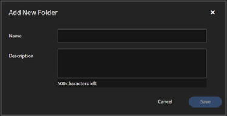

# Adobe Learning Managerの詳細設定

## カタログラベル

Adobe Learning Managerのカタログラベルは、学習目標（コース、資格認定、学習パスなど）のタグ付けに使用されます。 特定のフィールドと値を使用します。 これらのラベルは、作成者がコンテンツを効果的に分類して整理するのに役立ち、フィルタリング、トラッキング、レポート機能を向上させます。

詳細については、[Adobe Learning Managerのカタログラベル](/help/migrated/administrators/feature-summary/catalog-labels.md)を参照してください。

>[!NOTE]
>
>* 必須ラベル：コースの作成時に、作成者にカタログラベルを必須にするかどうかを選択できます。
>* 作成者のワークフロー：作成者は、コースを作成または編集する際に準拠ラベルを追加し、適切に分類されるようにする必要があります。

## コンテンツフォルダー

コンテンツフォルダーを使用すると、プライベートフォルダーやパブリックフォルダーを作成してコンテンツを整理および管理することができます。 この機能により、特定の作成者またはグループのみがコンテンツにアクセスできるようになり、コンテンツの表示と管理をより適切に制御できます。

**キーポイント：**

フォルダーは、コンテンツのリポジトリです。フォルダーは、アカウントで使用可能なコンテンツライブラリ全体のサブセットで、次のプロパティがあります。

* フォルダーを作成、編集、または削除できるのは、管理者のみです。
* カスタム管理者のみに定義された役割の一部として、フォルダーへのアクセスを制御できます。
* コンテンツは、常に1つ以上のフォルダーに関連付ける必要があります。 まず、すべてのコンテンツがパブリックフォルダーに関連付けられ、このフォルダーは後で変更できます。
* コンテンツは、作成時に複数のフォルダーに関連付けることができます。これは、コピー操作でも行うことができます。
* すべてのフォルダー名はアカウント内で一意である必要があります。そうでない場合、フォルダー名の指定中にエラーが発生します。

フォルダーは、コンテンツの表示のみを制御し、コンテンツのコピーを作成しません。 したがって、コンテンツの編集は関連するすべてのフォルダーに反映されます。

**パブリックフォルダー**

アカウントには必ず公開フォルダーが存在しています。初期状態ではすべてのコンテンツがこのフォルダーに含められます。 その後作成者は、このフォルダーから他のフォルダーにコンテンツを移動できます。 公開フォルダーには、次のプロパティがあります。

* このフォルダーに関連付けられたすべてのコンテンツは、デフォルトですべてのタイプの作成者からアクセスできます。
* 公開フォルダーに含まれているコンテンツを他のフォルダーに含めることはできません。 その逆も同様です。

このフォルダーは、構成可能な役割定義に含めることはできません。 したがって、公開フォルダーを構成可能な役割定義に含めない限り、公開フォルダーへのアクセスは制限されません。

**プライベートフォルダー**

自分が作成したフォルダーは、すべてプライベートフォルダーになります。

**コンテンツフォルダーを追加する**

コンテンツフォルダーを追加するには、次の手順に従います。

1. **[!UICONTROL 設定]**/**[!UICONTROL コンテンツフォルダー]**&#x200B;を選択します。
2. 「**[!UICONTROL 追加]**」を選択して、新しいフォルダーを作成します。
3. 作成するフォルダーの名前と説明を入力します。

   

4. **[!UICONTROL 保存]**&#x200B;を選択してフォルダーを作成します。

**フォルダーの操作**

* **[!UICONTROL フォルダーを追加]**:フォルダーを追加するには、フォルダーを選択してから、画面の右上隅にある&#x200B;**[!UICONTROL 追加]**&#x200B;を選択します。
* **[!UICONTROL フォルダーを削除]**:フォルダーを削除するには、削除するフォルダーを選択し、**[!UICONTROL アクション]**&#x200B;メニューを選択してから、**[!UICONTROL フォルダーを削除]**&#x200B;を選択します。

## 教室の場所

物理的または仮想的な教室の場所のライブラリを作成および管理します。 これらの場所は、作成者や管理者がインストラクター主導のトレーニング(ILT)イベントを設定する際に使用できます。 この機能により、人数制限や位置情報など、教室の詳細が事前に設定され、簡単にアクセスできるようになります。

詳しくは、[Adobe Learning Managerに教室の場所を追加する](/help/migrated/administrators/feature-summary/classroom.md)を参照してください。

## レポート

このセクションでは、コンプライアンスおよびグループの成功ダッシュボードを構成できます。

詳しくは、以下を参照してください。

* [準拠ダッシュボード](/help/migrated/administrators/feature-summary/reports.md#compliance-dashboard)
* [グループの成功ダッシュボード](/help/migrated/administrators/feature-summary/group-success-dashboard.md)

