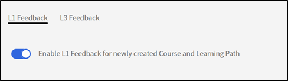

# Adobe Learning Managerの基本設定

## 概要

「基本情報」セクションは、Adobe Learning Managerの設定の基盤として機能します。このセクションには、複数の地域、言語、ビジネスコンテキストにまたがる学習プラットフォームの仕組みを定義する基本的な構成パラメーターが含まれています。

## 主な利点

* 地域固有のコンテンツ配信とユーザーエクスペリエンスを提供します。
* 時間表示、日付書式および通貨表示を標準化します。
* 選択したタイムゾーンに対して夏時間の自動調整を行います。
* プラットフォーム全体で手動調整の必要性を減らします。

## 基本設定を変更する

### 基本的な情報設定にアクセスする

1. Adobe Learning Managerに管理者としてログインします。
2. 左側のナビゲーションバーで&#x200B;**[!UICONTROL 設定]**&#x200B;を選択します。

   

3. **[!UICONTROL 基本情報]**&#x200B;を&#x200B;**[!UICONTROL 基本]**&#x200B;カテゴリで選択します。

   

4. **[!UICONTROL 変更]**&#x200B;を選択して、基本設定を変更します。

### 基本設定を変更する

**国/地域**

Adobe Learning ManagerのAdministrator設定の「国/地域」ドロップダウンでは、組織に関連付ける国または地域を指定できます。 この設定はローカリゼーションの目的で使用され、プラットフォームが地域の環境設定、コンプライアンス要件、タイムゾーンに適合していることを確認します。

**タイムゾーン**

「タイムゾーン」ドロップダウンでは、プラットフォームのデフォルトのタイムゾーンを定義できます。 これにより、コーススケジュール、締め切り、レポートなどの時間を重視するすべてのアクティビティが、組織または学習者の現地時間に正確に合わせられます。

**ロケール**

ロケールは、アカウントの言語と地域の設定を示します。 管理者は「ロケール」ドロップダウンを使用して、プラットフォームのインターフェイスとコンテンツをユーザーに表示する言語を設定できます。 このオプションにより、学習者と管理者が希望する言語でプラットフォームを操作できるようになります。

**会計年度の開始日**

このオプションを使用すると、組織の会計年度の開始月を定義できます。 例えば、組織の会計年度が12月に始まる場合は、このオプションを12月に設定できます。 レポートと分析は、この会計年度期間に合わせて調整されます。

**通貨**

「通貨」オプションでは、アカウントのデフォルト通貨を定義できます。 この通貨は、コース、学習パス、資格認定などの学習目標の価格設定に使用されます。 例えば、米国で事業を行っている組織の場合、通貨をUSD($)に設定できます。 同様に、ヨーロッパでの操作の場合は、EUR(€)を選択できます。

### フィードバック設定の変更

Adobe Learning Managerのフィードバックの設定では、学習者(L1)やマネージャー(L3)からフィードバックを収集および管理するためのツールが管理者に提供されます。 これらの設定により、コースと学習目標が効果的に評価され、継続的な改善が可能になります。

学習者から貴重なインサイトを収集する前に、L1フィードバック機能を有効にして、パラメーターを設定する必要があります。 この最初のステップでは、「フィードバックの設定」領域に移動し、すべての新しいコースでこの機能をオンにします。さらに、フィードバックフォームの主要言語を選択します。

### L1フィードバックを有効にする

「L1フィードバック」タブで、新しく作成したコースと学習パスの「L1フィードバックを有効にする」トグルスイッチを見つけます。 スイッチを選択してオンにします。 このレポートには、作成した新しいコースのL1フィードバックフォームが自動的に含まれます。

**既定の言語を選択してください**

言語ドロップダウンを使用して、フィードバックフォームのデフォルトの言語を選択します。 これにより、質問が正しい言語で学習者に提示されます。

**コースの種類ごとにアンケートを構成する**

Adobe Learning Managerでは、コースがセルフペースモジュールかインストラクターによるクラスルームセッションかに基づいて、質問をカスタマイズできます。 これにより、受け取るフィードバックが具体的かつ適切なものであることが保証されます。 このステップでは、セルフペースコースと教室コースの両方の質問を選択して絞り込み、最も有意義なデータを収集します。

**セルフペースコースの場合**:

* **必須の質問**:アンケートには、「このコースを同僚に勧める可能性はどれくらいありますか？」という必須の質問が含まれています。 これは、コース全体の満足度に関する重要な指標を提供する、標準のNPS(Net Promoter Score)に関する質問です。
* **質問のカスタマイズ**：提供された質問のリストを確認します。 フィードバックフォームに質問を含めるには、その横にあるトグルスイッチを「はい」に設定します。 質問を削除するには、スイッチを「いいえ」に切り替えます。
* **カスタム質問の追加**:セルフペースコンテンツに固有の質問を追加する場合は、[さらに追加]リンクを選択して、新しいカスタムの質問を作成し、アンケートに追加します。

**教室コースの場合**:

* **質問のカスタマイズ** ：教室ベースのトレーニング用に調整された質問のリストを確認します。 各質問の横にあるスイッチを「はい」に切り替えて質問を含めるか、「いいえ」に切り替えてフィードバックフォームから質問を除外します。
* **カスタム質問の追加** ：教室の環境または円滑なスタイルに固有の新しい質問を追加するには、「さらに追加」リンクを選択して作成し、リストに追加します。

**フィードバックの通知を設定する**

応答速度を最大化するには、自動リマインダーを設定することをお勧めします。 この手順では、これらのリマインダーを設定してスケジュールする方法を説明します。リマインダーの送信日時、再帰の頻度および期間を定義します。 学習者に積極的にリマインダーを送信することで、収集するフィードバックの量を大幅に増やすことができます。

1. **新しいリマインダーを追加**: **[!UICONTROL L1フィードバックのリマインダー]**&#x200B;セクションで、**[!UICONTROL 新しいリマインダーを追加]**&#x200B;を選択します。

   

2. **リマインダーのスケジュールを定義する**：表示される&#x200B;**リマインダーの設定**&#x200B;パネルで、ドロップダウンメニューと入力フィールドを使用して、リマインダーを設定します。

   a. **[!UICONTROL 送信のタイミング]**:リマインダーを&#x200B;**[!UICONTROL コースの完了時]**&#x200B;に送信するか、**[!UICONTROL コースの完了後]**&#x200B;に送信するかを選択します。
b. **[!UICONTROL 定期的なアイテム]**:アラームの頻度を選択します（たとえば、毎週）。
c. **[!UICONTROL 期間]**:リマインダーが送信される合計期間（週単位）を指定します（例： 4週間）。

3. **[!UICONTROL リマインダーを保存]**：青いチェックマークアイコンを選択して、新しいリマインダー設定を保存します。 必要に応じて、このプロセスを繰り返して、さらにリマインダーを追加できます。

   

4. ページの右上隅にある「**[!UICONTROL 保存]**」を選択して、L1フィードバックの設定を適用します。

### L3フィードバックを有効にする

学習者のマネージャーからフィードバックを収集する前に、L3フィードバック設定を構成する必要があります。 この最初のステップでは、「フィードバック設定」ページに移動し、「L3フィードバック」タブを選択します。 ここから、フィードバックリクエストの言語を設定し、マネージャーに送信される主要な質問を確認できます。

**L3フィードバックタブを選択**

フィードバックの設定ページで「L3フィードバック」タブを選択します。

**フィードバックに関する声明の確認**

L3フィードバックは、学習者のマネージャーから、同意または不同意の単一の声明として要求されます。 デフォルトでは、「トレーニングを受講した後、従業員のパフォーマンスが明らかに改善されました」というメッセージが表示されます。 組織のニーズに合わせて、このステートメントを編集できます。

**既定の言語を選択してください**

「言語」ドロップダウンを選択して、フィードバックリクエストのデフォルト言語を選択します。

**フィードバックの通知を設定する**

マネージャーがタイムリーにフィードバックを提供できるようにするには、自動リマインダーを設定する必要があります。 この手順では、これらのリマインダーを送信するタイミングと再送する頻度を設定します。 このスクリーンショットは、コースの完了時にL3フィードバックリマインダーを1回送信するように設定できることを示していますが、必要に応じてリマインダーを追加することもできます。

1. **[!UICONTROL 新しいリマインダーを追加]**：新しいリマインダーを作成するには、**[!UICONTROL 新しいリマインダーを追加]**&#x200B;リンクを選択します。
2. **[!UICONTROL リマインダーのスケジュールを定義する]**: **[!UICONTROL リマインダーの設定]**&#x200B;パネルで、ドロップダウンメニューと入力フィールドを選択して、リマインダーを設定します。
a. **[!UICONTROL 送信のタイミング]**:リマインダーがいつ送信されるかを選択します。 オプションは、**[!UICONTROL コースの完了時]**&#x200B;と&#x200B;**[!UICONTROL コースの完了後]**&#x200B;です。
b. **[!UICONTROL 定期的なアイテム]**:リマインダーの頻度を選択します。 繰り返しが&#x200B;**[!UICONTROL 一度]**&#x200B;の場合、マネージャーはフィードバックを提供する通知を1回受け取ります。 利用可能なオプションは、「1回」、「毎日」、「毎週」、「毎月」です。
3. スケジュールを設定した後、青いチェックマークアイコンを選択してリマインダー設定を保存します。 既存のリマインダーのリストにリマインダーが表示されます。

   

4. ページの右上隅にある「**[!UICONTROL 保存]**」を選択して、L3フィードバックの設定を適用します。

## 「一般」設定

### 概要

Adobe Learning Managerの一般設定では、学習者の全体的なエクスペリエンスと管理プロセスを一元的に設定できます。 これらの設定により、組織固有のニーズに合わせてプラットフォームをカスタマイズする様々な機能を有効または無効にできます。

設定可能な主な一般設定は次のとおりです。

* **コースの有効性と管理：**&#x200B;コースの有効性の評価を学習者に表示し、すべてのコースの変更に対して管理者の承認を必要とするコースの管理を有効にすることを選択します。
* **学習者のエンゲージメント機能：**&#x200B;コースのコメントに対する&#x200B;**掲示板**、学習者の外部ソースからのスキル、**ダイジェスト電子メール**&#x200B;などの機能を有効または無効にして、学習者に新しいコンテンツや進捗状況に関する情報を配信できます。
* **コンテンツとコース管理：**&#x200B;設定により、対話型eラーニングの&#x200B;**複数回の試行**&#x200B;を構成し、コンテンツに&#x200B;**一意の学習目標ID**&#x200B;を追加して、**モジュールバージョンの更新**&#x200B;の既定の動作を設定することができます。
* **ユーザー管理：** **ユーザーの自動登録**&#x200B;を有効にして、新しいユーザーをシステムに自動的に追加し、指定した期間アクティブではない&#x200B;**内部ユーザーを自動削除**&#x200B;します。
* **カスタマイズと表示** ：学習者に表示される項目を制御できます。例えば、検索対象の&#x200B;**フィルターパネル**&#x200B;を有効または無効にしたり、**カタログラベル**&#x200B;を表示したり、最大3つの&#x200B;**フッターリンク**&#x200B;をカスタマイズしたりできます。

### コースの管理

コースのモデレートを使用すると、作成者がコースに対して行った更新を監視および管理できます。 コースのコンテンツに加えられた変更は、学習者に公開される前に、管理者によってレビューおよび承認されます。 作成者は、「コースの管理」を選択して、コースに変更を加えたコースを公開する際、管理者の承認を得る必要があります。

作成者がコースを更新（モジュールの追加や削除など）し、コースを公開しようとすると、

1. 作成者が変更を含むコースを再度パブリッシュすると、通知が届きます。
2. 通知を選択して、作成者が行った変更を表示します。
3. 新旧のコンテンツを比較します。
4. 変更を承認または拒否する：
a. 変更を承認してコースを更新で再公開します。
b. 変更を拒否して、コースの以前のバージョンをアクティブに保ちます。
5. 作成者は、承認または却下にかかわらず、決定に対する通知を受けます。

### ディスカッションボード

Adobe Learning Managerの「掲示板」オプションを使用すると、学習者はコース、モジュール、または学習プログラムに関するディスカッションに参加できます。 この機能を有効にして管理することで、学習者間での共同作業と知識の共有を促進できます。 ディスカッション掲示板は特定のコースまたはモジュールにリンクされ、状況に応じて関連性が高くなります。

学習者は「ディスカッション」タブを使用して、他の学習者やインストラクタとやり取りできます。 現在表示しているか登録している任意のコースの投稿を表示できます。 管理者がコースのディスカッションを有効にしている場合、そのコースの「メモ」タブの横に「ディスカッション」タブが表示されます。

コースの「ディスカッション」タブを選択すると、そのコースの既存の投稿とコメントを表示できます。 既にコースを登録している場合は、投稿やコメントを入力して他のユーザーに表示することもできます。 メッセージを入力した後、「投稿」をクリックします。 投稿は10文字以上にする必要があります。

投稿はすぐに「ディスカッション」タブに表示されます。 投稿を新しい順または古い順に並べ替えて、書き込んだ投稿を削除できます。 コースの登録を解除した後に、すべての投稿を表示したり、自分が作成した投稿を削除したりすることもできます。

管理者は、ディスカッションをモデレートして、関連性と妥当性を確認できます。 学習者は、自分が参加しているディスカッションへの返信または更新に関する通知を受け取ります。

### 複数回の試行

このオプションを選択すると、作成者はコースレベルまたはモジュールレベルで可能な再試行回数を設定できます。 完了すると、学習者はコースや評価テストを再受講できます。  この設定は、クイズ、テスト、または評価を必要とするコースタイプを含むコースで役立ちます。

### スキル、タグ、製品、役割の表示

このオプションでは、割り当てられているスキルやタグのみを学習者に表示するか、学習者に表示されるカタログの一部であるスキルやタグのみを表示するか、すべてのスキルやタグを表示するかを指定します。 これには、コースや学習パスに関連付けられたスキル、タグ、製品、役割が含まれます。

**[!UICONTROL 編集]**&#x200B;を選択して、学習者が表示できる内容を制限します：

次に、学習者は自分に表示されるスキルとタグを検索し、選択したスキルを登録します。

### 一意の学習目標 ID

このオプションを使用すると、各学習目標（コース、学習パス、資格認定、作業計画書など）に一意のIDを割り当てることができます。 これにより、すべての学習目標に個別のIDが割り当てられます。このIDは、トラッキング、レポート、および外部システムとの統合に役立ちます。

これを有効にすると、作成者には学習目標の作成時に学習目標IDを追加するフィールドが表示されます。 ユーザーはそれに応じてIDを追加できます。 一意のIDは、学習記録ストア(LRS)や学習管理システム(LMS)などのサードパーティシステムとの統合に適しています。 一意のIDを使用すると、作成者は特定の学習目標を簡単に検索し、学習者のトランスクリプトを通じて特定の学習目標を追跡できます。

### フィルターパネルを表示

このオプションでは、学習者アプリケーションで学習者が使用できるフィルターオプションを制御できます。 これらのフィルターは、学習者が「学習状況」セクションと「カタログ」セクションで検索結果を絞り込むのに役立ちます。 次のフィルターオプションを選択できます。

* グループ
* カタログ
* タイプ
* 形式
* 時間
* スキル
* スキルレベル
* タグ
* 価格
* 価格範囲
* 場所
* 製品
* 推奨レベル

>[!NOTE]
>
>フィルター&#x200B;**[!UICONTROL 形式]**&#x200B;と&#x200B;**[!UICONTROL 期間]**&#x200B;はデフォルトでオフになっており、学習者にすぐに表示されることはありません。 明示的に選択してください。

### 製品用語

Adobe Learning Managerには、コース、学習パス、作業計画書などの学習目標を定義する特定の製品用語があります。 好みに応じて、用語を英語とフランス語でカスタマイズできます。 製品用語テンプレートをダウンロードし、例えば学習プランを規定ルールに置き換えます。 同様に、フランス語でも同様のエントリを変更します。 次に、変更したテンプレートをアップロードし、「保存」を選択して製品の用語を更新します。

詳しくは、 Adobe Learning Managerの製品用語を参照してください。

### モジュールバージョンの更新

このオプションを使用すると、モジュールを含むコースに登録済みの学習者の進捗状況を中断することなく、管理者がモジュールのコンテンツを更新できます。 これにより、学習者は学習をスムーズに進めることができ、作成者はコンテンツを最新の状態に保つことができます。 このオプションを有効にすると、作成者はモジュールの新しいバージョン（SCORM、AICC、xAPIパッケージなど）をアップロードして、既存のバージョンを置き換えることができます。

* モジュールを既に開始している学習者は、登録したバージョンから続行されます。
* 新しい学習者は、更新されたバージョンに自動的にアクセスします。
* Adobe Learning Managerでは、レポート作成や監査用にバージョンの違いを記録します。

### ユーザーの自動登録

このオプションを使用すると、ユーザーをシステムに追加したときに、特定のカタログや学習コンテンツに自動的に登録できます。 これにより、ユーザーは手作業を必要とせずに関連する学習教材に即座にアクセスできます。

* 新しいユーザーは、システムに追加されると、事前定義されたカタログまたはコースに自動的に登録されます。
* 管理者は、役割、グループ、その他の条件などのユーザー属性に基づいて、ユーザーを自動登録するカタログまたはコースを決定するためのルールを定義できます。 詳しくは、[Adobe Learning Managerの学習プラン](/help/migrated/administrators/feature-summary/learning-plans.md)を参照するか、[登録時にコースに外部ユーザーグループを自動登録する](https://elearning.adobe.com/2024/05/automatically-enroll-external-user-groups-in-courses-upon-registration/)を参照してください。

### 社内ユーザーの自動削除

このオプションを選択すると、指定した期間Adobe Learning Managerにアクセスしなかった場合、そのユーザーは削除されます。  Adobe Learning Managerにログインせずにユーザーがアクセスできる日数を指定します。 このオプションを使用すると、非アクティブな内部ユーザーを、指定した期間が経過した後でシステムから自動的に削除することもできます。 これにより、アクティブでなくなったユーザーが削除され、整理されたクリーンなユーザーデータベースを維持できます。

* 定義された期間、非アクティブであった社内ユーザーは、自動的に削除されます。
* ユーザーは削除前に通知を受け取り、ログインして削除できないようにします。
* 削除されたユーザーがアクセスを復元するには、アカウント管理者に連絡する必要があります。

### カタログラベルを表示

このオプションを使用すると、作成者は学習目標の作成時にカタログラベルを設定できます。 学習者は、学習者アプリケーションの「カタログ」セクションにカタログラベルが表示されます。 これらのラベルは、利用可能な様々なカタログを学習者が識別して区別するのに役立ちます。 オプションが選択されていない場合、コースまたは学習目標はデフォルトのカタログに移動します。

### カスタムのコンプライアンスタイプ

このオプションを使用すると、作成者は学習目標を作成しながら、組織の特定の要件に合わせてカスタマイズされた準拠タイプを定義および管理できます。 作成者は、作成するコースに準拠ラベルと期限を追加できます。
これは、特に、固有の組織ポリシーに基づいて従業員のコンプライアンス研修を追跡および実施する場合に便利です。

### 学習者が自分のスコアの表示

このオプションを選択すると、学習者がトランスクリプトでクイズスコアを表示できるようになります。 トランスクリプト内のQuiz_score、Quiz_score_max、Highest_Quiz_score、Highest_Quiz_score_max列は、学習者が評価スコアを表示するのに役立ちます。 これらのスコアは、学習者が進捗状況を追跡し、パフォーマンスを理解するのに役立ちます。

このオプションの選択を解除した場合、学習者のトランスクリプトにクイズスコアは表示されません。

### ダイジェスト電子メール

このオプションを使用すると、学習者に概要電子メールを送信して、学習活動、進捗状況、および今後の期日に関する更新情報を提供できます。 これらの電子メールは、学習者がトレーニングプログラムに関する情報を受け取り、参加できるように作成されています。 これらの電子メールには、完了したコースなど、学習者のアクティビティが記載されます。

電子メールの頻度は、電子メールテンプレートの設定で変更できます。 さらに、学習者に関連する特定の詳細を含めるように、ダイジェスト電子メールのコンテンツをカスタマイズできます。

>[!NOTE]
>
>* アクティブなアカウントの場合、ダイジェスト電子メールはデフォルトで無効になっていますが、手動で有効にすることができます。
>* 体験版アカウントの場合、ダイジェスト電子メールのオプションは無効のままになり、オプションを有効にすることはできません。

### コース/学習パス/資格認定/作業計画書カードアイコンを有効にする

作成者はこのオプションを使用して、様々な種類の学習コンテンツ用のカバー画像を学習者のコースカードに追加できます。 これらの画像は、学習者がコンテンツの種類（コース、学習パス、資格認定、作業計画書など）を一目で識別するのに役立ちます。 学習目標の作成時に、作成者はコースにカバー画像を追加できます。

このオプションを選択しない場合、カードにアイコンは表示されません。

### フッターのリンク

このオプションを使用すると、外部リソース、会社のwebサイト、またはその他の関連ページへのリンクを追加して、学習者アプリのフッターセクションをカスタマイズできます。 これらのリンクは学習者アプリのインターフェイスの下部に表示され、重要な情報にすばやくアクセスすることができます。 このリンクを使用して、学習者に外部webサイト、ヘルプページ、会社のポリシーを案内できます。 学習者はアプリから直接、追加のリソースに簡単にアクセスできます。

フッターリンクのカスタマイズ方法は次のとおりです。

1. **[!UICONTROL リンクを追加]**: **[!UICONTROL さらに追加]**&#x200B;を選択し、指定したフィールドに名前とURLまたは電子メールIDを入力します。 URLの先頭にhttp://またはhttps://が付いていることを確認します。
2. **[!UICONTROL ロケール間でレプリケート]**: **[!UICONTROL [レプリケート]]**&#x200B;を選択して、すべてのロケールで変更をカスケードし、すべての言語が同じ名前とURLを取得できるようにします。
3. 「**[!UICONTROL 保存]**」を選択して変更を適用します。

**追加オプション：**

* デフォルト値のリセット：リセットアイコンを選択して、「ヘルプ」フィールドと「管理者に問い合わせる」フィールドでデフォルト値に戻します。
* すべての言語のカスタマイズ：ドロップダウンリストから言語を選択し、その言語の名前とURLを追加します。 変更を保存すると、選択した言語のフッターリンクが更新されます。

### レポートのタイムゾーン

このオプションを使用すると、学習トランスクリプトとセッションの概要レポートを特定のタイムゾーンで書き出すための、アカウントレベルの環境設定を設定できます。 使用できるオプションは以下のとおりです。

* UTC（デフォルト動作）
* アカウントレベルのタイムゾーン設定

また、このオプションを使用すると、ジョブAPIを使用してダウンロードされた学習者のトランスクリプトに、選択したタイムゾーンが反映されます。

### Badgr の統合

このオプションを選択すると、学習者は次のことを実行できます。

* Badgrのwebサイトにバッジをアップロードします。
* ソーシャルメディアでバッジを共有してください。

機能：

* 「Badgrの統合」セクションでオプションを選択します。
* 学習者は、Adobe Learning ManagerからBadgrアカウントにログインします。
* Adobe Learning Managerで獲得したバッジは、Badgrアカウントに自動的にアップロードされます。

>[!NOTE]
>
>* Adobe Learning Managerでは、統合の一部としてBadgrアカウントを提供していません。 学習者は、自身のBadgrアカウントを作成する必要があります。
>* 学習者は、学習者アプリの「バッジ」ページから直接Badgrアカウントを設定できます。

詳細については、[Badgrのサポート](/help/migrated/learners/feature-summary/badges.md#support-for-badgr-badges)バッジを参照してください。

### 評価を表示

このオプションを使用すると、学習者アプリでのコース評価の表示を有効または無効にできます。 有効にすると、学習者はコースの評価を表示できるため、コースへの登録に関して、十分な情報に基づいた決定を下すことができます。

* 「コースの有効性」オプションが選択されている場合、学習者はコースの有効性の値のみを確認できます。 コースの有効性は、学習者のフィードバック(L1)、クイズスコア(L2)およびマネージャーのフィードバック(L3)に基づいて計算されます。
* 「星評価」オプションが選択されている場合、学習者は星評価の平均とコースを評価した学習者の数のみを表示できます。 星評価は、コースの完了時に学習者が付与するすべての評価の平均です。

新しいアカウントの場合、評価を表示セクションの「星評価」オプションがデフォルトで有効になります。

既存のアカウントでは、アカウントで以前に「コースの有効性」オプションを有効にしていた場合、評価を表示セクションが有効になり「コースの有効性」オプションが選択されます。 「コースの有効性」オプションが無効な場合、評価を表示セクションも無効になります。 評価を表示セクションが有効な場合、「星評価」オプションはデフォルトで有効になります。

### デフォルト表示 (学習者の役割)

このオプションは、コースカタログの学習者のビューを参照します。 「リストビュー」チェックボックスを選択して、学習者のビューをデフォルトのグリッドビューからリストビューに変更します。

### 学習パス

**[!UICONTROL 学習パスの拡張機能を有効にする]**&#x200B;を選択した場合、学習パス内に学習パスを含め、これらの学習パスをコースと組み合わせることができます。 このオプションは元に戻すことができません。

### インストラクターの管理

このオプションにより、作成者は事前に設定されたリストから、バーチャルクラスルームまたはクラスルームのセッションのインストラクターを選択できます。

**主な機能：**

* インストラクターの選択を制限：セッションに割り当てることができるのは、インストラクターの役割を持つユーザーのみです。
* 移行ワークフローへの影響：この制限は、移行ワークフローには適用されません。

### モジュールのプレビュー

「有効にする」を選択した場合、作成者は、コースの作成後に学習者としてコースをプレビューできます。

### コース/学習パス/資格認定の価格の有効化

このオプションを使用すると、コース、学習パス、資格認定のeコマース機能を有効にできます。 この機能は主に、Adobe Learning ManagerとAdobe Commerceを連携し、トレーニング内容を収益化するために使用されます。
この機能を有効にすると、「基本情報」ページに「通貨」フィールドが表示されます。

コースに料金が請求できる場合、作成者はコース、学習パス、または資格認定価格を指定できます。 学習者は、Adobe Learning Managerまたは[カスタム構築のAEMサイト](/help/migrated/integrate-aem-learning-manager.md)から直接トレーニングを購入できます。

>[!NOTE]
>
>繰り返し行われる資格認定やマネージャーが承認したコースなど、特定の種類のトレーニングは購入できません。

### 複数のアイテムの SKU カートを有効にする

このオプションを使用すると、学習者は複数のトレーニング項目（コース、学習パス、資格認定）をショッピングカートに追加し、一緒に購入できます。 この機能は、Adobe Commerceと統合されたeコマース機能の一部です。

この機能は、複数のトレーニングアイテムを販売し、学習者の購入プロセスを合理化したい組織にとって特に便利です。

**主な機能：**

* 複数の購入：学習者はカートに複数の項目を追加し、1回のトランザクションで購入できます。 詳しくは、「複数品目のカート」を参照してください。
*効率的なチェックアウト：学習者がトレーニング項目ごとに個別に購入する必要性が減ります。
* SKU管理：管理者は、コース、学習パス、資格認定のSKUを管理して、トラッキングとレポートを適切に行うことができます。

### プレーヤー設定

作成者はこのオプションを使用して、コースレベルの様々なコースに合わせてFluidicプレーヤーをカスタマイズできます。 作成者は、プレーヤーの学習者にトレーニングコンテンツをどのように表示するかを設定できます。 コンテンツの言語、インターフェイスの環境設定、再生オプションに関する設定などが含まれます。

### マネージャーは完了済みとマークできます

このオプションを使用すると、マネージャーは自分のスタッフのコース、資格認定、または学習パスの完了をマークできます。 この機能は、学習者がプラットフォーム外でトレーニングを完了した場合や、進捗状況を手動で更新する必要がある場合に便利です。
マネージャーは、次の方法でコース完了をマークできます。

* チェックリストモジュール：チェックリストモジュールを使用すると、マネージャーは特定のタスクまたは基準に基づいて学習者のパフォーマンスを評価できます。 作成者は、コースの作成時にこのモジュールを有効にし、マネージャーをレビュー担当者として割り当てる必要があります。
* コースページ：コースページでは、次の操作を実行できます。
a.    左ペインで「**[!UICONTROL 学習者]**」タブを選択します。
b.    出席をマークする学習者を選択します。
c.    **[!UICONTROL アクション]** > **[!UICONTROL 完了のマーク]**&#x200B;を選択します。

**追加のメモ：**

* マネージャーは、レポート用に学習者リストを書き出すこともできます。
* コースに複数のインスタンスが含まれている場合、マネージャーはインスタンスごとに学習者を個別に表示および管理できます。

### 廃止

このオプションにより、作成者は、不要になったトレーニングコンテンツ（コース、学習パス、資格認定）を廃止できます。 廃止されたコンテンツは学習者のカタログから削除されますが、追跡の目的でレポートや履歴データにアクセスできます。 次の2つのオプションがあります。

1. 撤回すると、登録済み学習者はアクションを表示および実行できますが、まだ登録されていない学習者はアクセスできなくなります。
a. 登録済み学習者：
i. 廃止されたコースまたは学習パスに既に登録されている学習者は、引き続きコンテンツにアクセスできます。
ii. コースの完了や教材の表示などのアクションを引き続き実行できます。
b. 未登録の学習者：
i. コースまたは学習パスを廃止前に登録していなかった学習者には、カタログにコンテンツが表示されなくなります。
ii. 廃止されたコンテンツには完全にアクセスできなくなります。
2. 撤回すると、登録済みの学習者と未登録の学習者の両方がアクセスできなくなります。
a. 登録済み学習者：
i. コースまたは学習パスに既に登録されていた学習者は、コンテンツを廃止するとアクセスできなくなります。
ii. 廃止されたコンテンツに対する表示やアクションはできなくなります。
b. 未登録の学習者：
i. コースや学習パスに登録していない学習者も、コンテンツがカタログに表示されなくなるため、アクセスできなくなります。

### 自動廃止

作成者はこのオプションを使用して、コースを自動的に廃止する特定の日付を設定できます。 コースが廃止されると、新しい登録ができなくなります。ただし、登録済みの学習者は引き続きコースにアクセスして完了できます。

キーノート：

* 自動廃止日を設定すると、コースは指定した日に自動的に「廃止」状態に移行します。
* 撤回したコースは、新しい学習者のコースカタログには表示されませんが、既存の学習者は引き続きアクセスして完了できます。

### 検索結果にすべての登録済みコースを表示

このオプションを使用すると、登録した学習パスまたは資格認定に学習者が含まれている場合でも、学習者は検索結果でコースを表示できます。

### スキルのインポート

このオプションを使用すると、LinkedIn LearningやGo1などの外部ソースから、対応するコネクターを使用してスキルを読み込むことができます。 この機能は、外部のSkills CloudとTalent Management SystemsをAdobe Learning Managerに統合し、プラットフォームがスキルを効率的に管理および活用する機能を強化します。

外部コンテンツプロバイダーのスキルは、Adobe Learning Managerの管理者定義のスキルリポジトリに追加されます。 これらのスキルは、コースの作成ワークフローで作成者が利用できるようになります。

1. 「**[!UICONTROL 有効にする]**」を選択します。

   

2. **[!UICONTROL [スキルソースの選択]]**&#x200B;ドロップダウンからコンテンツプロバイダーを選択します。
3. 「**[!UICONTROL 保存]**」を選択します。
このオプションを有効にすると、この操作は元に戻すことができません。 後で無効にしたり、別のソースに変更したりすることはできません。

