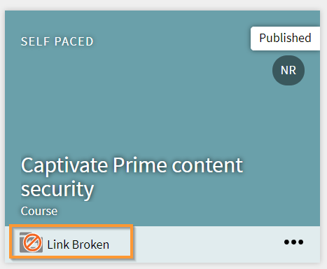

# 共有カタログのフルコントロールの有効化

## カタログの作成 {#createcatalog}

管理者はコース、学習プログラム、作業計画書、資格認定のカタログを作成できます。

詳細については、「[カタログ](/help/migrated/administrators/feature-summary/catalogs.md)」を参照してください。

## カタログの共有 {#sharecatalog}

カタログは組織の社内ユーザーや社外ユーザーと共有できます。ただし、共有は排他的です。つまり、社内で共有されているカタログを社外グループと共有したり、社外で共有されているカタログを社内グループと共有したりすることはできません。

コース、学習プログラム、作業報告書、資格認定は、共有カタログの学習目標としてサポートされます。

詳細については、「[カタログの共有](/help/migrated/administrators/feature-summary/catalogs.md)」を参照してください。

## 共有カタログのフルコントロールの有効化 {#fullcontrol}

カタログへのフルアクセス権は社外アカウントに付与できます。その後、アカウントの管理者はカタログを承諾し、学習コンテンツやモジュールを適宜追加、削除できます。

社外アカウントにフルコントロールを付与するには

1. カタログに学習コンテンツを追加した後、カタログを社外ユーザーと共有する必要があります。
1. 社外アカウントダイアログボックスで、社外組織の管理者のサブドメインと電子メール ID を追加します。
1. 「カタログコントロール」オプションでボタンを切り替えて、カタログのフルコントロールを社外ユーザーに付与します。

   

   *共有カタログのフルコントロールを許可する*

   カタログのフルコントロールを付与すると、社外組織の管理者はカタログの変更を求めるリクエストを承認できます。その後、社外組織の作成者はコースの編集やモジュールの追加を行えるようになります。

   詳細については、以下のセクションを参照してください。

## 社外組織の管理者 {#administratorofexternalorganization}

前の組織の管理者がカタログのフルコントロールを有効にすると、社外組織の管理者はカタログを承認して表示できるようにします。

1. 通知アイコンをクリックし、カタログの承認を示す通知を表示します。

   <!---->

1. カタログの招待を承認するには、「承認」をクリックします。
1. 共有しているカタログをカタログのリストで起動すると、カタログのフルコントロールが付与されたことを示すメッセージが表示されます。

   

   *カタログの詳細の表示*

1. カタログの説明と名前は変更できます。

## 学習プログラム、資格認定、作業報告書のカタログの共有 {#sharecatalogforlearningprogramcertificationandjobaids}

管理者はコースのカタログのフルコントロールを付与できるほか、以下のカタログのフルコントロールも付与できます。

* 学習プログラム
* 資格認定
* 作業計画書

## コースのリセット {#resetcourse}

1. リンクが切れているカタログカードで、「**[!UICONTROL コースをリセット]**」をクリックします。

<!-- -->

1. 「リセット」ボタンをクリックすると、アラートメッセージが表示されます。コースをリセットすると、以下の処理が行われます。

   * 新しく追加したすべてのコンテンツがカタログから削除されます。
   * カタログが元の共有カタログと同期されて更新されます。
   * 親の学習目標との関係が復元されます。

   カタログはリセットすると元に戻せなくなります。カタログに加えた変更は元に戻せません。

1. 変更を確定するには、「はい」をクリックします。
1. メッセージの&#x200B;*壊れたリンク*&#x200B;が、「コースカタログ」に表示されなくなります。

   カタログの詳細を表示すると、カタログが元の状態に復元されていることがわかります。

## 学習目標の再追加 {#readdalearningobject}

コース、学習プログラム、資格認定、作業報告を誤って削除した場合は、復元することができます。

削除した学習目標を復元するには、「再追加」をクリックします。

これによって操作が取り消され、学習目標がカタログビューに復元されます。

*学習目標の再追加*

「再追加」ボタンをクリックすると、学習目標がカタログに正常に追加されたことを示す確認メッセージが表示されます。

## 社外組織 {#externalorganization}

社外アカウントの管理者がカタログを承認すると、作成者はコースや学習プログラムを追加できるようになります。

1. ユーザーは自分のアカウントでカタログが使用可能になったことを示す通知を受信します。
1. コースのリストを表示するには、左側のナビゲーションペインで「**[!UICONTROL コース]**」をクリックします。自分が作成したコースと共有しているコースがすべて表示されます。
1. コースの詳細を表示するには、コースカードで「**[!UICONTROL コースを表示]**」をクリックします。

   <!---->

1. コース詳細ページでは、コースおよび共有モジュールに関する情報を確認できます。モジュールを追加するには、「モジュールを追加」をクリックします。既存のモジュールにモジュールを追加すると、既存のモジュールの最後に新しいモジュールが表示されます。モジュールはいつでも並べ替えることができます。
1. モジュールを追加したら、「再パブリッシュ」をクリックします。

   モジュールを再パブリッシュすると、カタログカードに「*リンクが壊れています*」というメッセージが表示されます。

   新しいモジュールによって元のカタログが更新されたため、取得したコースとの既存の関係は失われます。

   学習目標のコンテンツが変更されたため、学習目標と元のアカウントとの同期は失われます。

   <!---->

モジュールを追加および再パブリッシュした後で、以前にカタログ内のコースを誤って追加または削除してしまった場合は、モジュールをリセットして、フルコントロールで最初に共有されたときのモジュールを元の状態に戻すことができます。
