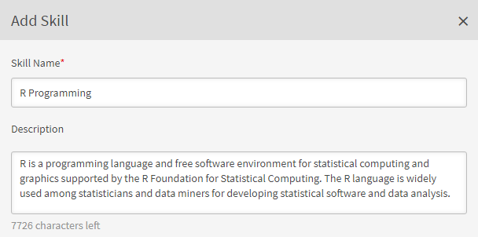

# スキルとレベルの作成および変更

スキルとレベルの作成、割り当て、変更

スキルマップとは、組織内の従業員のスキルセット、知識および特性をグループ化したものです。これらのスキルマップは、企業や組織が従業員のパフォーマンスの期待値を設定したり引き上げたりする際に役立ちます。従業員はスキルを身に付けることにより、自分の能力を組織の期待に合わせることができます。

Adobe Learning Manager ではスキルマップを使用することで、スキルセットに基づいて学習者のパフォーマンスをマッピングすることができます。学習者は一部のコースの受講を完了すると、スキルマップを表示して、各スキルの達成度を確認できます。

Learning Manager LMS におけるスキルの基本目的は、ビジネス目標に沿った学習ツールを管理者に提供することです。

## スキルの追加 {#addaskill}

管理者は、次の操作を実行できます。

* ドメインをスキルにマッピングする。
* 複数レベルのスキルを追加する。
* レベルにバッジを追加する。

スキルを追加するには、次の手順に従います。

1. 左ペインで、**[!UICONTROL スキル]**/**[!UICONTROL 追加]**/**[!UICONTROL スキルの追加]**&#x200B;を選択します。 スキルに名前を付けて、説明を記入します。

   

   *スキルの名前と説明を追加する*

1. スキルにドメインを割り当てます。 スキルの作成時に、Learning Managerがサポートする最も関連性の高いスキルドメインにスキルをマッピングできます。 詳細については、[***ドメインへのスキルのマッピング***](/help/migrated/administrators/feature-summary/curation-skills.md)&#x200B;を参照してください。

   フィールドにドメイン名の一部を入力すると、候補が表示されます。スキルに関連するオプション（複数可）を選択します。

   

   *ドメインの追加*

1. スキルにレベルを割り当てます。レベルを追加するには、「**[!UICONTROL 追加]**」をクリックします。

   スキルを作成して従業員に割り当てることができます。スキルには様々なレベルがあり、レベルごとに特定の数の単位が必要です。

   1 つのスキルに最大 3 つのレベルを割り当てることができます。学習パスは、学習者を様々な学習目標に登録させるためのものです。学習目標は、スキルの様々なレベルの要件を満たす単位に変換されます。

   これらの学習目標（LO）とレベルを達成すると、学習者は以前より高い生産性レベルを身につけたことになります。

   

   *スキルレベルの追加*

   スキルを追加する際、単位に小数を割り当てることができます。単位は小数点以下第 2 位まで表示されます。

   小数は英語版でのみサポートされます。

1. レベルのバッジを選択します。**[!UICONTROL バッジ]**&#x200B;ドロップダウンリストから、そのレベルのバッジとして使用する画像を選択します。
1. 変更を保存するには、「**[!UICONTROL 保存]**」をクリックします。

   スキルを作成したら、新しく作成したスキルが&#x200B;**[!UICONTROL スキル]**&#x200B;ページに表示されます。また、スキルのドメインや簡単な説明も表示されます。スキルのレベルと、各レベルに割り当てられた単位も表示されます。

   

   *oifスキルの一覧を表示*

## スキルの学習者への割り当て {#assigntheskilltolearners}

管理者は、スキルを学習者に割り当てることができます。

スキルを作成して保存すると、そのスキルがスキルページに表示されます。スキルを学習者に割り当てるには、以下の手順を実行します。

1. **[!UICONTROL スキル]**&#x200B;ページで、スキルを登録している学習者の数を示すハイパーリンクをクリックします。新たに作成されたスキルでは、すべてのレベルの学習者の数はゼロです。

   

   *スキルに割り当てられた学習者の表示*

   この例では、レベル 1 の学習者を追加します。レベル 1 に隣接するハイパーリンクをクリックします。

1. 学習者ダイアログで、「**[!UICONTROL 学習者を追加]**」をクリックします。

   

   *学習者の追加*

1. 学習者を検索して、追加します。ユーザーグループを追加することもできます。

   

   *学習者を検索して追加*

1. 変更を保存するには、「**[!UICONTROL 保存]**」をクリックします。

   ユーザーを割り当てた後、ユーザーグループ内のすべての学習者は、デフォルトでスキルに自動登録されます。「**[!UICONTROL 自動登録]**」ボタンをクリックすることで、学習者は自動登録をオプトアウトできます。

   

   *自動登録を無効にする*

   個々の学習者は、自分で自動登録することも、管理者が学習プログラムに登録することもできます。

1. 「**[!UICONTROL 閉じる]**」をクリックすると、作成したスキルに割り当てられた学習者の総数が表示されます。

   この例では、個々の学習者が 2 人、ユーザーグループに含まれる学習者が 3 人います。

   

   *スキルに割り当てられた学習者の数*

## スキルのコースへの割り当て {#assignskilltocourse}

スキルの作成後、作成者はコースを作成し、スキルをそのコースに割り当てることができます。

*コースにスキルを割り当てる*

作成者がコースをパブリッシュすると、**[!UICONTROL スキル]**&#x200B;ページに、スキルレベルに関連付けられたコースのカウントが表示されます。スキルレベルは、新しいコースにスキルを割り当てるときに 1 つ大きくなります。

*スキルレベルに関連付けられているコースの数*

## スキルへの作業計画書の割り当て {#assignajobaidtotheskill}

作業計画書は、コースや学習プログラムなどの特定の学習目標に登録することなく学習者がアクセスできるトレーニングコンテンツです。

作業計画書を作成する際に、作成者はスキルレベルを作業計画書に関連付けることができます。スキルなしで作業計画書を作成し、スキルのあるコースに関連付けても、そのスキルが作業計画書にリンクされることはありません。

*作業計画書を作成する*

**[!UICONTROL スキル]**&#x200B;ページでは、そのスキルレベルに関連付けられた作業計画書の数を確認できます。

*スキルの作業計画書の数*

## スキルの検索 {#searchskill}

スキルを検索するには、そのスキルの名前を入力するか、表示されているオプションで目的のスキルを選択します。 先行入力検索機能を使用することもできます。

スキルページの「**[!UICONTROL アクティブ]**」セクションと「**[!UICONTROL 撤回済み]**」セクションの両方で、スキルを検索することができます。

## スキルの編集 {#editaskill}

**[!UICONTROL スキル]**&#x200B;ページで、変更するスキルをクリックします。**[!UICONTROL スキルの編集]**&#x200B;ダイアログで、必要な変更を行います。例：

* スキルドメインを追加または削除する。
* スキルの名前と説明を編集する。
* スキルレベルを追加するか、既存のレベルを変更する。
* スキルのバッジを追加または削除する。

変更を加えたら、「**[!UICONTROL 保存]**」をクリックします。

## スキルの撤回 {#retireaskill}

スキルを撤回するには、**[!UICONTROL スキル]**&#x200B;ページで、撤回するスキルを選択します。

ページの右上隅にある&#x200B;**[!UICONTROL アクション]**&#x200B;メニューで、「**[!UICONTROL 撤回]**」をクリックします。

スキルを撤回すると、スキルはコースに表示されなくなります。

スキルを撤回すると、スキルが再公開されるまで、それ以上コースや作業計画書に関連付けたり、学習者に割り当てたりすることはできません。スキルを撤回しても、既存の関連付けおよび割り当ては影響を受けません。

## スキルの再公開 {#republishaskill}

スキルを撤回すると、撤回されたスキルが「**[!UICONTROL 撤回済み]**」タブに表示されます。このタブには、撤回されたすべてのスキルのリストが表示されます。

撤回されたスキルを再公開するには、スキルを選択し、**[!UICONTROL アクション]**&#x200B;メニューで「**[!UICONTROL 再公開]**」をクリックします。

これによりスキルが復元され、スキルが再び「**[!UICONTROL アクティブ]**」タブに表示されます。

## スキルの削除 {#deleteaskill}

削除できるのは、以前に撤回されたスキルのみです。

「**[!UICONTROL 撤回]**」タブで削除するスキルを選択し、**[!UICONTROL アクション]**&#x200B;メニューで「**[!UICONTROL 削除]**」をクリックします。

削除できるのは、学習者、コース、作業計画書に関連付けられていないスキルのみです。

## インストラクターにスキルを割り当てる

インストラクターのスキル情報が含まれている CSV ファイルを追加します。 これらのスキル情報は、スキルのリストに追加されます。

1. 画面の右上隅で、**[!UICONTROL 追加]**/**[!UICONTROL インストラクターにスキルを割り当て]**&#x200B;を選択します。
1. CSVをアップロードします。 CSVの列は次のとおりです。

   * スキル名
   * スキルレベル
   * インストラクターの電子メールまたはインストラクターのUUID

   UUIDが有効なアカウントの場合、 「インストラクターの電子メール」列を「インストラクターのUUID」に置き換えます。

   「保存」をクリックします。

   

   *CSVからインストラクターのスキルを追加*

1. 確認のポップアップメッセージが表示されます。

   注意： CSVのフィールドが正しくない場合、次のエラーメッセージがポップアップで表示されます。

   

   *間違ったフィールドのエラーメッセージ*

### スキルページ

スキルページには「インストラクター」という列があり、スキルに割り当てられたインストラクターの数が表示されます。 インストラクターの数をクリックすると、ポップアップが表示され、スキルに割り当てられたインストラクターが表示されます。

*スキルページ*

### スキル割り当てのCSVをダウンロード

1. スキルページで、**[!UICONTROL 追加]**/**[!UICONTROL インストラクターにスキルを割り当て]**&#x200B;をクリックします。
1. ダイアログで、**[!UICONTROL 以前に追加した割り当て]**&#x200B;をクリックします。
1. 最後にアップロードしたCSVがダウンロードされます。

>[!NOTE]
>
>スキルの割り当て情報が含まれている CSV をダウンロードおよび編集してから、ファイルをアップロードすることをお勧めします。

## よくある質問 {#frequentlyaskedquestions}

+++スキルから学習者を削除するにはどうすればよいですか？

スキルから学習者を削除することはできません。ただし、スキルに新しい学習者またはユーザーグループを追加することはできます。
+++

+++学習者をスキルに自動登録する方法

自動登録機能は、ユーザーグループ専用の機能です。 例えば、「すべての作成者」というユーザーグループを特定のスキルに追加して保存すると、自動登録機能がデフォルトで有効になります。 そのため、「すべての作成者」というユーザーグループにユーザーを追加すると、上記のスキルがそのユーザーに割り当てられることになります。

「すべての作成者」グループでそのスキルの自動登録機能を無効にすると、「すべての作成者」グループにユーザーを追加しても、そのユーザーに対してそのスキルが割り当てられることはありません。
+++

+++自動登録を再開するにはどうすればよいですか？

自動登録機能を再度有効にするには、自動登録機能を無効にしたスキルに、同じユーザーグループをもう一度割り当てます。

これにより、自動登録機能が有効になり、自動登録機能が無効だったときにそのグループに追加されたユーザーに対して、対象のスキルが割り当てられます。

つまり、ユーザーグループの再割り当てを行って自動登録機能を再開するたびに、そのグループ内のメンバーが更新され、グループ内のすべての現行メンバーに対してスキルが割り当てられることになります。
+++

+++どうすればコースにスキルを割り当てることができますか？

手順について詳しくは、[スキルのコースへの割り当て](skills-levels.md#assignskilltocourse)の節を参照してください。
+++

+++スキルレベルを変更するにはどうすればよいですか？

スキルに含まれる 1 つ以上のレベルを変更するには、スキルを編集し、既存のレベルのプロパティを変更します。
+++

+++バッジとスキルをコースの完了に関連付けるためには、どうすればよいですか？

作成者は、コースの作成時に、スキルをコース完了に関連付けることができます。「設定」セクションで、コース完了のスキル条件を設定できます。

コース完了のバッジを有効にするには、作成者アプリケーションの「**[!UICONTROL インスタンス]**」セクションで必要なバッジを有効にします。
+++

+++バッジに「処理中」と表示されている場合でも、管理者はバッジを完了とマークできますか？

管理者は、学習目標を完了としてマークできます。スキルとバッジは学習目標に関連付けられており、個別に&#x200B;**[!UICONTROL 完了]**&#x200B;をマークすることはできません。

つまり、バッジを達成するには、**関連付けられた学習目標を完了する必要があります**。
+++

### その他の関連ヘルプ

* [スキルとAdobe Learning Manager](https://elearning.adobe.com/2018/11/skills-captivate-prime/)
