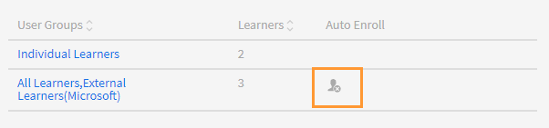

# スキルとレベルの作成および変更

スキルとレベルを作成、割り当て、変更します。

スキルマップとは、組織内の従業員のスキルセット、知識、および特性をグループ化したものです。 これらのスキルマップは、企業/組織が従業員のパフォーマンスに対する期待を設定または高めるのに役立ちます。 スキルを活用することで、従業員は組織の期待に沿った行動を取ることができます。

AdobeLearning Managerではスキルマップを使用することで、スキルセットに基づいて学習者の成績をマッピングすることができます。 学習者は一部のコースの受講を完了すると、スキルマップを表示して、各スキルの達成度を確認できます。

Learning Manager LMSにおけるスキルの基本的な目的は、ビジネス目標に沿った学習ツールを管理者に提供することです。

## スキルを追加 {#addaskill}

管理者は、次の操作を実行できます。

* スキルにドメインをマッピングする。
* スキルの複数のレベルを追加します。
* レベルにバッジを追加します。

スキルを追加するには、次の手順に従います。

1. 左側のペインで、 **[!UICONTROL スキル]**. スキルに名前と説明を付けます。

   

   *スキルの名前と説明の追加*

1. スキルにドメインを割り当てます。 スキルの作成時に、Learning Managerがサポートする最も関連性の高いスキルドメインにスキルをマッピングできます。 詳しくは、「 [***ドメインへのスキルのマッピング***](/help/migrated/administrators/feature-summary/curation-skills.md).

   フィールドにドメインの入力を開始すると、推奨事項が表示されます。 スキルに関連するオプションを1つ以上選択します。

   

   *ドメインを追加*

1. スキルにレベルを割り当てます。 レベルを追加するには、 **[!UICONTROL 追加]**.

   スキルを作成して従業員に割り当てることができます。 スキルには様々なレベルがあり、すべてのレベルで一定の単位を取得する必要があります。

   1つのスキルに最大3つのレベルを割り当てることができます。 学習パスは、様々な学習目標に学習者を登録するパスです。学習目標は、スキルの様々なレベルの要件を満たす一定の単位数に翻訳されます。

   これらの学習目標(LO)とレベルが達成されると、学習者は以前よりも生産性の高いレベルで学習を実行できるようになります。

   

   *スキルレベルを追加*

   スキルを追加するときに、単位に小数を割り当てることもできます。 クレジットは小数第2位まで表示されます。

   10進法のサポートは英語でのみ利用できます。

1. レベルのバッジを選択します。 から **[!UICONTROL バッジ]** ドロップダウンリストで、そのレベルのバッジとして使用する必要がある画像を選択します。
1. 変更を保存するには、 **[!UICONTROL 保存]**.

   スキルが作成されると、新しく作成されたスキルを **[!UICONTROL スキル]** ページです。 スキルのドメインと簡単な説明も表示されます。 レベルと各レベルに割り当てられたクレジットも表示できます。

   

   *スキルのリストを表示*

## 学習者へのスキルの割り当て {#assigntheskilltolearners}

管理者は、スキルを学習者に割り当てることができます。

スキルを作成して保存すると、それらのスキルがスキルページに一覧表示されます。 ここで、次のようにスキルを学習者に割り当てることができます。

1. を **[!UICONTROL スキル]** ページで、スキルに登録されている学習者の数を含むハイパーリンクをクリックします。 新しく作成されたスキルの場合、すべてのレベルの学習者の数はゼロです。

   

   *スキルに割り当てられた学習者の表示*

   この例では、レベル1の学習者を追加します。 [レベル1]の横にあるハイパーリンクをクリックします。

1. 学習者ダイアログで、次をクリックします。 **[!UICONTROL 学習者を追加]**.

   

   *学習者を追加*

1. 学習者を検索して追加します。 ユーザーグループを追加することもできます。

   

   *学習者の検索と追加*

1. 変更を保存するには、 **[!UICONTROL 保存]**.

   学習者を割り当てると、ユーザーグループに学習者が存在する場合、その学習者はデフォルトで自動的にスキルに登録されます。 学習者が自動登録をオプトアウトするには、次をクリックします **[!UICONTROL 自動登録]** をクリックします。

   

   *自動登録を無効にする*

   個々の学習者は、自分で自動登録することも、管理者が学習プログラムに登録することもできます。

1. クリック後 **[!UICONTROL 閉じる]**&#x200B;作成したスキルに割り当てられている学習者の合計数を表示できます。

   この例では、ユーザーグループ内に2人の個別の学習者と3人の学習者が存在します。

   

   *スキルに割り当てられた学習者の数*

## コースへのスキルの割り当て {#assignskilltocourse}

スキルを作成したら、作成者はコースを作成し、コースにスキルを割り当てることができます。

*コースへのスキルの割り当て*

作成者がコースをパブリッシュした後、 **[!UICONTROL スキル]** このページでは、スキルレベルに関連付けられているコースの数を確認できます。この数は、スキルを新しいコースに割り当てるときに増加します。

*スキルレベルに関連付けられているコースの数*

## スキルに作業計画書を割り当てる {#assignajobaidtotheskill}

作業計画書とは、コースや学習プログラムなどの特定の学習目標に登録しなくても学習者がアクセスできるトレーニングコンテンツです。

作業計画書を作成するときに、作成者はスキルレベルを作業計画書に関連付けることができます。 スキルのない作業計画書を作成し、スキルのあるコースに関連付けても、スキルが作業計画書にリンクされるわけではありません。

*作業計画書の作成*

を **[!UICONTROL スキル]** ページで、そのスキルレベルに関連する作業計画書の数を確認できます。

*スキルの作業計画書の数*

## スキルを検索 {#searchskill}

スキルの名前を入力し、表示されたオプションからスキルを選択して、任意のスキルを検索します。 先行入力検索もここで利用できます。

スキルは、両方の **[!UICONTROL アクティブ]** および **[!UICONTROL 退職]** 「スキル」ページのセクション。

## スキルの編集 {#editaskill}

を **[!UICONTROL スキル]** ページで、変更するスキルをクリックします。 を **[!UICONTROL スキルを編集]** ダイアログで、必要な変更を行います。例：

* スキルドメインの追加または削除
* スキルの名前と説明を編集します。
* スキルレベルの追加または既存のレベルの変更。
* スキルのバッジの追加または削除。

変更が完了したら、 **[!UICONTROL 保存]**.

## スキルを廃止する {#retireaskill}

スキルを廃止するには、 **[!UICONTROL スキル]** ページで、廃止するスキルを選択します。

から **[!UICONTROL アクション]** メニューのページの右上隅で、をクリックします。 **[!UICONTROL 廃止]**.

スキルを廃止すると、そのスキルはコースに表示されなくなります。

スキルが廃止されると、再公開されるまで、そのスキルをコースや作業計画書に関連付けたり、学習者に割り当てたりすることはできません。 既存の関連付けと割り当ては、スキルの廃止による影響を受けません。

## スキルの再公開 {#republishaskill}

スキルを撤回すると、撤回したスキルが「 **[!UICONTROL 退職]** タブをクリックします。 タブには、撤回されたすべてのスキルのリストが表示されます。

廃止されたスキルを再公開するには、スキルを選択して、 **[!UICONTROL アクション]** メニューで **[!UICONTROL 再公開]**.

これによりスキルが復元され、 **[!UICONTROL アクティブ]** タブをクリックします。

## スキルの削除 {#deleteaskill}

削除できるのは、以前に廃止されたスキルのみです。

を **[!UICONTROL 退職]** タブをクリックし、削除するスキルを **[!UICONTROL アクション]** メニューで **[!UICONTROL 削除]**.

スキルは、学習者、コース、作業計画書に関連付けられていない場合にのみ削除できます。

## インストラクターへのスキルの割り当て

インストラクターのスキルが記載されたCSVファイルを追加します。 これらのスキルは、スキルのリストに追加されます。

1. 画面の右上隅で、を選択します。 **[!UICONTROL 追加]** > **[!UICONTROL インストラクターへのスキルの割り当て]**.
1. CSVをアップロードします。 CSVの列は次のとおりです。

   * スキル名
   * スキルレベル
   * インストラクターの電子メールまたはインストラクターのUUID

   UUIDが有効なアカウントの場合、 「インストラクターの電子メール」列を「インストラクターのUUID」に置き換えます。

   「保存」をクリックします。

   

   *CSVからのインストラクタースキルの追加*

1. 確認のポップアップメッセージが表示されます。

   注意： CSVのフィールドが正しくない場合、次のエラーメッセージがポップアップで表示されます。

   

   *誤ったフィールドに対するエラーメッセージ*

### スキルページ

「スキル」ページには「インストラクター」という列があります。これは、スキルに割り当てられたインストラクターの数を示します。 インストラクターの数をクリックすると、ポップアップが表示され、スキルに割り当てられたインストラクターが表示されます。

*スキルページ*

### スキル割り当てのCSVをダウンロード

1. 「スキル」ページで、 **[!UICONTROL 追加]** > **[!UICONTROL インストラクターへのスキルの割り当て]**.
1. ダイアログで、 **[!UICONTROL 以前に追加された割り当て]**.
1. 最後にアップロードしたCSVがダウンロードされます。

>[!NOTE]
>
>最初にスキル割り当てのCSVをダウンロードして編集し、ファイルをアップロードすることをお勧めします。

## よくある質問 {#frequentlyaskedquestions}

+++スキルから学習者を削除するにはどうすればよいですか？

スキルから学習者を削除することはできません。 ただし、新しい学習者またはユーザーグループをスキルに追加できます。
+++

+++学習者をスキルに自動登録する方法

自動登録機能はユーザーグループ専用です。 すべての作成者などのユーザーグループをスキルに登録して保存すると、デフォルトで自動登録が有効になります。 したがって、ユーザーグループ「すべての作成者」に新たに追加したユーザーにもスキルが割り当てられます。

すべての作成者でそのスキルレベルの自動登録を停止すると、すべての作成者ユーザーグループに追加される新しいユーザーにはスキルが割り当てられません。
+++

+++自動登録を再開するにはどうすればよいですか？

自動登録を停止した同じユーザーグループをスキルレベルにもう一度登録します。

これにより、自動登録が再開され、この機能がオフのときにグループに追加された学習者にも、現在スキルが割り当てられます。

つまり、ユーザーグループを再登録して自動登録を開始するたびに、ユーザーグループのメンバーが更新され、現在のすべてのメンバーにスキルが割り当てられます。
+++

+++どうすればコースにスキルを割り当てることができますか？

「 」セクションを参照してください。 [コースへのスキルの割り当て](skills-levels.md#assignskilltocourse) 手順の詳細については、を参照してください。
+++

+++スキルレベルを変更するにはどうすればよいですか？

スキルの1つまたは複数のレベルを変更するには、スキルを編集し、既存のレベルのプロパティを変更します。
+++

+++バッジとスキルをコースの完了に関連付けるためには、どうすればよいですか？

作成者としてコースを作成する際に、スキルをコースの完了に関連付けることができます。 「設定」セクションで、コース完了のスキル条件を設定できます。

コース完了のバッジを有効にするには、 **[!UICONTROL インスタンス]** 作成者アプリのセクションで、必要なバッジを有効にします。
+++

+++バッジに「処理中」と表示されている場合でも、管理者はバッジを完了とマークできますか？

管理者は、学習目標を完了としてマークできます。 スキルとバッジは学習目標に関連付けられており、マークすることはできません **[!UICONTROL 完了]** 個別に。

つまり、バッジを獲得するには、 **関連する学習目標を完了する必要がある**.
+++

### その他の類似項目

* [Learning ManagerのスキルとAdobe](https://elearning.adobe.com/2018/11/skills-captivate-prime/)
