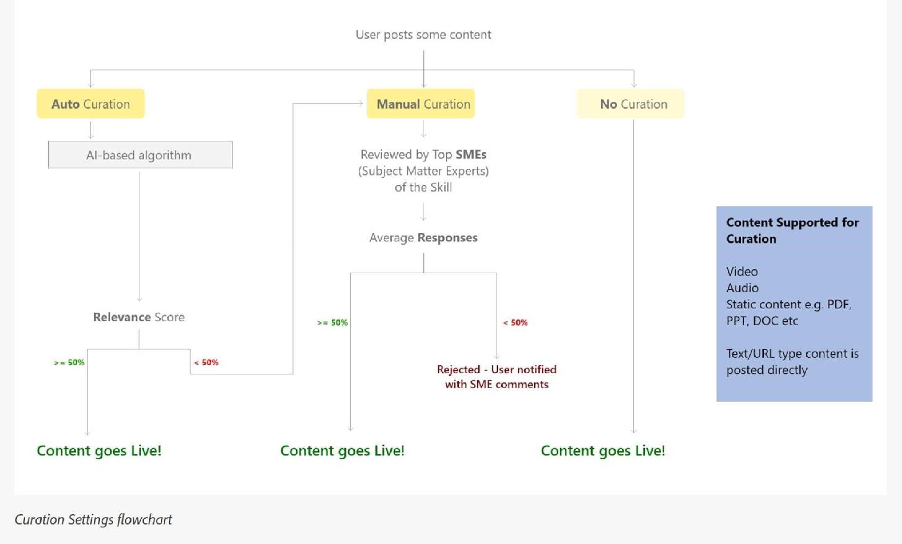
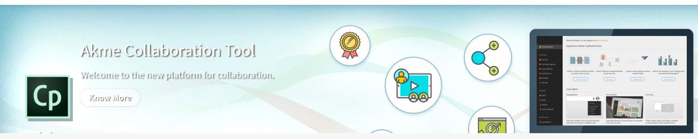

# 管理者としてソーシャル学習の監視とモデレートを行う

管理者は、ソーシャル学習で実行するアクティビティを有効化、無効化および監視できます。 ソーシャル学習機能が有効になると、学習者はその機能を表示して、ソーシャル学習への参加を開始できます。

## ソーシャル学習の設定を有効にして構成する {#enableandconfiguresettingsinsociallearning}

ソーシャル学習機能を有効にして設定するには、次の操作を行います。

1. クリック **[!UICONTROL ソーシャル学習]** 左側のナビゲーションパネルから。 アクティビティページにリダイレクトされます。
1. 有効にする **[!UICONTROL ソーシャル学習]** を使用した機能 **[!UICONTROL 有効にする]** 初めてオンにする場合は、アクティビティページのボタン。 それ以外の場合は、 **[!UICONTROL 設定]** ページです。

   下のスクリーンショットのようなポップアップダイアログボックスが表示されます。

    

   *ソーシャル学習を有効にする*

<!--  -->

管理者は、ソーシャル学習の設定を変更できます。 設定には、次のようなコンテンツのキュレーションの種類が含まれます **[!UICONTROL 手動のみのキュレーション]** および **[!UICONTROL キュレーションなし]**. スコープ設定は、ユーザータイプ（内部/外部）やアカウントに存在するその他のアクティブフィールドなど、別のスコープに設定できます。 管理者は、学習者がAdobeのLearning ManagerデスクトップアプリケーションをダウンロードするためのURLパスを設定できます。

## コンテンツキュレーション {#contentcuration}

ソーシャル学習は非公式の学習であるため、その機能は他のソーシャルメディアプラットフォームと似ています。 ソーシャルメディアは関連性の低いコンテンツを頻繁に消費するため、生産性に影響を与え、人の気が散ります。 この考えは、コンテンツの節度とキュレーションによって満たすことができます。

**[!UICONTROL 手動のみのキュレーション]** および **[!UICONTROL キュレーションなし]** 管理者が選択できる2つのキュレーションオプションです。

**[!UICONTROL 自動アシストによる手動キュレーション]:** Learning Managerには、人工知能ベースの自動キュレーションエンジンが搭載されています。このエンジンにより、後で目的の学習者に提供できるあらゆる形式のコンテンツの本質をインテリジェントに見つけることができます。 また、特定の信頼度スコアに基づいて、コンテンツの投稿を承認または拒否することもできます。

例えば、Adarshは学習者です。興味深いブログを見つけて、Adobe学習マネージャーのソーシャル学習プラットフォームに投稿しました。 その後、投稿はAIを活用したコンテンツキュレーションエンジンに送られます。このエンジンは、コンテンツに含まれるスキルを予測し、これらのスキルと関連する掲示板スキルを比較します。 いずれかのスキルが一致した場合、コンテンツが投稿されます。それ以外の場合は、手動のみのキュレーションに送信されます。

投稿に必要な最小の信頼スコアは50%です。

**[!UICONTROL 手動のみのキュレーション]:** 公開前にコンテンツの信頼性を確認するには、管理者が手動のみのキュレーション設定を有効にします。 手動のみのキュレーション設定が有効になると、キュレーションのために上位SME（最大3）に移動します。 平均応答に基づいて、投稿はそれに応じて承認または拒否されます。 応答が50%より大きい場合、投稿はライブになり、それ以外の場合は拒否されます。 SMEの詳細については、 [ここをクリック](social-learning-configurations-as-an-admin.md#SubjectMatterExpertsSMEs).

## コンテンツの自動キュレーション {#autocuration}

コンテンツを手動でモデレートすると、エラーが発生しやすく、時間がかかります。 さらに、このプロセスはスケーラブルではなく、大量の社会活動に適していません。 そのため、社会的に活発な多数のユーザーにサービスを提供する場合、コンテンツのキュレーションは自動的に重要になります。

Learning Managerには、コンテンツを自動的にキュレートするオプションがあります。 キュレーションは、管理者が定義済みのスキルをスキルにマッピングした後、事前定義されたスキルと連携するAI対応エンジンによって行われます。 詳しくは、「 [スキルドメインのマッピング](curation-skills.md).

自動キュレーションでは、次の種類のコンテンツが許可されます。

* PDF
* オーディオファイルとビデオファイル
* Presentations- PPTまたはPPTX
* ドキュメント – .doc、.docx

管理者は、管理者アプリ内からコンテンツを自動的にキュレートするオプションを有効にできます。

1. 管理アプリの左側のペインで、次をクリックします **[!UICONTROL ソーシャル学習]**.
1. ページで、タブをクリックします **[!UICONTROL 設定]**.
1. オプションを有効にする **[!UICONTROL 自動アシストによる手動キュレーション]**.

   

   *「自動アシストによる手動キュレーション」オプションを選択します*

ユーザーが掲示板にコンテンツをアップロードすると、AIベースのアルゴリズムによってコンテンツからテキストが削除され、そのテキストがキュレーションエンジンに渡されます。 キュレーションエンジンは、コンテンツに存在するスキルを検索しようとします。

アップロードされたコンテンツから予測されたスキルは、コンテンツがアップロードされた掲示板のものと一致する。  掲示板スキルの50%を超える信頼スコアに一致するスキルがある場合、コンテンツが掲示板に投稿されます。 信頼度スコアが50%未満の場合、コンテンツは手動キュレーションのために送信されます。

コンテンツが自動キュレーションされると、ユーザーは、そのコンテンツが以前アップロードされた掲示板で利用可能であるという通知を受け取ります。

*キュレーション設定のフローチャート*

手動のみのキュレーションがオンになっている場合、管理者はスキルのSMEを追加することをお勧めします。 管理者は、スキルに関する専門知識を持つユーザーにSMEポイントを事前に提供することで、SMEを追加できます。 SMEへのポイントの提供方法の詳細については、  [ここをクリック](social-learning-configurations-as-an-admin.md#SubjectMatterExpertsSMEs).

**キュレーションなし：** すべての学習者の投稿は、コンテンツのモデレートなしで自動的に投稿されます。

<!---->

## コンテンツの自動キュレーションに関するよくある質問 {#faq-auto-curation}

+++SMEが投稿をキュレートするのにどれくらいの時間がかかりますか？

SMEによる投稿のキュレーションには、最低24時間かかります。 タイムゾーンの違いにより、47時間に増える場合があります。

+++

+++3つのSMEがすべて揃ったら、次の3つのSMEのセットに進みますか？ SMEは必ず3人が呼び出されますか？

キュレーションのリクエストは、初日にトップのSMEに送られます。 回答がない場合は、その翌日、次の3人のSMEにリクエストが送信されます。

3人の新しいSMEが応答しない場合、リクエストは取締役会のモデレーターに送信されます。

掲示板のモデレーターが応答しない場合、リクエストは自動承認されます。

+++

+++2人のSMEがキュレーションし、1人のSMEがキュレーションしない場合、リクエストは4人目のSMEに送信されますか、それともリクエストは、最初のSMEのグループが投稿を評価したものの平均を取りますか？

投稿を承認するには、50%の承認評価が必要です。 同様に、50 %の拒否率を使用して投稿を拒否します。 SMEが行った承認ごとに、50%に達したかどうかが評価されます。

1日が経過しても50%に達しない場合は、次のセットのSMEに送信され、回答されていない以前のキュレーションリクエストが期限切れになります。

例えば、初日に3人のSMEにキュレーションリクエストが送信され、1人が承認したが、2人が応答しなかったとします。 翌日、キュレーションリクエストは3人のSMEの次のセットに進みます。このレベルでは現在、アクティブなSMEは合計4人です。 キュレーションを承認するには、2つ以上のSEMで承認する必要があります。（2人が承認し、2人が拒否した場合、最初の50%に達するものが採用されます）。

+++

+++「モデレーター」は、誰かが新しい掲示板を作成したときにのみ割り当てられると思われます（必須ではありません）。掲示板に関連付けられているスキルにSMEが割り当てられる場合、学習者が掲示板に「モデレーター」を割り当てるどのようなユースケースがありますか？

以下は、ソーシャル掲示板のモデレーターの責任です。

* ボード名、説明、ボードの表示設定、およびその他の構成を編集できます。
* 視聴者に適さない投稿を掲示板で削除する機能。
* モデレーターは、掲示板に関する「不正を報告」通知を受信します。
* 掲示板にSMEが存在しない場合、モデレーターはキュレーションリクエストを受け取ります。

+++

+++当社のトレーニングチームは、スキルレベルに関連するスキルと、そのスキルに割り当てられたSMEを追加および監視します。

SMEは、スキルレベルではなく、スキルに基づいて追加/割り当てられます。 これは設計通りです。

+++

+++ソーシャル学習「モデレーター」とソーシャル学習「SME」の違いは何ですか？

**モデレーター：** 取締役会のセカンダリ所有者。 掲示板の作成時に作成者によって追加され、作成者が不在でも掲示板を管理できるようになります。 デフォルトでは、掲示板の作成者がモデレーターになります。

**SME:** 各分野の専門家は、特定のスキルの専門家です。 管理者は、特定のスキルにSMEを割り当てて、そのスキルのコンテンツをキュレートできます。 SMEは、自分のスキルにリンクされたボードのキュレーションリクエストを受け取ります。 学習者はSMEポイントを獲得することでSMEになることもできます。

+++

+++スキルに割り当てられているSMEが2、3人いる場合、ソーシャル学習の投稿の承認または拒否は、すべてのSMEのキュレーションによって決定しますか、または最初にキュレーションした人によって決定しますか？

投稿を承認するには、50%の承認評価が必要です。 同様に、50 %の拒否率を使用して投稿を拒否します。 SMEが行った承認ごとに、50%に達したかどうかが評価されます。

1日が経過しても50%に達しない場合は、次のセットのSMEに送信され、回答されていない以前のキュレーションリクエストが期限切れになります。

+++

## 範囲設定 {#scopesettings}

ソーシャル学習では、範囲によってユーザーに表示される掲示板が決まります。掲示板は、コンテンツの表示を制御します。 ユーザーがスコープを持っている場合。例： ***Vendor_A***&#x200B;を選択した場合、表示できるのは、同じスコープに属する他のユーザーが作成した掲示板および関連する投稿のみです ***Vendor_A***.

これにより、管理者はベンダー、パートナー、組織の個別の部門など、ユーザーのコホートを維持できます。

社内ユーザーと社外ユーザーの両方に対して、ソーシャル学習とリーダーボードを有効にします。

社内ユーザーと社外ユーザーを有効にするには、個別のセクションがあります。

**社内学習者に対して有効化**

このセクションでは、ユーザー特性を選択して、社内ユーザーのソーシャル学習の範囲を定義できます。 同じ特性を持つユーザー **value** 同じソーシャル学習スペースを共有

から **ユーザー特性** ドロップダウンリストで、必要なオプションを選択します。

*範囲を定義するユーザー特性を選択します*

デフォルトでは、 **[!UICONTROL すべての社内ユーザー]** 「ユーザー特性」ドロップダウンリストでは、常にオプションが選択されています。

アクティブフィールドに基づいて、内部ユーザーの範囲を設定できます。

**社外学習者に対して有効にする**

社外ユーザーの学習範囲を定義するには、社外プロファイルを使用します。 同じ社外プロファイルを持つ学習者は、共通のソーシャル学習スペースを共有します。

*社外学習者の範囲を有効にする*

社外ユーザーは、社外プロファイルに基づいてスコープが設定されます。

例えば、上のリストで **[!UICONTROL Acme株式会社]**&#x200B;様の場合、Acme Corpに属するすべての学習者が、自分が作成した掲示板を閲覧できます。 このオプションを無効にした場合 **Henry Cavill**&#x200B;を選択した場合、Henry Cavillが作成した掲示板は学習者に表示されません。

管理者は、に表示されるアクティブフィールドに基づいて、コンテンツの表示範囲を設定できます **[!UICONTROL ユーザー特性]** フィールドに入力します。

例えば、管理者は範囲を **[!UICONTROL ユーザータイプ（内部/外部）]** ユーザー： 範囲を「ユーザータイプ」に設定すると、内部学習者がソーシャル学習プラットフォームで共有したコンテンツは、組織の他の内部学習者にのみ表示され、外部ユーザーには表示されません。その逆も同様です。

管理者がユーザー特性を選択した後、「ユーザー特性」フィールドの下にあるチェックボックスを選択して、ソーシャル学習機能を学習者と学習者グループに制限できます。 値フィールドをクリックして、ソーシャル学習機能を有効にする学習者または学習者グループを選択します。

デフォルトでは、範囲は **[!UICONTROL ユーザータイプ]** 社内または社外の学習者を対象としています。

アクティブフィールドに値が含まれていない場合は、 **[!UICONTROL 値]** 管理者にフィールドドロップダウンリストは表示されません。

<!-- -->

AdobeのLearning Managerデスクトップアプリケーションを使用してコンテンツを投稿することもできます。 MacとWindowsのどちらのユーザーであるかに応じて、所定のリンクをクリックしてデスクトップアプリケーションをダウンロードし、所定の手順に従ってシステムにインストールします。 インストールに問題がある場合は、 [ここをクリック](../../kb/troubleshooting-issues-with-adobe-learning-manager-desktop-app.md).

## 掲示板の作成権限 {#permission}

すべての学習者による掲示板の作成を制限し、掲示板を効率的にモデレートするために、管理者は選択したユーザーグループに掲示板の作成権限を付与することができます。

*掲示板を作成する権限を設定する*

デフォルトでは、 **[!UICONTROL すべての学習者]** が有効になっています。

**[!UICONTROL すべての学習者]:** このオプションを選択すると、すべての内部ユーザーと外部ユーザーが掲示板を作成できるようになります。

**学習者のグループ：** このオプションを選択した場合、掲示板を作成する権限を持つユーザーにのみ **[!UICONTROL 新しい掲示板の作成]** ソーシャル学習のリンク 掲示板を作成する権限を付与する必要があるユーザーグループを選択します。 自動生成されたユーザーグループとカスタムユーザーグループを追加することもできます。

<!---->

同じ範囲を共有するユーザーは、掲示板のみを表示できます。 権限を持たないユーザーの場合、 **[!UICONTROL 新しい掲示板の作成]** リンクは非表示のままです。

変更が有効になるまで、60分間待ちます。

## 特別なユーザー {#privilege}

管理者は、ユーザーグループに特別な権限を付与できます。この権限を付与されたグループのメンバーは、すべての掲示板に参加できます。 「スコープ設定」セクションで設定された制限は、特殊ユーザーグループによってバイパスされます。

ユーザーグループは、自動生成またはカスタムのいずれかになります。

この特権を付与されたユーザーは、以下を除くすべてのボードにアクセスできます **非公開掲示板**.

*特別な権限を付与*

管理者がユーザーグループを選択した場合、デフォルトでは、ユーザーの範囲に関係なく、グループ内のすべてのユーザーがすべての掲示板にアクセスできます。 これらの管理者特権を持つユーザーは、すべての内部および外部ボードを表示して参加できます。

特別なユーザーは、そのスキルに対する十分なSMEポイントを持っている場合、すべてのスコープにわたるキュレーションリクエストを受け取ります。

ユーザーが必要なSMEポイントを持っていない場合、キュレーション権限はそのスキルの上位3人のSMEに渡されます。

新しい範囲では、彼/彼女はボード間の活動のためのポイントを取得します。

「ソーシャルリーダー」の掲示板セクションで、ユーザーは自分のスコープのすべてのユーザーと特殊ユーザーを表示できます。

特別なユーザー権限が付与されている場合は、ユーザーの範囲に関係なく、アカウント内のすべてのユーザーをリーダーボードに表示できます。

特別ユーザーが十分なポイントを獲得して中小企業になると、 **[!UICONTROL 主題分野の専門家]** ソーシャルリーダーボードにリストします。

変更が有効になるまで、60分間待ちます。

## ソーシャルバナーのカスタマイズ {#customize-social-banner}

管理者は、ソーシャル学習ホームページのヘッダー画像に表示されるタイトルや字幕をカスタマイズできます。 管理者がタイトルや字幕として入力した内容が、学習者のソーシャル学習ホームページに同じように表示されます。

1. 管理者アプリで、以下をクリックします。 **[!UICONTROL ソーシャル学習]** > **[!UICONTROL 設定]**.
1. クリック **[!UICONTROL カスタマイズ]**.
1. バナー画像を変更します。 画像のサイズは少なくとも **1600 px X 240 px**.
1. 非表示または表示するオプションを切り替え **[!UICONTROL 詳細を見る]** バナーのリンク
1. 以下のフィールドにタイトルと字幕を入力します。

   

   *ソーシャルバナーのカスタマイズ*

その他にも、次のようなオプションがあります。

* **[!UICONTROL 言語]:** ドロップダウンリストから、タイトルと字幕を翻訳する言語を選択します。 別の言語にカスタムテキストも追加できます。
* **[!UICONTROL 複製]:** このボタンをクリックすると、タイトルと字幕をすべての言語に複製できます。
* **[!UICONTROL リセット]:** このボタンをクリックすると、タイトルと字幕が元の状態に戻ります。

管理者が入力した情報が、ソーシャル学習ホームページのヘッダーに表示されます。

<!---->

## トレンド {#trends}

学習者のソーシャルアクティビティのトレンドは、「トレンド」セクションの「アクティビティ」タブで表示および追跡できます。 このデータは、過去7日間、先月、過去3か月間、およびすべての期間など、異なる期間について表示できます。

「過去7日間」は、日付フィルターのデフォルト値です。

>[!NOTE]
>
>「過去7日間」は、日付フィルターのデフォルト値です。

最初のビジュアルは、日付フィルターから選択した期間に関する次の情報を管理者に提供します。

1. **[!UICONTROL 新しい投稿]**：日付期間内に作成された新しい投稿の数が表示されます。 期間全体の合計投稿数も表示されます。
1. **[!UICONTROL アクティブユーザーの割合]**：アカウントで使用可能なユーザーの合計数と比較した、ソーシャル学習でアクティブなユーザーの合計数の割合が表示されます。
1. **[!UICONTROL 新しい掲示板]**：作成された新しい掲示板の数が表示されます。 期間全体の掲示板の総数も表示されます。

2つ目のビジュアルは、日付フィルターから選択した期間に基づいて作成された掲示板または投稿の数の傾向を表示する折れ線グラフです。 フィルターをクリックすると、過去7日間、先月、過去3か月間、およびすべての時間などの様々な時間オプションが表示されます。

*トレンドを表示する新規グラフ*

## スキル {#skills}

このセクションでは、ソーシャルアクティビティプラットフォームで使用されているすべてのスキルを表示できます。 管理者は検索フィールドを使用して、掲示板を作成しSMEをマッピングする際に、まだ使用されていないスキルを検索できます。 これを実行すると、このスキルを使用して掲示板が作成されたときにSMEが通知を受け取り、手動キュレーションワークフローの一部として投稿をレビューできるようになります。

ソーシャル学習が無効になっているアカウントでは、スキルは表示されません。 このようなアカウントでも検索バーを使用できるため、管理者はスキルを検索してSMEを追加することができます。

管理者は、掲示板や投稿の作成時に使用されたスキルごとに、アクティビティスコア、投稿数、掲示板、ユーザー、SMEの名前を表示できます。

<!---->

<table>
 <tbody>
  <tr>
   <td>
    
<b>Sl. いいえ。</b>
</td>
   <td>
    
<b>列名</b>
</td>
   <td>
    
<b>説明</b>
</td>
  </tr>
  <tr>
   <td>
    
1
</td>
   <td>
    
スキル名
</td>
   <td>
    
ソーシャル学習で使用されているスキルの名前が表示されます。
</td>
  </tr>
  <tr>
   <td>
    
2
</td>
   <td>
    
アクティビティスコア
</td>
   <td>
    
スキルに属するすべての掲示板のアクティビティポイントの合計が表示されます。
</td>
  </tr>
  <tr>
   <td>
    
3
</td>
   <td>
    
投稿
</td>
   <td>
    
スキルを使用して作成された投稿の合計数を表示します。
</td>
  </tr>
  <tr>
   <td>
    
4
</td>
   <td>
    
掲示板
</td>
   <td>
    
スキルを使用して作成されたボードの合計数が表示されます。
</td>
  </tr>
  <tr>
   <td>
    
5
</td>
   <td>
    
ユーザー
</td>
   <td>
    
そのスキルを使用した学習者の合計数が表示されます。
</td>
  </tr>
  <tr>
   <td>
    
6
</td>
   <td>
    
SME
</td>
   <td>
    
そのスキルの現在の上位3つのSMEを表示します。 管理者はリンクをクリックして、SMEを追加または変更できます。
</td>
  </tr>
 </tbody>
</table>

## スキルドメイン {#skilldomain}

AdobeのLearning Managerでは、Learning Managerのエンドユーザーが主に使用するスキルに基づいて、自動キュレーションシステムがコンテンツのキュレーションに使用する25のスキルドメインのリストが分類されています。 管理者は、設定したエンタープライズスキルを、Primeが提供するスキルドメインにマッピングする必要があります。 スキルのマッピングは、スキルの作成中に、管理者のスキルページから実行することも、既存のスキルを変更して実行することもできます。 スキルのマッピングまたは追加方法について詳しくは、 [ここをクリック](skills-levels.md#Createaskillandalevel).

+++Learning Managerのキュレーションシステムで使用されるスキルドメインのリスト

1. 会計
1. Analytics
1. ビジネス倫理
1. 商法
1. ビジネスプロセス
1. コンピューターのセキュリティ
1. 顧客関係管理
1. デザイン
1. 財務
1. 人事管理
1. 情報技術
1. ラーニング
1. 管理
1. Marketing
1. 医学
1. 生産と製造
1. 品質管理
1. Sales
1. 科学研究と工学
1. ソーシャルメディア
1. ソフトスキル
1. 戦略的管理
1. サプライチェーン管理
1. 技術的コミュニケーション
1. 事業場の安全

+++

## サブジェクトマターエキスパート(SME) {#subjectmatterexpertssmes}

**領域の専門家** ある技能について非常に豊富な知識と専門知識を持っている人物だ An **SME** 管理者がキュレーション設定を手動で設定した場合、または自動キュレーション方法でコンテンツのキュレーションに失敗した場合は、ソーシャル学習で重要な役割を果たします。 「SMEs」列には、上位3つのSMEのみが表示されます。

## SMEになるための要件 {#requirementstobeansme}

SMEのステータスを取得するには、ソーシャルラーニングでの活動を通じてSMEポイントを獲得する必要があります。 管理者は、スキルレベルの専門知識に基づいて、SMEにポイントを付与できます。

## スキルへのSMEの追加 {#addingsmestoaskill}

スキルにSMEを追加するには、以下の手順に従います。

1. クリック **[!UICONTROL SMEの追加]** または **[!UICONTROL SMEの変更]**.

   

   *SMEの追加または変更*

1. クリック **[!UICONTROL 詳細オプション]** をクリックします。

   

   *詳細オプションダイアログを表示*

1. スキルに関する専門知識を持つユーザーを検索します。 ユーザーが見つかったら、 **ポイントを追加** 入力ボックス：

   ユーザーが既にポイントを持っている場合、ユーザーに付与された新しいポイントの数が現在のポイント数に追加されます。

   デフォルトでは、ソーシャル学習の新規ユーザーごとに、現在のポイントは0です。

   

   *ユーザーへのポイントの追加*

1. を選択します **[!UICONTROL SMEの最小ポイントを有効にする]** チェックボックスでは、ユーザーが上位SMEリストにSMEとして表示される必要がある最小ポイント数の制限を設定できます。 しきい値を設定すると、必要な最小ポイント値以下のポイントを持つSMEはSMEリストに表示されません。

   もし **[!UICONTROL SMEの最小ポイントを有効にする]** チェックボックスがオフの場合、ポイントが最も高い上位3人のユーザーが、その特定のスキルのSMEと見なされます。

1. クリック **[!UICONTROL 保存]** ボタンをクリックして、行った変更を表示します。

## SMEポイント制度 {#smepointsystem}

**以下の条件に基づいて、SMEにポイントが付与されます。**

* 他のユーザーが自分で作成した投稿に賛成票を投じるたびに、そのユーザーに2つのポイントが付与されます。
* 他のユーザーがコメントに賛成票を投じるたびに、ユーザーに2つのポイントが付与されます。
* 質問に答えるために学習者に5つのポイントが与えられます。
* 与えられた回答が賛成票を獲得するたびに、学習者にさらに2つのポイントが付与されます。

## キュレーションアクティビティに基づくSMEステータスポイント {#smestatuspointsbasedoncurationactivity}

**SMEがキュレーションを行った場合も、以下の条件に基づいてポイントが付与されます。**

* 自動キュレーションによってコンテンツが関連しているかどうかが判断できず、手動キュレーションの投稿が送信された場合、SMEはモデレートの送信時に5ポイントを獲得します。

## 設定のダウンロード {#downloadconfigurations}

<!---->

Enterprise Serverの場合、管理者は、学習者がWindows用およびMac用のデスクトップアプリケーションをダウンロードできる場所を変更できます。

*ダウンロードの場所の変更*

Enterprise Server URLは公開ホストされている必要があります。

## 月間アクティブユーザー請求プランのソーシャルアクティビティ {#socialactivitiesformonthlyactiveusersbillingplan}

ユーザーが新しいソーシャル掲示板、ソーシャル投稿、ソーシャルコメントを作成するたびに、そのアクティビティは有効なアクティビティとしてカウントされ、 **月間ライセンス認証ユーザー**(MAU)アカウントがMAU請求モデルに従っている場合のプラン。 詳細については、を参照してください。 [請求管理](billing-management.md).

## よくある質問 {#frequentlyaskedquestions}

+++社外学習者に対してソーシャル学習を有効にする方法

イン **[!UICONTROL ソーシャル学習]** > **[!UICONTROL 設定]**「スコープ設定」セクションで、オプションを有効にします。 **[!UICONTROL 社外学習者に対して有効にする]**. ドロップダウンから社外プロファイルを選択し、そのプロファイルの学習範囲を定義します。

*「社外学習者に対して有効にする」オプションを選択します*
+++
