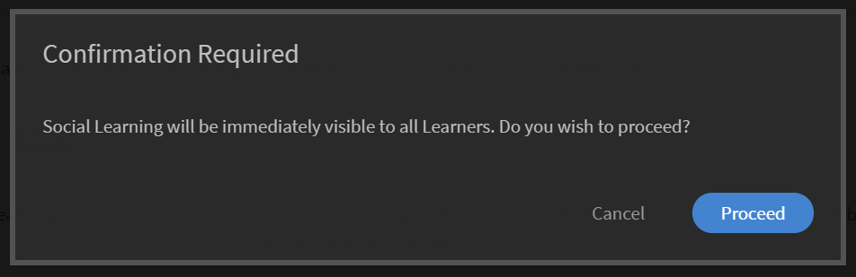
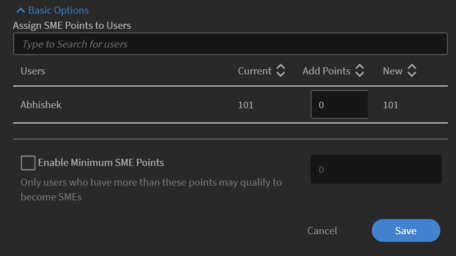

# 管理者としてソーシャル学習のモニターとモデレートを行う

管理者は、ソーシャル学習で実行されるアクティビティの有効と無効を切り替えたり、アクティビティをモニターしたりすることができます。ソーシャル学習機能を有効にすると、学習者はソーシャル学習に参加できるようになります。

ソーシャル学習を使用すると、学習者は場所を問わず学習し、コンテンツを同僚と共有できます。 この機能により、学習者は対話、アイデアの交換、共同作業を行うことができ、全体的な学習体験が向上します。

## ソーシャル学習機能を有効にして各種の設定を行う {#enableandconfiguresettingsinsociallearning}

ソーシャル学習機能を有効にして各種の設定を行うには、以下の手順を実行します。

1. 左側のナビゲーションパネルで「**[!UICONTROL ソーシャル学習]**」をクリックします。アクティビティページにリダイレクトされます。
1. 初めてオンにする場合は、[アクティビティ]ページの[**[!UICONTROL 有効化]**]ボタンを使用して、**[!UICONTROL ソーシャル学習]**&#x200B;機能を有効にします。 それ以外の場合は、**[!UICONTROL 設定]**&#x200B;ページから有効にすることができます。

   以下のようなポップアップダイアログが表示されます。

    

   *ソーシャル学習を有効にする*

<!--  -->

管理者は、ソーシャル学習の設定を変更できます。 設定には、**[!UICONTROL 手動のみのキュレーション]**&#x200B;や&#x200B;**[!UICONTROL キュレーションなし]**&#x200B;などのコンテンツのキュレーションの種類が含まれます。 スコープ設定は、ユーザータイプ（内部/外部）やアカウントに存在するその他のアクティブフィールドなど、別のスコープに設定できます。 また、管理者は、学習者が Adobe Learning Manager デスクトップアプリケーションをダウンロードするための URL パスを設定することもできます。

### コンテンツのキュレーション {#contentcuration}

ソーシャル学習は非公式な学習であるため、その機能は、他のソーシャルメディアプラットフォームの機能に似ています。ソーシャルメディアは関連性の低いコンテンツを頻繁に消費するため、生産性に影響を与え、人の気が散ります。 こうした点を考慮して開発されたのが、コンテンツのキュレーション機能です。

**[!UICONTROL 手動のみのキュレーション]**&#x200B;と&#x200B;**[!UICONTROL キュレーションなし]**&#x200B;は、管理者が選択できる2つのキュレーションオプションです。

**[!UICONTROL 手動による自動キュレーション]:** Learning Managerには、AIベースの自動キュレーションエンジンが搭載されています。これにより、後で目的の学習者に提供できるあらゆる形式のコンテンツの本質をインテリジェントに見つけることができます。 また、特定の信頼度スコアに基づいて、コンテンツの投稿を承認または拒否することもできます。

例えば、Adarshは学習者です。彼が面白いブログを見つけたので、Adobe Learning Managerのソーシャル学習プラットフォームに投稿しました。 その後、投稿はAIを活用したコンテンツキュレーションエンジンに送られます。このエンジンは、コンテンツに含まれるスキルを予測し、これらのスキルと関連する掲示板スキルを比較します。 いずれかのスキルが一致した場合、コンテンツが投稿されます。それ以外の場合は、手動のみのキュレーションに送信されます。

投稿に必要な最小の信頼スコアは50%です。

**[!UICONTROL 手動のみのキュレーション]:**&#x200B;管理者は、コンテンツが公開される前にコンテンツの信頼性を確認するために、手動のみのキュレーションの設定を有効にすることができます。 このオプションを有効にすると、上位の SME（最大 3 名）にキュレーション作業が委任されます。平均応答に基づいて、投稿はそれに応じて承認または拒否されます。 平均値が 50 パーセント以上の場合は投稿が承認され、50 パーセント未満の場合は拒否されます。SME の詳細については、[ここをクリック](social-learning-configurations-as-an-admin.md#SubjectMatterExpertsSMEs)してください。

新しい範囲では、ユーザーは掲示板全体でのアクティビティに対してポイントを獲得します。

「ソーシャルリーダーボード」セクションでは、ユーザーは自分の範囲のすべてのユーザーとスペシャルユーザーを表示できます。

スペシャルユーザー権限を付与されている場合、ユーザーの範囲に関係なく、リーダーボード内のアカウントのすべてのユーザーを表示できます。

特別なユーザーが十分なポイントを獲得してSMEになった場合、ソーシャルリーダー掲示板の&#x200B;**[!UICONTROL 主要なサブジェクトマターエキスパート]**&#x200B;のリストに表示されます。

変更内容が反映されるまで、60 分待ちます。

### 範囲の設定 {#scopesettings}

ソーシャル学習では、範囲によって表示される掲示板が決定され、コンテンツの可視性が制御されます。ユーザーがスコープ（例： ***Vendor_A***）を持っている場合、同じスコープ&#x200B;***Vendor_A***&#x200B;に属する他のユーザーによって作成された掲示板および関連する投稿のみを表示できます。

これにより、管理者は、ベンダー、パートナー、または組織内の部門などのユーザーのグループを個別に保持できます。

社内ユーザーと社外ユーザーの両方に対してソーシャル学習とリーダーボードを有効にします。

社内ユーザーと社外ユーザーをそれぞれ有効にするための個別のセクションがあります。

**社内学習者に対して有効にする**

このセクションでは、ユーザー特性を選択して、社内ユーザーのソーシャル学習の範囲を定義できます。 同じ特性を持つユーザー&#x200B;**value**&#x200B;は、同じソーシャル学習スペースを共有します。

**ユーザー特性**&#x200B;ドロップダウンリストから、必要なオプションを選択します。

*範囲を定義するユーザー特性を選択してください*

既定では、[ユーザー特性]ドロップダウンリストオプションの[**[!UICONTROL すべての内部ユーザー]**]は常に選択されています。

アクティブフィールドに基づき社内ユーザーの範囲を設定することができます。

**社外学習者に対して有効にする**

社外ユーザーの学習範囲を定義するには、社外プロファイルを使用します。同じ社外プロファイルを持つ学習者は、共通のソーシャル学習スペースを共有します。

*社外学習者の範囲を有効にする*

社外ユーザーは、社外プロファイルに基づいて範囲を設定されます。

例えば、上のリストから **[!UICONTROL Acme Corp]** を有効にすると、Acme Corp に属するすべての学習者が、作成した掲示板を表示できます。「**Henry Cavill**」オプションを無効にした場合、学習者は Henry Cavill によって作成された掲示板を表示できません。

管理者は、「**[!UICONTROL ユーザー特性]**」フィールドに表示されるアクティブなフィールドに基づいて、コンテンツの表示範囲を設定することができます。

例えば、コンテンツの表示範囲を「**[!UICONTROL ユーザータイプ]**」（内部ユーザーまたは外部ユーザー）に設定することができます。範囲を「ユーザータイプ」に設定すると、内部学習者がソーシャル学習プラットフォームで共有したコンテンツは、組織の他の内部学習者にのみ表示され、外部ユーザーには表示されません。その逆も同様です。

管理者が特定のユーザーの「ユーザー特性」オプションを選択した場合、そのユーザーは、「ユーザー特性」フィールドの下にあるチェックボックスを選択することにより、特定の学習者や学習者グループのみにソーシャル学習機能の使用を制限することができます。ソーシャル学習機能の使用を許可する学習者または学習者グループを選択するには、「値」フィールドをクリックします。

既定では、スコープは内部学習者または外部学習者の&#x200B;**[!UICONTROL ユーザーの種類]**&#x200B;によって設定されます。

アクティブなフィールドに値が設定されていない場合は、管理者が「**[!UICONTROL 値]**」フィールドをクリックしても、ドロップダウンリストは表示されません。

<!-- -->

Adobe Learning Managerデスクトップアプリケーションを使用してコンテンツを投稿することもできます。 Mac と Windows のどちらを使用しているかに応じて、該当するリンクをクリックしてデスクトップアプリケーションをダウンロードし、画面に表示される手順に従ってアプリケーションをコンピューターにインストールしてください。インストールできない場合は、[ここをクリック](../../kb/troubleshooting-issues-with-adobe-learning-manager-desktop-app.md)してください。

### ダウンロード設定 {#downloadconfigurations}

<!---->

エンタープライズサーバーの場合は、管理者は、Windows と Mac の両方について、デスクトップアプリケーションのダウンロード元となる場所を変更することができます。

*ダウンロードの場所を変更する*

エンタープライズサーバーの URL は、パブリックにホストされている必要があります。

### 掲示板の作成権限 {#permission}

すべての学習者による掲示板の作成を制限し、掲示板を効果的にモデレートするために、管理者は掲示板を作成する権限を選択されたユーザーグループに付与することができます。

*掲示板の作成権限を設定する*

デフォルトでは、「**[!UICONTROL すべての学習者]**」オプションが有効になっています。

**[!UICONTROL すべての学習者]:**&#x200B;このオプションを選択すると、社内ユーザーと社外ユーザーの全員が掲示板を作成できるようになります。

**学習者グループ：**&#x200B;このオプションを選択すると、掲示板を作成する権限を持つユーザーのみに、ソーシャル学習で「**[!UICONTROL 新しい掲示板を作成]**」リンクが表示されます。掲示板を作成する権限を付与する必要があるユーザーグループを選択します。 自動生成されたユーザーグループとカスタムユーザーグループを追加することもできます。

<!---->

同じ範囲を共有するユーザーには、掲示板のみが表示されます。権限を持たないユーザーの場合、「**[!UICONTROL 新しい掲示板の作成]**」リンクは表示されません。

変更内容が反映されるまで、60 分待ちます。

## スペシャルユーザー {#privilege}

管理者は、グループのメンバーがすべての掲示板に参加できるように、ユーザーグループに特別な権限を付与することができます。「範囲設定」セクションで設定された制限は、スペシャルユーザーグループによってバイパスされます。

ユーザーグループは、自動生成またはカスタムを指定できます。

この権限を付与されたユーザーは、**非公開掲示板**&#x200B;を除くすべての掲示板にアクセスできます。

*特権の付与*

管理者がユーザーグループを選択すると、デフォルトでは、ユーザーの範囲に関係なく、グループ内のすべてのユーザーがすべての掲示板にアクセスできます。これらの昇格された特権を持つユーザーは、すべての社内および社外掲示板を表示し、それらに参加できます。

スペシャルユーザーが特定のスキルに対して十分な SME ポイントを獲得している場合、そのユーザーはすべての範囲でキュレーションリクエストを受信します。

ユーザーに必要な SME ポイントがない場合、キュレーション特権はそのスキルの上位 3 名の SME に渡されます。

新しい範囲では、ユーザーは掲示板全体でのアクティビティに対してポイントを獲得します。

「ソーシャルリーダーボード」セクションでは、ユーザーは自分の範囲のすべてのユーザーとスペシャルユーザーを表示できます。

スペシャルユーザー権限を付与されている場合、ユーザーの範囲に関係なく、リーダーボード内のアカウントのすべてのユーザーを表示できます。

特別なユーザーが十分なポイントを獲得してSMEになった場合、ソーシャルリーダー掲示板の&#x200B;**[!UICONTROL 主要なサブジェクトマターエキスパート]**&#x200B;のリストに表示されます。

変更内容が反映されるまで、60 分待ちます。

### ソーシャルバナーのカスタマイズ {#customize-social-banner}

管理者は、ソーシャル学習ホームページのヘッダー画像に表示されるタイトルや字幕をカスタマイズできます。 管理者がタイトルや字幕として入力した内容が、学習者のソーシャル学習ホームページに同じように表示されます。

1. 管理者アプリで、**[!UICONTROL ソーシャル学習]**/**[!UICONTROL 設定]**&#x200B;をクリックします。
1. 「**[!UICONTROL カスタマイズ]**」をクリックします。
1. バナー画像を変更します。 画像のサイズは、**1600 px X 240 px**&#x200B;以上にする必要があります。
1. バナーの&#x200B;**[!UICONTROL 詳細]**&#x200B;リンクを非表示または表示するオプションを切り替えます。
1. 以下のフィールドにタイトルと字幕を入力します。

   

   *ソーシャルバナーのカスタマイズ*

次のようなオプションがあります。

* **[!UICONTROL 言語]:**&#x200B;ドロップダウンリストから、タイトルと字幕を翻訳する言語を選択します。 別の言語にカスタムテキストも追加できます。
* **[!UICONTROL 複製]:**&#x200B;このボタンをクリックすると、タイトルと字幕をすべての言語に複製できます。
* **[!UICONTROL リセット]:**&#x200B;このボタンをクリックすると、タイトルと字幕が元の状態に戻ります。

  管理者が入力した情報が、ソーシャル学習ホームページのヘッダーに表示されるようになります。

  <!---->

### ソーシャル学習ビュー

管理者は、次の設定からソーシャル学習ビューを選択できます。

* 投稿ビュー – このオプションを選択すると、すべての掲示板の個々の投稿が表示されます。
* 掲示板ビュー – このオプションを選択すると、使用可能なすべての掲示板が表示されます。

## コンテンツの自動キュレーション {#autocuration}

多くの場合、コンテンツを手動でモデレートすると、ミスが発生しやすくなり、時間がかかります。また、このプロセスは拡張性が低く、大量のソーシャルアクティビティには適しません。したがって、アクティブにソーシャル活動を行う多くのユーザーにサービスを提供する場合、コンテンツの自動キュレーションが重要です。

Learning Manager には、コンテンツを自動的にキュレートするオプションがあります。管理者が事前定義されたスキルをスキルにマッピングした後、AI 対応のキュレーションエンジンにより、事前定義されたスキルにコンテンツがマッピングされます。詳細については、[スキルドメインのマッピング](curation-skills.md)を参照してください。

自動キュレーションでは、以下のタイプのコンテンツを使用できます。

* PDF
* オーディオおよびビデオファイル
* プレゼンテーション - PPT または PPTX
* ドキュメント - .doc、.docx

管理者は、管理者アプリ内からコンテンツを自動的にキュレートするオプションを有効にできます。

1. 管理者アプリの左側のペインで、「**[!UICONTROL ソーシャルラーニング]**」をクリックします。
1. そのページで、「**[!UICONTROL 設定]**」タブをクリックします。
1. 「**[!UICONTROL 自動アシストされた手動キュレーション]**」オプションを有効にします。

   

   *自動アシストによる手動キュレーションオプションを選択*

ユーザーが掲示板にコンテンツをアップロードすると、AI ベースのアルゴリズムがコンテンツからテキストをスクレイピングして、テキストがキュレーションエンジンに渡されます。キュレーションエンジンは、コンテンツ内に存在するスキルの検索を試行します。

アップロードされたコンテンツから予測されたスキルは、コンテンツがアップロードされた掲示板のものと一致する。  掲示板スキルの50%を超える信頼スコアに一致するスキルがある場合、コンテンツが掲示板に投稿されます。 信頼性スコアが 50% 未満の場合、コンテンツは手動キュレーションに送られます。

コンテンツが自動キュレーションされるたびに、そのコンテンツがアップロードされた掲示板で利用可能になったという通知がユーザーに届きます。

*キュレーション設定のフローチャート*

管理者は、「手動のみのキュレーション」オプションがオンになっている場合は、特定のスキルに対して SME 管理者を追加することをお勧めします。特定のスキルに関する専門知識を持っているユーザーに対して事前に SME ポイントを付与することにより、SME を追加することができます。SMEにポイントを提供する方法の詳細については、[ここをクリック](social-learning-configurations-as-an-admin.md#SubjectMatterExpertsSMEs)してください。

**キュレーションなし：**&#x200B;すべての学習者の投稿は、コンテンツのモデレートなしで自動的に投稿されます。

<!---->

## コンテンツの自動キュレーションのよくある質問 {#faq-auto-curation}

+++SMEが投稿をキュレートするのにどれくらいの時間がかかりますか？

SME による投稿のキュレーションには、最低 24 時間かかります。 タイムゾーンの違いにより、47時間に増える場合があります。

+++

+++3つのSMEがすべて揃ったら、次の3つのSMEのセットに進みますか？ 関係するのは常に 3 人の SME ですか？

キュレーションリクエストは、初日に上位 3 人の SME に送信されます。 応答しない場合、リクエストは翌日に次の 3 人の SME に送信されます。

新しい 3 人の SME が応答しない場合、リクエストは掲示板のモデレーターに送信されます。

掲示板のモデレーターが応答しない場合、リクエストは自動承認されます。

+++

+++2人のSMEがキュレーションし、1人のSMEがキュレーションしない場合、リクエストは4人目のSMEに送信されますか、それともリクエストは、最初のSMEのグループが投稿を評価したものの平均を取りますか？

投稿を承認するには、50% の承認の評価が必要です。 同様に、50%の不採用の評価によって投稿は拒否されます。 SME の承認が行われるたびに、50% に達しているか評価されます。

1 日経過しても 50% に達しない場合は、次の SME の組に送信されて、それ以前の未回答のキュレーションリクエストは期限切れとなります。

例えば、初日にキュレーションリクエストが 3 人の SME に送信されます。1 人は承認しましたが、2 人からの返答はありませんでした。 翌日に、次の組となる 3 人の SME へキュレーションリクエストが送信されます。この段階で、合計4 人のアクティブな SME が関係することになります。 キュレーションの承認には、少なくとも 2 人の SME が承認する必要があります。（2 人の承認と 2 人の拒否がある場合、最初に 50% に達したものが採用されます）

+++

+++「モデレーター」は、誰かが新しい掲示板を作成したときにのみ割り当てられると思われます（必須ではありません）。掲示板に関連付けられているスキルにSMEが割り当てられる場合、学習者が掲示板に「モデレーター」を割り当てるどのようなユースケースがありますか？

以下は、ソーシャル掲示板のモデレーターの責任です：

* 掲示板名、説明、掲示板の表示設定、その他の設定を編集する権限。
* 投稿が視聴者に適していない場合、掲示板上の投稿を削除する権限。
* モデレーターは、掲示板に関する「不正を報告」通知を受信します。
* 掲示板に SME が不在の場合、モデレーターがキュレーションリクエストを受け取ります。

+++

+++当社のトレーニングチームは、スキルレベルに関連するスキルと、そのスキルに割り当てられたSMEを追加および監視します。

SME は、スキルレベルではなくスキルに基づいて追加や割り当てが行われます。 これは設計通りです。

+++

+++ソーシャル学習「モデレーター」とソーシャル学習「SME」の違いは何ですか？

**モデレーター：**&#x200B;掲示板のセカンダリ所有者。 掲示板の作成時に作成者が追加し、作成者が不在でも掲示板を管理できるようにします。 デフォルトでは、掲示板の作成者はモデレーターです。

**SME:**&#x200B;主題専門家とは、特定のスキルの専門家です。 管理者は、SME を特定のスキルに割り当てて、そのスキルの内容をキューレーションできます。 SME は、自身のスキルに関連した掲示板のキュレーションリクエストを受け取ります。 SME ポイントを獲得することにより、学習者も SME になることができます。

+++

+++スキルに割り当てられているSMEが2、3人いる場合、ソーシャル学習の投稿の承認または拒否は、すべてのSMEのキュレーションによって決定しますか、または最初にキュレーションした人によって決定しますか？

投稿を承認するには、50% の承認の評価が必要です。 同様に、50%の不採用の評価によって投稿は拒否されます。 SME の承認が行われるたびに、50% に達しているか評価されます。

1 日経過しても 50% に達しない場合は、次の SME の組に送信されて、それ以前の未回答のキュレーションリクエストは期限切れとなります。

+++

## 傾向 {#trends}

学習者のソーシャルアクティビティのトレンドは、「トレンド」セクションの「アクティビティ」タブで表示および追跡できます。 このデータは、過去 7 日間、過去 1 ヶ月間、過去 3 ヶ月間、すべての期間など、異なる期間で表示することができます。

日付フィルタのデフォルト値は過去 7 日間です。

>[!NOTE]
>
>日付フィルタのデフォルト値は過去 7 日間です。

管理者が日付フィルタで期間を選択すると、最初の画面には以下の情報が表示されます。

1. **[!UICONTROL 新しい投稿]**：指定した期間内に作成された新しい投稿の件数が表示されます。また、すべての期間内に作成された投稿の総数も表示されます。
1. **[!UICONTROL アクティブなユーザーの割合]**：アカウントに登録されている有効なユーザーの数に対して、ソーシャル学習に参加しているアクティブなユーザーの数を比較した場合の合計パーセンテージが表示されます。
1. **[!UICONTROL 新しい掲示板]**：作成された新しい掲示板の数を表示します。 期間全体の掲示板の総数も表示されます。

次の画面には、日付フィルタで選択した期間内に作成された掲示板や投稿の件数に関する傾向を示す折れ線グラフが表示されます。日付フィルタをクリックすると、過去 7 日間、過去 1 ヶ月間、過去 3 ヶ月間、すべての期間など、異なる期間を選択することができます。

*傾向を表示する線グラフ*

## スキル {#skills}

「スキル」セクションには、ソーシャルアクティビティプラットフォームでこれまでに使用されたすべてのスキルが表示されます。管理者は、作成した掲示板に SME をマッピングする際に、検索フィールドを使用して、まだ使用されていないスキルを検索することができます。この操作を実行すると、まだ使用されていないスキルを使用して掲示板が作成された場合に、通知が SME に送信されます。通知を受け取った SME は、手動キュレーションワークフローの一環として、その掲示板で作成された投稿のレビューを行います。

ソーシャル学習機能が無効になっているアカウントの場合、スキルは表示されません。ただし、検索バーは表示されるため、管理者はスキルを検索して、そのスキルに SME を追加することができます。

管理者は、掲示板や投稿の作成時に使用された各スキルについて、アクティビティスコア、投稿数、掲示板の数、ユーザー数、SME の名前を表示することができます。

<!---->

<table>
 <tbody>
  <tr>
   <td>
    
<b>Sl. 番号</b>
</td>
   <td>
    
<b>列名</b>
</td>
   <td>
    
<b>説明</b>
</td>
  </tr>
  <tr>
   <td>
    
1
</td>
   <td>
    
スキル名
</td>
   <td>
    
ソーシャル学習で使用されるスキルの名前が表示されます。
</td>
  </tr>
  <tr>
   <td>
    
2
</td>
   <td>
    
アクティビティスコア
</td>
   <td>
    
「スキル名」列に表示されているスキルに属するすべてのボードのアクティビティポイントの合計が表示されます。
</td>
  </tr>
  <tr>
   <td>
    
3
</td>
   <td>
    
投稿
</td>
   <td>
    
「スキル名」列に表示されているスキルを使用して作成された投稿の総数が表示されます。
</td>
  </tr>
  <tr>
   <td>
    
4
</td>
   <td>
    
掲示板
</td>
   <td>
    
「スキル名」列に表示されているスキルを使用して作成された掲示板の総数が表示されます。
</td>
  </tr>
  <tr>
   <td>
    
5
</td>
   <td>
    
ユーザー
</td>
   <td>
    
「スキル名」列に表示されているスキルを使用した学習者の総数が表示されます。
</td>
  </tr>
  <tr>
   <td>
    
6
</td>
   <td>
    
SME
</td>
   <td>
    
「スキル名」列に表示されているスキルに割り当てられている上位 3 名の SME が表示されます。管理者は、リンクをクリックして SME の追加や変更を行うことができます。
</td>
  </tr>
 </tbody>
</table>

## スキルドメイン {#skilldomain}

Adobe Learning Managerは、Learning Managerのエンドユーザーが主に使用するスキルに基づいて、自動キュレーションシステムがコンテンツのキュレーションに使用する25のスキルドメインのリストを分類しました。 管理者は、設定したエンタープライズスキルを、Primeが提供するスキルドメインにマッピングする必要があります。 スキルのマッピングは、スキルの作成中に、管理者のスキルページから実行することも、既存のスキルを変更して実行することもできます。 スキルのマップまたは追加方法の詳細については、[ここをクリック](skills-levels.md#Createaskillandalevel)してください。

+++Learning Managerのキュレーションシステムで使用されるスキルドメインのリスト

1. 会計
1. 分析
1. ビジネス倫理
1. 事業法
1. ビジネスプロセス
1. コンピューターセキュリティ
1. 顧客関係管理
1. デザイン
1. ファイナンス
1. 人事管理
1. 情報技術
1. 学習
1. マネジメント
1. マーケティング
1. 製薬
1. 生産と製造
1. 品質管理
1. セールス
1. 科学的研究とエンジニアリング
1. ソーシャルメディア
1. ソフトスキル
1. 戦略管理
1. サプライチェーン管理
1. テクニカルコミュニケーション
1. 職場の安全性

+++

## 主題専門家（SME） {#subjectmatterexpertssmes}

**特定分野の専門家**&#x200B;とは、特定のスキルについて幅広い知識と専門知識を持っている人です。 管理者がキュレーション設定を手動で設定した場合、または自動キュレーション方法でコンテンツのキュレーションに失敗した場合、**SME**&#x200B;はソーシャル学習で重要な役割を果たします。 「SME」列には、上位 3 名の SME のみが表示されます。

## SME になるための条件 {#requirementstobeansme}

SME になるためには、ソーシャル学習のアクティビティを通じて SME ポイントを獲得する必要があります。それ以外の方法はありません。管理者は、スキルレベルの専門知識に基づいて、SMEにポイントを付与できます。

## SME をスキルに追加する {#addingsmestoaskill}

SME をスキルに追加するには、以下の手順を実行します。

1. **[!UICONTROL [SMEの追加]]**&#x200B;または&#x200B;**[!UICONTROL [SMEの変更]]**&#x200B;をクリックします。

   

   *SMEの追加または変更*

1. ポップアップダイアログボックスから&#x200B;**[!UICONTROL 「詳細オプション」]**&#x200B;をクリックします。

   

   *詳細オプションダイアログの表示*

1. 該当するスキルに関する専門知識を持っているユーザーを検索します。ユーザーが見つかったら、「**ポイントを追加**」入力ボックスに付与するポイント数を入力します。

   そのユーザーが既にポイントを獲得している場合は、ここで入力したポイントが現在のポイントに加算されます。

   新しくソーシャル学習に参加したユーザーのデフォルト値は、すべて 0 ポイントになります。

   

   *ユーザーにポイントを追加する*

1. 「**[!UICONTROL 最小 SME ポイントを有効にする]**」チェックボックスを選択すると、「トップ SME」リストに SME として表示されるために必要な最小ポイントのしきい値を設定することができます。このしきい値を設定すると、獲得ポイントがしきい値以下である SME は「トップ SME」リストに表示されなくなります。

   「**[!UICONTROL SMEの最小ポイントを有効にする]**」チェックボックスが選択されていない場合、ポイントが最も高い上位3人のユーザーが、その特定のスキルのSMEと見なされます。

1. 「**[!UICONTROL 保存]**」ボタンをクリックして、行った変更を表示します。

## SME ポイントシステム {#smepointsystem}

**以下の条件に基づいて、ユーザーに SME ポイントが付与されます。**

* 特定のユーザーが作成した投稿を別のユーザーが高評価するたびに、その投稿を作成したユーザーに 2 ポイントが付与されます。
* 特定のユーザーが入力したコメントを別のユーザーが高評価するたびに、そのコメントを入力したユーザーに 2 ポイントが付与されます。
* 質問に回答したユーザーに 5 ポイントが付与されます。
* 投稿した回答が高評価されるたびに、追加で 2 ポイントが付与されます。

## キュレーションアクティビティに基づく SME ポイント {#smestatuspointsbasedoncurationactivity}

**SME がキュレーション作業を行った場合も、以下の条件に基づいてポイントが付与されます。**

* 自動キュレーションが適切であるかどうかが不明であるという理由で手動キュレーション用として投稿が送信された場合は、キュレーション作業を行った SME に 5 ポイントが付与されます。

## 月間アクティブユーザー課金プランのソーシャルアクティビティ {#socialactivitiesformonthlyactiveusersbillingplan}

ユーザーが新しいソーシャルボード、ソーシャル投稿、ソーシャルコメントを作成するたびに、アカウントがMAU請求モデルに従っている場合、アカウントは&#x200B;**月間アクティベーションユーザー**(MAU)プランを対象にカウントされる有効なアクティビティとしてカウントされます。 詳細については、「[課金管理](billing-management.md)」を参照してください。

## よくある質問 {#frequentlyaskedquestions}

+++社外学習者に対してソーシャル学習を有効にする方法

**[!UICONTROL ソーシャル学習]** > **[!UICONTROL 設定]**&#x200B;の「範囲設定」セクションで、オプション&#x200B;**[!UICONTROL 社外学習者に対して有効にする]**&#x200B;を有効にします。 ドロップダウンから社外プロファイルを選択し、そのプロファイルの学習範囲を定義します。

*社外学習者に対して「有効にする」オプションを選択します*
+++
