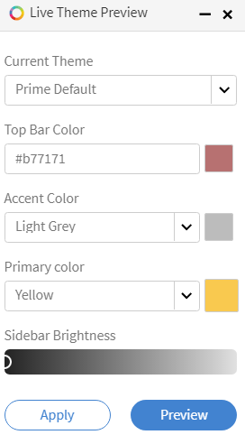

# カラーテーマ

Learning Manager でのカラーテーマとブランディング

Learning Manager では、組織のブランディング要件に合わせてアプリケーションの見た目を変更できます。

## ユーザーインターフェイスのカスタマイズ

このトレーニングでは、インターフェイスの外観をカスタマイズして、組織のブランディング要件に合わせる方法について説明します。

トレーニングを起動できない場合は、<almacademy@adobe.com>に書き込んでください。

## ブランディング {#branding}

左ペインで&#x200B;**[!UICONTROL ブランディング]**&#x200B;をクリックして、組織名の更新、サブドメイン、ロゴスタイル、テーマの変更を行います。 各トピックの横にある「**[!UICONTROL 編集]**」をクリックして、コンテンツを変更します。

## ロゴのスタイル {#logostyling}

**[!UICONTROL 「編集」]**&#x200B;をクリックして、Learning Managerアプリケーションに表示されるロゴと会社名の見た目を設定します。

「**[!UICONTROL 新しいロゴをアップロード]**」をクリックし、ロゴをコンピューターから選択してアップロードします。 ロゴと組織名の見た目は下でプレビューできます。 任意のヘッダースタイルを選択し、[**[!UICONTROL 保存]**]をクリックします。

## テーマ {#themes}

カラーテーマの変更をアプリケーションに適用する前に、変更をプレビューする 5 枚の参考画像が提供されます。 画像の左側と右側にある &lt; and > 記号をクリックして、一連のプレビュー画像を閲覧します。 または、画像の下部にあるナビゲーション用の円をクリックして、一連のプレビュースナップショットを閲覧することもできます。

**テーマを選択**

このセクションの下にある&#x200B;**[!UICONTROL ヒントを表示]**&#x200B;をクリックすると、以下のようにヒントが画像に表示されます。

*テーマのヒントの表示*

Learning Managerアプリケーションには、5つのカラーテーマオプションが用意されています。

* Prime デフォルト
* ペブル
* カーニバル
* オータム
* ウィンタースカイ
* ビビッド

>[!NOTE]
>
>ビビッドテーマはアクセシビリティに準拠しています。

*テーマの色をカスタマイズする*

トップバーの色、アクセントの色（左ペインのアイコンの色など）、プライマリカラー、テーマのサイドバーの明るさ（Prime デフォルトのテーマを除く）をカスタマイズできます。

**[!UICONTROL メインカラー]**&#x200B;ピッカーでは、没入型UIで使用する色を選択できます。

カスタマイズするには、左ペインでテーマの種類を選択し、ブランドカラーとサイドバーアイコンの色の隣の四角をクリックします。 サイドバーの明るさのサイドバーをクリックし、前後にドラッグして明るさを調整します。 これらのオプションを変更する際は、上の画像のプレビューを見ながら行ってください。

**[!UICONTROL [テーマのリセット]]**&#x200B;をクリックして、テーマの元の設定を復元します。 変更が完了したら、**[!UICONTROL [保存]]**&#x200B;をクリックします。

**ライブプレビュー**

「テーマ」セクションの左下隅にある「**[!UICONTROL ライブプレビュー]**」をクリックします。 次のようなポップアップが表示されます。

*ライブプレビューポップアップ*

ドロップダウンリストから任意のテーマを選択し、設定を調整して「**[!UICONTROL プレビュー]**」をクリックすると、アプリケーションで変更がライブ表示されます。 これで、アプリケーションのすべての機能を確認し、変更を確認できます。 ライブプレビュー中に役割を変更することもできます。 変更に問題がなければ、ライブテーマのプレビューポップアップ機能に戻り、「**[!UICONTROL テーマを適用]**」をクリックします。

変更をライブでプレビューしている間も、ライブテーマプレビューのポップアップは画面の下部に引き続き表示されます。 ポップアップを最小化することもできます。

## 複数のブランド {#multiple-branding}

複数のブランディングを実装する方法は次のとおりです。

1. 管理アプリの左側のペインで「**ブランディング**」を選択します。
1. 「複数のブランディング」セクションで「**編集**」を選択します。
1. トグルボタンを選択して有効にします。

### 社内ユーザー

1. ドロップダウンからアクティブフィールドを選択します。
1. 選択内容に基づいて、組織の名前を変更し、ユーザー用に新しいロゴをアップロードできます。

### 社外ユーザー

1. ドロップダウンからアクティブフィールドを選択します。
1. 選択内容に基づいて、組織の名前を変更し、ユーザー用に新しいロゴをアップロードできます。

>[!NOTE]
>
>内部ユーザーは、外部ユーザーのようにアクティブフィールドを持つことができます（例えば、管理者はアクティブフィールド値を個別に選択することで、内部ユーザーと外部ユーザーのマルチブランディングを個別に追加する必要があります）。

>[!INFO]
>
>詳細については、この[ブログ](https://elearning.adobe.com/2024/06/multiple-branding-how-to-add-customised-branding-for-internal-and-external-users/)を参照してください。

#### 注意事項

* 管理者は、このアクティブフィールド値にマルチレベルブランディングを追加できます。外部ユーザーは、異なるメカニズム(SSOシングル(Okta、Mini orange)、ソーシャルログイン)でログインし、マルチブランディングが適用されるかどうかを確認できます。
* 外部ユーザーには、内部ユーザーのようにアクティブフィールドとアクティブフィールドの値があります。共有する場合でも、管理者がマルチブランディングで個別に指定する必要があります。 適用されると、外部ユーザーは異なるメカニズム(SSOシングル(Okta、Mini orange)、ソーシャルログイン)でログインし、マルチブランディングが適用されるかどうかを確認できます。
* プロファイル間で外部ユーザーを移動：外部ユーザーをプロファイル間で移動しても、管理者または外部ユーザーがログインまたは登録時にアクティブフィールドの値を編集/削除しない限り、ユーザーのアクティブフィールドの値には影響しません

>[!NOTE]
>
>社内ユーザーと社外ユーザーの両方に対して、同じアクティブフィールド名、同じアクティブフィールド値、異なる設定で複数のブランディングが設定されている場合。 この場合、お客様には、不一致を避けるために、同じ構成設定（ロゴ、テーマ、組織名）を使用することをお勧めします。

## アカウントのカスタマイズ {#customize}

Adobe Learning Manager を使用すると、アカウントをカスタマイズしてユーザーエクスペリエンスを強化できます。

カスタマイズ可能なコンポーネントを次のリストにまとめました。 アカウントをカスタマイズするには、Learning Manager [サポート](mailto:captivateprimesupport@adobe.com)にお問い合わせください。

<table>
 <tbody>
  <tr>
   <td>
    
<b>カスタマイズ</b>
</td>
   <td>
    
<b>推奨事項</b>
</td>
  </tr>
  <tr>
   <td>
    
トレーニングカードの色のカスタマイズ
</td>
   <td>
    
 

    <ul>
     <li>最大 12 色のカスタムカラーのみ。 </li>
     <li>すべての学習目標に色が適用されます。 カラーはすべての学習目標（トレーニング）に順に適用され、すべてのカラーで16進数のカラーコード(例：#ffffff)が必要な形式になります。</li>
     <li>カラーが 1 つだけ提供されている場合は、そのカラーがすべての学習目標に適用されます。</li>
    </ul>
    
 
</td>
  </tr>
  <tr>
   <td>
    
マウスカーソルの画像
</td>
   <td>
    
カスタム画像は、ユーザーが任意の学習目標にカーソルを合わせたときに表示されます。 

    <ul>
     <li>ユーザーがLearning ManagerのWebページにカーソルを置くと、適用済みのカスタム画像が表示されます。 </li>
     <li>推奨サイズ – 16 x 16または24 x 24 px</li>
     <li>推奨される画像形式 – PNG、JPG</li>
    </ul></td>
  </tr>
  <tr>
   <td>
    
進行状況アイコンの画像
</td>
   <td>ページを移動しているときに表示されます。 進捗状況を示す「4正方形」のGIFが表示される場所に表示されます。 
    <ul>
     <li>推奨サイズ – 32x32 px以下</li>
     <li>推奨される画像形式 – GIF、PNG、JPG</li>
    </ul>
    
 
</td>
  </tr>
  <tr>
   <td>
    
Fonts
</td>
   <td>
    
フォントを適用するには、CDN が必要です。 適用するフォントファミリーを共有することも必要になります。

    
<b>注意：</b>フォントファミリーは、すべてのブラウザーに対応していることが必要です。
</td>
  </tr>
  <tr>
   <td>
    
背景画像
</td>
   <td>
    
背景画像が表示されるのは、学習者の役割のみです。 

    
学習者の背景に適用する画像が必要です。

    <ul>
     <li><b>推奨される画像形式：</b>PNG、JPG、JPEG</li>
     <li><b>推奨サイズ：</b>1400 x 908 px</li>
    </ul></td>
  </tr>
 </tbody>
</table>

## 推奨設定の構成 {#configurerecommendationsettings}

**ブランディング** > **全般**&#x200B;で、社内外の学習者の推奨範囲を設定し、学習者ホームページで学習者がスキルを選択できるようにすることができます。

**全般**&#x200B;ページには、次のオプションがあります。

<table>
 <tbody>
  <tr>
   <td>
    
学習者ホームページ
</td>
   <td>
    
<strong>「クラシック」</strong>または<strong>「没入型」</strong>のいずれかを選択します。 「没入型」を選択すると、他のオプションが表示されます。
</td>
  </tr>
  <tr>
   <td>
    
トレーニングの種類 
</td>
   <td>
    
<strong>「カスタム」</strong>または<strong>「業界に適合」</strong>のいずれかを選択します。 学習者が 1000 人未満の場合、アカウント全体が 1 つの範囲とみなされます。 この推奨事項は、すべての学習者に基づいています。 
</td>
  </tr>
  <tr>
   <td>
    
推奨の範囲設定 
</td>
   <td>
    
1 つ以上のアクティブフィールドを選択します。 <strong>「カスタム」</strong>の場合は、1 つのアクティブフィールドしか選択できません。 <strong>業界に適合</strong>の場合、最大5つのアクティブなフィールドを選択できます。 
</td>
  </tr>
  <tr>
   <td>
    
関心のある分野を学習者が検索できるようにする
</td>
   <td>
    
クラシック環境のみ。 <strong>はい</strong>を選択するか、<strong>いいえ</strong>を選択してください。 
</td>
  </tr>
  <tr>
   <td>
    
関心のある分野（スキル）を選択するようにユーザーを促す  
</td>
   <td>
    
没入型環境のみ。 「<strong>はい</strong>」または「<strong>いいえ</strong>」を選択します。 
</td>
  </tr>
 </tbody>
</table>
