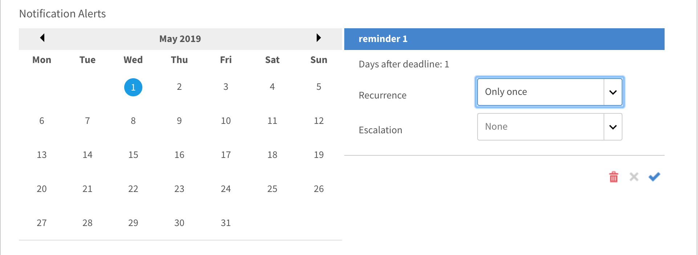

# 通知

通知機能は、AdobeのLearning Managerのすべてのユーザーに適用されます。 ただし、様々なシナリオでは、役割に基づいてユーザーごとに異なる種類の通知が届きます。 通知ポップアップダイアログを使用すると、ユーザーへのすべてのアラートと通知が表示されます。

## 通知にアクセス {#accessnotifications}

ユーザーは、ウィンドウの右上隅にある通知アイコンをクリックすることで通知を表示できます。 このポップアップダイアログには、すべての通知が発生時刻およびスクロールバーと共に表示されます。 すべての通知について詳細を表示するには、ポップアップダイアログの下部にある「すべての通知を表示」をクリックします。 通知ページが表示されます。

最新の通知数は、通知アイコン上にハイライト表示された番号から把握できます。 例えば、前回のログイン後に5つの最新の通知がある場合、通知アイコンの上に数字の5が表示されます。 これらの番号は、最新の通知をすべて読み取ると消えます。

## 管理者向け通知の種類 {#typesofnotificationsforadministrators}

管理者は、次の場合に通知を受け取ります。

* ユーザーのcsvリストが正常にアップロードされるたびに。
* csv形式のユーザーリストがアップロードされない場合 管理者に、失敗の理由を示すメッセージが表示されます。
* 管理者は、コースや学習プログラムのインスタンスレベルの通知アラートを設定することもできます。 この場合、管理者はインスタンスレベルで選択された頻度に基づいて通知を取得します。

>[!NOTE]
>
>管理者が自分のロールに加えて作成者またはマネージャーの権限を持っている場合、管理者は各ロールに関する通知を受け取ります。

管理者ロールの通知ウィンドウの例を次のスクリーンショットに示します。

*管理者通知を表示*

このポップアップウィンドウには、すべての通知が発生時刻およびスクロールバーと共にハイライト表示されます。 最新の通知数は、通知アイコン上にハイライト表示された番号から把握できます。 例えば、前回のログイン後に5つの最新の通知がある場合、通知アイコンの上に数字の5が表示されます。 これらの番号は、最新の通知をすべて読み取ると消えます。

クリック **[!UICONTROL すべての通知を表示]** すべての通知を別のページに表示するには、通知ポップアップウィンドウの下部にあるリンクをクリックします。

## マルチレベルのエスカレーション通知の設定 {#setupmultilevelescalationnotifications}

学習者が締め切りを逃した場合のエスカレーション電子メールをマネージャーおよびスキップマネージャーに送信できます。 コースの作成中または作成後に、コースが完了していない場合にマルチレベルのエスカレーション通知を設定できます。 エスカレーション通知は、マネージャーまたはスキップマネージャーに送信されるように、設定された頻度で送信されるように設定できます。

1. 管理者または作成者としてログインし、「コース」をクリックします。
1. エスカレーション通知を変更するコースを選択し、 **[!UICONTROL コースを表示]**.

   

   *「コースを表示」オプションを選択します*

1. をクリック **[!UICONTROL インスタンス]** > **[!UICONTROL 通知アラート]**.

   

   *「通知アラート」オプションを選択します。*

1. カレンダーが開き、コースに設定された期限が赤でハイライトされます。 ハイライト表示された日付をクリックすると、学習者に対してリマインダーが設定されていることを確認できます。

   

   *期限のリマインダーの表示*

1. 期限より前の日付を選択してリマインダーを設定します。 これにより、締め切りが近づいていることを示すリマインダーを学習者に対して設定できます。

   

   *期限のリマインダーの日付を設定*

1. 期限より後の日付を選択して、学習者のリマインダーのスケジュールと、マネージャーへのエスカレーション通知を設定します。

   

   *リマインダーとエスカレーション日の設定*

1. マネージャーにエスカレーションした後も学習者がコースを完了できない場合は、設定を使用して学習者のスキップマネージャーにエスカレーションできます。 延長された期限の後の日付をクリックし、リマインダーの繰り返し、スケジュールの日数を選択して選択します **マネージャーとスキップレベルマネージャー** を **エスカレーション** ドロップダウン。 青いチェックマークをクリックして、通知設定を保存します。

   

   *通知設定の保存*

## よくある質問 {#frequentlyaskedquestions}

+++インスタンスにリマインダー通知を設定する方法を教えてください。

インスタンスで、「通知アラート」をクリックします。 カレンダーが開き、コースに設定された期限が赤でハイライトされます。 ハイライト表示された日付をクリックすると、学習者に対してリマインダーが設定されていることを確認できます。 リマインダーを設定します（以下を参照） [セクション](user-notifications.md#Setupmultilevelescalationnotifications).
+++
