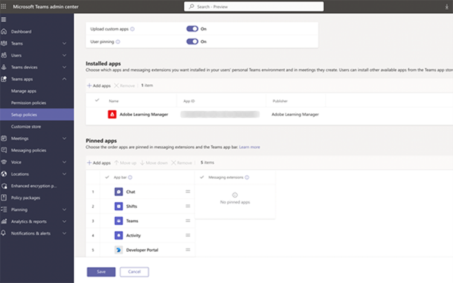

# Adobe版Learning Manager Microsoft Teams版

## 設定方法

MS TeamsでALMを設定するには、3つの手順を実行し、ALM AdministratorとMicrosoft Azure Administratorからの支援が必要です。 組織によっては、Azure管理者とMS Teams管理者が異なるため、MS Teams管理者も追加する必要があります。

**ALM管理者 – 統合管理者の役割がTeamsアプリを承認**

統合管理者がMS Teamsアプリを承認すると、AdobeのLearning ManagerアプリがMS Teamsアプリストアで利用できるようになり、学習者はアプリにアクセスできるようになります。 ただし、アプリには通知やサイレントログインはなく、MS Teamsの学習者にアプリを固定することはできません。

**Microsoft Azure管理者がAzureダッシュボードでALMアプリの権限を承認**

Azure管理者は、ALMアプリに必要な権限を承認する必要があります。 これにより、ALMアプリがMS Teamsに通知を送信し、サイレントログインを許可できるようになります。 サイレントログインでは、ブラウザーでLearning ManagerをAdobeして個別にログインする必要はありません。

**MS Teams管理者がALMグループ版のポリシーを作成**

管理センターのMS Teams管理者は、すべてのユーザーのALMアプリを固定し、グローバルポリシーとして許可する必要があります。 ALMが社内の特定のグループでのみ使用されている場合、MS Teams管理者はカスタムポリシーを選択し、その特定のグループにのみ適用する必要があります。

## 統合管理者の役割がTeamsアプリを承認

次の手順に従います。

1. 統合管理者アプリで、 **[!UICONTROL アプリケーション]** > **[!UICONTROL おすすめアプリ]**、を選択します **[!UICONTROL ALM Teamsアプリ]**.

   
   *ALM Teamsアプリを選択*

1. 画面の右上隅で、を選択します。 **[!UICONTROL 承認]**.

   
   *アプリ設定ページで「承認」を選択します*

1. 選択 **[!UICONTROL OK]** をクリックします。

   
   *承認後に「 OK 」を選択します*

1. 承認されると「外部アプリ」セクションに「ALM Teamsアプリ」が表示されます。

   
   *ALM Teamsアプリがアプリページに表示されます*

これで、ユーザーがMS TeamsでALMアプリにアクセスできるようになりました。

## Microsoft Azure管理者がAzureダッシュボードでALMアプリの権限を承認

次の手順に従います。

1. Azure管理者として、Azureダッシュボードの「 Azure Active Directoryの管理」セクションに移動します。

   
   *Azureダッシュボードを起動*

1. 次のリンクを別のブラウザーウィンドウに貼り付けます。

   `https://login.microsoftonline.com/<tenantIdTobeReplaced>/oauth2/authorize?client_id=8d349d9f-bf59-4ece-8022-a41e87d81903&response_type=code&redirect_uri=https://learningmanager.adobe.com`

1. 上記のリンクで、次を置換します： `<tenantIdTobeReplaced>` テナントIDは、以下の概要ページで使用できます。 新しいURLを入力します。

1. AdobeのLearning ManagerアプリをAzureアプリケーションに追加します。

   
   *Azureに追加*

1. 「エンタープライズアプリケーション」タブを選択し、「すべてのアプリケーション」を選択します。 そこにALMTeamsAppが表示されます。

   
   *ALMアプリを表示*

1. アプリをクリックして、「権限」タブに移動します。

   
   *「アクセス許可」タブの表示*

1. 「アクセス許可」タブで「 」を選択します。 **[!UICONTROL MSFTの管理者の同意を付与]**&#39;を追加して、ALMグループ版アプリの権限を付与します。

   
   *権限を選択*

1. 選択 **[!UICONTROL 承認]**.

   
   *「承認」を選択します*

1. 付与されると、これらの権限により、ALMアプリはサイレントログインを許可し、MS Teamsアプリで学習者に通知を送信できるようになります。

   
   *アクセス権が付与されます*

## MS Teams管理者がTeamsアプリのポリシーを作成

次の手順に従います。

1. MS Teams管理者として、管理センターで、Teamsアプリを学習者のTeamsアプリに追加するためのポリシーを作成します。

   
   *ポリシーの作成*

1. 「Setup Policies」セクションに移動します。 グローバルポリシーを作成し、 **[!UICONTROL アプリを追加]** （「固定されたアプリ」サブセクション）。

   
   *ポリシーの追加*

1. 次のダイアログで、 **[!UICONTROL Learning ManagerのAdobe]**&#x200B;を選択し、アプリを追加します。 これにより、Learning Manager Adobeが「インストール済みアプリ」セクションに追加されます。

   
   *アプリをインストール*

1. このポリシーを保存します。 これにより、組織内のすべてのユーザーがアプリを使用できるようになります。

また、管理者はグローバルポリシーの代わりにカスタムポリシーを作成することもできます。 AdobeのLearning Managerをそのカスタムポリシーに追加し、AdobeのLearning Managerにアクセスする必要があるユーザーグループにのみカスタムポリシーを適用します。
