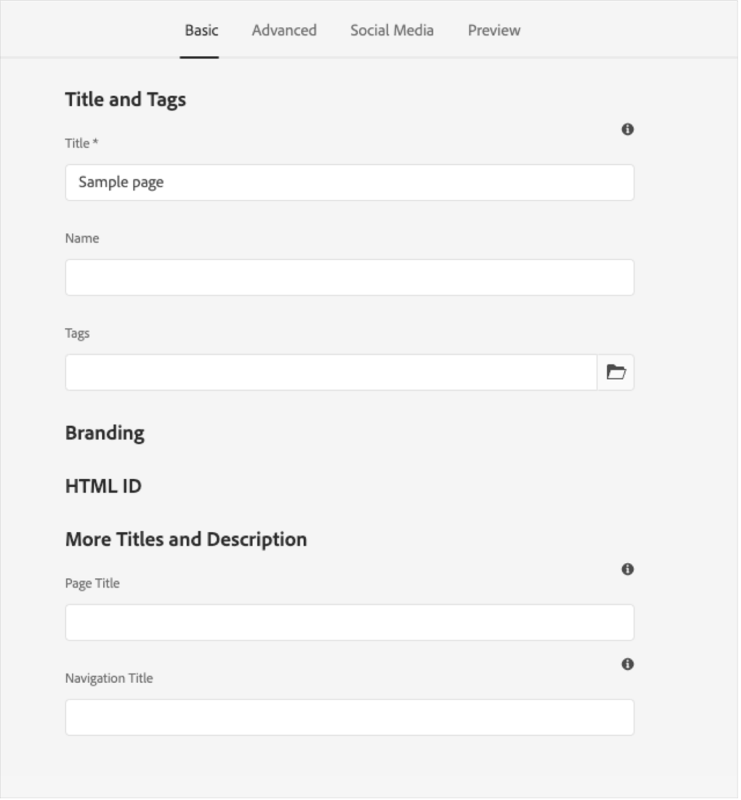

# AEM Sites用のAdobe学習マネージャーリファレンスサイト（ALMリファレンスサイト）パッケージ

Adobe学習マネージャー(ALM)は、Adobe Experience Manager(AEM)サイトと統合されます。 これにより、コーディングの労力を最小限に抑えながら、AdobeのLearning Manager向けに独自のwebサイトとレスポンシブなモバイルインターフェイスを作成できます。 この統合により、ユーザー向けにカスタマイズされた学習体験を作成できます。

このようなエクスペリエンスを構築するため、ALMではAEM Sitesインスタンスにインストール可能なZIPファイルの形式で、AEM Sites用のAdobeのLearning Managerリファレンスサイトパッケージ（ALMリファレンスサイトパッケージ）を提供しています。

パッケージには、学習カタログ、埋め込みウィジェット、カレンダーなどの埋め込みウィジェットとともに、AEM Sites webページテンプレートとwebサイトコンポーネントが含まれています。

ALM参照サイトパッケージをインストールしたら、AEM SitesインスタンスでホストできるLearning Manager Adobe用のwebサイトの構築を開始できます。 その後、ユーザーはWebサイトにコンポーネントをドラッグ&amp;ドロップできます。

ALM参照サイトパッケージのインストール

## 前提条件

* AEM SitesとAdobe Commerceのライセンス
* AEMオンプレミス6.5またはAdobe Experience Manager - Cloud Service
* Adobe Commerce 2.4.3

AEM Sitesの環境を保護したら、ALM参照サイトパッケージをインストールする必要があります。 このパッケージには、学習プラットフォームの構築に役立つAEM webページとwebサイトコンポーネントが含まれています。

参照サイトパッケージがホストされています [**GitHubリポジトリー**](https://github.com/adobe/adobe-learning-manager-reference-site/releases/tag/1.0.0).

詳細については、READMEを参照してください。

## アプリケーションの作成 [!DNL Adobe Learning Manager]

AEMサイトパッケージをインストールしたら、学習ポータルをAEMサイトに接続するようにALMアプリケーションを設定する必要があります。

このシナリオは、AEMをで使用する場合に当てはまります [!DNL Adobe Learning Manager].

次の手順に従います。

1. 統合管理者として、 **[!UICONTROL アプリケーション]**.
1. 新しいアプリケーションを作成するには、ページの右上隅にあるをクリックします。 **[!UICONTROL 登録]**.
1. 新規アプリケーションを登録画面で、次の詳細を入力します。

   1. アプリケーション名：作成しているアプリケーションの名前。
   1. URL：組織のURL。
   1. リダイレクトドメイン：AEM webサイトのホスティングドメイン。 ワイルドカードを指定することもできます。
   1. 説明：アプリケーションの説明。
   1. 範囲： 「学習者ロールの読み取りアクセス権」および「学習者ロールの書き込みアクセス権」を選択します。
   1. このアカウントのみ：既存のALMアカウントにアプリケーションを使用する場合は、「はい」を選択します。

1. 変更が完了したら、「保存」をクリックします。

画面からアプリケーションの資格情報をメモします。

*アプリケーションの資格情報*

アプリケーションを承認するには、 **[!UICONTROL 承認]**.

## トークンを取得

1. 「開発者向けリソース」タブで、 **[!UICONTROL テストおよび開発用のアクセストークン]**.

   

   *テストおよび開発用のアクセストークンを選択*

1. 次の詳細を入力します。

   
   *トークンの詳細を入力*

   1. OAuthコードを取得：前のセクションのクライアントIDを入力し、範囲を変更します。 「送信」をクリックして、Oauthコードを取得します。
   1. 更新トークンの取得：前のセクションのクライアントIDとシークレットを入力します。 また、前の手順で取得したOAuthコードも入力します。 「送信」をクリックします。
   1. アクセストークンの取得：前のセクションのクライアントIDとシークレットを入力します。 また、前の手順で取得した更新トークンも入力します。 「送信」をクリックします。
   1. アクセストークンの詳細の取得：前の手順で取得したアクセストークンを入力します。 「送信」をクリックします。

1. 次のJSON応答から詳細を取得できます。 応答は、アクセストークン、更新トークン、ユーザーロール、アカウントID、ユーザーID、有効期限で構成されます。 更新トークンは再利用するので、注意してください。

## AEMでのALMアカウントの設定

1. AEMインスタンスを起動します。
1. 設定/Cloud Serviceをクリックします。
1. Adobeの「Learning Managerの設定」をクリックします。

   
   *AdobeのLearning Manager設定を選択*

1. 作成/設定フォルダーをクリックします。 フォルダーに名前を付けます。

   
   *構成の作成*

1. 学習プロジェクトで、作成した構成を選択します。

1. 構成の詳細を入力します。

   
   *構成フォルダーの作成*

   1. Adobeの学習マネージャーモード：ログインしている学習者とログインしていない学習者の両方に対する学習体験の表示方法を選択します。
   1. Learning ManagerのURL Adobe：学習サービスがホストされているALMインスタンスのURLを入力します。
   1. アカウントID: ALMアカウントのID。
   1. クライアントID、クライアントシークレット、作成者更新トークン：ALMでのアプリケーションの作成時に取得した資格情報を入力します。
   1. ウィジェットのカスタマイズ：詳しくは、 [AEMと統合する](/help/migrated/integrate-aem-learning-manager.md) `.`

1. 設定を保存して閉じます。

### AEM + Adobe版Learning Manager（ログインしているユーザーとログインしていないユーザー）

AdobeLearning Managerでは、アカウントの作成やログインを必要とせずに、既存および潜在的なお客様やパートナーに製品やトレーニングを紹介できるようになりました。 この機能は、トレーニングの迅速かつ簡単なプレビューを学習者に提供することで、製品とトレーニングの導入を促進するのに役立ちます。プレビューは、製品機能を強調および促進するのに役立ちます。 そのため、製品やサービスを効果的に紹介することができます。特に見込み客やパートナーに対して紹介できるため、製品の認知度が高まります。 アクセスが容易で到達性が高いことから、関心が高まり、トレーニングの登録と学習の採用が促進されます。

学習者は、このワークフローを使用することで、AdobeのLearning Managerにログインしなくても、トレーニングのプレビュー、トレーニング情報へのアクセス、トレーニングの検索を行うことができます。 このワークフローは、ネイティブのLearning Managerインターフェイスには適用されません(AEM Sitesおよびその他のヘッドレスインターフェイスにのみ適用されます)。

**学習プラットフォームコネクタを設定して有効にする**

このセクションでは、次のコネクタを設定して有効にするために必要な手順について説明します。

**トレーニングデータアクセス**

このコネクターを使用すると、AEM Sitesベースや別のカスタムメイドのヘッドレスユーザーインターフェイスで、トレーニング情報を取得して学習者に提示でき、学習者のログイン前後を問わずシームレスなトレーニング情報検索が可能になります。

このコネクタは、AEM Sitesベースまたはその他のヘッドレスインターフェイスを使用している場合にのみ必要です。

コネクタは、トレーニングメタデータをデータ保存および取得ソリューションと検索有効化システムにエクスポートします。 したがって、AEM Sitesベースまたは別のカスタムメイドのヘッドレスユーザーインターフェイスを設定し、これらの2つのサービスを使用してトレーニングデータを取得し、webページをレンダリングして、学習者に最適化されたトレーニング検索機能を提供することができます。 例えば、書き出されたメタデータを使用して、AEM Sitesベースの非ログインインターフェイスで学習者はトレーニング情報を表示するトレーニングページを検索、参照、アクセスすることができます。

このコネクタを有効にすると、AEM Sitesベースのwebページを作成してレンダリングし、ログイン前後の両方の学習者にカスタマイズされたエクスペリエンスを提供できます。 このコネクタを有効にすると、AEM Sitesベースのwebページを作成してレンダリングし、ログイン前後の両方の学習者にカスタマイズされたエクスペリエンスを提供できます。

* Learning ManagerのcdnベースURL Adobe - 「トレーニングデータアクセス」接続ページからのデータ取得CDNサービスパスのベースURLを入力します。
* 管理者更新トークン – 前のセクションで決定した更新トークンを入力します。
* トレーニングメタデータのベースURL - 「トレーニングデータアクセス」接続ページから、検索有効化および検索データ取得サービスパスのベースURLを入力します。
* AdobeのLearning Manager登録URL – アカウントの統合管理者が生成したセルフ登録URLを入力します。学習者はこのURLを使用してトレーニングに登録します。

### AEM + Adobe版Learning Manager + Adobe Commerce（ログインしているユーザーとログインしていないユーザー）

Adobe版Learning Managerでは、学習プラットフォームとAdobe Commerceをシームレスに統合するためのソリューションを提供しています。 このリリースでは、ネイティブ、AEMサイトベース、またはその他のヘッドレスLearning ManagerインターフェイスをAdobe Commerceに簡単に接続できます。 この統合により、学習プラットフォーム内でeコマース機能を実現できます。 顧客やビジネスパートナーに有料トレーニングを提供できるようになったほか、ネイティブと非ネイティブの両方のLearning Managerインターフェイスでトレーニングを簡単に購入できるようになりました。 また学習者は、AdobeのLearning Managerにログインしなくても、トレーニングのプレビュー、トレーニング情報へのアクセス、トレーニングの検索を行うことができます。

既存のAEMアプリケーションを使用して承認することもできます。新規作成する必要はありません。

* AdobeのLearning ManagerのcdnベースURL - Adobe Commerce接続ページからのデータ取得CDNサービスパスのベースURLを入力します。
* Adobe Commerce URL – 使用しているAdobe CommerceインスタンスのURLを入力します。
* GraphQLのプロキシパス – クライアント側のLearning ManagerコンポーネントはAdobe CommerceのGraphQLエンドポイントに直接アクセスするため、CORSエラーが発生する場合があります。 このエラーを回避するには、すべてのコールをAEMと同じエンドポイントから処理するか、CORSヘッダーを追加するプロキシを介して処理する必要があります。
* Adobe Commerceストア名 – 前のセクションで指定したAdobe Commerceストアの名前を入力します。
* Adobe Commerce customer token lifetime （秒単位） – ログインセッションの事前決定期間を示すcustomer token lifetimeを入力します。
* 管理者更新トークン – 前のセクションで決定した更新トークンを入力します。

## Webページをカスタマイズ

AEMのリファレンスサイトとウィジェットを使用して、webページをカスタマイズします。

1. AEMインスタンスを起動します。
1. 「サイト」をクリックし、設定ページを開きます。
1. クリック **[!UICONTROL 学習サイト]** > **[!UICONTROL 言語マスター]** > **[!UICONTROL 英語]**. プロジェクト内のすべてのWebページがフォルダーに含まれます。

   
   *すべてのWebページを表示*

1. テンプレートを選択し、 **[!UICONTROL 編集]**.

1. ページで「コンポーネント設定」ボタンをクリックし、コンポーネントのプロパティーを変更します。

   
   *「設定」ボタンを選択*

1. 変更をプレビューするか、ページを公開します。

## Webページの作成

参照サイトパッケージによって提供されるテンプレートとは別に、AEMのテンプレートに基づいてWebページを作成することもできます。

1. メインのAEMページで、作成/ページをクリックします。

1. カスタマイズするテンプレートを選択します。 「次へ」をクリックします。

1. ページプロパティを入力します。

   
   *ページプロパティ*

1. ページを作成するには、 **[!UICONTROL 作成]**.

1. 新しいページを選択し、 **[!UICONTROL 編集]**.

1. ページにコンポーネントを挿入します。例： **学習 – コンテンツ**.

   
   *サイトでフィルター*

1. ページに表示される必要なカタログフィルターを選択します。

## Blueprintからのサイトの作成

ALM参照サイトパッケージには、学習プラットフォーム用のwebサイトを作成できる「学習サイトの青写真」が用意されています。 AEM blueprintsを使用すると、AEM Sitesコンポーネントから直接webページを構築できます。 テンプレートを使用する必要はありません。

1. AEMのスタートページで、をクリックします。 **[!UICONTROL Sites]**.

1. クリック **[!UICONTROL 作成]** > **[!UICONTROL サイト]**.

1. 「Learning Site Blueprint」をクリックします。

   

   *青写真からサイトを作成*

1. 「次へ」をクリックします。

1. プロパティページで、ページメタデータを入力します。 「作成」をクリックします。

   
   *Learning Site Blueprintの選択*

1. ホームハイパーリンクをクリックして、作成したサイトのホームページに移動します。 このページでは、ウィジェットとカタログコンポーネントをカスタマイズできます。

## Webサイトをコーディングする

組み込みのテンプレートを使用し、WYSIWYGコンポーネントを使用してWebサイトを一から作成するだけでなく、コードを記述してサイトを構築することもできます。

コードは [参照サイトGitHubリポジトリー](https://github.com/adobe/adobe-learning-manager-reference-site) を選択します。

テンプレートの主な部分は次のとおりです。

* コア：OSGiサービス、リスナーまたはスケジューラなどのすべてのコア機能と、サーブレットや要求フィルタなどのコンポーネント関連のJavaコードを含むJavaバンドル。
* ui.apps：プロジェクトの/apps（および/etc）部分、つまりJS&amp;CSSクライアントライブラリ、コンポーネント、テンプレートが含まれます。
* ui.content:ui.appsのコンポーネントを使用したサンプルコンテンツが含まれています
* ui.frontend:reactコンポーネントが含まれます。

すべてのコードはリポジトリに格納され、作業を開始できます。

## 既存のWebページまたはテンプレートへのlearning managerコンポーネントの読み込みと追加

AEM参照サイトパッケージをインストールすると、Learning ManagerコンポーネントがAEM Sitesインスタンスに追加されます。 デフォルトでは、これらのコンポーネントを、すぐに使用できるWebプロジェクト（Webサイト）学習サイトに追加できます。 これらのコンポーネントは、Learning Site Blueprintから作成したWebサイトでも使用できます。

ただし、新しく追加したこれらのLearning Managerコンポーネントを既存のWebプロジェクトまたはWebサイトで使用する場合は、次の手順に従って読み込む必要があります。

1. ALM参照サイトパッケージをインストールします。

1. Webプロジェクトを開き、HTMLファイル（Learning Managerコンポーネントを追加するWebページまたはWebテンプレート用）に移動します。
1. 会議への参加

   HTMLファイルを開き、次のコードスニペットをページコンポーネントに追加して、ページに存在する学習コンポーネントがレンダリングされる前にコードが実行されるようにします。

   *`<sly data-sly-use.configModel="com.adobe.learning.core.models.GlobalConfigurationModel"/>`*
   *`<meta name="cp-config" content="${configModel.config}" />`*

   上記のコードは、ページのmetaタグにマッピングされた設定を追加します。これは、学習コンポーネントがレンダリングするために必要です。 詳しくは、「 [Adobe版Learning Managerリファレンスサイト](https://github.com/adobe/adobe-learning-manager-reference-site/blob/master/ui.apps/src/main/content/jcr_root/apps/learning/components/page/customheaderlibs.html).

1. Webプロジェクトに構成がマッピングされていることを確認します。
1. Learning Managerコンポーネントを読み込むAEM Sitesテンプレートを開きます。
1. テンプレートページエディターで、「許可されたコンポーネント」コンテナに移動し、 **ポリシー**.
1. ポリシーページで、プロパティ/許可されたコンポーネントに移動し、「学習 – コンテンツ」、「学習 – フォーム」および「学習 – 構造」の各コンポーネントを選択します

次の手順を実行すると、テンプレートは読み込まれたLearning Managerコンポーネントのクライアントライブラリ依存関係を満たすことができます。

これらのコンポーネントを含むWebページは、コンポーネントを正常にレンダリングして使用するために、これらのライブラリを読み込む必要があります。

1. テンプレートページエディタで[ページ情報]をクリックし、[ページポリシー]をクリックします。
1. ポリシーページで、プロパティ/クライアントライブラリに移動し、これらをテンプレートページに追加します。

   1. learning.site
   1. learning.ui
   1. learning.commerce

このテンプレートを保存すると、このテンプレートから派生したすべてのWebページにLearning Managerコンポーネントを追加できます。
