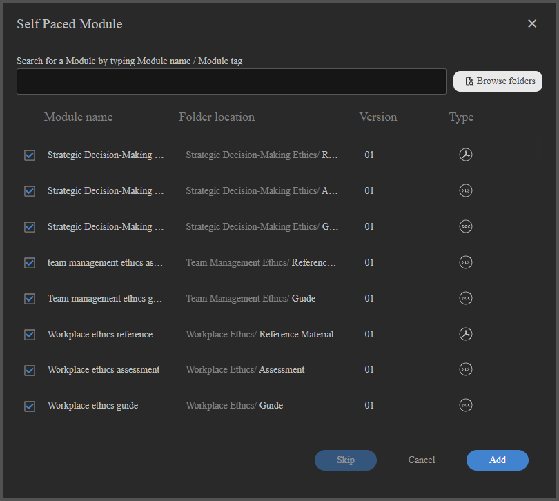
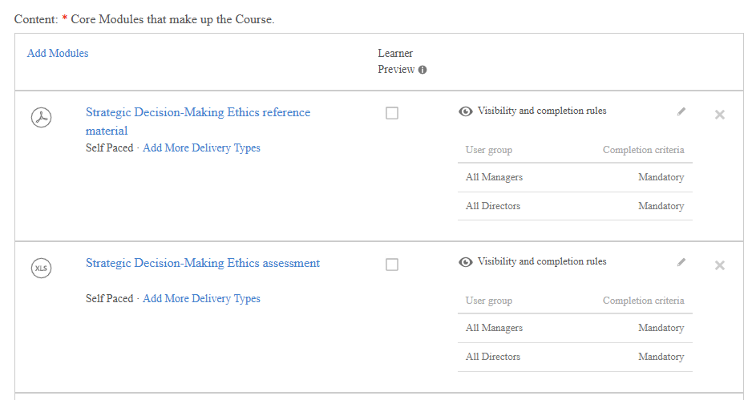

# 作成者向けのアダプティブコース

## アダプティブコースの作成と設定

モジュールごとの可視性と完了ルールを使用してコースを構築し、様々な学習者が、ユーザーグループに基づいて様々なコンテンツを表示および完了できるようにします。

>[!NOTE]
>
>アダプティブコースの種類は、アカウントで&#x200B;**表示と完了のルール**&#x200B;が有効になっている場合にのみ使用できます。 アダプティブコースを作成するオプションが表示されない場合は、管理者にアダプティブ学習を有効にするように依頼してください。

### アダプティブコースの作成

1. 作成者としてAdobe Learning Managerにログインします。

   

2. 左側のナビゲーションで「**コース**」を選択します。 次に、[**追加**]を選択します。
3. コースの名前、説明、その他の詳細を入力します。
4. 「**コンテンツの表示と完了ルール**」の切り替えを選択します。

   

5. 確認ダイアログで「**はい**」を選択します。

   

   **アダプティブコースへのモジュールの追加**

   必要なモジュールを追加します。 コンテンツモジュールを追加するには、コンテンツをアップロードするか、コンテンツライブラリから選択するか、教室またはバーチャル教室セッションを追加します。

   **適応ルールをサポートするモジュールの種類（コンテンツモジュール）:**

   * セルフペースのeラーニング
   * 教室セッション
   * バーチャルクラスルームセッション
   * アクティビティモジュール

   **アダプティブルールをサポートしていないモジュールの種類：**

   * **事前作業モジュール：**&#x200B;コアコンテンツの開始前にすべての学習者に表示されます。 表示規則や完了規則を設定することはできません。
   * **テストアウトモジュール:**&#x200B;すべての学習者が使用できます。 テストアウトを完了すると、コンテンツモジュールのステータスに関係なく、コース全体が完了します。 表示規則や完了規則を設定することはできません。
   * **作業計画書：**&#x200B;登録されているすべての学習者に対して常に表示されます。

6. 「**追加**」を選択します。

### 各モジュールの表示と完了のルールを設定する

コンテンツモジュールを追加したら、その適応ルールを設定します。

1. 設定するモジュールを選択します。
2. モジュールの設定で、**表示と完了の規則**&#x200B;セクションを見つけます。

   

3. **[ルールの追加]**&#x200B;を選択して、このモジュールを表示できるユーザーグループを追加します。

   

   

   これらのグループの学習者にはコース内にモジュールが表示されますが、モジュールが「必須」でない限り、モジュールを完了する必要はありません。

4. 「**保存**」を選択します。
5. コース内のすべてのコンテンツモジュールに対してこの操作を繰り返します。

**主要な規則：**

* モジュールを必須にするグループがある場合、その学習者はそのグループにモジュールを必須とします。
* 公開する前に、少なくとも1つのユーザーグループに対して、少なくとも1つのモジュールを&#x200B;**必須**&#x200B;として構成する必要があります。 システムは、この条件が満たされるまで公開をブロックします。

### ドラフト状態のコース

コースがドラフト状態の場合、そのコースは、適応構造全体を完全に設計、設定、および調整してから、学習者に対してロックされるフェーズを表します。 この段階で、作成者は、コースが適応コースとして機能するか通常コースとして機能するかを定義できます。この決定は、コースが公開されるまで可逆的です。 これは、コースの主要な適応性を確立または変更できる唯一のポイントであるため、ドラフトフェーズが重要になります。

ドラフトでは、作成者はコース構造を完全に制御できます。 モジュールを自由に追加、削除、並べ替えて、目的の学習フローを形成できます。 同時に、各モジュールの表示ルールを定義することで、詳細なレベルでアダプティブ動作を設定できます。 これらのルールによって、どのユーザーグループが特定のモジュールにアクセスできるかが決まり、コースが後でパーソナライズされた学習体験を提供できるようになります。 作成者は、表示と共に完了ルールを定義し、異なるユーザーグループに対してモジュールを必須またはオプションとしてマークできます。 有効な完了条件を確認するために、少なくとも1つのモジュールが必須である必要があります。

ドラフト状態では、アダプティブロジックの無制限の編集も可能です。 作成者は、システムの制約を受けずにルールの追加、変更、削除を繰り返し実行できるため、コースを完了する前にさまざまな構成を試すことができます。 適応型セットアップに加え、すべての標準コース要素（タイトルや説明などのコースメタデータおよびSCORMモジュールやその他のアセットなどの基礎となる学習コンテンツを含む）は編集可能です。

ドラフトでの適応設定は、コアコースモジュールにのみ適用されることを理解しておくことが重要です。 事前作業コンテンツやテストアウトコンテンツなどのその他のコンポーネントは、適応ルールをサポートしておらず、表示または完了設定の影響を受けません。

最後に、草案の状態は、公開する前にコースの設定を検証する最後の機会となります。 コースがパブリッシュされると、アダプティブ設定は永続的になり、元に戻すことはできません。

### 学習者としてプレビュー

**学習者としてプレビュー**&#x200B;を選択すると、ユーザーグループのルールに関係なく、コース内のすべてのモジュールが表示されます。 これにより、作成者と管理者はコース構造を完全に把握できます。 本番環境の学習者には、ユーザーグループによって表示されるモジュールのみが表示されます。

### アダプティブコースのPublish

適応コースのパブリッシュでは、通常のコースのパブリッシュと同じワークフローに従います。

すべてのモジュールとその規則を構成したら、**Publish**&#x200B;を選択します。

公開されると、コースを登録できるようになります。 学習者がコースを開くと、ユーザーグループに設定されたモジュールのみが表示されます。

>[!IMPORTANT]
>
>パブリッシュ後は、コースをアダプティブから通常に、またはその逆に切り替えることはできません。 公開する前に設定を確認してください。

### パブリッシュされたアダプティブコースの更新

パブリッシュ済みのアダプティブコースはいつでも更新できます。 変更はほぼリアルタイムで登録済み学習者に対して有効になります。

アダプティブコースの表示設定は変更できなくなりました。 アダプティブではないコースを選択することはできません。

>[!NOTE]
>
>インスタンスの切り替えで学習者をキャンセル待ちにすることはできません。登録はブロックされます。

### モジュールの追加または変更

1. パブリッシュされたコースを開きます。
2. 「**編集**」を選択します。
3. モジュールを追加、編集、または削除し、表示と完了ルールを調整します。
4. コースを再パブリッシュします。

**影響：**

| 変更 | 登録済み進行中の学習者への影響 |
|---|---|
| 新しい必須モジュールが追加されました（学習者のユーザーグループに表示されます） | モジュールが完了要件に追加されます。 モジュールが教室またはバーチャルクラスルームセッションで残りの席がない場合、学習者はそのモジュールでキャンセル待ちになります。 |
| 学習者のユーザーグループに対して削除または非表示になったモジュール | モジュールが完了要件から削除されました。 これが最後の必須モジュールである場合、コースは学習者に対して自動完了されます。 |
| 学習者のユーザーグループのモジュールが必須からオプションに変更されました | モジュールは表示されたままであるため、学習者はコースを完了するためにモジュールを完了する必要がなくなりました。 |
| 新しい必須モジュールが追加されました（学習者は既にコースを完了しています） | 学習者はモジュールを表示できるようになりますが、シートを自動的に取得したり、シートにアクセスしたりすることはできません。 新しいモジュールは、更新完了がトリガーされた場合にのみアクセス可能になります。 |

### インスタンスの切り替え動作

適応コースのインスタンスを切り替えた学習者は、次のように進捗状況を進めます。

* それらが既に完了したモジュールは、新しいインスタンスで完了したままになります。
* シートは、新しいインスタンスで完了していない表示可能なモジュールに対してのみ使用されます。
* インスタンスに空席がある場合、キャンセル待ちにすることはできません。 登録はブロックされます。

## アダプティブコースでの人数制限とキャンセル待ちの管理

Adobe Learning Managerのアダプティブコースでは、個々のクラスルームまたはバーチャルクラスルームのセッションレベルで人数制限を強制します。 フルセッションで登録全体がブロックされる通常のコースとは異なり、アダプティブコースでは即座に学習者が登録され、空席のない特定のセッションでのみキャンセル待ちになります。 学習者は、他のすべてのモジュールに中断なくアクセスできます。

### アダプティブコースでの座席の制限の仕組み

学習者が、教室またはバーチャルクラスルームモジュールを含む適応コースに登録すると、ユーザーグループに基づいて、学習者に表示されるセッションについてのみ席が利用可能かどうかが確認されます。

* 表示されているすべての教室またはバーチャルクラスルームセッションに使用可能な席がある場合、学習者は登録され、すぐにフルアクセスできるようになります。
* 表示可能なセッションに使用可能な席がない場合、学習者は登録され、これらの特定のセッションのみですぐにキャンセル待ちになります。 他のすべてのモジュールをすぐに開始および進めることができます。

次の表に、アダプティブコースで発生するすべての座席とキャンセル待ちのシナリオを示します。

| 登録時の条件 | 結果 |
|---|---|
| 表示されているすべてのCR/VCセッションに使用可能なシートがあります | すべてのモジュールへのフルアクセスで登録済み |
| 1つ以上の可視CR/VCセッションがいっぱいです | 登録済み、完全セッションでのみキャンセル待ち、その他すべてのモジュールは直ちにアクセス可能 |
| 学習者は既に登録されています。作成者は、シートのない新しい必須のCR/VCセッションを追加します。 | 新しいセッションにキャンセル待ちの学習者。既存の進行状況およびアクセスは影響を受けません |
| 学習者の登録解除 | 保持されているすべての席がすぐに解放され、次のキャンセル待ち学習者が登録日の順序でクリアされます。 |
| ユーザーグループを変更すると、学習者に表示されているセットからセッションが削除されます | 座席がすぐに解放される |
| 学習者がコースを完了すると、新しい必須CR/VCセッションが表示されます。 | モジュールは表示されていますが、シートが自動的に割り当てられていません。 学習者がセッションにアクセスするには、更新完了をトリガーする必要があります。 |
| 管理者またはインストラクターがシートを割り当てる | その学習者のすべてのキャンセル待ちCR/VCセッションが同時にクリアされます |

### キャンセル待ちの表示

1. 管理ビューでアダプティブコースを開きます。
2. **学習者**&#x200B;を選択します。
3. 「**キャンセル待ち**」タブを選択します。

「キャンセル待ち」タブには、1つ以上のモジュールにキャンセル待ちされている学習者が一覧表示されます。 適応型コースの場合、学習者は一部のモジュールで処理中でも、他のモジュールで同時にキャンセル待ちとなることがあるため、レポートはコースインスタンスレベルではなく、コースインスタンスのモジュールレベルになります。

### キャンセル待ちのクリアと席の割り当て

学習者の登録解除、人数制限の増加または手動割当により席が使用可能になった場合、登録日の順（登録日が早い順）にキャンセル待ちの学習者の選択が解除されます。

1人以上の学習者に席を手動で割り当てるには、次の手順に従います。

1. アダプティブコースを開きます。
2. **学習者**/**キャンセル待ち**&#x200B;タブを選択します。
3. 席を割り当てる学習者の横にあるチェックボックスをオンにします。
4. **シートの割り当て**&#x200B;を選択します。

「席を割り当て」を選択すると、現在表示しているセッションだけでなく、キャンセル待ちのすべてのセッションで、選択した学習者が同時にキャンセル待ちのリストからクリアされます。 座席が物理的または仮想的に学習者に合わせて配置されていることが前提です。

**キャンセル待ちの承認トリガー：**

キャンセル待ちは、次のいずれかの場合に自動的に処理されます。

* 学習者がコースから登録解除する（保持されているすべてのセッションで席が解放される）
* セッションの人数制限が増加する
* 学習者がインスタンスを切り替える場合
* 管理者またはインストラクターが席を割り当てる場合

>[!NOTE]
>
>アダプティブコースの新しいインスタンスを作成する場合、「**キャンセル待ちの学習者に通知**」オプションを使用できません。 これは予期される動作であり、通常のコースとは異なります。

通常のコースでは、キャンセル待ちリストはインスタンスレベルで追跡されるため、新しいインスタンスが開いたときに、待機中の学習者に通知するようシステムから求められることがあります。 アダプティブコースでは、キャンセル待ちはインスタンスレベルではなく、個々の教室またはバーチャルクラスルームの&#x200B;**セッション**&#x200B;レベルで追跡されます。 新しいインスタンスが作成されたときに通知するインスタンスレベルのキャンセル待ちがないため、プロンプトは表示されず、自動通知は送信されません。

## アダプティブコースの更新の完了をトリガー

Adobe Learning Managerで完了を更新すると、学習要件が変更されたときに、学習者の適応コース完了を再評価できます。 これは、学習者のユーザーグループが変更された場合、作成者がモジュールルールを更新した場合、または学習者が現在のプロファイルで適応コースを再受講する場合に関係します。

### 更新完了の機能

適応コースでは、学習者がコースを完了する際に、学習者の必須モジュールのセットはユーザーグループによって決定されます。 ユーザーグループが後で変更されたり、作成者が新しい必須モジュールを追加したりした場合、学習者は新しいプロファイルの要件を満たすために、追加のコンテンツを完了する必要が生じることがあります。

更新完了では、次の2つの処理が行われます。

1. 学習者が完了していない必須モジュールを新たに作成した場合に、学習者の既存のコース完了をロールバックします。
2. 学習者トランスクリプトに、更新された完了要件を示す新しいレコードを作成します。

元の完了レコードは、履歴エントリとして学習者のトランスクリプトに保持されます。 以前に完了したモジュールは完了したままになります。 学習者は、表示されていない、または以前に完了していない新規の必須モジュールの場合を除き、この手順を繰り返す必要はありません。

### 更新完了の適用時

**シナリオ1:ユーザーグループの変更により、新しい必須モジュールが追加されます**

学習者はアダプティブコースを完了します。 そのユーザーグループは後で変更され、新しいユーザーグループにより、以前は非表示になっていたモジュールまたはオプションのモジュールが必須になります。

* 既存の完了エントリは、学習者トランスクリプトに残ります。
* 学習者に未完了の必須モジュールが新しく追加された場合は、新しい学習者トランスクリプト行が作成され、コースが進行中として表示されます。
* 学習者が新しい完了を達成するには、新しい必須モジュールを完了する必要があります。

**シナリオ2:ユーザーグループを変更しても、新しい必須モジュールが作成されない**

学習者はアダプティブコースを完了します。 そのユーザーグループは変更されますが、新しいユーザーグループの要件は、既存の完了によって既に満たされています。

* コースは完了状態のままです。
* 新しい学習者トランスクリプト行は作成されません。
* 学習者がアクションを行う必要はありません。

**シナリオ3：学習者が開始したリテイク**

アダプティブコースを既に完了している学習者は、現在のユーザーグループプロファイルでコースを再受講して完了することができます。 これは、学習者の役割が最初の完了以降に変更された場合に便利です。

1. 学習者は、完了したアダプティブコースを開きます。
2. 学習者は、コースを再受講するか再開するかを選択します。
3. 現在のユーザーグループを使用してコースが再評価され、新しい必須モジュールセットが決定されます。
4. 新しい学習者トランスクリプト行が作成されます。

**シナリオ4:テストアウトモジュールの動作**

学習者が更新完了がトリガーされる前にテストアウトモジュールを完了した場合、更新後もテストアウト完了は有効です。 モジュールの完了または学習者のアクションによってトリガーされたコースの完了がシステムによって評価されると、コースは再度自動完了します。これは、テストアウトが既に完了しているためです。ただし、必須のコンテンツモジュールがコースに追加されている場合は、それらのモジュールが必須で未完了である場合を除きます。

>[!NOTE]
>
>学習者がテストアウトによって完了した後に、新しい教室またはバーチャルクラスルームセッションが適応コースに追加され、その後、完了の更新がトリガーされた場合、学習者は新しいセッションの&#x200B;**出席とスコア付け**&#x200B;タブまたは&#x200B;**キャンセル待ち**&#x200B;に自動的に表示されない場合があります。 これは、テストアウト完了によりコースが完了状態に保たれ、シート割り当てロジックが再トリガーされないことが原因で発生します。 新しく追加されたセッションでテストアウト学習者の出席を追跡する必要がある場合は、[**キャンセル待ち**]タブから学習者の席を手動で割り当てます。 適応コースの場合、テストアウトモジュールの使用はお勧めできません。

**シナリオ5：管理者がトリガーした更新**

学習者のプロファイルが変更され、管理者が既存の完了レコードに現在の要件が反映されていないと判断した場合、管理者は学習者の代理でリフレッシュ完了をトリガーできます。

>[!CAUTION]
>
>アダプティブコースが繰り返し行われる資格認定の一部である場合、完了の更新はルート資格認定サイクルにおける学習者の登録にのみ適用されます。 その後に繰り返されるサイクルには、更新の影響を受けないアダプティブコースの個別のインスタンスが含まれます。 繰り返し実行されるサイクルに登録されている学習者には、モジュールの更新は表示されず、完了がロールバックされることもありません。 組織が繰り返し行われる資格認定で適応コースを使用する場合、完了の更新を開始する前に、管理者にこの制限を伝えてください

1. 管理者ビューで学習者のプロファイルまたはコースの「学習者」タブを開きます。
2. 学習者の登録を検索します。
3. **[表示と完了の更新]**&#x200B;を選択します。

ALMは、学習者の現在のユーザーグループに基づいて必須モジュールを再評価し、新しい必須モジュールが存在する場合は完了をロールバックします。
