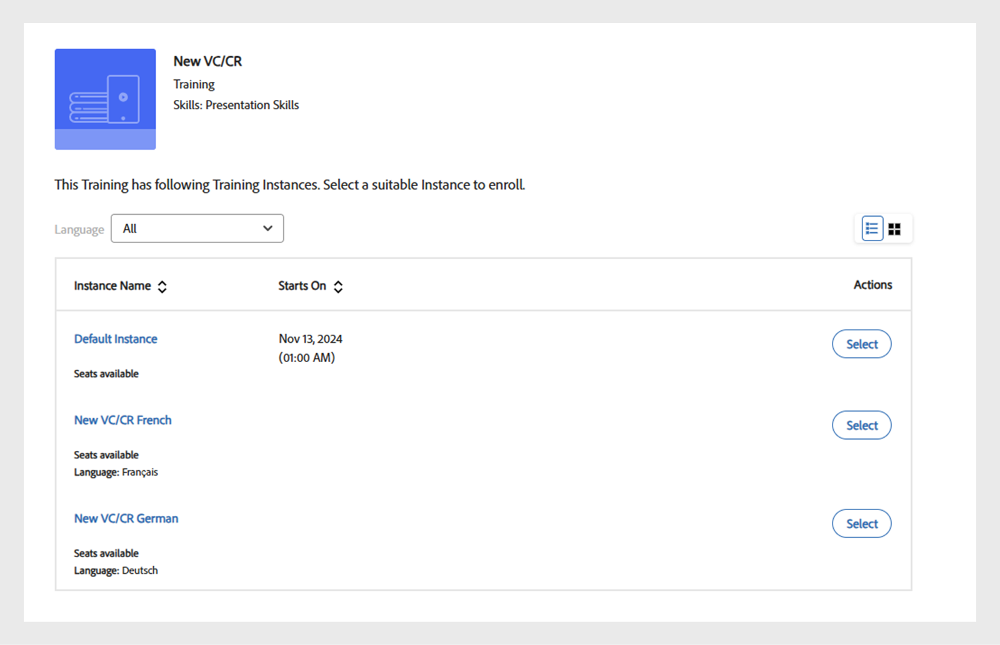

# 様々なロケールで学習目標を追加

このトピックでは、様々な言語でコース、認定資格、学習プランを追加する方法について説明します。

作成者は、コース、資格認定、学習プランなどの学習オブジェクトを作成できます。 これらの学習オブジェクトは、様々な言語で作成することもできます。

Learning Manager では、複数の言語で学習オブジェクトを作成できます。 学習目標を作成するときに、コンテンツやメタデータを追加の言語で追加できます。 また、学習オブジェクトの詳細をいつでも編集し、追加の言語で学習オブジェクトを提供することができます。

新しい言語を追加するには、新しいロケールを追加するコース、資格認定、または学習プランをクリックします。 基本情報ページ上部の「新しい言語を追加」をクリックします。

*新しい言語の追加*

ポップアップダイアログボックスが表示されたら、学習者用の追加の言語を 1 つ以上選択して「保存」をクリックします。

*言語の選択*

コースを再パブリッシュすると、変更内容が反映されます。

## 言語タグ付きCR/VCインスタンスの多言語サポート

作成者はAdobe Learning Manager(ALM)を使用して、教室およびバーチャルクラスルームモジュールの言語タグを使用して、言語固有のインスタンスを作成できます。 この機能を使用すると、学習者は希望する言語でCR/VCモジュールにアクセスできます。 例えば、作成者は2つのインスタンス（英語とフランス語）を持つCR/VCモジュールを作成できます。 学習者は、希望する言語でインスタンスを選択できます。

### ワークフロー

まず、作成者は複数の言語でコースを作成およびパブリッシュし、インスタンス作成ページで言語オプションを有効にします。 作成者は、それぞれの言語を選択して、異なるインスタンスを作成できます。 学習者は、自分にマップされている言語に基づいてインスタンスを選択できます。

### 複数の言語を使用するコースの作成

複数の言語でコースを作成するには、次の手順に従います。

1. **[!UICONTROL 作成者]**&#x200B;としてログインします。
2. **[!UICONTROL コース]**/**[!UICONTROL 追加]**&#x200B;を選択して、コースを作成します。
3. コースの&#x200B;**[!UICONTROL 名前]**&#x200B;と&#x200B;**[!UICONTROL 説明]**&#x200B;を入力します。
4. **[!UICONTROL 新しい言語の追加]**&#x200B;を選択し、必要な言語を選択します。 これにより、各言語に対して複数のタブが作成されます。

   
   _新しい言語の追加 – コース_
5. それぞれの言語のタブに移動し、コースの&#x200B;**[!UICONTROL 名前]**&#x200B;と&#x200B;**[!UICONTROL 説明]**&#x200B;を入力します。
6. 英語（米国）タブで、**[!UICONTROL モジュールを追加]**/**[!UICONTROL バーチャルクラスルームモジュール]**&#x200B;を選択します。

   >[!NOTE]
   >
   >手順は、教室モジュールでも同じです。

   
VCモジュールの新しい言語の追加

7. 各言語タブに&#x200B;**[!UICONTROL タイトル]**&#x200B;と&#x200B;**[!UICONTROL 説明]**&#x200B;を入力し、**[!UICONTROL 追加]**&#x200B;を選択します。
8. コースに必要な詳細情報を入力し、コースを公開します。

### 各言語のインスタンスの作成

各言語のインスタンスは、管理者アプリと作成者アプリから作成できます。 作成者アプリからインスタンスを作成するには、次の手順に従います。

1. **[!UICONTROL 作成者]**&#x200B;としてログインします。
2. **[!UICONTROL コース]**&#x200B;を選択し、多言語コースを選択します。
3. **[!UICONTROL インスタンス]** > **[!UICONTROL 新しいインスタンスの追加]**&#x200B;を選択して、インスタンスを作成します。
4. **[!UICONTROL インスタンス名]**&#x200B;を入力し、**[!UICONTROL 完了期限]**&#x200B;を選択します。
5. **[!UICONTROL [その他のオプションの表示]]**&#x200B;を選択して、他のオプションを表示します。
6. **[!UICONTROL 言語]**&#x200B;ドロップダウンから必要な言語を選択します。

   
   _インスタンスの言語を選択してください_

7. その他の詳細を入力して、**[!UICONTROL 保存]**&#x200B;を選択します。
8. 同じ手順で、他の言語のインスタンスを作成します。 学習者は、このコースのすべての言語インスタンスを確認できます。

### インスタンスを選択し、登録 – 学習者ワークフロー

学習者は、これらの言語インスタンスをアプリで確認できます。 希望する言語インスタンスを選択し、登録して、その言語のCR/VCセッションに参加できます。

インスタンスを選択して登録するには、次の手順に従います。

1. 学習者アプリで、**[!UICONTROL カタログ]**&#x200B;に移動し、コースを選択します。
2. 次の画面には、複数のインスタンスが表示されています。

   
   _学習者向けのVCモジュール_

3. 「言語」フィルターオプションを使用して除外できます。 希望する言語を選択し、コースに登録します。
4. 選択すると、コースの概要ページで以下の詳細を確認できます。

_インスタンスの詳細_

