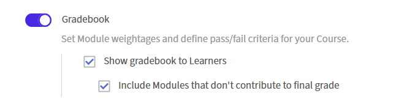

# 作成者向けGradebook

## コースの成績表の設定

Adobe Learning Managerでコースに重み付けスコアリングを設定すると、各学習者はモジュールの成績から計算された総スコアを受け取り、コースの修了を最小スコアしきい値に結び付けることができます。

成績表は、新しいコースの作成時にコースレベルで設定されます。 既存のパブリッシュ済みコースには追加できません。

>[!NOTE]
>
>学習者がコースで成績表を表示するには、管理者が最初にアカウントレベルで&#x200B;**成績表の表示**&#x200B;を有効にする必要があります。

### コースの成績表を有効にする

* 作成者としてAdobe Learning Managerにログインします。
* 左側のナビゲーションで「**コース**」を選択し、「**追加**」を選択して新しいコースを作成します。
* コース名、説明、およびその他の必要な詳細を入力します。
* 「**モジュール**」セクションで、「**成績表**」トグルを見つけます。

  

* **Gradebook**&#x200B;の切り替えを選択して有効にします。 その下に2つのオプションが表示されます。 両方ともデフォルトでオンになっています。
  * **学習者に成績表を表示：**&#x200B;学習者は、コースプレーヤーに&#x200B;**成績表**&#x200B;タブが表示され、モジュールのスコア、加重内訳、および総合的な結果が示されます。 これをオフにすると、学習者に公開せずに内部で成績を計算できます。
  * **成績評価に寄与しないモジュールを含める：**&#x200B;合格条件要件に含まれないモジュールも成績表に表示されます。 この設定をオフにすると、合格条件の一部であるモジュールのみが表示されます。

### モジュールを追加し、加重値を割り当てる

Gradebookを有効にした後、コンテンツモジュールを追加し、採点対象の各モジュールに加重値を割り当てます。 設定を保存する前に、加重比率の合計は正確に100である必要があります。

* **[モジュールの追加]**&#x200B;を選択します。
* モジュールピッカーで、追加するモジュールを選択し、**追加**&#x200B;を選択します。 **コンテンツ**&#x200B;セクションにモジュールが表示されます。 採点可能なモジュール、SCORM、Captivateコンテンツ、AICC、xAPI、ネイティブクイズ、アクティビティモジュール、教室セッション、バーチャルクラスルームセッションでは、**加重値**&#x200B;の入力フィールドが表示されます。 採点不可能なモジュールは、加重列にダッシュが表示されます。
* 採点可能なモジュールごとに、**加重値**&#x200B;フィールドにパーセント値を入力します。 入力に応じて&#x200B;**合計加重値**&#x200B;のインジケーターが更新されます。保存するには、**100%**&#x200B;に正確に到達する必要があります。

  

* 複数の配信タイプを持つモジュールの場合：加重値は、モジュールの&#x200B;**すべて**&#x200B;配信タイプがスコアリングをサポートする場合にのみ割り当てることができます。 いずれかの配信タイプがスコアリングをサポートしていない場合、モジュール全体に重み付けすることはできません。

>[!NOTE]
>
>スコアリング・スケールは、搬送タイプ間で一致する必要はありません。 100点満点の教室セッションと10点満点のSCORMモジュールは同じ成績表に共存できます。 数式は、各貢献度を自動的に正規化します。

### 最低合格スコアを設定

* コースエディターで、**合格条件**&#x200B;セクションを見つけます。
* [**モジュール間の最小スコアの集計**]フィールドに、0 ～ 100のパーセント値を入力します。
* 値&#x200B;**0**&#x200B;は、必要なモジュール完了のみに基づいてコースが完了し、スコアのしきい値の集計が行われないことを意味します。
* 0より大きい値を指定すると、学習者は必要なモジュールを完了し、この合計スコアを満たす、または上回る必要があります。
* **必須モジュール**&#x200B;フィールドに、必要な番号を入力するか、ドロップダウンから選択します。

  

* 「**保存**」を選択します。

学習者が開始する前にしきい値を把握できるように、「**成績表**」タブには最小合格点が表示されます。

### 複数回の試行を含むモジュールのスコア設定の構成 {#configurescoresettingsmultipleattempts}

モジュールで複数の答案が許可されている場合は、成績表の計算に使用する答案スコアを選択します。

* コースエディタで、複数回の試行が有効になっているモジュールを見つけます。

  

* そのモジュールの横にある&#x200B;**使用するスコア**&#x200B;設定を見つけます。
* **最新**&#x200B;または&#x200B;**最高**&#x200B;を選択：
  * **最新：**&#x200B;常に最新の試行スコアが使用されます。 後で試みた場合のスコアが低いほど、前のスコアが高いスコアに置き換わる。
  * **最高点：**&#x200B;試行の最高スコアは保持されます。 後で試行した場合にスコアが低くても、保存されているスコアは低下しません。

    

* 「**保存**」を選択します。

### コースのPublish

すべての成績表の設定を設定したら、標準のワークフローを使用してコースをパブリッシュします。 「**保存**」を選択し、「**Publish**」を選択して、学習者がコースを利用できるようにします。

### ベストプラクティス

* 各モジュールの相対的な重要度を反映する加重値を割り当てます。 学習目標にとって最も重要なモジュールに、より高いパーセンテージを与えます。
* スコアを非表示にする特定の理由がない限り、**学習者に成績表を表示**&#x200B;を有効にします。 自分の加重値とランニングスコアを確認できる学習者は、作業の優先順位を決定する方が適切な配置になります。
* 学習者が登録する前に合格点の最小値を設定します。 アクティブな登録後に変更すると、進行中の完了に影響する場合があります。
* モジュールが評価モジュールである場合、学習者が再試行する必要がある場合は、複数回の試行設定に&#x200B;**最高**&#x200B;を使用します。 最高のパフォーマンスではなく、現在の知識レベルを把握する場合は、**最新**&#x200B;を使用します。
* **加重合計**&#x200B;インジケーターが保存前に100%と正確に表示されることを確認します。
