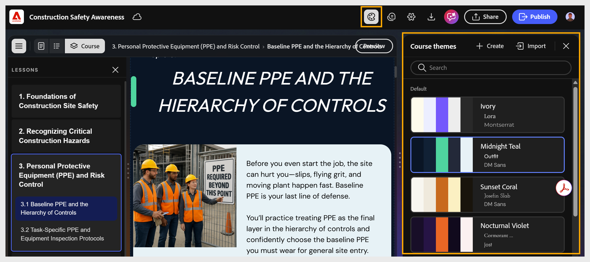

# テーマの適用

コーステーマは、コース全体のフォント、カラー、ヘッダー、フッター、およびコンポーネントのスタイル設定を制御します。

カスタマイズせずにコースにテーマを適用して、すばやく洗練された一貫した外観にします。

1. ツールバーから&#x200B;**テーマ**&#x200B;を選択します。 **コーステーマ**パネルが開き、使用可能なすべてのテーマが表示されます。
   

2. 利用可能なテーマを参照します。

   1. **既定：**&#x200B;には、コンテンツコンポーザーに付属の組み込みテーマが表示されます。

   2. **カスタム：**&#x200B;には、作成して保存したテーマが表示されます。

   3. **検索**&#x200B;バーを使用して、テーマを名前で検索します。

3. テーマを選択して適用します。 コースのプレビューが自動的に更新されます。
