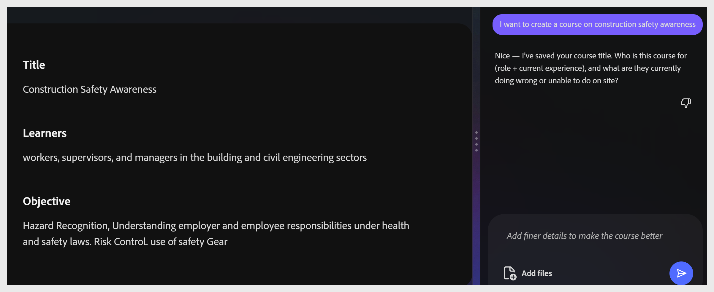

# コースの概要を完了する

**概要**&#x200B;ステージには3つのフィールドがあります： **タイトル**、**学習者**、および&#x200B;**目的**。 アシスタントは、これらの情報を会話に入力し、値の候補を表示し、代替案を提示して、各フィールドで確認を求めます。 3つのフィールドすべてにコンテンツが含まれていないと、**[アウトラインの生成]**&#x200B;ボタンはアクティブになりません。

## コースタイトルの設定

アシスタントは、プロンプトに基づいて2つのタイトルオプションを提示します。 目的のオプションを選択するか、チャットの入力に独自のオプションを入力します。 カンバスがすぐに更新されます。

### 学習者の定義

アシスタントは、学習者が誰であるか（役割、経験レベル、現在の対応内容）を尋ねます。 チャットに回答を入力するか、提案されたオプションを選択します。

**ヒント:**&#x200B;学習者が既に知っている知識と知らない知識の両方を挙げてください。 これにより、生成されたコース全体で語彙とシナリオの選択肢が形成されます。

## 目的を書き込む

アシスタントは、コースの完了後にジョブで学習者が実行できる操作について尋ねます。 動作の動詞から始まる動作として、目的を記述します。

**目標の例：**

ハザード認識、健康と安全に関する法律に基づく雇用主と従業員の責任の理解 リスク管理： 安全装置の使用。

目標を受け入れると、**アウトラインを生成**&#x200B;が青色に変わり、アクティブになります。

>[!TIP]
>
>目的は、下流のすべてを駆動します。 このパネルでは、ソースファイルのどの部分をAIが使用するか、アウトラインをどのように構成するか、クイズのテストの内容を制御します。
