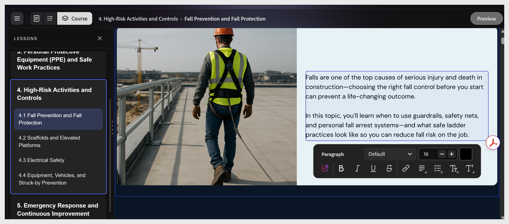

# コーステキストの編集

任意のテキストエレメントを選択して、カーソルをテキストエレメント内に配置します。 カンバスの下部に、太字、斜体、下線、取り消し線、リンク、アラインメント、リストコントロールと共に書式ツールバーが表示されます。

>[!NOTE]
>
>トピック名とレッスン名は、アウトライン構造の一部です。 コースの生成後に名前を変更するには、アシスタントに「Lesson 2を「Password Hygiene」に名前を変更します」と依頼します。 コースエディターで見出しを選択して、これらの名前を変更することはできません。

