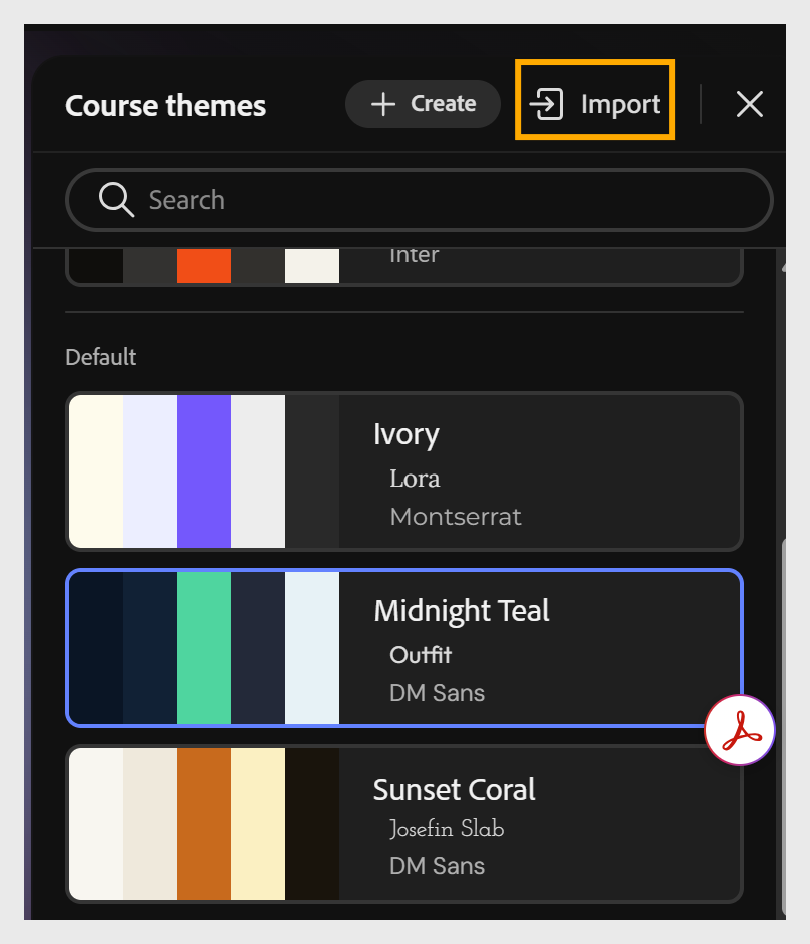

# テーマを読み込む

カスタマイズしたJSON ファイルを読み込み、コンテンツコンポーザーの新しいテーマとして変更内容を適用します。

1. ツールバーから&#x200B;**テーマ**&#x200B;を選択します。

2. 「**コーステーマ**」オプションから「**読み込み**」を選択します。
   

3. カスタマイズしたJSON ファイルをコンピューターから選択します。

4. **新規として保存**&#x200B;を選択して、新しいカスタムテーマを作成します。

## テーマJSON構造の概要

テーマJSON ファイルには、次の5つの主な領域があります。

| セクション | コントロール |
|----------------------------------------------------------------------|-----------------------------------------------------------------------------------------------------------------------------------------------------------------------------------------------------------------------------------------------------------------------------------------|
| メタデータ（ID、名前、バージョン、説明、作成者、ソース、isDefault） | テーマIDと表示情報 |
| foundation.palette | テーマ全体でvar(—tokenName)を介して参照される7つのコアカラートークン（前景、背景、アクセント、背景Subtle、セカンダリ、textPrimary、textInverse） |
| foundation.fonts | 見出しと本文のフォントスタック |
| foundation.間隔とfoundation.radius | 水平/垂直間隔スケールと角丸の半径トークン |
| エレメント | すべてのテキストロール(lessonTitle、topicTitle、blockHeading、subheading、question、caption、paragraph、buttonLabel)およびすべてのコンポーネント(paragraphBlock、imageBlock、videoBlock、imageGrid、accordion、carousel、flipCard、tabs、timeline、assessment)のタイポグラフィと構造スタイル |

ほとんどの値はvar(—tokenName)を使用するパレットトークンを参照するため、アクセントなどの1つのトークンを更新すると、そのトークンを参照するすべての要素に対して変更が自動的にカスケードされます。 個々のカラー値を検索する必要はありません。

