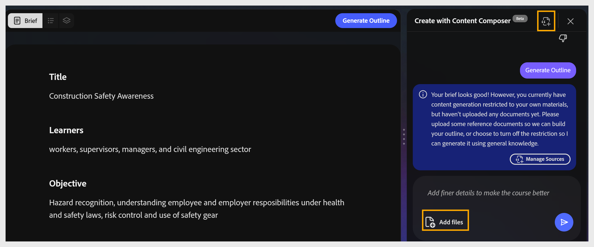

# ソースファイルの管理

**ソースの管理**&#x200B;を使用すると、Content Composerがコースを生成するために使用するコンテンツを制御できます。 独自の文書をコースに追加し、AIをそのコンテンツのみに制限するか、独自の知識でマテリアルを補足するかを選択できます。 ドキュメントを追加しない場合、コンテンツコンポーザーはAIモデルの既存の知識を使用してコースを生成します。

## ソースマテリアルを使用したコースの作成

1. チャットパネルまたはツールバーで、**ソースの管理**&#x200B;または&#x200B;**ファイルの追加**&#x200B;を選択します。
   

2. ファイルをダイアログにドラッグするか、**+ソースファイルの追加**&#x200B;を選択して参照します。 複数のソースファイルを追加できます。
   

3. **[ファイル内のコンテンツへの出力を制限する]**&#x200B;を選択します。 これにより、コンテンツコンポーザーはソースコンテンツのみを使用してコースを生成できます。 このオプションがオフの場合、Content ComposerはWebを使用してコースを作成します。
   

サポートされる形式：

| **形式** | **最大サイズ** |
|-------------------------|--------------|
| PDF | 100 MB |
| マークダウン(.md) | 100 MB |
| PowerPoint (.ppt/.pptx) | 100 MB |
| MS Word (.doc/.docx) | 100 MB |
| テキストファイル(.txt) | 100 MB |

「**続行**」を選択して、コースのアウトラインを生成します。

### ソースマテリアルなしで生成

ソースファイルを参照文書として持っていない場合は、次の手順を実行してコースのアウトラインを生成します。

1. **[ソースの管理]**&#x200B;を選択します。 **ソースの管理**&#x200B;ダイアログが開きます。

2. AIが一般的な知識を基にコンテンツを生成できるようにするには、**「ソースマテリアルがありません – ソースファイルを使用せずにコースを生成します**」を選択します。 このオプションが選択されていない状態でファイルがアップロードされると、AIは生成されるコンテンツをアップロードされたドキュメントのみに制限します。

3. 「**続行**」を選択して、コースのアウトラインを生成します。

### ソースマテリアルが変更されたときにコースを更新

コースが既に生成された後、ポリシーの改訂、SOPの新しいバージョンの取得、ピッチデックの更新など、ソースドキュメントが古くなることがあります。 このワークフローを使用して、コースを現在のマテリアルに戻します。

1. チャットパネルまたはツールバーから&#x200B;**ソースの管理**&#x200B;を選択して、ダイアログをもう一度開きます。

2. **+ソースファイルの追加**&#x200B;を使用して、新しいファイルまたは改訂されたファイルを追加します。

3. 古いバージョンのファイルを削除または置換して、ソースリストに現在のマテリアルのみが反映されるようにします。

4. 「続行」を選択して、更新されたソースリストを保存します。

5. 影響を受けるレッスンをコンテンツコンポーザーで再生成し、変更を確認してからコースを再パブリッシュします。 再公開により、アップデートが新しいモジュールバージョンとしてAdobe Learning Managerに送信されます。「 ALMのモジュールバージョン管理」を参照してください。

### ファイルのアップロードを確認

ファイルが添付されると、ツールバーのファイルアイコンにバッジ数が表示されます。 アシスタントがアップロードを確認し、**アウトラインの生成** ショートカットを提供します。 選択するか、上部のツールバーの&#x200B;**[アウトラインの生成]**&#x200B;を選択します。
