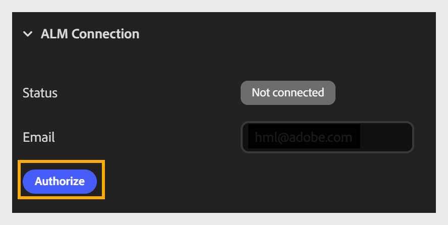
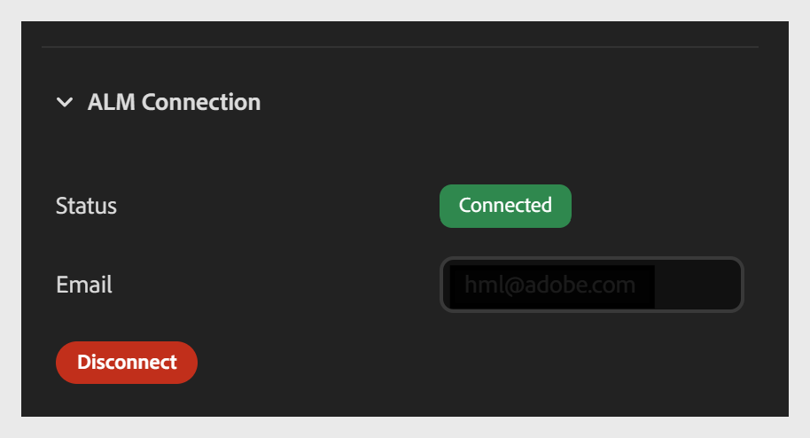

# コンテンツコンポーザーからAdobe Learning ManagerへのコースのPublish

「**書き出し**」タブを使用すると、コースをAdobe Learning Manager(ALM)に接続し、ALMコンテンツライブラリに直接公開できます。 接続を設定するには、**電子メール**&#x200B;フィールドに電子メールを入力します。 同じメールログインIDを持つALMアカウントを使用していることを確認してください。 接続すると、コースをモジュールとしてALMにパブリッシュできます。

この接続は、コースごとに1回限りの設定です。 一度確立すると、公開や書き出しを行うたびに再接続する必要はありません。

2つのセクションがあります。

- ALM接続セクション

- ALMパブリッシングセクション

**書き出し設定を構成するには**

1. **コース設定**&#x200B;を開き、左側の「**書き出し**」タブを選択します。

2. **ALM接続**&#x200B;セクションを展開します（まだ展開されていない場合）。

   - Adobe Learning Managerアカウントに関連付けられている&#x200B;**メールアドレス**&#x200B;を入力してください。

   - 「**許可**」を選択してログインし、コースをALMアカウントに接続します。
     

   - 承認されたら、**切断**&#x200B;から&#x200B;**接続済み**&#x200B;までの&#x200B;**ステータス**フィールドの更新を確認します。
     

## Adobe Learning Manager公開の詳細

アカウントを接続したら、 ALM公開セクションで公開の詳細を設定します。

- コースを識別するための&#x200B;**プロジェクト**&#x200B;名を入力してください。 この名前は、ALMコンテンツライブラリにコースタイトルとして表示されます。

- **説明**&#x200B;を入力します。ALMコンテンツライブラリにコースの簡単な概要が表示され、学習者や管理者がコースの目的を理解するのに役立ちます。

- **Publish**&#x200B;を選択して、コースをモジュールとしてALMコンテンツライブラリに送信します。