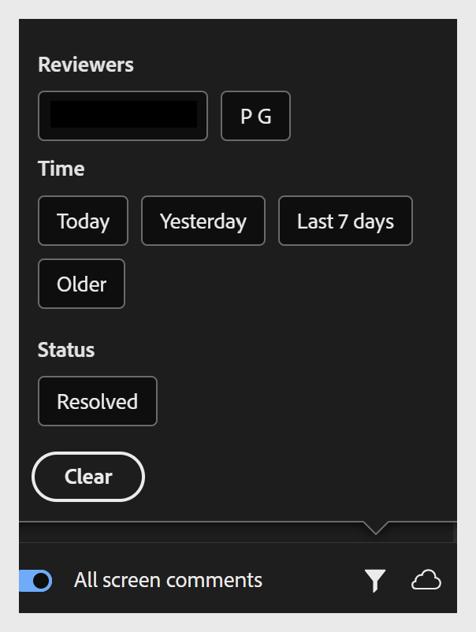

# 共有プロジェクトのレビューとコメント

プロジェクトがレビュー用に共有されている場合は、作成者が共有しているリンクを介してレビュー担当者としてコースにアクセスします。

1. 共有されたレビューリンクを開きます。

2. 右側の&#x200B;**コメント**&#x200B;パネルで、変更が必要なコースコンポーネントを選択します。 コンポーネントの名前はコメントフィールドの上部に表示されるため、フィードバックはコースの右側にリンクされたままになります。 その下にコメントを追加してください。

   

   **コメント**&#x200B;パネルでは、次の操作を実行できます。
   * コメントを追加、編集、削除、返信、解決する。
   * 他のレビュー担当者からのコメントを表示します。
   * **@**&#x200B;を使用すると、プロジェクトのオーナーまたは別のレビュー担当者にメンションできます（Adobe IDでログインした場合のみ）。
   * コメントに絵文字を追加します。
   * コースに関するすべてのコメントの表示：デフォルトでは、コメントパネルには、現在表示しているコースコンポーネントに関するコメントのみが表示されます。 「すべてのコメント」トグルをオンにすると、オンになっているコンポーネントや画面に関係なく、プロジェクト全体のすべてのコメントが表示されます。

   

   * **レビュー担当者**&#x200B;別、**時間別**&#x200B;別、**解決済み**&#x200B;状態別にコメントをフィルター処理します。

   

3. **送信**&#x200B;を選択してコメントを投稿するか、**キャンセル**&#x200B;してコメントを破棄してください。

## 不快なコンテンツを報告

共有コンテンツコンポーザーのコースのレビュー中に、Adobeの[利用条件](https://www.adobe.com/legal/terms.html)に違反するコンテンツが発生した場合は、報告することができます。

右上から&#x200B;**レポート**&#x200B;を選択し、フォームに入力します。 または、[abuse@adobe.com](mailto:abuse@adobe.com)宛てにメールで不正を報告することもできます。 

