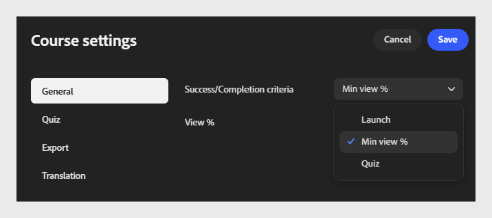
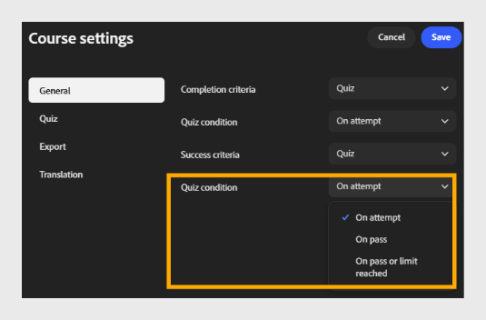

# 完了条件と成功条件の設定

## 完了条件

**完了条件**:ドロップダウンを選択し、コースをいつ完了とマークするかを選択します。

- **起動：**は、学習者がコースを開くとすぐに、どの程度表示したかに関係なく、コースを完了したとマークします。
  

- 学習者がコースコンテンツの指定した割合を表示すると、**最小表示%:**はコースを完了したとマークします。
  

- **クイズ：学習者のクイズアクティビティに基づいて、コースを完了とマークします。 クイズ条件を選択：**

  - **試行時：**&#x200B;結果に関係なく、学習者がクイズに挑戦するとすぐに完了したとマークします。

  - **合格時：**&#x200B;学習者がクイズに合格した場合にのみ完了とマークされます。

  - **合格または上限に達しました：**学習者が合格、または許可されている最大試行回数に達したときに、どちらか早い方が完了したとマークします。
    

## 合格条件

**合格条件**&#x200B;は、コースの受講後に、学習者が合格または不合格とマークされているかどうかを決定します。 完了基準とは異なり、成功基準はスコアベースである。

>[!NOTE]
>
>使用できるオプションは、**書き出し設定**&#x200B;で選択したSCORMバージョンによって異なります。 **SCORM 1.2**&#x200B;を選択すると、完了条件と合格条件が1つの設定にまとめられます。 **SCORM 2004**&#x200B;を選択した場合、完了条件と成功条件は、以下に説明するように個別の設定として表示されます。*

- **成功基準**:ドロップダウンを選択し、コースの成功基準を選択します。

- **起動：**は、コースを起動するだけで合格した学習者にマークを付けます。
  

- **最小表示%**：指定した割合のコンテンツを表示した学習者に、合格のマークを付けます。 例えば、学習者にコースの80%以上を表示させるには、「80」と入力します。
  

- **クイズ：**&#x200B;自分のクイズスコアが合格スコアのしきい値と一致したかどうかに基づいて、学習者に合格または不合格のマークを付けます。 クイズ条件を選択します。

  - **試行時：学習者がクイズに挑戦するとすぐに、成功とマークします。**

  - **合格：学習者がクイズに合格した場合にのみ合格とマークします。**

  - **合格または上限に達した場合：学習者が最大試行回数を超えたか、上限に達した場合に成功とマークします。**

  

>[!NOTE]
>
>学習者はコースを完了しても不合格になる場合があります。例えば、クイズのスコアが十分でない学習者がすべてのコンテンツを完了した場合などです。 完了条件と合格条件は独立しており、学習者の進行状況とパフォーマンスの追跡方法に基づいて、両方を慎重に設定します。 いずれかの条件でクイズを選択した場合は、「**クイズ設定**」タブでクイズの再試行と合格のスコアを設定します。

## 完了と成功の基準がレポートに重要な理由

- 完了条件は、ALMトランスクリプト、完了ダッシュボード、およびLMSから取得されたコンプライアンスまたは監査の書き出しで、学習者のステータスが完了済みに変わるタイミングを制御します。完了条件では、パフォーマンスではなく進行状況が測定されます。

- 合格条件は、完了ステータスとともに記録される合格/不合格の値を制御します。これは、ほとんどのコンプライアンスおよび認定レポートで信頼される値です。

- 完了および合格条件が同じモジュールの&#x200B;**Adobe Learning Manager**&#x200B;コンテンツライブラリでも設定されている場合、これらの設定はコンテンツコンポーザーで設定されている設定よりも優先されます。 どの製品がこれらのルールを所有するかを早期に決定し、両方の場所で競合する値を設定しないようにしてください。

- 検証する必要があるものに基準を一致させます。ローンチまたは最小ビュー%は認識コンテンツに十分ですが、クイズベースの基準を使用すると、コースを開いただけでなく、学習者が知識を実証した防御可能なレコードを取得できます。
