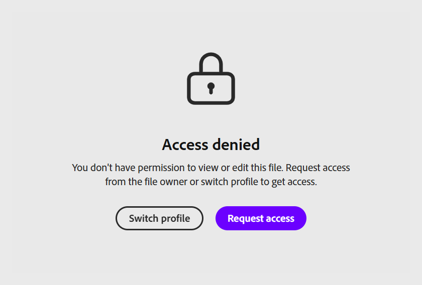

# プロジェクトをレビュー用に共有

Content Composerを使用すると、レビュー担当者や学習者がアプリケーションをインストールする必要なしにプロジェクトを共有できます。これにより、すばやく構造化された方法でフィードバックを収集し、公開前に承認を得ることができます。

作成者は、名前または電子メールでレビュー担当者を招待したり、アクセス権を持つユーザーを正確に制御したり、そのアクセス権をいつでも取り消したりすることができます。 レビュー担当者は共有リンクを開き、任意のコースコンポーネントに直接コメントを追加し、記録されたスコアに影響を与えずに最終クイズに挑戦することができます。これにより、学習者のエクスペリエンス全体をプレビューすることができます。

コメントは整理された実用的な状態を保つことができます。レビュー担当者と所有者は、外部でレビューするかプロジェクト内で作業するかを問わず、同じパネルからコメントで互いに返信し、解決し、フィルターし、言及することができます。 フィードバックに対処し、プロジェクトを更新したら、

プロジェクトをレビュー用に共有するには：

1. **レビュー用**&#x200B;を選択します。

   

2. **ユーザーを招待**&#x200B;フィールドにレビュー担当者の名前または電子メールアドレスを入力します。

   
3. 招待されたユーザーのみがプロジェクトにアクセスできることを確認するために、アクセス権を持つユーザーをレビューします。

4. **注釈作成者として招待**&#x200B;を選択して、名前または電子メールでレビュー担当者を追加します。 レビュー担当者は、必要な数だけ追加できます。 または、「**リンクをコピー**」を選択してレビューURLをコピーすると、既にアクセス権を持っているレビュー担当者と直接共有できます。 これらは、プロジェクトを共有する2つの個別の方法です。

   

## レビュー担当者のアクセス権の削除

プロジェクトにアクセスできるユーザーのリストからレビュー担当者を削除できます。 レビュー担当者が以前に共有したリンクを使用してプロジェクトを再度開こうとした場合。

選択したコメントを削除するオプションがあります。 ドキュメントにアクセスできるユーザーのリストからコメント作成者が削除されたとき。

アクセス権を削除するには：

* レビュー担当者の名前を選択し、表示されたオプションから「削除」を選択します。

* レビュー担当者が以前に共有されたリンクを使用して文書にアクセスしようとした場合。 「アクセスが拒否されました」というメッセージが表示されます。

  

## アクセスを要求

アクセス権がなくなった共有プロジェクトを開く場合は、アクセス権をリクエストしてからでないと、表示できません。 これは、例えば、所有者があなたを削除した場合、または別のAdobe IDでリンクを開いている場合に発生する可能性があります。 いずれの場合も、「アクセスが拒否されました」という画面が表示されます。

* 「**アクセス権をリクエスト**」を選択して、プロジェクトのレビューとコメントの追加を行うための権限を所有者に依頼します。

  

* プロジェクト所有者は、アクセスを要求しているレビュー担当者の名前の通知を受信します。