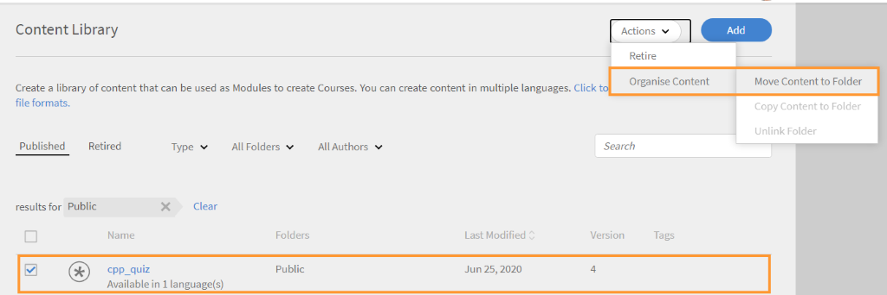

# コンテンツライブラリ

ここでは、コンテンツを作成して、セルフペースコンテンツとしてコースに組み込む方法について説明します。

## コンテンツライブラリ {#contentlibrary}

コンテンツは、コースの構成要素です。 作成者は、コンテンツのライブラリを作成し、セルフペースコンテンツとしてコースに組み込むことができます。 作成者のみがこのコンテンツライブラリにアクセスできます。

## サポートされるコンテンツタイプ {#supported}

ライブラリには、インタラクティブなコンテンツと静的なコンテンツの両方をアップロードできます。

次の表に、ライブラリにアップロードできるインタラクティブおよび静的なファイルタイプを示します。

<table>
 <tbody>
  <tr>
   <td>
    
<b>インタラクティブなコンテンツ</b>
</td>
   <td>
    
<b>コンテンツタイプ</b>
</td>
   <td>
    
<b>拡張機能</b>
</td>
  </tr>
  <tr>
   <td>
    
 
</td>
   <td>
    

    <ul>
     <li>SCORM 1.2</li>
     <li>SCORM 2004</li>
     <li>AICC</li>
     <li>TinCan</li>
    </ul>
    

</td>
   <td>
    
zip
</td>
  </tr>
  <tr>
   <td>
    
<b>静的コンテンツ</b>
</td>
   <td>
    
<b>コンテンツタイプ</b>
</td>
   <td>
    
<b>拡張機能</b>
</td>
  </tr>
  <tr>
   <td>
    
 
</td>
   <td>
    
ビデオ
</td>
   <td>
    
mp4, wmv, 3gp, 3g2, 3gp2, asf, avi, f4v h264, mpe, mpeg, mpg, mpg2, m4v, mov, wmv
</td>
  </tr>
  <tr>
   <td>
    
 
</td>
   <td>
    
音声
</td>
   <td>
    
mp3、wav、aac、m4a、wma、vorbis、pcm、eac3、amr、ac3
</td>
  </tr>
  <tr>
   <td>
    
 
</td>
   <td>
    
PDF
</td>
   <td>
    
pdf
</td>
  </tr>
  <tr>
   <td>
    
 
</td>
   <td>
    
MS PowerPoint
</td>
   <td>
    
pptx、ppt
</td>
  </tr>
  <tr>
   <td>
    
 
</td>
   <td>
    
MS Word
</td>
   <td>
    
docx、doc
</td>
  </tr>
  <tr>
   <td>
    
 
</td>
   <td>
    
Excel形式
</td>
   <td>
    
xlsx, xls
</td>
  </tr>
 </tbody>
</table>

## ライブラリに新しいコンテンツを追加する {#addnewcontentinthelibrary}

前のセクションで説明したように、ライブラリにはインタラクティブコンテンツと静的コンテンツの両方を追加できます。

## 静的コンテンツの追加 {#addstaticcontent}

1. 作成者としてログインし、左ペインでコンテンツライブラリをクリックして、「追加」をクリックします。

   または、「はじめに」ページから「コンテンツを作成」をクリックします。

1. 「名前」フィールドに、アップロードするコンテンツの名前を指定します。
1. 「説明」フィールドに、コンテンツの説明を入力します。 入力する説明が有効であることを確認してください。 文字数の上限は400文字です。
1. コンテンツを追加するには、「コンテンツファイルを追加」をクリックし、リソースファイルをアップロードします。 複数の言語のコンテンツを追加する場合、静的なコンテンツとインタラクティブなコンテンツを1つのグループに組み合わせることはできません。 すべてのロケールのすべてのコンテンツが静的であるか、すべてのコンテンツがインタラクティブである必要があります。

   コンテンツを置換する場合は、静的コンテンツを別の静的コンテンツに置換できます。 インタラクティブコンテンツでも同様です。

1. 「期間」フィールドには、学習者がこのモジュールで費やす予想時間をオプションで入力できます。 時間は分単位で指定します。

   学習者がコースを完了とマークした場合、学習者が費やした学習時間は指定した期間に基づいて計算されます。 学習者がプレーヤーのコンテンツを消費すると、プレーヤーで費やした時間が学習時間に追加されます。 実際のコンテンツ時間が指定された時間より短い場合は、プレイヤーは常にコンテンツ時間を尊重して表示するので、何も起こりません。

1. アップロードしたコンテンツのタグを「コンテンツタグ」フィールドに入力し、コンテンツを見つけやすくします。

   作成者は、これらのタグを使用して、コンテンツをコースに追加する際に、コンテンツを検索できます。

### バージョン管理 {#versioning}

コンテンツライブラリでは、アップロードされたコンテンツのバージョン管理も行われます。 PowerPointプレゼンテーションなどのコンテンツに変更を加えた場合に、ライブラリにPPTを再度アップロードすると、バージョン番号が1つずつ増加します。 これにより、コンテンツの変更を追跡できます。

## インタラクティブコンテンツの追加 {#addinteractivecontent}

1. 作成者としてログインし、左ペインでコンテンツライブラリをクリックして、「追加」をクリックします。

   または、「はじめに」ページから「コンテンツを作成」をクリックします。

1. 「名前」フィールドに、アップロードするコンテンツの名前を指定します。
1. 「説明」フィールドに、コンテンツの説明を入力します。 入力する説明が有効であることを確認してください。 文字数の上限は245文字です。
1. コンテンツを追加するには、「コンテンツファイルを追加」をクリックし、リソースファイルをアップロードします。 複数の言語のコンテンツを追加する場合、静的なコンテンツとインタラクティブなコンテンツを1つのグループに組み合わせることはできません。 すべてのロケールのすべてのコンテンツが静的であるか、すべてのコンテンツがインタラクティブである必要があります。

* [サポートされているファイル形式](content-library.md#supported)*

  インタラクティブコンテンツは、SCORM、AICC、またはCaptivateによって公開されたプロジェクトです。 ファイルはzipファイルである必要があります。

  Captivate、Presenter、またはPresenter Video Expressから生成されたHTMLコンテンツを追加することもできます。

[サポートされているファイル形式](content-library.md#supported)

1. Learning Managerでは、Learning Managerにアップロードされたビデオコンテンツのキャプションがサポートされます。 作成者は、ビデオファイルと一緒に、キャプションを含むファイルをアップロードできます。

   これにより、学習者はビデオモジュールの再生中にキャプションを表示できます。

   サポートされている形式は次のとおりです。  [Webビデオテキストトラック(webVTT)](https://www.w3.org/TR/webvtt1/).

   キャプションは、Learning Managerのコンテンツライブラリにアップロードされたビデオコンテンツでサポートされています。

   作成者は、ビデオまたはオーディオコンテンツをアップロードする際に、キャプションが含まれている.vttファイルをアップロードすることもできます。

   字幕がFluidicプレーヤーに表示されます。 キャプションも次に準拠しています [WCAG2.0標準](https://www.w3.org/TR/WCAG20/).

   ビデオコンテンツをライブラリに追加する際には、vttファイルを追加することもできます。この場合、以下の処理が行われます。 **が** 有効なファイルを指定してください。

   

   *Webvttファイルの追加*

   アップロードされたVTTファイルは、コンテンツの既存のバージョンに対応しています。 そのため、アップロードされたwebVTTファイルはコンテンツの古いバージョンにリンクされません。

   異なる言語でコンテンツを作成する場合は、言語ごとに異なるwebVTTファイルをアップロードできます。 学習者は、再生中に選択された言語に対応するキャプションを表示できます。

   >[!NOTE]
   >
   >   1つのVTTファイルが1つの言語をサポートします。 複数の言語をサポートするには、各コンテンツ言語に対して複数のビデオファイルをアップロードしてから、各ビデオファイルに対してそれぞれのVTTファイルをアップロードします。

   作成者は、コンテンツ、ビデオ、オーディオを変更するたびに、Learning Managerから新しいvttファイルを要求されます。

   このコンテンツをコースに追加した後、学習者としてコースをプレビューすると、ビデオのキャプションが表示されます。

   プレーヤーで、Fluidicプレーヤーの「CC」ボタンを切り替えて、キャプションを表示または非表示にします。

   同じビューは、 **学習者アプリ** ～と同様に **学習者としてプレビュー**.

   次の場合 **追加、更新、または削除** vttファイルを開くと、通知が届きます。
WebVTTサポートは以下に対して利用できません。

   1. ビデオアナウンス。
   1. 学習コンテンツ内で再生されたビデオ。 これはコンテンツによって決定されます。
   1. ソーシャル学習にアップロードされたビデオ
   1. Learning Managerデスクトップアプリで作成されたビデオ。
   1. 移行プロセスを使用して作成されたビデオコンテンツ。
   1. オフラインモードでのモバイルアプリでのビデオ再生。

1. 「期間」フィールドには、学習者がこのモジュールで費やす予想時間をオプションで入力できます。 時間は分単位で指定します。
1. アップロードしたコンテンツのタグを「コンテンツタグ」フィールドに入力し、コンテンツを見つけやすくします。

### 共有カタログのサポート

販売者アカウントがコースを含むカタログを共有し、コースに字幕のあるモジュール、オーディオ、ビデオが含まれている場合、コースは購入者アカウントでも同じように動作する必要があります。

モジュールの伝達は、販売者から購入者のアカウントに対して正しく機能します。 これには、モジュール内のvttファイルの編集/削除/追加が含まれる可能性があります。

コンテンツをアップロードすると、ページの右上隅にあるベルアイコンをクリックして通知を表示できます。 コンテンツを変更して再アップロードするたびに、通知が届きます。 変更を加えた場合、通知は自分だけに送信され、他の作成者には送信されません。

## クイズの作成

コンテンツライブラリページの新しいクイズ作成ツールを使用して、AdobeのLearning Manager内で評価を作成します。 作成された評価はコンテンツライブラリの一部となり、コースを再利用できるように「パブリック」フォルダーに追加できます。

1. 左側のパネルで「コンテンツライブラリ」を選択します。
1. 画面の右上隅で、 **追加/クイズ**.
1. 「クイズを作成」ページで、クイズの名前と説明を入力します。
1. 「クイズコンテンツ」セクションで、次を選択します **クイズ質問を追加**.
1. クイズ質問ダイアログで、質問のタイプを選択します。 次の3種類の質問があります。
   * 多肢選択問題
   * Trueまたはfalse
   * 空欄を埋める
1. 質問を入力し、正解を選択します。
1. クイズのポイントを設定します。
1. 質問に対して正しい回答を得てクイズに合格できるようにする場合は、チェックボックスをオンにします **無理やり正しく答えてクイズに合格させる**.
1. 選択 **保存して閉じる**.
1. クイズに合格するためのポイントを **合格条件** フィールドに入力します。
1. 学習者が正しい回答を表示できるようにするには、トグルを有効にします **正解を表示** クイズの後に学習者に送信します。
1. 質問と回答をランダムに表示する場合は、トグルを有効にします。
   * 質問の順序をランダム化
   * 解答オプションの順序をランダム化
1. フォルダーを指定してクイズを追加し、すべての作成者がクイズを使用できるようにします。
1. を **表示時間** フィールドに、学習者がクイズに費やす必要がある時間を指定します。
1. 作成済みのタグのリストからタグを指定します。
1. クイズにロゴと背景を追加します。
1. ページの右上隅で、 **公開**.

クイズがコンテンツライブラリに追加されます。 コンテンツライブラリのコンテンツと同様に、クイズは廃止してから削除できます。

## フォルダーに追加 {#add-folder}

管理者がコンテンツフォルダーを作成したら、作成者はコンテンツフォルダーにコンテンツをアップロードできます。アップロードされたコンテンツは、自分またはアカウント内の選択した作成者グループにのみ表示されます。 また、コンテンツを公開し、アカウント内のすべての作成者がコンテンツを見るようにすることもできます。

**使用例**

例えば、エージェンシーがコンテンツを完全に制御し続けたい場合、コンテンツを見逃すユーザーがすべてのコンテンツにアクセスできる必要があります。 また、エージェンシーのコンテンツ作成者は、自分のコンテンツにのみアクセスでき、場合によっては他のユーザーのコンテンツにもアクセスできる必要があります。

既存のコンテンツ（コンテンツフォルダーを設定する前にアップロードされたコンテンツ）を含むコンテンツライブラリは、次のように定義されます。 **パブリックフォルダー**. このフォルダーは削除または削除できません。 パブリックフォルダーに含まれるコンテンツには、あらゆる種類の作成者がアクセスできます。 コンテンツフォルダーを設定したら、標準の作成者とカスタム作成者が、新しいコンテンツをアップロードする際に、コンテンツを配置するフォルダーを選択します。

>[!NOTE]
>
>パブリックフォルダーとプライベートフォルダーを同時に使用することはできません。 これは、コンテンツを意味します **できない** パブリックフォルダーとプライベートフォルダーに同時に関連付ける。 パブリックフォルダーに関連付けることもできます。 **または** 任意の時点で1つまたは複数のプライベートフォルダに関連付けることができます。

コンテンツを追加するときに、コンテンツを保存するフォルダーを選択できます。

*フォルダーにコンテンツを追加*

以下を選択した場合 **公開**&#x200B;をクリックすると、すべての作成者にコンテンツが表示されます。 デフォルトでは、フォルダーに含まれないアカウントに存在するすべてのコンテンツは、パブリックフォルダーに格納されます。

コンテンツフォルダーは、コンテンツをリンクするための仮想コンパートメントです。 1つのコンテンツが2つのフォルダーに配置されている場合、コンテンツファイルは常に1つの単一ファイルですが、複数のフォルダーにリンクされています。 したがって、コンテンツがcustom-author-1によってcustom-folder-1へのアクセス権を持つ場合、更新された同じコンテンツは、custom-author-2によってアクセスされるcustom-folder-2にも反映されます。

コンテンツライブラリには、コンテンツフォルダを管理するための次の2つのオプションがあります。

**すべてのフォルダー**

これは、アカウントで作成されたすべてのフォルダーを表示するリストです。

*すべてのフォルダーを表示*

**すべての作成者**

このリストには、コンテンツを作成してライブラリにアップロードした作成者が表示されます。

*すべての作成者を表示*

これは使用可能です **のみ** 管理者が新規フォルダーを作成する場合。

## コンテンツをフォルダーに移動 {#movecontenttofolder}

パブリックフォルダのコンテンツを任意のプライベートフォルダに移動するには

1. 選択 **公開** フォルダーを **すべてのフォルダー** ドロップダウンリスト。

   

   *アップロードされたすべてのコンテンツを表示*

1. フォルダーに移動するコンテンツを選択します。 次に、 **[!UICONTROL アクション]** > **[!UICONTROL コンテンツを整理]** > **[!UICONTROL コンテンツをフォルダーに移動]**.

   

   *選択したコンテンツをフォルダーに移動*

1. コンテンツの移動先のフォルダーを選択します。 クリック **[!UICONTROL 移動]**.

## コンテンツをフォルダーにコピー {#copycontenttofolder}

フォルダーをコピーすると、そのフォルダーにタグが追加されます。 コピー操作では、コンテンツのコピーは作成されず、指定したフォルダーとの関連付けが追加されるだけです。

*フォルダーをコピー*

## フォルダーのリンクを解除 {#unlinkfolder}

リンク解除とは、選択したフォルダーからコンテンツを削除することを意味します。

コンテンツは、指定したフォルダーからリンク解除できます **のみ** 他のフォルダーにも関連付けられている場合。 リンク解除されるコンテンツが1つのフォルダにのみ関連付けられている場合は、代わりにMOVE操作を使用することをお勧めします。

>[!NOTE]
>
>「アクション」の「整理」メニューは、最初は無効になっています。 これを使用するには、まずフォルダドロップダウンリストでフォルダーを選択する必要があります。

*フォルダーのリンクの解除*

## 様々な言語のコンテンツを追加 {#addcontentfordifferentlanguages}

1. 別の言語のコンテンツを追加するには、 **新しい言語を追加** タブをクリックして、必要な言語を選択します。 この方法を使用すると、コンテンツに多言語サポートを追加できます。

   

   *コンテンツの新しい言語の追加*

1. 新しい言語に対してコンテンツのアップロードプロセスを繰り返します。
1. 言語を削除する場合は、[新しい言語の追加]タブをクリックして選択を解除します。

   変更したら、「保存」をクリックします。 ライブラリで、新しいコンテンツを利用できるようになりました。

## 完了条件の設定 {#setcompletioncriteria}

<table>
 <tbody>
  <tr>
   <td>
    
<b>静的コンテンツ</b>
</td>
   <td>
    
<b>インタラクティブなコンテンツ</b>
</td>
  </tr>
  <tr>
   <td>
    
設定できるのは、 <b>完了</b> 次のオプションのコンテンツの条件：

    <ul>
     <li>コンテンツの起動時</li>
     <li>必要最小パーセントに基づく</li>
    </ul></td>
   <td>
    
両方を設定できます <b>完了</b> および <b>成功</b> 次のオプションのコンテンツの条件：

    <ul>
     <li>コンテンツの起動時</li>
     <li>必要最小パーセントに基づく</li>
     <li>クイズに合格または試行したオプション</li>
    </ul>
    
<b>注意：</b> Captivate、Presenter Video Express、またはPresenterのHTMLコンテンツのみ編集できます。
</td>
  </tr>
 </tbody>
</table>

コンテンツを追加した後で、そのコンテンツの完了条件を変更できます。

Learning Managerでは、成功と完了に基づいてバッジとスキルが付与されます。 学習者がコースを完了していても成功しない場合、LOに対応するバッジとスキルが学習者に送信されません。

例えば、Adobe Captivateを使用してコースを作成し、環境設定ダイアログで学習パラメーターを設定した場合、同じ設定がLearning Managerの完了条件オプションに移行されます。

「完了条件」セクションでは、以下のオプションを設定できます。

**コンテンツの起動時：** このオプションを有効にすると、学習者がコンテンツを開いたときに、コンテンツの完了条件を定義できます。

**必要最小パーセントに基づく：** 学習者が消費する最小パーセンテージの値を設定します。 例えば、パーセンテージを50に設定した場合、学習者はコンテンツの50%を消費しても、完了条件を満たすことができます。

**クイズ：** 次のいずれかの条件を選択します。

* **クイズに合格：** 学習者がクイズに合格した場合にのみ、ステータスが「完了」と報告されます。
* **試行したクイズ：** クイズの合格または不合格に関係なく、学習者がクイズを試行すると、ステータスは「完了」と報告されます。
* **クイズに合格または上限に達しました：** 学習者がクイズに合格した場合、または試行をすべて行った場合は、ステータスは「完了」と報告されます。 例えば、コースに設定された試行回数が2回で、次のような場合です。

   * 学習者が最初の試行を受けて合格した場合、ステータスは「完了」および「合格」と報告されます。
   * 学習者が最初の試行を行って失敗した場合は、その試行の上限に達していないため、ステータスは未完了および失敗と報告されます。
   * 学習者がクイズを再度受けて不合格になった場合、ステータスは「完了」および「不合格」と報告されます。
   * 学習者がクイズを再度試み、合格した場合、ステータスは「完了」および「合格」と報告されます。

## 成功基準の設定 {#setsuccesscriteria}

同様に、コースの合格条件を定義できます。 合格条件は、学習者のパフォーマンスが「合格」または「不合格」であることを示します。 Captivateでコースを作成した場合は、次に示すように、環境設定ダイアログでコースの合格条件を設定できます。

例えば、クイズが含まれているモジュールをアップロードしたとします。 これで、そのモジュールの完了条件を「コンテンツの起動時」に設定し、合格条件を「クイズに合格」に設定しました。

学習者がコースを開始し、クイズに失敗した場合、コースは完了とマークされます。ただし、合格条件は、学習者がクイズに合格した場合にのみ満たされます。

## コンテンツフィルターオプション {#contentfilteroptions}

### 日付に従って並べ替え {#sortaccordingtodate}

コンテンツが最後に変更された日時に従ってコンテンツを並べ替えます。 コンテンツは昇順または降順で並べ替えることができます。

*コンテンツを日付順に並べ替え*

### 用途に応じて並べ替え {#sortaccordingtousage}

コンテンツが任意のコースで使用されているかどうかに従ってコンテンツを並べ替えます。 「タイプ」ドロップダウンで、「使用中」または「未使用」を選択します。

*使用状況でコンテンツを並べ替え*

## コンテンツの検索 {#searchforcontent}

コンテンツライブラリでは、コンテンツの名前またはコンテンツに関連付けられたタグを選択して、コンテンツを検索できます。

検索バーでコースまたはタグの名前を入力すると、推奨事項を確認できます。

<!---->

## コンテンツを廃止 {#retirecontent}

コンテンツを公開したら、そのコンテンツを削除することはできません。 まずコンテンツを削除する必要があります。 コンテンツを「撤回済み」としてマークすると、そのコンテンツは学習者に対して表示されなくなります。 コンテンツも「撤回済み」セクションに移動します。 後でコンテンツを公開済みの状態に移動することもできます。

コンテンツを廃止するには、次の手順に従います。

* コンテンツライブラリで、廃止するコンテンツを選択します。
* アクション/廃止を選択します。

学習目標で使用されているコンテンツは影響を受けません。 学習者は引き続きコンテンツにアクセスできます。

## 廃止されたコンテンツの再公開 {#republishretiredcontent}

コンテンツを廃止したら、コンテンツを再公開し、そのコンテンツを「公開済み」リストに表示することができます。 例えば、コンテンツのバージョン1を廃止し、それをバージョン2に置き換える場合、バージョン1.pptxを公開済みリストに移動し、バージョン2.pptxでファイルを更新できます。 新しいファイルは、さまざまなコースで利用できるようになります。

廃止されたコンテンツを再公開するには：

1. 次に移動： **退職** をタップし、再公開するコンテンツを選択します。
1. 選択 **操作** > **再公開**.

これで、コンテンツが公開済みリストに表示されます。

## コンテンツを削除 {#deletecontent}

コンテンツは、削除した後でも削除できます。

* 「撤回」タブに移動し、削除するコンテンツを選択します。
* アクション/削除を選択します。

コンテンツライブラリから削除されたコンテンツを使用する既存のコースでは、引き続きコンテンツが使用されることに注意してください。

## よくある質問 {#frequentlyaskedquestions}

+++ AdobeのLearning ManagerでSCORMコンテンツをアップロードする方法を教えてください。

Adobe Captivateなどの任意のツールでSCORM準拠のeラーニングコースを作成し、コンテンツをzipファイルで公開します。 次に、Learning Managerでzipファイルをカタログにアップロードし、完了条件および成功条件を設定します。
+++

+++同じコンテンツの新しいバージョンをLearning Managerにアップロードするにはどうすればよいですか？

Learning Managerのコンテンツライブラリでは、アップロードしたコンテンツのバージョンも保持されます。 PowerPointプレゼンテーションなどのコンテンツに変更を加えた場合に、ライブラリにプレゼンテーションを再度アップロードすると、バージョン番号が1つずつ増加します。 これにより、コンテンツの変更を追跡できます。 新しいバージョンのコンテンツは、すべての学習目標に同時に適用することも、コースごとに個別に適用することもできます。
+++

+++コースの詳細を別の言語で編集する方法を教えてください。
前のセクションで説明したように、言語（1つまたは複数）を追加した後、各言語タブをクリックし、コース情報を追加または編集します。

&lt;!----->
+++
