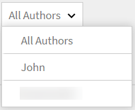
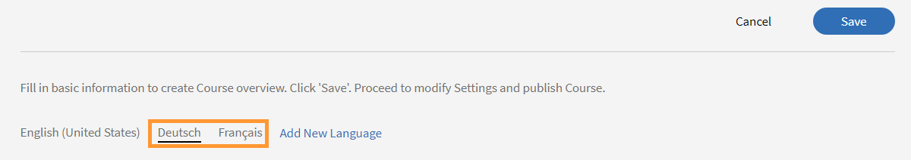

# コンテンツライブラリ

この記事では、作成したコンテンツをセルフペースコンテンツとしてコースに組み込む方法について説明します。

## コンテンツライブラリ {#contentlibrary}

コースは、複数のコンテンツから構成されています。作成者は、コンテンツ用のライブラリを作成し、セルフペースコンテンツとしてコースに組み込むことができます。このコンテンツライブラリにアクセスできるのは作成者のみです。

## サポートされるコンテンツタイプ {#supported}

インタラクティブコンテンツと静的コンテンツの両方をライブラリにアップロードできます。

次の表に、ライブラリにアップロードできるインタラクティブファイルと静的ファイルのタイプを示します。

<table>
 <tbody>
  <tr>
   <td>
    
<b>インタラクティブコンテンツ</b>
</td>
   <td>
    
<b>コンテンツタイプ</b>
</td>
   <td>
    
<b>拡張子</b>
</td>
  </tr>
  <tr>
   <td>
    
 
</td>
   <td>
    

    <ul>
     <li>SCORM 1.2</li>
     <li>SCORM 2004</li>
     <li>AICC</li>
     <li>TinCan</li>
    </ul>
    

</td>
   <td>
    
zip
</td>
  </tr>
  <tr>
   <td>
    
<b>静的コンテンツ</b>
</td>
   <td>
    
<b>コンテンツタイプ</b>
</td>
   <td>
    
<b>拡張子</b>
</td>
  </tr>
  <tr>
   <td>
    
 
</td>
   <td>
    
ビデオ
</td>
   <td>
    
mp4、wmv、3gp、3g2、3gp2、asf、avi、f4v h264、mpe、mpeg、mpg、mpg2、m4v、mov、wmv
</td>
  </tr>
  <tr>
   <td>
    
 
</td>
   <td>
    
音声
</td>
   <td>
    
mp3、wav、aac、m4a、wma、vorbis、pcm、eac3、amr、ac3
</td>
  </tr>
  <tr>
   <td>
    
 
</td>
   <td>
    
PDF
</td>
   <td>
    
pdf
</td>
  </tr>
  <tr>
   <td>
    
 
</td>
   <td>
    
MS PowerPoint
</td>
   <td>
    
pptx、ppt
</td>
  </tr>
  <tr>
   <td>
    
 
</td>
   <td>
    
MS Word
</td>
   <td>
    
docx、doc
</td>
  </tr>
  <tr>
   <td>
    
 
</td>
   <td>
    
MS Excel
</td>
   <td>
    
xlsx、xls
</td>
  </tr>
  <tr>
   <td>
    
 
</td>
   <td>
    
HTML
</td>
   <td>
    
zipファイル
</td>
  </tr>
 </tbody>
</table>

## 新しいコンテンツのライブラリへの追加 {#addnewcontentinthelibrary}

**作成者**&#x200B;はALMでコンテンツを追加できます。 ALMには、**[!UICONTROL コンテンツ]**&#x200B;と&#x200B;**[!UICONTROL クイズ]**&#x200B;の2種類のコンテンツがあります。 コンテンツを追加する方法については、[静的コンテンツの追加](content-library.md#addstaticcontent)および[クイズの作成](content-library.md##createaquiz)を参照してください。

## 静的コンテンツの追加 {#addstaticcontent}

1. **作成者**&#x200B;としてログインし、**[!UICONTROL 追加]**&#x200B;を選択した後、左ペインで&#x200B;**[!UICONTROL コンテンツライブラリ]**&#x200B;を選択します。

   または、[**[!UICONTROL はじめに]**]ページから[**[!UICONTROL コンテンツの作成]**]を選択できます。

1. [**[!UICONTROL 名前]**]フィールドに、アップロードするコンテンツの名前を入力します。
1. [**[!UICONTROL 説明]**]フィールドに、コンテンツの説明を入力します。 役に立つ説明を入力してください。文字制限は 400 文字です。
1. コンテンツを追加するには、[**[!UICONTROL コンテンツファイルの追加]**]を選択し、リソースファイルをアップロードします。 複数の言語でコンテンツを追加する場合、同じコンテンツグループ内で静的コンテンツとインタラクティブコンテンツを組み合わせることはできません。すべてのロケールのすべてのコンテンツが静的コンテンツになっているか、すべてのコンテンツがインタラクティブコンテンツになっている必要があります。

   コンテンツを置き換える場合は、静的コンテンツを別の静的コンテンツと置き換えることができます。インタラクティブコンテンツの場合も同様です。

1. 「**[!UICONTROL 期間]**」フィールドには、学習者がこのモジュールで費やす予想時間をオプションで入力できます。 時間は分単位になります。

   学習者がコースを完了とマークした場合、指定された期間に基づいて学習時間が計算されます。 学習者がプレーヤーのコンテンツを消費すると、プレーヤーの学習時間が学習時間に追加されます。 実際のコンテンツ時間が指定された時間より短い場合、プレーヤーはコンテンツ時間をそのまま表示します。 この場合、変更は行われません。

1. **[!UICONTROL タグ]**&#x200B;フィールドに、アップロードされたコンテンツのタグを入力して、コンテンツを見つけやすくします。

   作成者は、これらのタグを使用して、コンテンツをコースに追加する際に、コンテンツを検索できます。

### コンテンツライブラリにHTML5ファイルタイプを追加する

作成者は、HTML 5コンテンツを.zipファイルとしてセルフペースコンテンツに追加できます。 .zipフォルダーには、`index.html`という名前のHTMLファイルが含まれている必要があります。 複数のHTMLファイルがある場合は、すべてのファイルを`index.html`という名前のメインファイルにリンクする必要があります。 学習者は、FluidicプレーヤーでHTML 5コンテンツを表示できます。 作成者は、このHTML 5コンテンツをコースのセルフペースモジュールに追加し、完了条件を設定できます。 作成者は、次の2つの方法のいずれかでHTMLコースの修了条件を設定できます。

* 学習者は自分で完了とマークできます。
* コースを開始すると、完了とマークされます。

HTMLファイルタイプ(.zip)をコンテンツライブラリに追加するには、次の手順に従います。

1. 作成者アプリで、ホームページの「**[!UICONTROL コンテンツを作成]**」を選択します。
1. **[!UICONTROL コンテンツライブラリ]**&#x200B;画面で、**[!UICONTROL 追加]** > **[!UICONTROL コンテンツ]**&#x200B;を選択します。
1. コンテンツの名前と説明を入力します。
1. 「**[!UICONTROL コンテンツファイルを追加]**」オプションを選択し、フォルダーとして圧縮されているHTMLーファイルを参照して選択します。
1. コンテンツが追加されると、**[!UICONTROL コンテンツライブラリ]**&#x200B;セクションでコンテンツを表示できます。
1. HTMLーのコンテンツを選択して、**[!UICONTROL 編集]**&#x200B;を選択します。
1. **[!UICONTROL 完了条件]**&#x200B;オプションから次のオプションのいずれかを選択します。
   * **[!UICONTROL コンテンツの起動時]**：学習者がコースを起動すると、コースは自動的に完了とマークされます。
   * **[!UICONTROL 学習者が完了をマーク]** ：学習者は、Fluidicプレーヤーでコースを完了としてマークするオプションを使用できます。

   
   _完了条件_

1. 「**[!UICONTROL 保存]**」を選択します。
1. このコンテンツを追加してコースを作成します。  詳細については、[コースの作成、変更、公開](/help/migrated/authors/feature-summary/courses.md)をご覧ください。

学習者アプリで、作成者が選択基準を&#x200B;**[!UICONTROL コンテンツの起動時]**&#x200B;として選択した場合、学習者がコースを起動すると、コースは完了とマークされます。 作成者が&#x200B;**[!UICONTROL 学習者が完了をマーク]**&#x200B;を選択すると、学習者はコースを完了としてマークするオプションを使用できます。

_学習者が完了をマーク_

### バージョン管理 {#versioning}

アップロードしたコンテンツのバージョンはコンテンツライブラリでも保持されます。PowerPoint プレゼンテーションなどのコンテンツを変更し、その PPT をライブラリに再度アップロードすると、バージョン番号が 1 つ大きくなります。これにより、コンテンツの変更内容が追跡しやすくなります。

## インタラクティブコンテンツの追加 {#addinteractivecontent}

1. **作成者**&#x200B;としてログインし、**[!UICONTROL 追加]**&#x200B;を選択した後、左ペインで&#x200B;**[!UICONTROL コンテンツライブラリ]**&#x200B;を選択します。

   または、[**[!UICONTROL はじめに]**]ページから[**[!UICONTROL コンテンツの作成]**]を選択できます。

1. [**[!UICONTROL 名前]**]フィールドに、アップロードするコンテンツの名前を入力します。
1. [**[!UICONTROL 説明]**]フィールドに、コンテンツの説明を入力します。

   >[!NOTE]
   >
   >役に立つ説明を入力してください。文字制限は 245 文字です。

1. コンテンツを追加するには、[**[!UICONTROL コンテンツファイルの追加]**]を選択し、リソースファイルをアップロードします。 複数の言語でコンテンツを追加する場合、同じコンテンツグループ内で静的コンテンツとインタラクティブコンテンツを組み合わせることはできません。すべてのロケールのすべてのコンテンツが静的コンテンツになっているか、すべてのコンテンツがインタラクティブコンテンツになっている必要があります。

* [サポートされているファイルタイプ](content-library.md#supported)

  インタラクティブコンテンツは、SCORM コンテンツ、AICC コンテンツ、または Captivate が公開したプロジェクトのいずれかになります。ファイルは zip ファイルである必要があります。

  Captivate、Presenter、Presenter Video Express で生成した HTML コンテンツを追加することもできます。

1. Learning Manager は、Learning Manager でアップロードされたビデオコンテンツのキャプションをサポートします。 作成者は、ビデオファイルと一緒に、キャプションを含むファイルをアップロードできます。

   その後、学習者は、ビデオモジュールの再生中にキャプションを表示することができます。

   サポートされている形式は[Webビデオテキストトラック(webVTT)](https://www.w3.org/TR/webvtt1/)です。

   キャプションは、Learning Manager のコンテンツライブラリにアップロードされたビデオコンテンツでサポートされています。

   作成者は、ビデオまたはオーディオコンテンツをアップロードする際に、キャプションが含まれているVTTファイルをアップロードすることもできます。

   字幕がFluidicプレーヤーに表示されます。 キャプションも[WCAG2.0標準](https://www.w3.org/TR/WCAG20/)に準拠しています。

   ビデオコンテンツをライブラリに追加する際には、VTTファイルも追加できます。**&#x200B;**&#x200B;は有効なファイルである必要があります。

   

   *Webvttファイルの追加*

   アップロードされた VTT ファイルは、既存のバージョンのコンテンツに対応します。 そのため、アップロードされたwebVTTファイルはコンテンツの古いバージョンにリンクされません。

   コンテンツを様々な言語で作成する場合は、言語ごとに異なる webVTT ファイルをアップロードできます。 学習者は、再生中に選択した言語に対応するキャプションを表示できます。

   >[!NOTE]
   >
   >   1つのVTTファイルが1つの言語をサポートします。 複数の言語をサポートするには、各コンテンツ言語に対して複数のビデオファイルをアップロードしてから、各ビデオファイルに対してそれぞれのVTTファイルをアップロードします。

   作成者は、コンテンツ、ビデオ、オーディオを変更するたびに、Learning Managerから新しいvttファイルを要求されます。

   このコンテンツをコースに追加した後、学習者としてコースをプレビューすると、ビデオのキャプションが表示されます。

   Fluidic プレーヤーで CC ボタンを切り替えて、キャプションを表示または非表示にします。

   同じビューが&#x200B;**「学習者としてプレビュー」**&#x200B;だけでなく&#x200B;**学習者アプリ**&#x200B;にも表示されます。

   vttファイルを&#x200B;**追加、更新、または削除**&#x200B;すると、通知が届きます。
WebVTTサポートは以下に対して利用できません。

   1. ビデオのアナウンス。
   1. eラーニングコンテンツ内で再生されたビデオ。 これはコンテンツによって決まります。
   1. ソーシャル学習でアップロードされたビデオ。
   1. Learning Manager デスクトップアプリケーションで作成されたビデオ。
   1. 移行プロセスを使用して作成されたビデオコンテンツ。
   1. モバイルアプリのオフラインモードでのビデオ再生。

1. 「**[!UICONTROL 期間]**」フィールドには、学習者がこのモジュールで費やす予想時間をオプションで入力できます。 時間は分単位になります。
1. 「**[!UICONTROL タグ]**」フィールドに、アップロードしたコンテンツのタグを入力し、コンテンツを見つけやすくします。

### 共有カタログのサポート

販売者アカウントがコースを含むカタログを共有し、コースに字幕のあるモジュール、オーディオ、ビデオが含まれている場合、コースは購入者アカウントでも同じように動作する必要があります。

モジュールの伝播が、販売者から購入者のアカウントへ正しく機能するはずです。 これには、モジュール内のvttファイルの編集/削除/追加が含まれる可能性があります。

コンテンツをアップロードすると、ページの右上隅にあるベルアイコンをクリックして、通知を表示することができます。通知はコンテンツを変更して再度アップロードするたびに届きます。変更を行った場合は、変更を行ったユーザーのみに通知が届きます。他の作成者には届きません。

## クイズを作成 {#createaquiz}

コンテンツライブラリページの新しいクイズ作成ツールを使用して、Adobe Learning Manager 内で評価を作成します。 作成された評価はコンテンツライブラリの一部となり、コースを再利用できるように「パブリック」フォルダーに追加できます。

1. 左側のパネルで「コンテンツライブラリ」を選択します。
1. 画面の右上隅で、**追加/クイズ**&#x200B;を選択します。
1. 「クイズを作成」ページで、クイズの名前と説明を入力します。
1. 「クイズの内容」セクションで、**「クイズ質問を追加」**&#x200B;を選択します。
1. クイズ質問ダイアログで、質問のタイプを選択します。 次の 3 種類の質問があります。
   * 多肢選択問題
   * ○Ｘ形式
   * 空欄を埋める
1. 質問を入力し、正解を選択します。
1. クイズのポイントを設定します。
1. クイズに合格するように質問に正しく解答させる場合は、**「クイズに合格するように強制的に正しい解答にする」**&#x200B;チェックボックスをオンにします。
1. **「保存して閉じる」**&#x200B;を選択します。
1. **合格条件**&#x200B;フィールドに、クイズに合格するためのポイントを入力します。
1. 学習者が正解を表示できるようにする場合は、クイズの後に、学習者に対してトグル「**正解を表示**」を有効にします。
1. 質問と解答をランダムに表示する場合は、トグルを有効にします。
   * 質問の順序をランダム化
   * 解答の選択肢の順序をランダム化
1. フォルダーを指定してクイズを追加し、すべての作成者がクイズを使用できるようにします。
1. 「**期間**」フィールドで、学習者がクイズに費やす必要がある時間を指定します。
1. 作成済みのタグのリストからタグを指定します。
1. クイズにロゴと背景を追加します。
1. ページの右上隅で、**Publish**&#x200B;を選択します。

異なる言語でクイズを追加するには、次の手順に従います。

1. 様々な言語のクイズを追加するには、「**新しい言語の追加**」タブを選択し、必要な言語を選択します。 この方法を使用すると、コンテンツで複数の言語を使用できます。

   

   *コンテンツに新しい言語を追加する*

1. コンテンツをアップロードするプロセスを新しい言語ごとに繰り返します。
1. 言語を削除する場合は、[**[!UICONTROL 新しい言語の追加]**]タブを選択し、選択を解除します。

   変更が完了したら、[**[!UICONTROL 保存]**]をクリックします。 ライブラリで新しいコンテンツを使用できるようになります。

クイズが&#x200B;**[!UICONTROL コンテンツライブラリ]**&#x200B;に追加されます。 コンテンツライブラリのコンテンツと同様に、クイズは廃止してから削除できます。

## フォルダーへの追加 {#add-folder}

管理者がコンテンツフォルダーを作成すると、作成者はコンテンツをコンテンツフォルダーにアップロードできます。これにより、そのコンテンツは自分またはアカウント内の選択した作成者グループに対してのみ表示されます。 また、コンテンツを公開して、アカウント内のすべての作成者に表示させることもできます。

**使用例**

例えば、エージェンシーがコンテンツを完全に制御し続けたい場合、コンテンツを見逃すユーザーがすべてのコンテンツにアクセスできる必要があります。 また、エージェンシーのコンテンツ作成者は、自分のコンテンツにのみアクセスでき、場合によっては他のユーザーのコンテンツにもアクセスできる必要があります。

既存のコンテンツ（コンテンツフォルダーを構成する前にアップロードされたコンテンツ）を含むコンテンツライブラリは、**パブリックフォルダー**&#x200B;として定義されます。 このフォルダーは削除または削除できません。 パブリックフォルダーに含まれるコンテンツには、あらゆる種類の作成者がアクセスできます。 コンテンツフォルダーを設定したら、標準の作成者とカスタム作成者が、新しいコンテンツをアップロードする際に、コンテンツを配置するフォルダーを選択します。

>[!NOTE]
>
>パブリックフォルダーとプライベートフォルダーを同時に使用することはできません。 つまり、コンテンツ&#x200B;**をパブリックフォルダーとプライベートフォルダーに同時に関連付けることはできません**。 パブリックフォルダーに関連付けることも、**または**&#x200B;いつでも1つ以上のプライベートフォルダーに関連付けることができます。

コンテンツを追加するときに、コンテンツを保存するフォルダーを選択できます。

*フォルダーにコンテンツを追加*

**公開**&#x200B;を選択すると、すべての作成者にコンテンツが表示されます。 デフォルトでは、フォルダーに含まれないアカウントに存在するすべてのコンテンツは、パブリックフォルダーに格納されます。

コンテンツフォルダーは、コンテンツをリンクするための単なる仮想的な区画であることに注意してください。 1つのコンテンツが2つのフォルダーに配置されている場合、コンテンツファイルは常に1つの単一ファイルですが、複数のフォルダーにリンクされています。 したがって、コンテンツがcustom-author-1によってcustom-folder-1へのアクセス権を持つ場合、更新された同じコンテンツは、custom-author-2によってアクセスされるcustom-folder-2にも反映されます。

コンテンツライブラリには、コンテンツフォルダーを管理するための 2 つのオプションがあります。

**すべてのフォルダー**

これは、アカウントで作成されたすべてのフォルダーを表示するリストです。

*すべてのフォルダーを表示*

**すべての作成者**

このリストには、コンテンツを作成してライブラリにアップロードした作成者が表示されます。

*すべての作成者を表示*

これは、管理者が新しいフォルダーを作成するときに&#x200B;**のみ**&#x200B;使用できます。

## コンテンツをフォルダーに移動 {#movecontenttofolder}

パブリックフォルダのコンテンツを任意のプライベートフォルダに移動するには

1. **パブリック**&#x200B;フォルダーを&#x200B;**すべてのフォルダー**&#x200B;のドロップダウンリストから選択します。

   

   *アップロードされたすべてのコンテンツを表示*

1. フォルダーに移動するコンテンツを選択します。 次に、**[!UICONTROL アクション]**/**[!UICONTROL コンテンツを整理]**/**[!UICONTROL コンテンツをフォルダーに移動]**&#x200B;をクリックします。

   

   *選択したコンテンツをフォルダーに移動する*

1. コンテンツの移動先のフォルダーを選択します。 **[!UICONTROL [移動]]**&#x200B;をクリックします。

## コンテンツをフォルダーにコピー {#copycontenttofolder}

フォルダーをコピーすると、そのフォルダーにタグが追加されます。 コピー操作では、コンテンツのコピーは作成されず、指定したフォルダーとの関連付けが追加されるだけです。

*フォルダーをコピーする*

## フォルダーのリンクを解除 {#unlinkfolder}

リンク解除とは、選択したフォルダーからコンテンツを削除することを意味します。

他のフォルダーにも関連付けられている場合は、指定したフォルダー&#x200B;**ONLY**&#x200B;からコンテンツのリンクを解除できます。 リンク解除されるコンテンツが1つのフォルダにのみ関連付けられている場合は、代わりにMOVE操作を使用することをお勧めします。

>[!NOTE]
>
>「アクション」の「整理」メニューは、最初は無効になっています。 これを使用するには、最初にフォルダーのドロップダウンリストでフォルダーを選択する必要があります。

*フォルダーのリンクを解除する*

## 各種言語のコンテンツの追加 {#addcontentfordifferentlanguages}

1. 異なる言語にコンテンツを追加するには、[**新しい言語の追加**]タブをクリックし、必要な言語を選択します。 この方法を使用すると、コンテンツで複数の言語を使用できます。

   

   *コンテンツに新しい言語を追加する*

1. コンテンツをアップロードするプロセスを新しい言語ごとに繰り返します。
1. 言語を削除する場合は、「新しい言語を追加」タブをクリックして、選択をクリアします。

   変更したら、「保存」をクリックします。 ライブラリで新しいコンテンツを使用できるようになります。

## 完了条件の設定 {#setcompletioncriteria}

<table>
 <tbody>
  <tr>
   <td>
    
<b>静的コンテンツ</b>
</td>
   <td>
    
<b>インタラクティブコンテンツ</b>
</td>
  </tr>
  <tr>
   <td>
    
コンテンツの<b>完了</b>条件を設定するためのオプションは次のとおりです。

    <ul>
     <li>コンテンツ起動時</li>
     <li>必要最小割合に基づく</li>
    </ul></td>
   <td>
    
次のオプションでは、コンテンツの<b>完了</b>および<b>成功</b>の両方の条件を設定できます。

    <ul>
     <li>コンテンツ起動時</li>
     <li>必要最小割合に基づく</li>
     <li>クイズ合格オプションまたは受験済みのクイズオプション</li>
    </ul>
    
<b>注意：</b> Captivate、Presenter Video Express、またはPresenterのHTMLコンテンツのみ編集できます。
</td>
  </tr>
 </tbody>
</table>

コンテンツを追加した後で、そのコンテンツの完了条件を変更できます。

Learning Managerでは、成功と完了に基づいてバッジとスキルが付与されます。 学習者がコースを完了し、成功しなかった場合、学習者は LO に指定されているバッジとスキルを取得することはできません。

例えば、Adobe Captivate を使用してコースを作成し、環境設定ダイアログで学習パラメーターを設定した場合、同じ設定が Learning Manager の完了条件オプションに移行されます。

「完了条件」セクションでは、以下のオプションを設定できます。

**コンテンツ起動時：**&#x200B;このオプションを有効にすると、学習者がコンテンツを開いたときにコンテンツの完了条件を定義します。

**基準にする必要最小割合：**&#x200B;学習者が完了した最小割合の値（パーセント）を設定します。例えば、パーセンテージを 50 に設定した場合、学習者はコンテンツの 50% を完了すると、完了条件を満たすことになります。

**クイズ：**&#x200B;次のいずれかの条件を選択します。

* **クイズ合格：**&#x200B;学習者がクイズに合格した場合にのみ、ステータスが完了と報告されます。
* **受験済みのクイズ：**&#x200B;クイズに合格したかどうかを問わず、学習者がクイズを受験した場合は、ステータスが完了と報告されます。
* **クイズに合格したか、クイズの試行上限に到達：**&#x200B;学習者がクイズに合格したか、クイズの試行回数に達した場合は、ステータスが完了と報告されます。例えば、コースに設定された試行回数が 2 回である場合は、次のようになります。

   * 学習者が最初の試行を受けて合格した場合、ステータスは「完了」および「合格」と報告されます。
   * 学習者が最初の試行を行って失敗した場合は、その試行の上限に達していないため、ステータスは未完了および失敗と報告されます。
   * 学習者がクイズを再度受けて不合格になった場合、ステータスは「完了」および「不合格」と報告されます。
   * 学習者がクイズを再度試み、合格した場合、ステータスは「完了」および「合格」と報告されます。

## 合格条件の設定 {#setsuccesscriteria}

コースの合格条件も同様に定義できます。合格条件は、学習者のパフォーマンスが「合格」または「不合格」であることを示します。 Captivate でコースを作成した場合、コースの合格条件を環境設定ダイアログで設定できます。

例えば、クイズが含まれているモジュールをアップロードするとします。そのモジュールの完了条件を「コンテンツ起動時」、合格条件を「クイズ合格」に設定します。

学習者がコースを起動してクイズに失敗した場合、コースは完了済みとマークされますが、合格条件は学習者がクイズに合格しない限り失敗とみなします。

## コンテンツのフィルターオプション {#contentfilteroptions}

### 日付に基づいた並べ替え {#sortaccordingtodate}

コンテンツが最後に変更された日付に基づいてコンテンツを配置します。コンテンツは昇順または降順に並べ替えることができます。

*コンテンツを日付で並べ替える*

### 使用状況に基づいた並べ替え {#sortaccordingtousage}

コンテンツがいずれかのコースで使用されているかどうかに基づいてコンテンツを配置します。「タイプ」ドロップダウンで、「使用中」または「未使用」を選択します。

*用途でコンテンツを並べ替え*

## コンテンツの検索 {#searchforcontent}

コンテンツライブラリでは、コンテンツの名前を選択するか、コンテンツに関連付けられているタグを選択することにより、コンテンツを検索できます。

検索バーでコースまたはタグの名前を入力すると、推奨コンテンツが表示されます。

<!---->

## コンテンツの廃止 {#retirecontent}

コンテンツは公開すると削除できなくなります。コンテンツは最初に廃止する必要があります。コンテンツを撤回済みとしてマークすると、コンテンツが学習者に表示されなくなります。また、コンテンツは「撤回済み」セクションに移動されます。コンテンツは後で「公開済み」状態に移行することもできます。

コンテンツを廃止するには、以下の手順を実行します。

* コンテンツライブラリで、廃止するコンテンツを選択します。
* 「アクション／廃止」を選択します。

いずれかの学習オブジェクトで使用されているコンテンツは影響を受けません。学習者は引き続きコンテンツにアクセスできます。

>[!NOTE]
>
>**[!UICONTROL 廃止]**&#x200B;セクションからコンテンツを追加するには、**[!UICONTROL コンテンツライブラリ]** > **[!UICONTROL 廃止]**&#x200B;に移動して、**[!UICONTROL コンテンツの追加]**&#x200B;を選択します。 詳細については、[静的コンテンツの追加](content-library.md#addstaticcontent)を参照してください。

## 廃止したコンテンツの再パブリッシュ {#republishretiredcontent}

コンテンツを廃止すると、そのコンテンツを再パブリッシュして、公開済みリストにコンテンツを表示できます。例えば、コンテンツのバージョン 1 を廃止してバージョン 2 と置き換える場合、バージョン 1（version1.pptx など）を公開済みリストに移行し、そのファイルをバージョン 2（version2.pptx など）で更新できます。新しいファイルを様々なコースで使用できるようになります。

廃止済みコンテンツを再パブリッシュするには

1. 「**撤回済み**」タブに移動し、再パブリッシュするコンテンツを選択します。
1. **アクション** / **再パブリッシュ**&#x200B;を選択します。

コンテンツが公開済みリストに表示されます。

## コンテンツを更新する

作成者は、パブリッシュされたコースのコンテンツを更新できます。 これにより、学習者はコンテンツの最新バージョンを入手できます。 詳細については、この[ブログ](https://elearning.adobe.com/2024/06/how-to-update-the-content-in-the-course/)を参照してください。

## コンテンツの削除 {#deletecontent}

コンテンツは廃止した後に削除できます。

* 「撤回済み」タブに移動し、削除するコンテンツを選択します。
* 「アクション／削除」を選択します。

コンテンツはコンテンツライブラリから削除されますが、このコンテンツを使用している既存のコースはコンテンツを使用し続けます。

## よくある質問 {#frequentlyaskedquestions}

+++ Adobe Learning ManagerでSCORMコンテンツをアップロードするにはどうすればよいですか？

Adobe Captivate などの任意のツールで SCORM 準拠の eラーニングコースを作成し、コンテンツを zip ファイルとしてパブリッシュします。次に、Learning Managerでzipファイルをカタログにアップロードし、完了条件および成功条件を設定します。
+++

+++同じコンテンツの新しいバージョンをLearning Managerにアップロードするにはどうすればよいですか？

Learning Managerのコンテンツライブラリでは、アップロードしたコンテンツのバージョンも保持されます。 PowerPointプレゼンテーションなどのコンテンツに変更を加えた場合に、ライブラリにプレゼンテーションを再度アップロードすると、バージョン番号が1つずつ増加します。 これにより、コンテンツの変更内容が追跡しやすくなります。コンテンツの新しいバージョンは、すべての学習オブジェクトに同時に適用することも、コースごとに個別に適用することもできます。
+++

+++コースの詳細を別の言語で編集する方法を教えてください。
前のセクションで説明したように、言語（1 つまたは複数）を追加した後、各「言語」タブをクリックし、コース情報を追加／編集します。

&lt;!——>
+++
