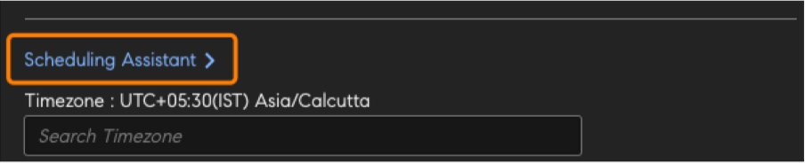
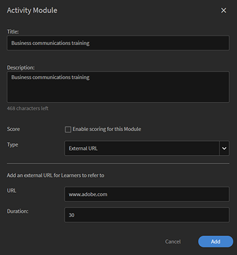

# コースの作成、変更、パブリッシュ

この記事では、Learning Manager でコース、認定資格、学習プログラムを作成する方法について説明します。

作成者は、コース、認定資格、学習プランなどの学習オブジェクトを作成することができます。学習者は、作成者が作成した学習オブジェクトを使用することができ、管理者は、学習者の進捗状況を確認することができます。

## Learning Manager のコース {#coursesincaptivateprime}

Adobe Learning Manager を使用すると、作成者は仮想トレーニング、セルフペーストレーニング、教室トレーニングおよびアクティビティに関連するモジュールを 1 つ以上使用してコースを作成できます。さらに管理者は、これらのコースを使用して、コースインスタンスの作成、学習者の登録、バッジの割り当てのほか、これらのコースに対するフィードバックを有効にすることができます。これらのコースを使用して、学習プログラム、学習プラン、認定資格を作成することもできます。

作成者は、eラーニングツールを使用して作成されたeラーニングコンテンツを使用することができます。 その他にサポートされているコース形式としては、ビデオファイル、PDF、doc、docx、PPT、PPTX があります。

## コースの作成 - 基本的なワークフロー {#createacoursebasicworkflow}

コースを作成するには、以下の手順を実行します。

1. Adobe Learning Manager に作成者としてログインします。これは作成者のみがコースを作成する権限を持つためです。次に、「はじめに」ページで「**[!UICONTROL コースの作成]**」をクリックします。
1. 「**コース概要**」ページで、コースの名前を入力します。コースカードに表示される、コースの短い説明を入力します。この説明は 140 文字以下にする必要があります。次に、「コースの詳細」ページに表示される、コースの詳細な説明を入力します。この説明は 1500 文字以下にする必要があります。

   作成者は、モジュールをコースに追加する際に、そのモジュールの説明を表示することができます。

1. 別の言語でコースを作成する場合は、ページの左上隅に表示されている「新しい言語を追加」をクリックします。コースで使用する 1 つ以上の言語を選択します。「**[!UICONTROL 保存]**」をクリックします。詳細については、「[各種言語のコンテンツの追加](/help/migrated/authors/feature-summary/content-library.md)」を参照してください。
1. **以下の手順で、コースの設定を変更します**。

   1. 「コース設定」ページでコースのスキルを選択し、 「スキル」ドロップダウンリストで、必要なスキルを選択します。 次に、「レベル」ドロップダウンリストで、必要なレベルを選択します。
   1. コースのスキルとレベルを選択し、スキルの単位を設定します。必要に応じて、さらにスキルを追加します。
   1. 「**登録タイプ**」ドロップダウンリストで、登録のタイプを選択します。

   選択できる登録タイプは以下のとおりです。

   * **マネージャーによりノミネート済み**：このタイプのコースを登録できるのはマネージャーのみです。学習者はこのタイプのコースに登録することはできません。
   * **マネージャーにより承認済み**：これは、マネージャーが承認を行うコースです。学習者はこのタイプのコースに申し込むことができますが、マネージャーの承認なしに直接登録することはできません。 学習者がこのコースに申し込むと、通知がマネージャーに送信されます。この申し込みをマネージャーが承認すると、このコースが登録済みコースとして表示されます。
   * **セルフ登録済み**：このタイプのコースの場合、学習者自身が直接登録することができます。

1. 「**[!UICONTROL 保存]**」をクリックして変更内容を保存し、コースを公開するには、**[!UICONTROL Publish]**&#x200B;をクリックします。

## コースの作成 - 高度なワークフロー {#createacourseadvancedworkflow}

1. Adobe Learning Manager に作成者としてログインします。これは作成者のみがコースを作成する権限を持つためです。次に、「はじめに」ページで「**[!UICONTROL コースの作成]**」をクリックします。
1. 「**コース概要**」ページで、コースの名前を入力します。コースカードに表示される、コースの短い説明を入力します。この説明は 140 文字以下にする必要があります。次に、「コースの詳細」ページに表示される、コースの詳細な説明を入力します。この説明は 1500 文字以下にする必要があります。
1. 別の言語でコースを作成する場合は、ページの左上隅に表示されている「新しい言語を追加」をクリックします。コースで使用する 1 つ以上の言語を選択します。「**[!UICONTROL 保存]**」をクリックします。詳細については、「[各種言語のコンテンツの追加](/help/migrated/authors/feature-summary/content-library.md)」を参照してください。
1. **以下の手順で、コースの設定を変更します**。

   1. 「コース設定」ページでコースのスキルを選択し、 「スキル」ドロップダウンリストで、必要なスキルを選択します。 次に、「レベル」ドロップダウンリストで、必要なレベルを選択します。
   1. コースのスキルとレベルを選択し、スキルの単位を設定します。必要に応じて、さらにスキルを追加します。
   1. 必要に応じて、コースにカスタム準拠ラベルを追加します。 [コース/学習パス/資格認定への準拠ラベルの追加](/help/migrated/authors/feature-summary/courses.md#add-compliance-labels-to-courselearning-pathcertification)を参照してください。
   1. 「**登録タイプ**」ドロップダウンリストで、登録のタイプを選択します。

   選択できる登録タイプは以下のとおりです。

   * **マネージャーによりノミネート済み**：このタイプのコースを登録できるのはマネージャーのみです。学習者はこのタイプのコースに登録することはできません。
   * **マネージャーにより承認済み**：これは、マネージャーが承認を行うコースです。学習者はこのタイプのコースに申し込むことができますが、マネージャーの承認なしに直接登録することはできません。 学習者がこのコースに申し込むと、通知がマネージャーに送信されます。この申し込みをマネージャーが承認すると、このコースが登録済みコースとして表示されます。
   * **セルフ登録済み**：このタイプのコースの場合、学習者自身が直接登録することができます。

1. コースの価格を設定するか、無料にするかを選択します。 コースを有料にする場合は、オプションを選択します **[!UICONTROL 有料]**&#x200B;を選択し、価格を指定します。 価格は、学習者のコースカードとコース概要ページに表示されます。

   メモ：これは、Adobe Commerceコネクタが設定されている場合にのみ有効になります。

1. 学習者が自分自身でコースの登録を解除できるようにするには、「**学習者は自分で登録解除できます**」チェックボックスを選択します。

1. **インスタンス構成**

   このオプションを有効にすると、ステータスが「進行中」の学習者が他のインスタンスにアクセスして登録できるようになります。 これにより、学習者は前のインスタンスの進行状況を保持できます。

   コースを公開した後に設定ページに戻ると、このオプションは編集できなくなります。

   このオプションは、次のコースタイプに対して有効にできます。

   * 自分のペース
   * 教室
   * アクティビティ
   * 混合

   注：コースを複製する際、ソースコースで「インスタンス設定」オプションを有効にしていた場合、このオプションは複製先コースで無効のままになります。

   **インスタンススイッチは**&#x200B;ではサポートされていません：

   * 有料コース
   * 「マネージャーによりノミネート済み」登録タイプのコース

   「インスタンスの切り替え」設定がカタログを使用して共有されている場合は、設定がピアアカウントに共有されないため、このオプションは複製先のコースで無効になります。

1. **複数の登録**

   この機能を使用すると、1つまたは異なる期間で複数のコースインスタンスに学習者を登録できます。

   切り替え&#x200B;**複数登録**&#x200B;を有効にすると、学習者の様々なコース登録に切り替えることができます。 「インスタンスの切り替え」を有効にしている場合は、「複数登録」を使用できません。

1. 必修コースを選択します。学習者は、これらのコースを完了しない限り、目的のコースを開始することはできません。「コース」フィールドをクリックし、コースの一覧で前提条件となるコースを選択します。
1. 前提条件のコースを必須にする場合は、**[** **前提条件**]チェックボックスをオンにします。
1. コースに関連するキーワードをタグとして追加します。学習者はこのタグを検索することにより、目的のコースを簡単に探すことができます。これらのタグはすべて、追加したモジュールに基づいて自動的に追加されます。このコースに他のタグを追加する場合は、そのタグを入力します。
1. コースに関連するキーワードをタグとして追加します。学習者はこのタグを検索することにより、目的のコースを簡単に探すことができます。これらのタグはすべて、追加したモジュールに基づいて自動的に追加されます。このコースに他のタグを追加する場合は、そのタグを入力します。
1. 「自動廃止」フィールドで、コースを廃止する日付を選択します。 管理者は、まず「自動廃止」オプションを有効にする必要があります。
1. 「**[!UICONTROL 保存]**」をクリックして変更内容を保存し、コースを公開するには、**[!UICONTROL Publish]**&#x200B;をクリックします。

### コース/学習パス/資格認定に準拠ラベルを追加 {#add-custom-compliance-label}

準拠ラベルをコースに追加するには、次の手順に従います。

1. 作成者アプリで、**[!UICONTROL コース]**/**[!UICONTROL 学習パス]**/**[!UICONTROL 資格認定]**&#x200B;に移動し、「**[!UICONTROL 追加]**」を選択します。
1. 名前と、説明、スキルなどのその他の詳細を入力します。
1. [**[!UICONTROL カスタム準拠]**]テキストボックスに、準拠ラベルを入力して選択します。

   
   _カスタムコンプライアンスの追加_

   >[!IMPORTANT]
   >
   >カスタムコンプライアンスを追加する場合は、コースの期限を必ず設定してください。

   >[!NOTE]
   >
   >カスタムの準拠タイプのラベルでは、最大50のコース、学習パス、または資格認定に同じ値を設定できます。

1. コース/学習パス/資格認定を保存して公開します。
コース/学習パス/資格認定は、準拠タイプと見なされます。 管理者はこのコースを準拠ダッシュボードに追加し、マネージャーと共有して進捗状況を追跡できます

>[!NOTE]
>
>作成者は、準拠ラベルを編集して、既存のコース/学習パス/資格認定に準拠ラベルを追加することもできます。

## ゲーミフィケーションポイント

ゲーミフィケーションポイントはコースレベルとコースインスタンスレベルで割り当てることができます。 これにより、さまざまなコースやインスタンスに対してポイントを付与できます。 学習者は、特定のコースを受講するインセンティブを得たり、特定のコースインスタンスを他のコースよりも優先させたりします。

1. コースインスタンスレベルで、「**[!UICONTROL ゲーミフィケーションポイント]**」を選択します。


*ゲーミフィケーションのポイントを設定します*

1. 「**[!UICONTROL 編集]**」を選択します。
1. 「コースレベル設定を使用」を選択すると、次のオプションが表示されます。

   * 「**[!UICONTROL 完了時]**」：学習者がコースを完了したときに 100 ポイントを付与するにはこのトグルを選択します。
   * **その他のルール**

      * 「**[!UICONTROL 早期完了]**」：これを選択すると、コースを完了した最初の 30 人の学習者に対し、100 ポイントが付与されます。
      * 「**[!UICONTROL タイムリーな完了]**」：これを選択すると、学習者が 999 日以内にコースを完了した場合、100 ポイントが付与されます。

1. 「**[!UICONTROL カスタム設定を使用する]**」を選択すると、次のオプションが表示されます。

   * 「**[!UICONTROL 完了時]**」：学習者がコースを完了したときに 100 ポイントを付与するにはこのトグルを選択します。
   * **その他のルール**

      * 「**[!UICONTROL 早期完了]**」：これを選択すると、指定したポイントが付与される学習者の数を決定できます。
      * 「**[!UICONTROL タイムリーな完了]**」：これを選択すると、学習者が指定した時間内にコースを完了した場合に付与されるポイントの数を指定できます。

   

   *期限前の完了を設定する*

1. 「**[!UICONTROL 保存]**」を選択します。

## 学習リソースの集約

作成者は、学習リソースを学習プランレベルで集約するか、個別のコースレベルのままにするかを決定できます。

作成者として、**[!UICONTROL 学習パス]**/**[!UICONTROL 設定]**&#x200B;を選択します。 「**[!UICONTROL 編集]**」をクリックします。

**[!UICONTROL リソース]**&#x200B;セクションの[学習パスレベルで集計された構成員のコースリソースを表示する]チェックボックスを有効にすると、コースレベルに存在するリソースを学習パスレベルで表示するかどうかを表示できます。

>[!NOTE]
>
>学習パスの「設定」ページで、管理者はこのオプションを有効にすることもできます。このオプションでは、学習パスレベルに表示されるコースレベルに存在するリソースが表示されます。

## スケジュール管理アシスタント

インストラクターと教室の予約状況で発生した競合を管理します。 インストラクターをコースに割り当てる前に、インストラクターが対応可能な日時を知りたい場合は、スケジュール設定アシスタントを使用します。

コースの作成中に、VCまたはCRコースの場合は「スケジューリングアシスタント」をクリックします。



*スケジュールアシスタントの起動*

「計画補助」ウィンドウが起動します。


*スケジュールアシスタントダイアログ*

スケジュール管理アシスタントでは、次の操作を実行できます。

* インストラクターを名前で検索
* インストラクターをスキルで検索

### インストラクターを名前で検索

「インストラクター」フィールドで、インストラクターの名前を入力するか、インストラクターの名前を部分検索します。 インストラクターのリストが表示されます。リストからインストラクターを選択できます。


*インストラクターの検索*

複数のインストラクターを選択できますが、割り当てられるインストラクターは一度に 1 人だけです。時間競合ウィンドウで、選択した時間が強調表示されます。 インストラクターの近くに十字アイコンが表示されます。このアイコンをクリックして、インストラクターを削除します。


*複数のインストラクターを検索*

### インストラクターをスキルで検索

1 つまたは複数のスキルを有するインストラクターを検索できます。 検索には AND 演算子を使用します。

スキルは、スキルレベルではなく、スキル名の一部または全部のみで検索できます。

インストラクターの名前、場所、人数制限をアシスタントに入力します。 

また、インストラクター検索ボックスの右側にあるフィルターアイコンをクリックすると表示されるスキルも検索できます。 次のスクリーンショットでは、そのボタンの場所が分かります。


*スキルでインストラクターを検索*

### ユーザーグループのフィルター

「インストラクター」フィールドでフィルターを選択します。 ユーザーグループの値を使用して、作成者またはカスタム作成者が適切なインストラクターを見つけることができる&#x200B;**[!UICONTROL 「ユーザーグループ」]**&#x200B;フィルターがあります。

両方のフィルターを適用すると、ユーザグループに属し、選択したスキルを持つインストラクターのリストが表示されます。

これは、「コース」ページまたは「インスタンス」ページの「スケジューリングアシスタント」に適用されます。


*ユーザーグループでフィルター*

### インスタンスページ

以下の画面から、「インスタンス」ページからスケジュール管理アシスタントにアクセスすることもできます。

スケジューリングアシスタントは、「インスタンス」ページから、管理者、カスタム管理者/作成者にも使用できます。

![[インスタンス]ページのスケジュールアシスタント](assets/instances-scheduling.png)

*「インスタンス」ページからインストラクターをスケジュール*

### 場所の検索

場所を検索するには、モジュールおよびスケジュールアシスタントページの両方で、教室の名前と場所の領域名の両方を指定します。

## リッチテキスト書式設定

コース、学習プログラム、資格認定や作業計画書を作成する際に、作成者はテキストや画像など様々な種類のコンテンツを入力したり、様々なテキスト書式設定オプションを適用したりできます。

コースを作成すると、「コース概要」フィールドにリッチテキストエディターが表示されます。 コンテンツの書式設定、画像の追加、ハイパーリンクの追加などを行うことができます。


*リッチテキストエディターを起動する*

また、リッチテキストエディターを使用して、次の項目を作成する際に説明を変更することもできます：

**学習プログラム**


*学習プログラムにリッチテキストエディターを使用する*

**資格認定**


*資格認定にリッチテキストエディターを使用する*

**作業計画書**


*作業計画書にリッチテキストエディターを使用する*

リッチテキストエディターは、他の言語にも使用できます。

## ヘッドレスユーザーインターフェイス用のリッチテキストの記述サポート

### CSS が必要な理由

リッチテキストは、HTML マークアップで構成されています。 マークアップをそのままレンダリングすると、ブラウザーにデフォルトのスタイルが適用されます。 その場合、企業のスタイルガイドラインに適合しなくなる可能性があります。 ガイドラインに適合するには、CSS が必要です。

### デフォルトのスタイル

添付された CSS のスタイルシートには、Learning Manager で適用されるスタイルが含まれています。このスタイルは、さまざまユースケースを念頭において調整されています。 自分の命名規則やビルドシステムに沿って、添付された CSS ファイルをダウンロードして Web アプリに読み込みます。 定義されたCSSクラスはql-editorクラスの名前空間に属し、既存のスタイルと干渉しません。

### スタイルのカスタマイズ

デフォルトのスタイルは万能ではありません。 指定された CSS を上書きすることで、カスタマイズできます。 すべてのスタイルは、改良版のセレクターとして「ql-editor」に囲まれます。 次のクラスが使用されます。

* インデント：**li.ql-indent-$number**。 $number には、1～9 が入ります。
* サイズ：**ql-size-small**、**ql-size-large**、**ql-size-huge**

* 整列：**ql-align-center**、**ql-align-justify**、**ql-align-right**

* カラー：**ql-color-$color**。 $color に入る色：white、red、orange、yellow、green、blue、purple
* 背景：**ql-bg-$color**。 $color に入る色：black、red、orange、yellow、green、blue、purple
* htmlタグ：p、ol、ul、pre、blockquote、h1、h2、h3、h4、h5、h6

[CSS ファイルをカスタマイズに使用できます。](assets/ql-headless.css)

### リッチテキストの概要のレンダリングを有効にする API の変更

お客様がヘッドレスインターフェイスを構築する際は、開発中のカスタムユーザーインターフェイスで学習オブジェクトを表示する必要があります。 これを行うには、通常、公開されている [GET /learningObjects](https://learningmanagereu.adobe.com/docs/primeapi/v2/#!/learning_object/get_learningObjects) APIを使用します。 Learning Managerで概要フィールドの「リッチテキスト」のキャプチャがサポートされるようになったため、API応答における学習オブジェクトのデータモデルも同じように公開されます。 以下のAPI応答のモデルのフラグメントにある「richTextOverview」という名前のフィールドを参照してください。 また、以前に公開されたフィールド(「overview」)は、下位互換性のために変更されません。

```
{ 
 "data": [ 
 { 
 "id": "string", 
 "type": "string", 
 "attributes": { 
 … 
 "localizedMetadata": [ 
 { 
 "description": "string", 
 "locale": "string", 
 "name": "string", 
 "overview": "string", 
 "richTextOverview": "string" 
 } 
 ], 
 … 
 }, 
 "relationships": { 
 … 
 } 
 } 
 } 
 ] 
} 
```

概要フィールドを既に使用しているお客様は、ヘッドレスインターフェイスには影響がなく、これまでと同じプレーンテキストが表示されることになります。 リッチテキストの概要を利用する場合は、Author UI で高度に書式設定された学習オブジェクト用の概要を作成する必要があります。その後、Learning Manager が API 応答モデルにおける（以前と同じ）プレーンテキストに加えて、リッチテキストの概要も返すようになります。

ただし、このリッチテキストを UI にレンダリングするには、お客様が CSS を含める必要があります。 これについては、以下のセクションで詳しく説明します。

## 複数回の試行を許可 {#allowmultipleattempts}

複数回の試行機能が管理者によって有効に設定されている場合、作成者は、コースレベルまたはモジュールレベルで、インタラクティブな eラーニングモジュールに対して複数回の試行機能を設定することができます。


*インタラクティブなeラーニングモジュールの複数回の試行を構成する*

<table>
 <tbody>
  <tr>
   <td>
    <p><b>オプション</b></p></td>
   <td>
    <p><b>説明</b></p></td>
  </tr>
  <tr>
   <td>
    <p>試行回数の制限値を設定する</p></td>
   <td>
    <p>特定のモジュールについて、試行回数の制限値を設定することができます。制限値を設定しなかった場合は、試行回数が無制限になります。<span style="font-size: 0.8125rem;">試行回数の制限値を設定すると、その情報が学習者に対して表示されます。学習者は、[再試行]ボタンをクリックして、モジュールの再試行を選択できます。</span></p></td>
  </tr>
  <tr>
   <td>
    <p>モジュールが完了して合格したら新しい試行を停止する</p></td>
   <td>
    <p>学習者が新しい試行オプションを選択できないようにするタイミングを設定するには、「モジュールが完了または合格したら新しい試行を停止する」チェックボックスをオンにします。 モジュールを正常に完了すると、「再試行」オプションが学習者ビューから削除されます。</p></td>
  </tr>
  <tr>
   <td>
    <p>ロックモジュールの試行間隔0:0:1形式：日/時間/分</p></td>
   <td>
    <p>試行間の特定の時間のモジュールをロックするには、[<b>試行間のモジュールをロックする0:0:1の形式：日/時間/分</b>]チェックボックスをオンにします。 モジュールがロックされると、指定されたロック時間が経過するまで、学習者はモジュールにアクセスできなくなります。 </p>
    <p>試行の終了条件を定義するには、[<b>プレーヤーを閉じる</b>]チェックボックスまたは[<b>完了</b>]チェックボックスをオンにします。</p></td>
  </tr>
  <tr>
   <td>
    <p>プレーヤーを閉じる</p></td>
   <td>
    <p>試行の終了条件として「<b>プレーヤーを閉じる</b>」を選択すると、モジュールの起動操作はすべて新しい試行として処理されます。学習者がプレーヤーを閉じると、モジュールのロックと試行に関する詳細情報が表示されます。</p></td>
  </tr>
  <tr>
   <td>
    <p>完了</p></td>
   <td>
    <p>試行の終了条件として「<b>完了</b>」を選択すると、モジュールのコンテンツの合格条件に基づいて試行の終了が判断されます。モジュールのコンテンツによって完了情報が送信されるまで、そのモジュールを再試行することはできません。試行が終了すると、モジュールのロックと試行に関する詳細情報が学習者に表示されます。</p></td>
  </tr>
  <tr>
   <td>
    <p>モジュールを完了するための時間制限を設定する</p></td>
   <td>
    <p>作成者は、チェックボックス「<b>モジュール完了の制限時間を設定</b>」を有効にすることで、モジュールを完了するための制限時間を設定できます。</p>
    <p>プレーヤーの起動操作はすべて新しい試行として処理されます。また、プレーヤーの起動時にモジュールの完了時間に関する情報が表示されます。</p>
    <p><b>注</b><span style="font-size: 0.8125rem;">：制限時間が経過すると、試行が自動的に終了します。プレーヤーを閉じた場合も、実行中の試行が終了します。</span></p></td>
  </tr>
  <tr>
   <td>
    <p>モジュールレベルでの複数回の試行</p></td>
   <td>
    <p>「試行を設定」ドロップダウンリストで「モジュールレベル」を選択すると、個別のモジュールレベルでオプションを設定することができます。</p></td>
  </tr>
 </tbody>
</table>

## コースモジュール {#coursemodules}

### モジュールを追加 {#addmodules}

コンテンツ、前作業およびテストアウトの各モジュールを追加できるようになりました。**コンテンツ**&#x200B;モジュールは、コースを構成する主要なモジュールです。**前作業**&#x200B;モジュールには、学習者がコースの受講を準備するときに役立つ基本的な情報が含まれています。学習者がこれらのモジュールを完了することは必須ではありません。**テストアウト**&#x200B;モジュールは、学習者がコンテンツをスキップできるようにします。学習者がコンテンツを既に理解していて、テストを受けて準拠要件を満たす必要がある場合に役立ちます。

コンテンツモジュールを追加するには、以下の手順を実行します。

1. 「**[!UICONTROL モジュールを追加]**」をクリックします。モジュールを追加するための 4 つのオプションが表示されます。最初のオプションは、セルフペースモジュールを追加します。モジュールを作成し、Adobe Learning Manager のモジュールライブラリに追加します。2 番目のオプションは、バーチャルクラスルームを設定します。3 番目のオプションは、教室モジュールを設定します。4 番目のオプションは、アクティビティモジュールを設定します。

   

   *コースのモジュールを追加する*

   **セルフペースのモジュール：**&#x200B;このモードでは、コースモジュールを自分のペースで開始して完了できます。自分のスケジュールを設定できます。

   このオプションをクリックすると、モジュールライブラリに既に追加されているセルフペースのモジュールのリストが表示されます。ここでは、リストをスクロールして追加するモジュールを選択するか、モジュールの名前を検索フィールドまたはモジュールタグに入力してモジュールを検索できます。

   モジュールを選択したら、「**[!UICONTROL 追加]**」をクリックします。これらのモジュールが「コンテンツ」セクションの下に表示されます。

   モジュールは並べ替えることもできます。モジュールをドラッグして上または下に移動し、適切な順序で配置します。

   **バーチャルクラスルームモジュール：**&#x200B;このモードでは、学習者はライブのオンライン教室で講義に出席し、訓練を受けたインストラクタから指導を受けることができます。セッションのタイトルと説明を入力し、セッションの期間を設定します。また、会議の URL や、セッションを実施するインストラクタを指定することもできます。変更を保存するには、「**[!UICONTROL 完了]**」をクリックします。

   

   *VCモジュールの追加*

   「バーチャルクラスルーム設定」のダイアログボックスを使用してコースを作成する場合は、作成した Teams 接続に&#x200B;**会議システム**&#x200B;を設定します。 イベントの会議主催者を指定するかどうかを選択します。

   会議の主催者について&#x200B;**はい**&#x200B;を選択する場合、主催者の名前を入力する必要があります。 名前を入力して、主催者を選択します。

   **ロビーバイパス**

   * **「はい」**&#x200B;を選択すると、学習者は誰でも会議に参加できます。
   * **「いいえ」**&#x200B;を選択すると、学習者が会議に参加するのを許可または禁止するリクエストが主催者に送信されます。

   **注意：**&#x200B;学習者は Microsoft Teams を使用することが必要です。 ただし、学習者はゲストとして Learning Manager に参加できます。

   **教室モジュール：**&#x200B;このモードでは、学習者は実際に講義に出席し、訓練を受けたインストラクタから指導を受けます。セッションのタイトルと説明を入力し、セッションの期間を設定します。また、セッションを実施するためのクラスの場所や、インストラクタを指定することもできます。変更を保存するには、「**[!UICONTROL 完了]**」をクリックします。

   

   *教室モジュールの追加*

   コースを作成するときに、「バーチャルクラスルーム設定」ダイアログボックスで、作成したMicrosoft Teams接続に会議システムを設定します。 イベントの会議主催者を指定するかどうかを選択します。

   会議の主催者について「はい」を選択する場合は、主催者の名前を入力する必要があります。 主催者の名前を入力して、主催者を選択します。

   **ロビーバイパス**

   * 「はい」を選択すると、学習者は誰でも会議に参加できます。
   * 「いいえ」を選択すると、学習者が会議に参加するのを許可または禁止するリクエストが主催者に送信されます。

   **注意：**&#x200B;学習者がゲストとしてMicrosoft Teamsに参加する場合は、メールアドレスを入力する必要があります。 電子メールがLearning Managerに存在している必要があります。

   **アクティビティモジュール：**&#x200B;このモードでは、学習者はワークショップ、演習、アンケートなど、一連の学習アクティビティを完了する必要があります。参照用のタイトル、説明および外部 URL を入力します。変更を保存するには、「**[!UICONTROL 完了]**」をクリックします。

   

   *アクティビティモジュールの追加*

   コースでアクティビティモジュールを追加するときに、アクティビティタイプがファイル送信のモジュールとxAPIベースのモジュールに対して、期間を指定できます。

1. 同様に、前作業モードおよびテストアウトモード用のモジュールを追加します。
1. モジュールのシーケンスタイプとして、「順序付け済み」または「順序付けなし」を選択します。

   「**順序付け済み**」を選択すると、モジュールが作成順に表示されます。「**順序付けなし**」を選択すると、モジュールは作成順に表示されません。この場合、学習者は、任意の順序でモジュールを学習することができます。

1. 必須モジュールのドロップダウンリストから、学習者がコースを完了するために受講する必要があるモジュールの数を選択します。
1. コースのカバー画像やバナー画像を追加します。 カタログは管理者によって作成されます。詳細については、「[カタログ](/help/migrated/administrators/feature-summary/catalogs.md)」を参照してください。

   **注意：**&#x200B;推奨サイズは次のとおりです。

   * **カバー画像：** 300 px x 300 px
   * **バナー画像：** 1600 px x 140 px

1. ページ右上隅の「**[!UICONTROL 保存]**」をクリックします。

#### アクティビティモジュールの「HTMLを追加」リンク

作成者は、アクティビティモジュールにHTMLリンクを追加し、完了条件を設定できます。 HTMLリンクを追加して完了条件を設定するには、次の手順に従います。

1. 作成者アプリで、ホームページの&#x200B;**[!UICONTROL 「コースの作成」]**&#x200B;を選択します。
1. **[!UICONTROL コースカタログ]**&#x200B;画面から&#x200B;**[!UICONTROL 追加]**&#x200B;を選択します
1. コースの名前と説明を入力します。
1. **[!UICONTROL モジュール]**&#x200B;オプションで、**[!UICONTROL モジュールの追加]** > **[!UICONTROL アクティビティモジュール]**&#x200B;を選択します。
1. **[!UICONTROL アクティビティモジュール]**&#x200B;プロンプトで、名前と説明を入力します。
1. **[!UICONTROL 型]**&#x200B;を&#x200B;**[!UICONTROL 外部URL]**&#x200B;として選択します。
1. **[!UICONTROL 完了条件]**&#x200B;オプションから次のオプションのいずれかを選択します。
   * **[!UICONTROL 学習者が完了をマーク]** ：学習者は、Fluidicプレーヤーでコースを完了としてマークするオプションを使用できます。
   * **[!UICONTROL コンテンツの起動時]**：学習者がコースを起動すると、コースは完了として自動的にマークされます。

   
   _完了条件_

1. **[!UICONTROL 追加]**&#x200B;を選択して、コースを公開します。

### パブリッシュ済みコースのモジュールの置き換え

Adobe Learning Managerは、複数のコンテンツモジュールで構成されるコースを作成、編集、管理するためのツールを作成者に提供します。 コースの内容を更新または改善する必要がある場合、作成者は学習者の進行状況を中断することなく、既存のモジュールを置き換えることができます。

モジュールを交換するには、次の手順に従います。

1. 作成者として Adobe Learning Manager にログインします。
2. 左側のナビゲーションパネルで「**[!UICONTROL コース]**」を選択します。
3. 任意のコースを選択して、**[!UICONTROL 編集]**&#x200B;を選択します。
4. 変更するモジュールを選択します。
5. タイトルと説明を変更します。
6. **コンテンツ**&#x200B;オプションを使用してモジュールを選択します。
   
7. 「**[!UICONTROL 完了]**」を選択します。
8. **[!UICONTROL 再公開]**&#x200B;を選択します。

学習者は他のモジュールで進捗状況を維持できますが、コースを完了するには新しいモジュールを完了する必要があります。

## チェックリスト {#create-checklist}

評価は、どの LMS でも重要な要素です。 オンライン評価は、トピックに対する学習者の理解度を評価する上で重要な方法の1つです。 しかし、多くの場合、その人が仕事をしている間に必要な作業を行う様子を観察して、その人の理解度を評価する必要があります。

店舗従業員や倉庫作業員が、日常的に実行することになっているタスクについて評価を受ける機会があるか検討してください。 コーヒーマシンを修理するために行う手順や、材料のパッキングを行う手順なども含まれるかもしれません。 インストラクターは、タスクの実行に関して従業員を評価しますが、こうした評価アクティビティでは、チェックリストに基づいて合格または不合格と評価することができます。

### チェックリストの作成 {#createachecklist}

チェックリストは、作成者のみが作成できる、 アクティビティモジュールの一種です。 アクティビティモジュールをセットアップする際、作成者は以下に示すように、アクティビティを&#x200B;**チェックリスト**&#x200B;として選択できます。


*チェックリストの作成*

**「チェックリスト」**&#x200B;オプションを選択すると、いくつかの追加オプションが表示されます。

**チェックリストタイプ：**&#x200B;**「はい / いいえ」**&#x200B;または&#x200B;**「1 ～ 5」**&#x200B;のいずれかのオプションを選択します。「はい / いいえ」を選択した場合は、「はい」または「いいえ」でのみ回答できる質問がチェックリストに表示されます。 「1 ～ 5」を選択した場合は、リッカート尺度のチェックリストが表示され、質問に対して 5 段階で評価されます。

**合格条件：**

<table>
 <tbody>
  <tr>
   <td>
    <p><b>「はい / いいえ」</b>を選択した場合</p></td>
   <td>
    <p><b>「1 ～ 5」</b>を選択した場合</p></td>
  </tr>
  <tr>
   <td>
    <p>「はい」を回答した数で合格条件を設定します。 例えば 3 を入力した場合、学習者は、インストラクターによる評価で 3 つ以上の<b>はい</b>の回答を得られた場合にコース合格となります。</p></td>
   <td>
    <p>1～5 の任意の数値によるしきい値として合格条件を設定します。 例えば、2 と 4 を入力した場合、学習者は、<b>4</b> 以上のスコアを持つ評価を <b>2</b> つ以上得られた場合にコース合格となります。</p></td>
  </tr>
 </tbody>
</table>

学習者を評価するインストラクターを選択します。

また、コメントやメモがある場合は、「**インストラクターへのメモ**」テキストフィールドにそのコメントやメモを追加できます。

次に、チェックリストの質問を追加します。 **[!UICONTROL 「追加」]**&#x200B;をクリックします。最大 150 個の質問を追加できます。


*チェックリストの質問の追加*

さらに質問を追加する場合は、**[!UICONTROL 「さらに追加」]**&#x200B;をクリックします。

変更を保存し、モジュールを追加して、コースを公開します。

### スキルを追加 {#addskills}

このページで、次の詳細情報を入力します。

1. コースのスキルとレベルを選択し、スキルの単位を設定します。必要に応じて、さらにスキルを追加します。

   

   *コースのスキルを追加する*

1. 登録のタイプを選択します。以下のオプションがあります。

   * **マネージャーによりノミネート済み**：このタイプのコースを登録できるのはマネージャーのみです。学習者はこのタイプのコースに登録することはできません。
   * **マネージャーにより承認済み**：これは、マネージャーが承認を行うコースです。学習者はこのタイプのコースに申し込むことができますが、マネージャーの承認なしに直接登録することはできません。 学習者がこのコースに申し込むと、通知がマネージャーに送信されます。この申し込みをマネージャーが承認すると、このコースが登録済みコースとして表示されます。
   * **セルフ登録済み**：このタイプのコースの場合、学習者自身が直接登録することができます。

1. 学習者が自分自身でコースの登録を解除できるようにするには、「**学習者は自分で登録解除できます**」チェックボックスを選択します。
1. 必修コースを選択します。学習者は、これらのコースを完了しない限り、目的のコースを開始することはできません。「コース」フィールドをクリックし、コースの一覧で前提条件となるコースを選択します。

   

   *必須コースの追加*

1. 必修コースを必須にする場合は、「**前提条件**」チェックボックスを選択します。
1. コースに関連するキーワードをタグとして追加します。学習者はこのタグを検索することにより、目的のコースを簡単に探すことができます。これらのタグはすべて、追加したモジュールに基づいて自動的に追加されます。このコースに他のタグを追加する場合は、そのタグを入力します。
1. テキスト領域をクリックし、提案されるプロファイルから選択することにより、このコースの対象学習者のプロファイルを追加します。
1. コースのリソースファイルを参照資料として追加します。テキストファイル、ビデオファイル、音声ファイルなどの資料をドラッグ操作で追加することができます。
1. これで、これらのプロファイルに一致する学習者が推奨コースとして利用できるようになります。このセクションでは、学習者用にその他のリソースを追加することもできます。学習者はこれらのファイルをダウンロードして後で参照することができます。すべての変更が完了したら、右上隅にある「**[!UICONTROL 保存]**」をクリックします。これにより、コースが草案として保存されます。コースは、デフォルトで草案として保存されます。

## モジュールにインストラクタを割り当てる {#assigninstructorsformodules}

1. コース用のモジュールを作成したら、そのモジュールにインストラクタを割り当てることができます。作成者ダッシュボードで「**[!UICONTROL コースカタログ]**」をクリックします。
1. インスタラクタを割り当てるモジュールが含まれているコースをクリックします。
1. **[モジュールの追加]**&#x200B;セクションで、インストラクターを割り当てるモジュールをクリックします。
1. 「**インストラクタ**」フィールドで、インストラクタの役割を割り当てるユーザーの名前を入力します。

   

   *インストラクターの役割をユーザーに割り当てる*

1. 更新を含むコースを再公開するには、**[!UICONTROL [再公開]]**&#x200B;をクリックします。

### インストラクターによる成功のマーク付け

Adobe Learning Managerを使用すると、インストラクターはクラスルームまたはバーチャルクラスルームのモジュールで学習者の成功ステータスをマークできます。 作成者は、教室またはバーチャル教室モジュールの作成時に、インストラクターに学習者の成功ステータスをマークする権限を付与できます。 インストラクターは、学習者を「合格」または「不合格」とマークすることで、合格をマークできます。これにより、進捗状況がそれに応じて更新されます。

インストラクターが学習者の成功をマークできるようにするには、次の手順を実行します。

1. 作成者として Adobe Learning Manager にログインします。
2. ホームページで&#x200B;**[!UICONTROL 「コースの作成」]**&#x200B;を選択します。
3. 「**[!UICONTROL 追加]**」を選択します。
4. 必要な詳細を入力して、**[!UICONTROL モジュールの追加]**&#x200B;を選択します。
5. **[!UICONTROL バーチャルクラスルームモジュール]**&#x200B;または&#x200B;**[!UICONTROL クラスルームモジュール]**&#x200B;を選択します。
6. 必要な詳細情報を入力し、日付を選択します。
7. 「**[!UICONTROL インストラクターに成功のマークを許可]**」オプションを選択します。

   
   _教室またはバーチャルクラスルームモジュールで、「インストラクターに成功のマークを許可」オプションがハイライトされた「セッションの詳細」画面_

8. 「**[!UICONTROL 完了]**」を選択します。


## 監視チェックリスト

インストラクターに加えてマネージャーも、チェックリストモジュールを確認できるようになりました。 人物マネージャーに加えて非階層マネージャー（ストアマネージャーや場所マネージャーなど）も、チェックリストを確認して項目を完了させることができます。

コースの作成者は、チェックリストモジュールの設定時に「レビュー担当者」セクションでこれらの役割オプションを選択することで、人物マネージャーと非階層マネージャー（該当する場合）をレビュー担当者として追加できます。 コースインスタンスレベルでこの操作を実行できます。


*アクティビティモジュールにレビュー担当者を追加する*

「**[!UICONTROL +マネージャー]**」オプションを選択すると、組織階層内の学習者のマネージャーが自動的にチェックリストをレビューできるようになります。 マネージャー名を個別に検索して追加する必要はありません。

アカウント管理者が「アクティブフィールド」オプションを使用して非階層のマネージャーの役割（場所マネージャーやサイトマネージャーなど）を設定している場合は、それらのマネージャーの役割を選択して有効化することで、チェックリストを確認できます。

マネージャー名を個別に検索して追加する必要はありません。 学習者がチェックリストコースに登録すると、選択したインストラクターに加えてマネージャー / ストアマネージャーにも、レビューに関する通知が自動的に送信されます。 このワークフローにより、作成者が個々のマネージャーの名前を記載する必要がなくなります。

上記のサンプルスクリーンショットで「**[!UICONTROL +ストアマネージャー]**」オプションを選択すると、学習者に関連付けられた非階層マネージャーが自動的に有効になり、チェックリストを確認できるようになります。 ここで「store」は、管理者が定義したアクティブフィールドに置き換えられることに注意してください。

チェックリストモジュールの更新には、チェックリストモジュールが含まれているコースに学習者が登録される際にインストラクターやマネージャーに送信される通知も含まれます。 レビューアーはインストラクター / マネージャーダッシュボードと同じように、Learning Manager 通知センターでチェックリストアクションの期限を知らせる通知を受け取ります。

<!---->

レビューアーは、インストラクターまたはマネージャーとしてログインする際に表示される通知メニューと同じように、保留中のチェックリストレビュー項目に関する情報をチェックリストメニューからすべて確認できます。


*資格認定の承認*

「チェックリストをレビュー」をクリックすると、レビューアーは評価を完了できます。


*保留中のチェックリストの確認項目の確認*

チェックリストにレポートをダウンロードできます。チェックリストには学習者の評価、レビューアーの名前、役割、電子メールに関する詳細情報が含まれます。

チェックリストレポートの CSV には、次のような新しいフィールドおよび更新されたフィールドがあります。

* レビューアー名。インストラクター名はありません
* レビューアーの電子メール。インストラクターの電子メールはありません
* レビューアーの役割：設定可能な値は、マネージャー、ストア / 場所マネージャー、インストラクターです

## コースのプレビュー {#previewacourse}

コースを作成して草案として保存すると、コースを学習者としてプレビューできます。その後、そのコースをパブリッシュすると、コースカタログから使用できるようになります。

コースをプレビューするには、「**[!UICONTROL 学習者としてプレビュー]**」をクリックします。


*学習者としてコースをプレビューする*

これにより、コースの「**概要**」ページが開きます。このページには、モジュール、モジュールの順序、コースに関するその他の詳細情報が表示されます。


*モジュールとその他の関連する詳細を表示する*

このコースが学習者に提供するエクスペリエンスを確認するには、各モジュールをクリックして再生を開始します。.これにより、Fluidic プレーヤーでコースの再生が開始されます。

## コースのパブリッシュ {#publishacourse}

コースを学習者としてプレビューした後、コースをパブリッシュすると、学習者が利用できるようになります。この時点でコースはまだ草案モードであることに注意してください。

一般的なコースのライフサイクルは次のように変化します。

* **ドラフト** – 作成者がコースの作成と保存を完了したとき。 この段階では、学習者はまだコースを利用できません。
* **公開済み** – 作成者がコースの公開を完了したとき。 学習者は、この段階でコースに登録することができます。作成者は、この状態のコースを編集することもできます。
* **撤回済み** – 公開されているコースを「撤回済み」の状態に移行することができます。この状態のコースは、作成者が学習者用のコースカタログに表示する必要がありません。
* **削除済み** - Adobe Learning Managerアプリケーションからコースが完全に削除された段階です。 作成者のみが、「草案」状態または「撤回済み」状態のコースのみを削除できます。


*コースライフサイクルのワークフロー*

作成したコースをパブリッシュするには、ページの右上隅にある「**[!UICONTROL パブリッシュ]**」をクリックします。


*コースをPublishする*

表示される確認ポップアップメッセージで、「**[!UICONTROL OK]**」をクリックします。

これで、コースカタログからコースを利用できるようになりました。

## コースの表示 {#viewacourse}

作成者は、利用可能なすべてのコースを一覧表示することができます。Learning Manager アカウント内のすべてのコースを表示する場合は「コースカタログ」をクリックします。Learning Manager で自分が作成したすべてのコースを表示する場合は&#x200B;**[!UICONTROL 「マイコース」]**&#x200B;をクリックします。

コースカードで、オプションにマウスを合わせ、「**[!UICONTROL コースを表示]**」をクリックします。


*コースの表示*

コース情報ウィンドウが表示されます。コースは読み取り専用モードになっています。コースを変更するには「**[!UICONTROL 編集]**」をクリックします。

## コースの廃止 {#retireacourse}

管理者は、Adobe Learning Managerアカウントの「廃止」オプションを有効にできます。 この機能を使用すると、管理者はコースを廃止して、現在登録している学習者がアクセスを保持している間、新しい登録を利用できなくなります。

登録済みの場合や完了済みの場合でも、コースを廃止すると学習者に非表示になります。 コースを廃止すると、新しい学習者をコースに登録できなくなります。既に登録している学習者は、コースを受講できます。

Adobe Learning Managerアカウントの「廃止」オプションを有効にするには：

1. Adobe Learning Managerに管理者としてログインします。
2. **[!UICONTROL 設定]**&#x200B;を選択し、**[!UICONTROL 一般]**&#x200B;を選択します。
3. 次の中から、いずれかの「廃止」オプションを選択します。
   * 撤回すると、登録済み学習者はアクションを表示および実行できますが、まだ登録されていない学習者はアクセスできなくなります。
   * 撤回すると、登録済み学習者とまだ登録されていない学習者の両方がアクセスできなくなります。

管理者は、**[!UICONTROL コース]**&#x200B;ページからコースを廃止できます。

コースを廃止するには、コースカードでオプションにマウスを合わせ、「コースを廃止」をクリックします。


*コースの廃止*

表示される確認ポップアップで、「**[!UICONTROL はい]**」をクリックします。

## コースの複製 {#duplicateacourse}

コースのコピーを作成した後、コースを変更することができます。コースをバックアップする場合は、コースを複製できます。

## コースの検索 {#searchforcourses}

Adobe Learning Manager では、目的のコースを素早く簡単に検索することができます。コースは次の方法で検索できます。

**検索フィールド：**「**コースカタログ**」ページの右上隅にある検索バーをクリックします。コースの名前、またはコースに関連するキーワードを入力します。コースの作成時に追加したタグを使用してコースを検索することもできます。その場合は、「コースを検索」フィールドでタグを入力します。


*コースの検索*

**コースリストのフィルタリング：**&#x200B;コースの状態（「すべて」、「公開済み」、「草案」、「撤回済み」など）に基づいて、コースをフィルタリングすることができます。この方法で、表示されるコースを絞り込み、目的のコースを選択することができます。

作成者は、コースを並べ替えることで、目的のコースを簡単に探すことができます。**[!UICONTROL [並べ替え条件]]**&#x200B;をクリックして、アルファベット昇順、アルファベット降順、コース作成日、コース更新日、コースの有効性を選択します。


*コースの一覧をフィルター処理する*

## 学習者のコースへの登録 {#enrolllearnersinacourse}

コースに学習者を登録する場合、またはマネージャーがコースの学習者をノミネートできるようにする場合は、管理者モードに切り替える必要があります。これは、管理者のみがコースの学習者を登録する権限を持つためです。

管理者モードに切り替えるには、以下の手順を実行します。

1. プロファイル写真をクリックし、「管理者」を選択します。
1. 管理モードで、左側のペインの「**[!UICONTROL コース]**」をクリックします。このページでは、Learning Managerアカウントのすべての作成者が作成したすべてのコースを確認できます。
1. 学習者を登録するには、コースカードにマウスを合わせ、「**学習者を登録**」オプションを表示します。このオプションをクリックします。

   

   *学習者をコースに登録する*

1. 学習者を登録ダイアログボックスの右上隅に、「**デフォルトのインスタンス**」オプションが選択されて表示されます。作成者がコースを作成するとすぐに、コースのデフォルトのインスタンスが作成されます。

   

   *コースの既定のインスタンスを表示する*

1. 「学習者を含む」フィールドに学習者の名前を入力し、学習者を選択します。ここでユーザーグループを追加することもできます。自分のLearning Managerアカウントにすべての学習者を登録する場合は、「すべて」を入力します。 また、学習者をチームに登録することもできます。

   

   *コースに学習者を追加する*

1. コースから任意の学習者を除外するには、「**学習者を除外**」フィールドに学習者の名前を入力します。
1. 学習者を登録したら、「**[!UICONTROL 続行]**」をクリックします。学習者を登録ダイアログボックスで、登録の概要を表示できます。

   

   *コース登録の概要を表示*

1. コースにすべての学習者を登録するには、「**[!UICONTROL 登録]**」をクリックします。これらの学習者は、このコースに正常に登録されました。学習者は、そのコースを受講できるようになったことを知らせる通知を受け取ります。さらに多くの学習者を登録するには、登録手順を繰り返します。

## Connect VC モジュールのコースインスタンスの変更 {#connect-vc}

Connect コースの取得時、次の 2 種類の会議室を作成できます。

* 動的
* 永続的

会議室の永続的な URL は常に固定されています。 ただし、Connect や自分の会議室のないユーザーの場合は、実行時に動的な会議室を使用する必要があります。 その後、他のユーザーが会議に参加できるようになります。


*動的な会議室オプション*

これで、「**コースインスタンス**」ページで、会議室の永続的な URL を変更できるようになりました。

<!--|  |  |
|---|---|-->

## 学習者のコースからの登録解除 {#unenrolllearnersfromacourse}

コースを作成する際に、作成者は「**学習者は自分で登録解除できます**」オプションを有効にして、学習者がコースを離脱できるようにすることができます。

管理者も、コースから学習者を登録解除することができます。


*コースから学習者の登録を解除する*

詳細については、「[学習者の登録解除](/help/migrated/administrators/feature-summary/courses.md)」を参照してください。

## Captivate および Presenter のコースモジュールの追加 {#addcoursemodulesforcaptivateandpresenter}

パブリッシュメニューを使用して、Adobe Captivate および Adobe Presenter ソフトウェアからコースモジュールを Learning Manager にパブリッシュすることもできます。

1. Captivateで、**[!UICONTROL Publish]** > **[!UICONTROL Learning ManagerにPublish]**&#x200B;をクリックします。
1. サブドメイン名または電子メール ID を入力し、「**[!UICONTROL 送信]**」をクリックします。複数のアカウントが存在する場合は、アカウントを選択するためのプロンプトが表示されます。
1. Adobe の資格情報を使用してログインします。Adobe ID を持っていない場合は、「**[!UICONTROL アカウントの作成]**」をクリックしてアカウントを作成してください。認証が完了すると、モジュールをパブリッシュするためのページが表示されます。
1. モジュールに関するすべての基本情報を入力して「パブリッシュ」をクリックします。

Learning Manager のモジュールページに、パブリッシュされたモジュールが表示されます。詳しくは、[Adobe Learning Manager へのプロジェクトのパブリッシュ](https://helpx.adobe.com/captivate/classic/publish-project-to-captivate-prime.html)を参照してください。

## コースの有効性 {#courseeffectiveness}

作成者はコースの有効性スコアを活用することで、個々の学習者のニーズに合っていないコースを特定し、そのコースの内容を修正できます。コースの有効性を評価することにより、そのコースが学習者にとって有益なものであるかどうかを判断することができます。コースの内容に関する学習者からのフィードバックを組み合わせて、コースの有効性が評価されます。学習者のコースのクイズ結果と、コースからの学習に基づいて学習者を評価するマネージャーのフィードバック。

作成者は、「**マイコース**」オプションを使用して、コースの有効性スコアを確認することができます。このスコアは、以下のスナップショットのように、コースのサムネイルに表示されます。このスナップショットでは、コースの評価スコアが 100 になっています。

<!---->

コースの有効性評価値は、L1、L2、L3 のフィードバック値を考慮して算出されます。 各フィードバックの内訳を表示するには、コースの有効性の値をクリックします。 以下のようなポップアップメニューが表示されます。


*コースの有効性の計算*

このサンプルのスナップショットでは、1 人中 1 人のユーザーが 3 種類すべてのフィードバックを提供しているため、スコアは 100／100 になります。この場合、フィードバックの件数が少ないため、コースの全体的な有効性のスコアが不正確なものになっています。このポップアップメニューの右下隅に表示されている下向き矢印をクリックすると、コースの有効性スコアの計算方法が表示されます。

<!---->

上記の円グラフが示すように、マネージャーからの L3 フィードバックにはより多くの重みが与えられます。

## 認定制度と学習プログラム {#certificationsandlearningprograms}

作成者と管理者は、作成者アプリケーションを使用して、学習者用の認定資格と学習プログラムを作成することができます。認定資格または学習プログラムを作成するには、ホームページで「認定資格」または「学習プログラム」をクリックします。

資格認定および学習プログラムを作成および管理する方法については、[資格認定](/help/migrated/administrators/feature-summary/certifications.md)および[学習プログラム](/help/migrated/administrators/feature-summary/learning-programs.md)を参照してください。

## 社外の資格認定の必須コース {#mandatorycoursesforexternalcertification}

Learning Manager の以前のリリースでは、社外の資格認定の学習者が資格認定を完了するためにコースを完了することは必須ではありませんでした。

「カリキュラム」タブで「**資格認定完了に必須条件として目的のコースを設定します**」オプションを有効にすると、コースを必須として設定できるようになりました。


*資格認定を完了するための必須コースを設定する*

コースが必須として設定されている場合：

* マネージャーの「提出物」ページには、コースを完了した学習者のみが表示されます。
* 学習者はコースを完了した後にのみファイルをアップロードできます。

## よくある質問 {#frequentlyaskedquestions}

+++「マネージャーのノミネーションをシーク」というテキストをコースで非表示にするにはどうすればよいですか？

次の手順を実行します。

1. 作成者として Learning Manager にログインします。
1. コースを開きます。
1. 左ペインで、**[!UICONTROL 設定]** > **[!UICONTROL 編集]**&#x200B;をクリックします。
1. 「**登録タイプ**」ドロップダウンリストで、登録タイプを「**マネージャーによりノミネート済み**」から「**マネージャーにより承認済み**」または「**セルフ登録済み**」に変更します。

1. コースを再パブリッシュします。

+++

+++コースを組み合わせるにはどうすればよいですか？

学習プログラムを使用して、複数のコースを組み合わせることができます。

1. 管理者として Learning Manager にログインします。
1. 左側のペインで、「**[!UICONTROL 学習プログラム]**」をクリックします。
1. 学習プログラムを追加するために「**[!UICONTROL 追加]**」をクリックします。
1. 学習プログラムの詳細情報を入力し、「**[!UICONTROL 保存]**」をクリックして学習プログラムを保存します。
1. 学習プログラムが作成されたら、「**[!UICONTROL カタログ]**」をクリックします。
1. コースカードで「**[!UICONTROL 追加]**」をクリックします（以下の図を参照）。 学習プログラムに追加する各コースについて、同じ手順を繰り返します。


必要なコースを学習プログラムにすべて追加したら、「**[!UICONTROL パブリッシュ]**」をクリックします。

学習プログラムに追加できるのは、「セルフ登録済み」タイプのコースのみです。「マネージャーによりノミネート済み」タイプのコースと「マネージャーにより承認済み」タイプのコースを追加することはできません。 これは、Learning Manager のデフォルトの動作です。

+++

+++学習者が表示できるコースを制限するにはどうすればよいですか？

カタログを使用すると、学習者に対して表示されるコースを制限することができます。 デフォルトのカタログには、Learning Managerにデフォルトで追加されたすべてのコースが含まれています。

学習者が表示できるコースを制限するには、デフォルトのカタログを無効にして、カスタムのカタログを作成する必要があります。

1. 管理者として Learning Manager にログインします。
1. 左側のペインで、「**[!UICONTROL カタログ]**」をクリックします。
1. カタログを作成するために「**[!UICONTROL 作成]**」をクリックします。 カタログの詳細情報を入力して「**[!UICONTROL 保存]**」をクリックします。

1. 新しく作成したカタログオプションで、学習プログラム、資格認定、コースなど、追加できる学習のタイプを選択できます。
1. 「学習プログラム」セクションで、「**[!UICONTROL コンテンツを追加]**」をクリックします。
1. 左側のペインで、対象となる学習者に応じて、「**[!UICONTROL 社内で共有]**」または「**[!UICONTROL 社外で共有]**」をクリックします。

1. ユーザーグループを追加する場合は、「**[!UICONTROL ユーザーグループを追加]**」をクリックします。
1. カタログページで、**D[!UICONTROL 既定のカタログ]**&#x200B;を無効にし、作成したカタログを有効にします。


+++

+++完了したコースにもう一度登録するにはどうすればよいですか？

完了したコースを元に戻すことはできません。 学習者は、完了したコースに&#x200B;**もう一度登録することはできません**。

+++

+++完了したコースを表示するにはどうすればよいですか？

学習者は、コースの「再訪」ボタンをクリックして、完了したコースを表示することができます。

以下の手順を実行します。

1. 学習者としてログインします。
1. 完了したコースを開きます。
1. 「**[!UICONTROL 再訪]**」をクリックします。

+++

+++コースにリソースファイルを追加する方法

コースの作成時に、コースに関連するコースにビデオ、オーディオ、PDFまたはテキストファイルを追加し、学習者が追加のトレーニング資料にアクセスできるようにすることができます。


+++

+++モジュールに複数回の試行を設定するにはどうすればよいですか？

**前提条件：**&#x200B;管理者は、管理アプリの&#x200B;**設定/一般**&#x200B;で、オプション&#x200B;**複数回の試行**&#x200B;を有効にする必要があります。

作成者は「コースの概要」ページで&#x200B;**「複数回の試行を許可」**&#x200B;オプションを有効にします。

詳細については、[複数回の試行に関するセクション](courses.md#Allowmultipleattempts)を参照してください。

+++

+++Adobe Learning Manager にアップロードされたコンテンツをダウンロードして、そのコンテンツを修正できますか？

いいえ、Learning Managerにアップロードされたコンテンツは、パブリッシュされたzipファイルであり、ソースファイルではありません。 そのため、コンテンツをダウンロードしても、オーサリングツールでそのコンテンツを編集することはできません。 コンテンツを編集するには、ソースファイルが必要です。

+++
