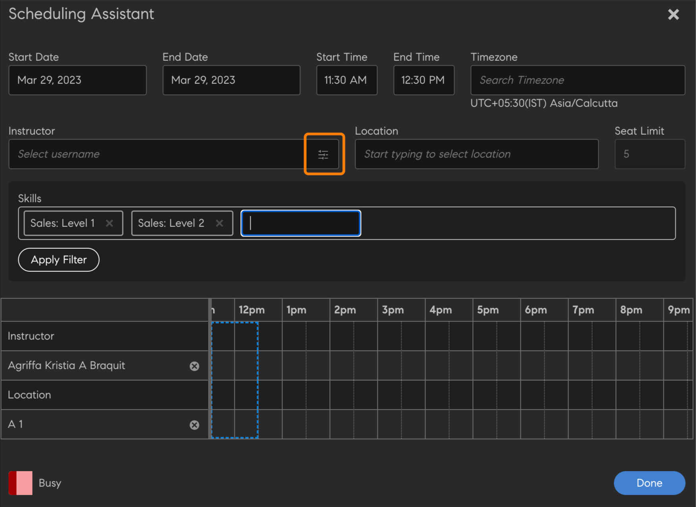
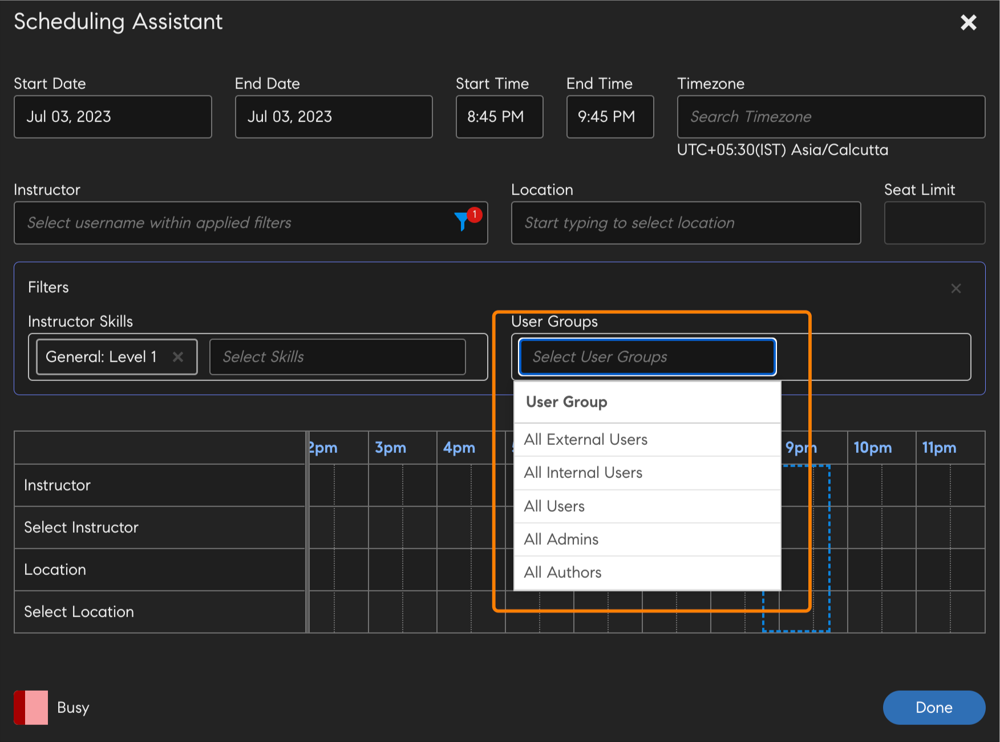
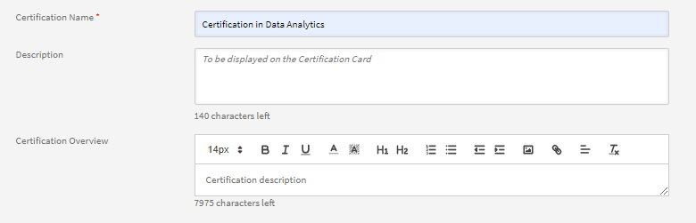
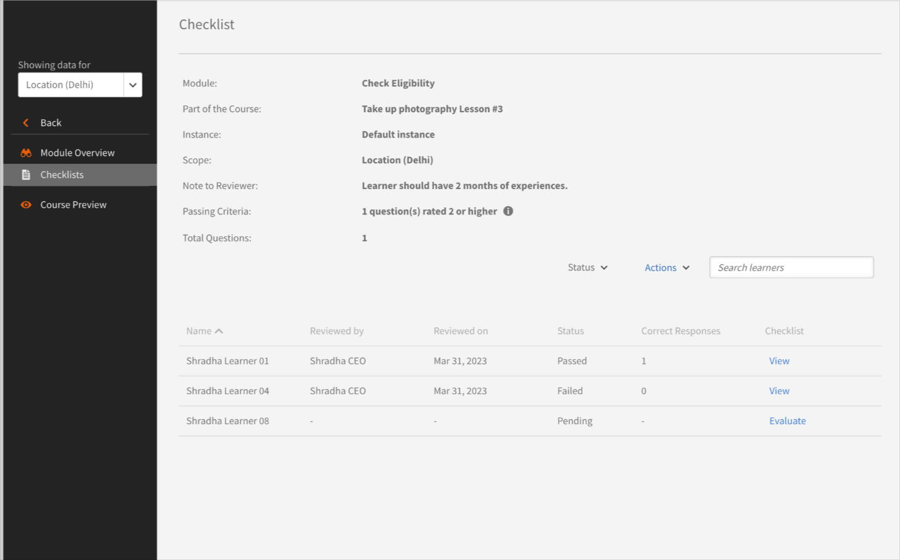
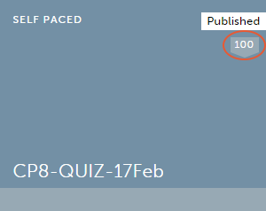

# コースの作成、変更、パブリッシュ

この記事では、Learning Managerでコース、資格認定および学習プログラムを作成する方法について説明します。

作成者は、コース、資格認定、学習プランなどの学習目標を作成できます。 学習者はこれらの学習目標を使用できますが、管理者は学習者の進行状況を追跡できます。

## Learning Managerのコース {#coursesincaptivateprime}

作成者はAdobe Learning Managerで、バーチャルトレーニング、セルフペーストレーニング、教室トレーニング、アクティビティに関連する1つ以上のモジュールを使用してコースを作成できます。 管理者はさらに、これらのコースを使用して、コースインスタンスの作成、学習者の登録、バッジの割り当て、これらのコースに対するフィードバックの有効化を行うことができます。 また、これらのコースを使用して、学習プログラム、学習プラン、資格認定を作成することもできます。

作成者は、任意のeラーニングツールを使用して作成されたeラーニングコンテンツを使用できます。 その他にサポートされているコース形式には、ビデオファイル、PDF、doc、docx、PPT、PPTXがあります。

## コースの作成 – 基本ワークフロー {#createacoursebasicworkflow}

コースを作成するには、次の手順に従います。

1. 作成者のみがコースを作成する権限を持っているため、Learning ManagerAdobeに作成者としてログインします。 ここで、[スタートアップ]ページで、をクリックします。 **[!UICONTROL コースの作成]**.
1. を **コースの概要** ページで、コースの名前を入力します。 次に、コースカードに表示されるこのコースの簡単な説明を入力します。 この説明は140文字以内にしてください。 次に、コースの詳細な概要を入力します。この概要は「コースの詳細」ページに表示されます。 説明は1,500文字以内にする必要があります。

   作成者は、モジュールをコースに追加する際、モジュールの説明を確認することができます。

1. コースを他の言語で利用できるようにするには、ページの左上隅にある「新しい言語の追加」をクリックします。 コースを利用可能にする1つまたは複数の言語を選択します。 クリック **[!UICONTROL 保存]**. 詳しくは、「 [様々な言語のコンテンツを追加](/help/migrated/authors/feature-summary/content-library.md).
1. **コース設定の変更**-

   1. コース設定ページで、コースのスキルを選択します。 スキルドロップダウンリストで、必要なスキルを選択します。 次に、「レベル」ドロップダウンリストから必要なレベルを選択します。
   1. コースのスキルとレベルを選択し、スキルの単位を設定します。 必要に応じて、さらにスキルを追加します。
   1. から **登録タイプ** ドロップダウンリストで、登録のタイプを選択します。

   登録のタイプは次のとおりです。

   * **マネージャーによりノミネート済：** これらのコースはマネージャーのみが指名できます。 学習者はこのタイプのコースに登録することはできません。
   * **マネージャーが承認しました：** マネージャーはこれらのコースを承認します。 学習者はこのタイプのコースに申し込むことができますが、マネージャーの承認なしに直接登録することはできません。 学習者がこのタイプのコースに申し込むと、通知リクエストがマネージャーに送信されます。 マネージャーにより承認されると、これらのコースは学習者の登録済みコースとして表示されます。
   * **セルフ登録：** このタイプのコースの場合、学習者自身が直接登録することができます。

1. 変更を保存するには、 **[!UICONTROL 保存]**. コースをパブリッシュするには、 **[!UICONTROL 公開]**.

## コースの作成 – 高度なワークフロー {#createacourseadvancedworkflow}

1. 作成者のみがコースを作成する権限を持っているため、Learning ManagerAdobeに作成者としてログインします。 ここで、[スタートアップ]ページで、をクリックします。 **[!UICONTROL コースの作成]**.
1. を **コースの概要** ページで、コースの名前を入力します。 次に、コースカードに表示されるこのコースの簡単な説明を入力します。 この説明は140文字以内にしてください。 次に、コースの詳細な概要を入力します。この概要は「コースの詳細」ページに表示されます。 説明は1,500文字以内にする必要があります。
1. コースを他の言語で利用できるようにするには、ページの左上隅にある「新しい言語の追加」をクリックします。 コースを利用可能にする1つまたは複数の言語を選択します。 クリック **[!UICONTROL 保存]**. 詳しくは、「 [様々な言語のコンテンツを追加](/help/migrated/authors/feature-summary/content-library.md).
1. **コース設定の変更**-

   1. コース設定ページで、コースのスキルを選択します。 スキルドロップダウンリストで、必要なスキルを選択します。 次に、「レベル」ドロップダウンリストから必要なレベルを選択します。
   1. コースのスキルとレベルを選択し、スキルの単位を設定します。 必要に応じて、さらにスキルを追加します。
   1. から **登録タイプ** ドロップダウンリストで、登録のタイプを選択します。

   登録のタイプは次のとおりです。

   * **マネージャーによりノミネート済：** これらのコースはマネージャーのみが指名できます。 学習者はこのタイプのコースに登録することはできません。
   * **マネージャーが承認しました：** マネージャーはこれらのコースを承認します。 学習者はこのタイプのコースに申し込むことができますが、マネージャーの承認なしに直接登録することはできません。 学習者がこのタイプのコースに申し込むと、通知リクエストがマネージャーに送信されます。 マネージャーにより承認されると、これらのコースは学習者の登録済みコースとして表示されます。
   * **セルフ登録：** このタイプのコースの場合、学習者自身が直接登録することができます。

1. コースの価格を設定するか、無料にするかを選択します。 コースを有料にする場合は、オプションを選択します **[!UICONTROL 有料]**&#x200B;価格を指定します。 価格は、コースカードと学習者のコース概要ページに表示されます。

   メモ：これは、Adobe Commerceコネクタが設定されている場合にのみ有効になります。

1. 学習者がコースから自分で登録解除できるようにする場合は、チェックボックスをオンにします **学習者は自分で登録解除できます**.
1. **インスタンス構成**

   このオプションを有効にすると、ステータスが「進行中」の学習者が他のインスタンスにアクセスして登録できるようになります。 これにより、学習者は前のインスタンスの進行状況を保持できます。

   コースのパブリッシュ後に、設定ページに戻ると、オプションは編集できなくなります。

   このオプションは、次のコースタイプに対して有効にできます。

   * セルフペースの
   * 教室
   * 活動性
   * ブレンド

   注：コースを複製する際、ソースコースで「インスタンス設定」オプションを有効にしていた場合、このオプションは複製先コースで無効のままになります。

   **インスタンススイッチはサポートされていません**:

   * 有料コース
   * マネージャーによりノミネートされた登録タイプのコース。

   インスタンスの切り替え設定は、カタログを通じて共有する場合、ピアアカウントには反映されません。このオプションは移行先コースでは無効のままです。

1. **複数の登録**

   この機能を使用すると、1つまたは異なる期間で複数のコースインスタンスに学習者を登録できます。

   トグルを有効にする **複数登録** 学習者の様々なコース登録を切り替える場合 インスタンスの切り替えを有効にしている場合は、複数登録を使用できません。

1. コースを受講する前に完了する必要がある必須コースを選択します。 「コース」フィールドをクリックし、コースのリストから選択します。
1. 有効にする **有効にする** **前提条件** このチェックボックスをオンにすると、前提条件のコースが必須になります。
1. コースに関連するタグとして、キーワードを追加します。 これらのタグは、学習者が検索中にコースを簡単に見つけるのに役立ちます。 これらのタグはすべて、追加したモジュールに基づいて自動的に追加されます。 このコースに他のタグを追加する場合は、先に進んでそのタグを入力できます。
1. コースに関連するタグとして、キーワードを追加します。 これらのタグは、学習者が検索中にコースを簡単に見つけるのに役立ちます。 これらのタグはすべて、追加したモジュールに基づいて自動的に追加されます。 このコースに他のタグを追加する場合は、先に進んでそのタグを入力できます。
1. 「自動廃止」フィールドで、コースを廃止する日付を選択します。 管理者は、最初に自動削除オプションを有効にする必要があります。
1. 変更を保存するには、 **[!UICONTROL 保存]**. コースをパブリッシュするには、 **[!UICONTROL 公開]**.

## ゲーミフィケーションポイント

ゲーミフィケーションポイントをコースレベルとコースインスタンスレベルで割り当てることができます。 これにより、様々なコースやインスタンスに対してポイントを付与できます。 学習者は、特定のコースを受講するインセンティブを得たり、特定のコースインスタンスを他のコースよりも優先させたりします。

1. コースインスタンスレベルで、次を選択します。 **[!UICONTROL ゲーミフィケーションポイント]**.


*ゲーミフィケーションのポイントを設定*

1. 選択 **[!UICONTROL 編集]**.
1. 「コースレベル設定を使用」を選択すると、次のオプションが表示されます。

   * **[!UICONTROL 完了時]**：学習者がコースを完了したときに100ポイントを獲得する場合は、この切り替えスイッチを選択します。
   * **詳細ルール**

      * **[!UICONTROL 早期完了]**：これを選択すると、最初の30人の学習者がコースを完了したときに100ポイントが付与されます。
      * **[!UICONTROL タイムリーな完了]**：これを選択すると、学習者が999日以内にコースを完了した場合、100ポイントが付与されます。

1. 次を選択した場合 **[!UICONTROL カスタム設定を使用]**&#x200B;を選択すると、次のオプションが表示されます。

   * **[!UICONTROL 完了時]**：学習者がコースを完了したときに100ポイントを獲得する場合は、この切り替えスイッチを選択します。
   * **詳細ルール**

      * **[!UICONTROL 早期完了]**：これを選択すると、指定したポイントが付与される学習者の数を決定できます。
      * **[!UICONTROL タイムリーな完了]**：これを選択すると、学習者が指定した時間内にコースを完了した場合に付与されるポイントの数を指定できます。

   

   *早期完了と早期完了の設定*

1. 選択 **[!UICONTROL 保存]**.

## 学習リソースの集約

作成者は、学習プランレベルで学習リソースを集約するか、個々のコースレベルに留めるかを決定できます。

作成者として、次を選択します **[!UICONTROL 学習パス]** > **[!UICONTROL 設定]**. クリック **[!UICONTROL 編集]**.

を **[!UICONTROL リソース]** 「学習パスレベルに集約された構成員のコースリソースを表示」チェックボックスを有効にすると、コースレベルに存在するリソースが学習パスレベルで表示されるかどうかが表示されます。

>[!NOTE]
>
>学習パスの「設定」ページで、管理者はこのオプションを有効にすることもできます。このオプションでは、学習パスレベルに表示されるコースレベルに存在するリソースが表示されます。

## スケジュールアシスタント

予約インストラクターと教室の競合を管理します。 インストラクターをコースに割り当てる前に、インストラクターが対応可能な日時を知りたい場合は、スケジュール設定アシスタントを使用します。

コースの作成中に、VCまたはCRコースの場合は「スケジューリングアシスタント」をクリックします。


*スケジュールアシスタントの起動*

「計画補助」ウィンドウが起動します。


*[集計表アシスタント]ダイアログ*

スケジュールアシスタントでは、次の操作を実行できます。

* インストラクターを名前で検索します。
* スキルでインストラクターを検索します。

### インストラクターを名前で検索

「インストラクター」フィールドで、インストラクターの名前を入力するか、名前の一部を検索します。 インストラクターのリストが表示され、そこからインストラクターを選択できます。


*インストラクターの検索*

複数のインストラクターを選択できますが、一度に割り当てることができるのは1人のインストラクターのみです。 選択した時間は、時間の競合ウィンドウでハイライト表示されます。 インストラクターの近くに十字アイコンが表示されます。このアイコンをクリックして、インストラクターを削除します。


*複数のインストラクターの検索*

### スキルでインストラクターを検索

1つまたは複数のスキルを持つインストラクターを検索します。 検索にはAND演算子が使用されます。

スキルは、スキルレベルではなく、スキル名の一部または全部のみで検索できます。

アシスタントで、インストラクターの名前、場所、人数制限を入力します。

また、インストラクター検索ボックスの右側にあるフィルターアイコンをクリックすると表示されるスキルも検索できます。 以下のスクリーンショットは、ボタンを示しています。



*スキルでインストラクターを検索*

### ユーザーグループフィルター

「インストラクター」フィールドでフィルターを選択します。 次の項目があります。 **[!UICONTROL ユーザーグループ]** 作成者またはカスタム作成者をフィルター処理し、ユーザーグループの値を使用して適切なインストラクターを見つけることができます。

両方のフィルターが適用されている場合、ユーザーグループに属し、選択したスキルを持つユーザーのリストがインストラクターに表示されます。

これは、「コース」ページまたは「インスタンス」ページの「スケジューリングアシスタント」に適用されます。



*ユーザーグループでフィルター*

### インスタンスページ

次に示すように、「インスタンス」ページからスケジューリングアシスタントにアクセスすることもできます。

スケジューリングアシスタントは、「インスタンス」ページから、管理者、カスタム管理者/作成者にも使用できます。


*「インスタンス」ページからインストラクターをスケジュール*

### 場所の検索

場所を検索するには、モジュールおよびスケジュールアシスタントページの両方で、教室の名前と場所の領域名の両方を指定します。

## リッチテキスト書式設定

コース、学習プログラム、資格認定、作業計画書を作成する際に、作成者はテキストや画像などの様々な種類のコンテンツを入力したり、様々なテキスト形式オプションを適用したりできます。

コースを作成すると、「コース概要」フィールドにリッチテキストエディターが表示されます。 コンテンツの書式設定、画像の追加、ハイパーリンクの追加などを行うことができます。


*リッチテキストエディターの起動*

同様に、リッチテキストエディターを使用して、次の項目を作成する際に説明を変更できます。

**学習プログラム**


*リッチテキストエディターを学習プログラムに使用する*

**資格認定**



*認定にリッチテキストエディターを使用する*

**作業計画書**


*リッチテキストエディターを作業計画書に使用する*

リッチテキストエディターは、他の言語にも使用できます。

## ヘッドレスユーザーインターフェイスのリッチテキスト記述サポート

### CSSが必要な理由

リッチテキストは、HTMLマークアップで構成されています。 マークアップをそのままレンダリングすると、ブラウザーによってデフォルトのスタイルが適用されます。 これは多くの場合、会社のスタイルガイドラインとうまくいきません。 ガイドラインを満たすにはCSSが必要です。

### デフォルトのスタイル

添付されたCSSのスタイルシートには、Learning Managerで適用されるスタイルが含まれています。 このスタイルは、ほとんどのユースケースを考慮して調整されています。 命名規則やビルドシステムに従って、添付されたCSSファイルをダウンロードして、webアプリに読み込みます。 定義されたCSSクラスはql-editorクラスの名前空間に属し、既存のスタイルと干渉しません。

### スタイルのカスタマイズ

デフォルトのスタイルは、すべてのユーザーのニーズを満たしているとは限りません。 指定されたCSSを上書きすることで、カスタマイズできます。 すべてのスタイルは、子孫セレクターとしてql-editorに囲まれます。 次のクラスが使用されます。

* インデント: **li.ql-indent-$number**. $numberには1 ～ 9の値を指定できます。
* サイズ: **ql-size-small**, **ql-size-large**, **ql-size-huge**

* 揃え： **ql-align-center**, **ql-align-justify**, **ql-align-right**

* カラー： **ql-color-$color**. $color =白、赤、オレンジ、黄、緑、青、紫
* 背景： **ql-bg-$color**. $color = black、red、orange、yellow、green、blue、purple
* htmlタグ：p、ol、ul、pre、blockquote、h1、h2、h3、h4、h5、h6

[カスタマイズに使用するCSSファイル。](assets/ql-headless.css)

### リッチテキストの概要のレンダリングを有効にするAPIの変更

お客様がヘッドレスインターフェイスを構築する場合は、開発中のカスタムユーザーインターフェイスで学習オブジェクトを表示する必要があります。 これを行うには、通常、 [GET /learningObjects](https://learningmanagereu.adobe.com/docs/primeapi/v2/#!/learning_object/get_learningObjects) 公開されるAPI。 Learning Managerで概要フィールドの「リッチテキスト」のキャプチャがサポートされるようになったため、API応答における学習オブジェクトのデータモデルも同じように公開されます。 以下のAPI応答のモデルのフラグメントにある「richTextOverview」という名前のフィールドを参照してください。 また、以前に公開されたフィールド(「overview」)は、下位互換性のために変更されません。

```
{ 
 "data": [ 
 { 
 "id": "string", 
 "type": "string", 
 "attributes": { 
 … 
 "localizedMetadata": [ 
 { 
 "description": "string", 
 "locale": "string", 
 "name": "string", 
 "overview": "string", 
 "richTextOverview": "string" 
 } 
 ], 
 … 
 }, 
 "relationships": { 
 … 
 } 
 } 
 } 
 ] 
} 
```

概要フィールドを既に使用しているお客様は、ヘッドレスインターフェイスには影響がなく、以前と同様にプレーンテキストが表示されるだけです。 リッチテキストの概要を利用する場合は、作成者UIで高度に書式設定された学習オブジェクトの概要を作成する必要があります。その後、Learning Managerでは、API応答モデルでの（以前と同様の）プレーンテキストに加えて、リッチテキストの概要も返されます。

ただし、このリッチテキストをUIにレンダリングするには、お客様がCSSを含める必要があります。 これについては、次のセクションで詳しく説明します。

## 複数回試行を許可 {#allowmultipleattempts}

管理者が「複数回の試行」を有効にすると、作成者はコースまたはモジュールレベルでインタラクティブeラーニングモジュールの複数回の試行を設定できます。


*インタラクティブなeラーニングモジュールの複数回の試行を設定*

<table>
 <tbody>
  <tr>
   <td>
    <p><b>Option</b></p></td>
   <td>
    <p><b>説明</b></p></td>
  </tr>
  <tr>
   <td>
    <p>試行を設定</p></td>
   <td>
    <p>モジュールの試行回数を無制限に設定することも、明確な制限を設定することもできます。<span style="font-size: 0.8125rem;">試行情報は、有効になると学習者に表示されます。 学習者は、「再試行」ボタンをクリックして、モジュールの再試行を選択できます。</span></p></td>
  </tr>
  <tr>
   <td>
    <p>モジュールが完了または合格したら、新しい試行を停止します</p></td>
   <td>
    <p>学習者が新しい試行オプションを選択できないようにするタイミングを設定するには、「モジュールが完了または合格したら新しい試行を停止する」チェックボックスをオンにします。 モジュールを正常に完了すると、「再試行」オプションが学習者ビューから削除されます。</p></td>
  </tr>
  <tr>
   <td>
    <p>試行の間にモジュールをロック0:0:1形式：日/時間/分</p></td>
   <td>
    <p>チェックボックスをオンにすると、次の試行までの間の特定の時間モジュールをロックできます。<b>試行の間にモジュールをロック0:0:1形式：日/時間/分</b>“。 モジュールがロックされると、指定されたロック時間が経過するまで、学習者はモジュールにアクセスできなくなります。 </p>
    <p>試行の終了条件を定義するには、「<b>プレイヤーを閉じる</b>'または'<b>完了</b>」のチェックボックスをオンにします。</p></td>
  </tr>
  <tr>
   <td>
    <p>プレイヤーを閉じる</p></td>
   <td>
    <p>条件に「 」が選択されている場合、すべてのモジュール起動は新しい試行として扱われます。<b>プレイヤーを閉じる</b>'. 学習者は、モジュールのロックの詳細と、プレーヤーを閉じる際の試行の詳細が表示されます。</p></td>
  </tr>
  <tr>
   <td>
    <p>完了</p></td>
   <td>
    <p>試行の終了が次の値に基づいている場合： <b>完了</b>を選択していない場合は、コンテンツの成功基準に基づいて算出されます。 学習者は、コンテンツが完了情報を送信するまで、モジュールを再試行できません。 試行が終了すると、モジュールロックと試行の詳細が学習者に通知されます。</p></td>
  </tr>
  <tr>
   <td>
    <p>モジュール完了の制限時間の設定</p></td>
   <td>
    <p>作成者は、チェックボックスをオンにすることで、モジュールを完了するための制限時間を設定できます」<b>モジュール完了の制限時間の設定</b>“。</p>
    <p>各プレーヤーの起動は、新しい試行と見なされ、学習者は起動時に時間の詳細が表示されます。</p>
    <p><b>注意：</b><span style="font-size: 0.8125rem;">この試行は、時間が経過すると自動的に終了します。 プレイヤーを閉じると、現在の試行も終了します。</span></p></td>
  </tr>
  <tr>
   <td>
    <p>モジュールレベルでの複数回の試行</p></td>
   <td>
    <p>「試行を設定」ドロップダウンリストから「モジュールレベル」で試行を選択すると、個々のモジュールレベルでオプションを設定できます。</p></td>
  </tr>
 </tbody>
</table>

## コースモジュール {#coursemodules}

### モジュールの追加 {#addmodules}

これで、コンテンツ、事前作業、およびテストアウトモジュールを追加できます。 **内容** モジュールは、コースを構成するメインモジュールです。 **事前作業** モジュールには基本的な情報が含まれており、学習者がコースを準備する際に役立ちます。 これらのモジュールは、学習者が完了する必要はありません。 **Testout** モジュールを使用すると、学習者がコンテンツをスキップし、コンテンツに既に気付いていて、コンプライアンス要件を満たすためにテストを受けたい場合に、テストを受けることができます。

コンテンツモジュールを追加するには、次の手順を実行します。

1. クリック **[!UICONTROL モジュールの追加]**. モジュールを追加するには、4つのオプションを表示します。 最初のオプションは、セルフペースモジュールを追加することです。 これらのモジュールを作成し、AdobeのLearning Managerのモジュールライブラリに追加します。 次の2番目のオプションは、バーチャルクラスルームを設定することです。 3つ目は教室モジュールを設定すること、4つ目はアクティビティモジュールを設定することです。

   

   *コースのモジュールの追加*

   **セルフペースモジュール：** このモードでは、コースモジュールを自分のペースで開始および完了できます。 独自のスケジュールを設定できます。

   このオプションをクリックすると、モジュールライブラリに追加済みのセルフペースモジュールのリストが表示されます。 ここでは、リストをスクロールして追加するモジュールを選択するか、検索フィールドまたはモジュールタグにモジュールの名前を入力してモジュールを検索できます。

   モジュールを選択したら、 **[!UICONTROL 追加]**. これらのモジュールは、「コンテンツ」セクションに表示されます。

   モジュールを並べ替えることもできます。 任意のモジュールをドラッグして上下に移動し、モジュールを適切な順序で配置します。

   **バーチャルクラスルームモジュール：** このモードでは、学習者はトレーニングを受けたインストラクターによるオンラインでのライブレクチャーに参加できます。 タイトルと説明を入力し、セッションの長さを設定します。 また、会議のURLとセッションを実行するインストラクターを指定することもできます。 変更を保存するには、 **[!UICONTROL 完了]**.

   

   *VCモジュールの追加*

   「バーチャルクラスルーム設定」ダイアログボックスを使用してコースを作成する場合は、 **会議システム** 作成したTeams接続に転送します。 イベントの会議主催者を指定するかどうかを選択します。

   次を選択した場合 **はい** 会議の主催者の場合、主催者の名前を入力する必要があります。 名前を入力して、主催者を選択します。

   **ロビーバイパス**

   * 次を選択した場合 **はい**&#x200B;学習者は誰でも会議に参加できます。
   * 次を選択した場合 **いいえ**&#x200B;学習者が会議に参加するのを許可または禁止するリクエストが主催者に送信されます。

   **注意：** 学習者がMicrosoft Teamsを利用できる状態になっている必要があります。 ただし、学習者はゲストとしてLearning Managerに参加できます。

   **教室モジュール：** このモードでは、学習者はトレーニングを受けたインストラクターによる対面講義に出席します。 タイトルと説明を入力し、セッションの長さを設定します。 また、セッションを実行するクラスとインストラクターの場所を指定することもできます。 変更を保存するには、 **[!UICONTROL 完了]**.

   

   *教室モジュールの追加*

   コースを作成するときに、「バーチャルクラスルーム設定」ダイアログボックスで、作成したMicrosoft Teams接続に会議システムを設定します。 イベントの会議主催者を指定するかどうかを選択します。

   会議の主催者について「はい」を選択する場合は、主催者の名前を入力する必要があります。 主催者の名前を入力して、主催者を選択します。

   **ロビーバイパス**

   * 「はい」を選択すると、学習者は誰でも会議に参加できます。
   * 「いいえ」を選択すると、学習者が会議に参加するのを許可または禁止するリクエストが主催者に送信されます。

   **注意：** 学習者がゲストとしてMicrosoft Teamsに参加する場合は、メールアドレスを入力する必要があります。 電子メールがLearning Managerに存在している必要があります。

   **アクティビティモジュール：** このモードでは、学習者はワークショップ、演習、アンケート、その他の学習活動など、一連のアクティビティを完了する必要があります。 タイトル、説明、外部urlを入力して参照します。 変更を保存するには、 **[!UICONTROL 完了]**.

   

   *アクティビティモジュールの追加*

   コースでアクティビティモジュールを追加するときに、アクティビティタイプがファイル送信のモジュールとxAPIベースのモジュールに対して、期間を指定できます。

1. 同様に、事前作業モードとテストアウトモードのモジュールを追加します。
1. モジュールのシーケンスタイプとして、「順序付け済み」または「順序付けなし」を環境設定に基づいて選択します。

   以下を選択した場合 **番号付き**&#x200B;を選択した場合、モジュールは作成順に表示されます。 以下を選択した場合 **順序なし**&#x200B;では、モジュールは順番に並べられません。 学習者は、任意の順序でモジュールを完了できます。

1. 必須モジュールドロップダウンリストで、学習者がコースを完了するために受講する必要があるモジュールの数を選択します。
1. コースのカバー画像とバナー画像を追加します。 管理者がカタログを作成します。 詳しくは、「 [カタログ](/help/migrated/administrators/feature-summary/catalogs.md).

   **注意：** 推奨サイズは次のとおりです。

   * **カバー画像：** 300 px x 300 px
   * **バナー画像：** 1600 px x 140 px

1. ページの右上隅にあるをクリックします。 **[!UICONTROL 保存]**.

## チェックリスト {#create-checklist}

評価はあらゆるLMSの重要な側面である。 オンライン評価は、トピックに対する学習者の理解度を評価する上で重要な方法の1つです。 しかし、多くの場合、その人が仕事をしている間に必要な作業を行う様子を観察して、その人の理解度を評価する必要があります。

日常的に実行する予定の作業について評価を受けている店舗従業員または倉庫従業員を考えます。 コーヒーマシンを修理する手順や、材料の梱包に関わる手順などです。 インストラクターは、チェックリストに基づいて従業員を評価し、評価アクティビティで合格または不合格と評価することができます。

### チェックリストの作成 {#createachecklist}

チェックリストを作成できるのは作成者のみです。 チェックリストは、アクティビティモジュールの一種です。 アクティビティモジュールを設定する際、作成者はアクティビティを **チェックリスト**&#x200B;を次に示します。


*チェックリストの作成*

オプションを選択した場合 **チェックリスト**&#x200B;では、いくつかの追加オプションが表示されます。

**チェックリストの種類：** オプションを選択し、 **はい/いいえ** または **1-5**. 「はい」/「いいえ」を選択した場合、チェックリストには「はい」または「いいえ」でのみ回答できる質問が含まれます。 1～5を選択すると、Likertチェックリストが表示されます。このチェックリストでは、5段階で質問を採点することができます。

**合格条件：**

<table>
 <tbody>
  <tr>
   <td>
    <p>もし君が選んでいたら <b>はい/いいえ</b>それなら…</p></td>
   <td>
    <p>もし君が選んでいたら <b>1-5</b>それなら…</p></td>
  </tr>
  <tr>
   <td>
    <p>合格条件を応答数として「Yes」に設定します。 例えば、3を入力すると、学習者は少なくとも3つを受け取り、コースに合格します <b>はい </b>応答。インストラクターが評価します。</p></td>
   <td>
    <p>パス条件は、1 ～ 5の任意の数値のしきい値として設定します。 例えば、2と4を入力した場合、学習者が少なくとも到達していれば、コースに合格したことになります <b>2 </b>スコアが次の値以上の評価 <b>4</b>.</p></td>
  </tr>
 </tbody>
</table>

学習者を評価するインストラクターまたはインストラクターを選択します。

また、コメントやメモがある場合は、 **インストラクターへのメモ** テキストフィールド。

次に、チェックリストの質問を追加します。 クリック **[!UICONTROL 追加]**. 最大150個の質問を追加できます。


*チェックリストの質問の追加*

さらに質問を追加するには、 **[!UICONTROL さらに追加]**.

変更を保存し、モジュールを追加して、コースをパブリッシュします。

### スキルを追加 {#addskills}

このページで、次の詳細を入力します。

1. コースのスキルとレベルを選択し、スキルの単位を設定します。 必要に応じて、さらにスキルを追加します。

   

   *コースのスキルを追加する*

1. 登録のタイプを選択します。 次のオプションがあります。

   * **マネージャーによりノミネート済：** これらのコースはマネージャーのみが指名できます。 学習者はこのタイプのコースに登録することはできません。
   * **マネージャーが承認しました：** マネージャーはこれらのコースを承認します。 学習者はこのタイプのコースに申し込むことができますが、マネージャーの承認なしに直接登録することはできません。 学習者がこのタイプのコースに申し込むと、通知リクエストがマネージャーに送信されます。 マネージャーにより承認されると、これらのコースは学習者の登録済みコースとして表示されます。
   * **セルフ登録：** このタイプのコースの場合、学習者自身が直接登録することができます。

1. 学習者がコースから自分で登録解除できるようにする場合は、チェックボックスをオンにします **学習者は自分で登録解除できます**.
1. コースを受講する前に完了する必要がある必須コースを選択します。 「コース」フィールドをクリックし、コースのリストから選択します。

   

   *必須コースの追加*

1. 有効にする **前提条件** このチェックボックスをオンにすると、前提条件のコースが必須になります。
1. コースに関連するタグとして、キーワードを追加します。 これらのタグは、学習者が検索中にコースを簡単に見つけるのに役立ちます。 これらのタグはすべて、追加したモジュールに基づいて自動的に追加されます。 このコースに他のタグを追加する場合は、先に進んでそのタグを入力できます。
1. テキスト領域をクリックして候補からプロファイルを選択し、このコースの対象ユーザーのプロファイルを追加します。
1. コースのリソースファイルを追加教材として追加します。 テキスト、ビデオ、オーディオファイルなどのマテリアルをドラッグします。
1. 今後、これらのプロファイルを持つ学習者を対象とした推奨コースとして、このコースを提供します。 このセクションで、学習者に追加のリソースを添付することもできます。 学習者は、後で参照できるように、これらのファイルをダウンロードできます。 これらの変更がすべて完了したら、先に進んで「 **[!UICONTROL 保存]** をクリックします。 これにより、コースが草案として保存されます。 コースは、デフォルトでドラフトとして保存されます。

## モジュールのインストラクターの割り当て {#assigninstructorsformodules}

1. コースのモジュールを作成したら、モジュールにインストラクターを割り当てることができます。 作成者ダッシュボードで、をクリックします。 **[!UICONTROL コースカタログ]**.
1. インストラクターを割り当てるモジュールがあるコースをクリックします。
1. から **モジュールの追加** セクションで、インストラクターを割り当てるモジュールをクリックします。
1. を **講師** フィールドに、インストラクターの役割を割り当てるユーザーのユーザー名を指定します。

   

   *インストラクターの役割をユーザーに割り当てる*

1. 更新を含むコースを再パブリッシュするには、 **[!UICONTROL 再公開]**.

## 検証チェックリスト

インストラクターに加えて、マネージャーがチェックリストモジュールをレビューできるようになりました。 個人マネージャだけでなく、店舗マネージャや場所マネージャなどの非階層マネージャも、チェックリストをレビューおよび完了できます。

コースの作成者は、チェックリストモジュールの設定時に「レビュー担当者」セクションでこれらの役割オプションを選択することで、人物マネージャーと非階層マネージャー（該当する場合）をレビュー担当者として追加できます。 この操作はコースインスタンスレベルで実行できます。


*アクティビティモジュールでのレビュー担当者の追加*

「」を選択&#x200B;**[!UICONTROL +マネージャー]**」オプションを選択すると、組織階層の学習者のマネージャーが自動的に有効になり、チェックリストを確認できるようになります。 マネージャー名を個別に検索して追加する必要はありません。

アカウント管理者が「アクティブフィールド」オプションを使用して、階層以外のマネージャーの役割（場所マネージャーやサイトマネージャーなど）を設定している場合は、それらのマネージャーの役割を選択して、チェックリストのレビューを可能にすることができます。

マネージャー名を個別に検索して追加する必要はありません。 学習者がチェックリストコースに登録すると、選択したインストラクターと共に、マネージャー/ストアマネージャーにレビュー用の通知が自動的に送信されます。 このワークフローにより、作成者が個々のマネージャーの名前を記載する必要がなくなります。

上記のサンプルスクリーンショットでは、「**[!UICONTROL +店舗マネージャー]**」オプションを選択すると、学習者に関連付けられた非階層マネージャーが自動的に有効になり、チェックリストを確認できるようになります。 ここで「store」は、管理者が定義したアクティブフィールドに置き換えられることに注意してください。

また、チェックリストモジュールが更新されると、学習者が含まれているコースに学習者が登録された場合のインストラクターとマネージャーへの通知も含まれます。 レビュー担当者は、Learning Manager通知センターおよびインストラクター/マネージャーのダッシュボードで、チェックリストアクションの期限を通知されます。

<!---->

レビュー担当者は、インストラクター/マネージャーとしてログインすると、「チェックリスト」メニューと「通知」メニューから、保留中のすべてのチェックリストのレビュー項目に関する情報を表示できるようになります。


*資格認定の承認*

「チェックリストのレビュー」をクリックすると、レビュー担当者は評価を完了できます。



*保留中のチェックリストの確認項目の確認*

レポートはチェックリストにダウンロードできます。チェックリストには、学習者の評価、レビューアーの名前、役割、および電子メールに関する詳細情報が含まれます。

チェックリストレポートcsvには、新しいフィールドと更新されたフィールドがあります。

* インストラクター名の代わりにレビューアー名
* インストラクターの電子メールではなく、レビュー担当者の電子メール
* 「Reviewer Role」：設定可能な値は、「Manager」、「Store/Location Manager」、「Instructor」

## コースのプレビュー {#previewacourse}

コースが作成され、草案として保存されたら、コースを学習者としてプレビューし、パブリッシュしてコースカタログで利用できるようになります。

コースをプレビューするには、 **[!UICONTROL 学習者としてプレビュー]**.


*学習者としてのコースのプレビュー*

コースが開きます **概要** このページでは、モジュール、モジュールの順序、コースに関連するその他の詳細を確認できます。


*モジュールとその他の関連する詳細の表示*

学習者がこのコースをどのように利用できるかを確認するには、各モジュールをクリックして再生を開始します。 Fluidicプレーヤーでコースの再生が開始されます。

## コースのパブリッシュ {#publishacourse}

コースを学習者としてプレビューした後は、コースを公開し、学習者がコースを利用できるようにすることができます。 コースはまだ下書きモードであることに注意してください。

一般的なコースのライフサイクルは次のようになります。

* **ドラフト**  – 作成者がコースの作成と保存を完了したとき。 現時点では、学習者がコースを利用することはできません。
* **公開日**  – 作成者がコースの公開を完了したとき。 この状態では、学習者がコースを登録できます。 この状態でコースを編集することもできます。
* **退職**  – 作成者は、公開されているコースを「撤回済み」の状態に移行することができます。この状態のコースは、学習者用のコースカタログには表示されません。
* **削除済み** - AdobeのLearning Managerアプリケーションからコースが完全に削除された段階です。 作成者のみが、「草案」状態または「撤回済み」状態のコースのみを削除できます。


*コースライフサイクルのワークフロー*

作成したコースをパブリッシュするには、 **[!UICONTROL 公開]** をクリックします。


*コースのパブリッシュ*

表示される確認ポップアップメッセージで、 **[!UICONTROL OK]**.

これで、コースカタログ内でコースを利用できるようになりました。

## コースの表示 {#viewacourse}

作成者は、利用可能なすべてのコースを一覧表示することができます。 Learning Managerアカウント内のすべてのコースを表示するには、「コースカタログ」をクリックします。 Learning Managerで作成したすべてのコースを表示するには、 **[!UICONTROL マイコース]**.

コースカードで、オプションにカーソルを合わせてクリックします。 **[!UICONTROL コースを表示]**.


*コースの表示*

コース情報ウィンドウが表示されます。 コースは読み取り専用モードです。 コースを変更するには、 **[!UICONTROL 編集]**.

## コースを廃止する {#retireacourse}

コースを廃止すると、そのコースに新しい学習者を登録できなくなります。 登録済みの学習者はコースを受講できます。

コースを廃止するには、コースカードでオプションにカーソルを合わせ、「コースの廃止」をクリックします。


*コースを廃止する*

表示される確認ポップアップで、をクリックします。 **[!UICONTROL はい]**.

## コースの複製 {#duplicateacourse}

コースのコピーを作成し、コースを変更することができます。 コースをバックアップする場合は、コースを複製できます。

## コースの検索 {#searchforcourses}

AdobeのLearning Managerでは、目的のコースをすばやく簡単に検索できます。 コースは次の方法で検索できます。

**検索フィールド：** 右上隅の検索バーをクリックします **コースカタログ** ページです。 コース名、またはコースに関連付けられているキーワードを入力します。 コースの作成時に追加されたタグを使用して検索することもできます。 「コースを検索」フィールド内でタグを検索することができます。つまり、入力と同時に検索フィールドにタグが表示されます。


*コースの検索*

**コースのリストをフィルタリング：** 「すべて」、「公開済み」、「草案」、「撤回済み」などの状態で、コースを絞り込むことができます。 選択内容に基づいて絞り込まれたコースのリストを表示し、必要なコースを選択できます。

作成者は、コースを並べ替えて、必要なコースを見つけやすくすることもできます。 クリック **[!UICONTROL 並べ替え条件]** アルファベット昇順、アルファベット降順、コース作成日、コース更新日、コースの有効性を選択します。


*コースのリストをフィルタリング*

## コースへの学習者の登録 {#enrolllearnersinacourse}

学習者をコースに登録したり、マネージャーがコースに学習者をノミネートできるようにするには、管理者モードに切り替える必要があります。管理者のみが、コースに学習者を登録する権限を持っているためです。

管理モードに切り替えるには

1. プロフィール画像をクリックし、「管理者」を選択します。
1. 管理モードで、をクリックします。 **[!UICONTROL コース]** をクリックします。 このページでは、Learning Managerアカウントのすべての作成者が作成したすべてのコースを確認できます。
1. 学習者を登録するには、コースカードにカーソルを合わせます。このオプションが表示されます **学習者の登録**. このオプションをクリックします。

   

   *コースへの学習者の登録*

1. 学習者の登録ダイアログボックスの右上隅に、 **既定のインスタンス** が選択されています。 作成者がコースを作成するとすぐに、コースのデフォルトのインスタンスが作成されます。

   

   *コースのデフォルトインスタンスの表示*

1. 「学習者を含める」フィールドに学習者の名前を入力し、学習者を選択します。 ここでユーザーグループを追加することもできます。 自分のLearning Managerアカウントにすべての学習者を登録する場合は、「すべて」を入力します。 学習者をグループに登録することもできます。

   

   *コースへの学習者の追加*

1. コースから学習者を除外する場合は、学習者の名前を **学習者を除外** フィールドに入力します。
1. 学習者を登録した後、 **[!UICONTROL 続行]**. 「学習者を登録」ダイアログボックスで、登録の概要を確認できます。

   

   *コース登録の概要を表示*

1. コースのすべての学習者を登録するには、 **[!UICONTROL 登録]**. これらの学習者は、このコースに正常に登録されました。 学習者は、コースを受講するように通知されます。 さらに学習者を登録するには、登録手順を繰り返します。

## VC接続モジュールの「コースインスタンス」ページの変更点 {#connect-vc}

Connectコースの取得中に、次の2種類の部屋を作成できます。

* 動的
* 固定

永続的なURLは常に固定されます。 ただし、Connectを持たないユーザーや独自の会議室の場合は、実行時に動的な会議室を使用する必要があります。 その後、ユーザーは会議に参加できます。


*動的な会議室オプション*

これで、上の永続的なルームのurlを変更できます。 **コースインスタンス** ページです。

<!--|  |  |
|---|---|-->

## コースからの学習者の登録解除 {#unenrolllearnersfromacourse}

作成者はコースの作成時に、このオプションを有効にできます **学習者は自分で登録解除できます**&#x200B;コースを受講する学習者がコースからアンロールできるようにします。

管理者はコースから学習者の登録を解除することもできます。


*コースからの学習者の登録解除*

詳しくは、「 [学習者の登録解除](/help/migrated/administrators/feature-summary/courses.md).

## Captivateおよびプレゼンター用のコースモジュールの追加 {#addcoursemodulesforcaptivateandpresenter}

パブリッシュメニューを使用して、Adobe CaptivateおよびAdobe PresenterソフトウェアからコースモジュールをLearning Managerにパブリッシュすることもできます。

1. Captivateで、 **[!UICONTROL 公開]** > **[!UICONTROL Learning Managerにパブリッシュ]**.
1. サブドメイン名または電子メールIDを指定して「 **[!UICONTROL 送信]**. 複数のアカウントがある場合は、アカウントを選択するように求められます。
1. Adobe資格情報でログインします。 AdobeIDがない場合は、 **[!UICONTROL アカウントを作成]**. 認証後、モジュール公開ページに移動します。
1. モジュールに関するすべての基本情報を入力し、「公開」をクリックします。

Learning Managerのモジュールページに、パブリッシュされたモジュールが表示されます。 詳しくは、「 [AdobeのLearning Managerにプロジェクトを公開する](https://helpx.adobe.com/captivate/classic/publish-project-to-captivate-prime.html).

## コースの有効性 {#courseeffectiveness}

作成者はコースの有効性スコアを活用することで、個々の学習者のニーズに合っていないコースを特定し、そのコースの内容を修正できます。 コースの有効性は、学習者の観点からコースの有用性を理解するために評価されます。 これは、コースコンテンツに対する学習者からのフィードバックの結果を組み合わせたものです。 学習者のコースのクイズ結果と、コースからの学習に基づいて学習者を評価するマネージャーのフィードバック。

イン **マイコース**&#x200B;作成者は、以下のスナップショットに示すように、コースのサムネールでコースの有効性の評価を表示できます。 このコースの評価は100になっています。

<!---->

L1、L2、L3フィードバック値を考慮して、コースの有効性の評価値が届きます。 各フィードバックの内訳を表示するには、「コースの有効性」の値をクリックします。 次のようなポップアップメニューが表示されます。


*コースの有効性の計算*

このサンプルスナップショットでは、1人に1人のユーザーが3種類のフィードバックをすべて受け取っているため、スコアは100/100です。 この表から、見つからないフィードバックを理解して、全体的な有効性を向上させることができます。 コースの有効性の計算方法を表示するには、ポップアップメニューの右下隅にある下矢印をクリックします。

<!---->

上記の円グラフのように、マネージャーからのL3フィードバックにはより多くの重みが与えられます。

## 資格認定と学習プログラム {#certificationsandlearningprograms}

作成者と管理者の両方が、学習者の資格認定と学習プログラムを作成者アプリから作成できます。 ホームページで「資格認定」または「学習プログラム」をクリックして、それぞれの学習目標を作成します。

資格認定と学習プログラムを作成および管理する方法については、「  [資格認定](/help/migrated/administrators/feature-summary/certifications.md) および  [学習プログラム](/help/migrated/administrators/feature-summary/learning-programs.md).

## 社外資格認定の必須コース {#mandatorycoursesforexternalcertification}

Learning Managerの以前のリリースでは、社外の資格認定の学習者が資格認定を完了するためにコースを完了することは必須ではありませんでした。

オプションを有効にして、コースを必須にできるようになりました。 **資格認定の完了に必須条件として必要なコースを設定** 「カリキュラム」タブで設定します。


*資格認定を完了するための必須コースの設定*

コースが必須として設定されている場合：

* マネージャーの送信ページには、学習者がコースを完了した後にのみ学習者が一覧表示されます。
* 学習者は、コースを完了した後にのみ、ファイルをアップロードできます。

## よくある質問 {#frequentlyaskedquestions}

+++コースで「マネージャーのノミネーションをシーク」を削除するにはどうすればよいですか？

次の手順を実行します。

1. 作成者としてLearning Managerにログインします。
1. コースを開きます。
1. 左側のペインで、 **[!UICONTROL 設定]** > **[!UICONTROL 編集]**.
1. を **登録タイプ** ドロップダウンリストで、次から登録タイプを変更します。 **マネージャーがノミネート済み** から **マネージャーが承認しました** または **セルフ登録済み**.

1. 登録タイプを変更したら、コースを再パブリッシュします。

+++

+++どうすればコースを組み合わせることができますか？

学習プログラムを通じて、複数のコースを組み合わせることができます。

1. 管理者としてLearning Managerにログインします。
1. 左側のペインで、 **[!UICONTROL 学習プログラム]**.
1. 学習プログラムを追加するには、 **[!UICONTROL 追加]**.
1. 学習プログラムの詳細を入力し、学習プログラムを保存するには、をクリックします。 **[!UICONTROL 保存]**.
1. 学習プログラムを作成したら、 **[!UICONTROL カタログ]**.
1. コースカードで、 **[!UICONTROL 追加]**&#x200B;を次に示します。 学習プログラムに追加するコースの数に応じて、このプロセスを繰り返します。


学習プログラムに必要なすべてのコースを追加したら、「 **[!UICONTROL 公開]**.

学習プログラムに追加できるのは「セルフ登録」タイプのコースのみです。「マネージャーによりノミネート済み」タイプのコースや「マネージャーにより承認済み」タイプのコースを追加することはできません。 これは、Learning Managerのデフォルトの動作です。

+++

+++すべての学習者がすべてのコースを表示できないようにするには、どうすればよいですか？

これはカタログを使用して行うことができます。 デフォルトのカタログには、Learning Managerにデフォルトで追加されたすべてのコースが含まれています。

デフォルトのカタログを無効にし、カスタムカタログを作成する必要があります。

1. 管理者としてLearning Managerにログインします。
1. 左側のペインで、 **[!UICONTROL カタログ]**.
1. をクリックしてカタログを作成 **[!UICONTROL 作成]**. 詳細を入力して「 **[!UICONTROL 保存]**.

1. 新しく作成したカタログオプションで、学習プログラム、資格認定、コースなど、追加できる学習のタイプを選択できます。
1. 「学習プログラム」セクションで、をクリックします。 **[!UICONTROL コンテンツを追加]**.
1. 左側のペインで、 **[!UICONTROL 社内で共有]** または **[!UICONTROL 外部で共有]** 対象とするオーディエンスに応じて異なります。

1. ユーザーグループを追加するには、 **[!UICONTROL ユーザーグループの追加]**.
1. 「カタログ」ページで、 **D[!UICONTROL デフォルトのカタログ]**&#x200B;作成したカタログを有効にします。


+++

+++完了したコースに再登録するにはどうすればよいですか？

コースの完了を元に戻すことはできません。 学習者 **再登録できません** 完了したコースに追加します。

+++

+++完了したコースを表示するにはどうすればよいですか？

学習者は、完了後にコースの「再訪」ボタンをクリックすることで、コースを表示できます。

次の手順を実行します。

1. 学習者としてログインします。
1. 完了したコースを開きます。
1. クリック **[!UICONTROL 再訪]**.

+++

+++どうすればコースにリソースファイルを追加できますか？

コースの作成時に、コースに関連するコースにビデオ、オーディオ、PDFまたはテキストファイルを追加し、学習者が追加のトレーニング資料にアクセスできるようにすることができます。


+++

+++モジュールに複数回の試行を設定する方法

**前提条件：** 管理者はこのオプションを有効にする必要があります **複数回の試行** を **設定/一般** 」をクリックします。

作成者は「コースの概要」ページでオプションを有効にします **複数回試行を許可**.

詳しくは、 [複数回の試行に関するセクション](courses.md#Allowmultipleattempts).

+++

+++AdobeのLearning Managerにアップロードしたコンテンツをダウンロードして、そのコンテンツを修正できますか？

いいえ、Learning Managerにアップロードされたコンテンツは、パブリッシュされたzipファイルであり、ソースファイルではありません。 そのため、コンテンツをダウンロードしても、オーサリングツールでそのコンテンツを編集することはできません。 コンテンツを編集するには、ソースファイルが必要です。

+++

