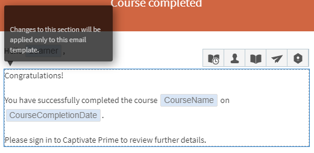

# 電子メールテンプレート

この記事では、すべての学習オブジェクトに関係する電子メールテンプレートの設定方法について説明します。

Learning Manager アプリケーションでは、イベントに基づき複数ロールのユーザーにメール通知が送信されます。

作成者は、内容の追加や編集を行い、学習者、マネージャー、作成者のアクティビティによってトリガーされた各種イベントについてユーザーに通知を送信することにより、電子メールテンプレートをカスタマイズすることができます。 例えば、学習者がコースに登録するたびに、カスタマイズされた電子メールを送信することができます。 学習者はコースの登録時に、そのコースの電子メールを自動的に受け取ります。

作成者は、電子メールテンプレートオプションを無効にすることにより、特定のイベントについて電子メール通知の送信を無効に設定することもできます。

## 電子メール通知の設定 {#settingemailnotifications}

1. 作成者アプリケーションで、電子メールテンプレートの設定対象となる学習オブジェクトをクリックします。 例えば、「コース」をクリックします。
1. 「学習オブジェクト」ページで、電子メールの設定対象となるコース、資格認定、または学習プログラムをクリックします。
1. 学習オブジェクトの詳細ページで「電子メールテンプレート」をクリックします。

   選択した学習オブジェクトで使用できるテンプレートのリストが表示されます。

   
   *テンプレートのリスト*

1. イベント名をクリックして、プレビューモードでテンプレートを表示します。

   

   *テンプレートプレビューを表示*

   テンプレートの本文内のテキストをクリックすると、各テンプレートをカスタマイズすることができます。 スナップショットに表示されている適切なアイコンをクリックすると、テキスト内に変数を挿入することができます。 各アイコンの上にマウスを置くと、名前が表示されます。

   
   *変数の挿入*

   次の変数を使用することができます。

   * LPName
   * LPCompletionDeadline
   * LearnerName
   * LearnerEmail
   * CourseName
   * CourseDescription
   * CourseCompletionDeadline
   * CourseSkillDetails
   * CourseBadge

   テンプレート上部の「元に戻す」をクリックすると、メッセージ本文をデフォルトの内容にリセットすることができます。

   テンプレートの先頭部分を見てわかるように、電子メール通知のタイプに応じて、テンプレートの対象ユーザーを役割別にカスタマイズすることができます（マネージャーや学習者など）。

1. テンプレートページ下部の「保存」をクリックします。
1. 「電子メールテンプレート」ページの「はい」ボタンまたは「いいえ」ボタンをクリックして、電子メール通知の有効と無効を切り替えます。

*電子メール通知を有効または無効にする*

各イベント名の通知ボタン内の丸が「はい」の側に表示されている場合（ボタンの背景が青になっている場合）は、通知が有効になっています。 通知ボタン内の丸が「いいえ」の側に表示されている場合（ボタンの背景がグレーになっている場合）は、通知が無効になっています。

コースレベルで電子メールテンプレートの設定を行った場合、そのコースについては、管理者レベルの設定よりもコースレベルの設定の方が優先されます。
