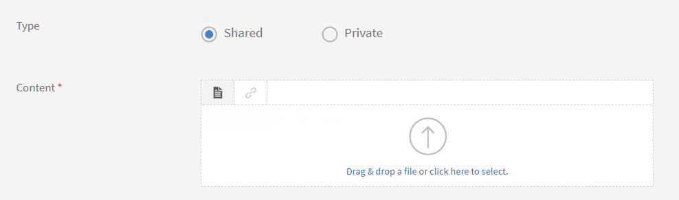

# 作業計画書

作業計画書とは、登録や完了条件なしに学習者がアクセスできるトレーニングコンテンツのリポジトリです。 学習者は、これらの作業計画書を参照して、組織内のアクティビティやタスクの実行に関するサポートを受けることができます。

作業計画書は、個別に使用することも、Learning Managerでコースを受講しながら使用することもできます。

作成者は、学習者向けの作業計画書を作成できます。 作業計画書を使用すると、学習者が継続的に使用してタスクを完了できるヒント、チェックリスト、ガイドなどの参考資料を提供できます。

## 作業計画書の作成 {#createjobaid}

1. 作成者ログインで、左ペインの「作業計画書」をクリックします。
1. 表示されるページの右上隅にある「作成」をクリックします。
1. 名前、説明、およびタグを入力します。 スキルと関連するレベルを選択します。 他の作成者が作業計画書にアクセスして個々のコースに割り当てることがないようにする場合は、コンテンツを非公開として選択します。

   作業計画書に使用できるのは、既存のスキルのみです。 スキルは必須ではありません。

1. コンテンツセクションで作業計画書のコンテンツをアップロードします。

   ビデオ、pdf、pptx、docxがアップロードでサポートされているファイル形式です。 プロジェクトのzipファイルまたはインタラクティブコンテンツのアップロードはサポートされていません。

1. 作業計画書の期間（分）を入力します。
1. クリック **[!UICONTROL 保存]**.

   作業計画書が公開されました。

## サポートされている作業計画書のタイプ {#typesofsupportedjobaids}

作業計画書でサポートされているファイル形式を次に示します。

* PDF
* PPT
* PPTX
* XLS
* XLSX
* DOC
* DOCX
* すべてのビデオファイル形式

>[!NOTE]
>
>Zipファイルと画像ファイルはサポートされていません。

## 作業計画書の取り消し/再公開 {#withdrawrepublishjobaids}

作業計画書の横にある設定アイコンをクリックし、「取り消し」を選択すると、公開した作業計画書を取り消すことができます。

*公開した作業計画書の編集、取り消しまたはプレビュー*

「取り消し」タブをクリックして、取り消した作業計画書を表示します。 取り消したジョブを再公開するには、設定アイコンをクリックして「公開」を選択します。

## 作業計画書でのHTMLパッケージのサポート

作業計画書が、新しいタイプのコンテンツとして標準のHTMLパッケージに対応するようになりました。 この機能強化により、学習者は、作業計画書プレーヤーからHTMLパッケージを開いて表示し、ダウンロードすることができます。

作成者は作業計画書を作成する際に、標準のHTMLパッケージを他のサポートされているファイル形式と共にアップロードできます。

*HTMLパッケージのサポート*

HTMLパッケージには、次のものが含まれている必要があります。

* Index.htmlファイル。
* Index.htmlファイルは、zipファイルのルートフォルダーにある必要があります。

アップロードするコンテンツをzipファイルとして指定し、このzipファイルにIndex.htmlファイルを格納します。

すべてのコンテンツ、リソース、アセットは、HTMLパッケージ内で参照され、Index.htmlからアクセスできる必要があります。

## よくある質問 {#frequentlyaskedquestions}

+++作業計画書を作成する方法

作成者として、[作業計画書]ページで、をクリックします。 **[!UICONTROL 作成]**. 必要な詳細を追加し、作業計画書を保存します。

作業計画書を作成した後、コースの作成中に、コースに作業計画書を追加できます。

+++

### その他の類似項目

* [管理者向け作業計画書](../../administrators/feature-summary/job-aids.md)
* [学習者向け作業計画書](../../learners/feature-summary/job-aids.md)
