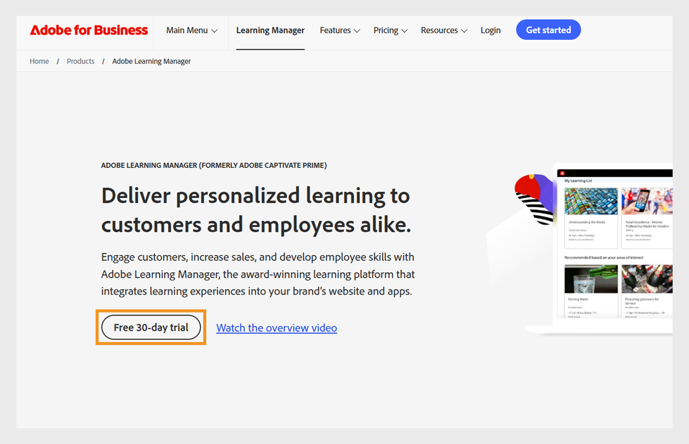

# Adobe Learning Managerで体験版アカウントを作成する

Adobe Learning Managerで30日間無料の体験版アカウントを簡単に設定して、機能を確認したり、学習ワークフローをテストしたりできます。 このガイドでは、最初のステップ、サインアップ方法、セットアップ後にアカウントの詳細を見つける方法について説明します。

体験版アカウントを作成するには：

1. [Adobe Learning Manager](https://business.adobe.com/products/learning-manager/adobe-learning-manager.html)に移動します。
2. **[!UICONTROL 30日間の無料体験]**&#x200B;を選択します。

   

3. ログインページで「**[!UICONTROL アカウントを作成]**」を選択します。

   

4. **[!UICONTROL メールアドレス]**&#x200B;と&#x200B;**[!UICONTROL パスワード]**&#x200B;を入力してください。

   

5. 次の詳細を入力して、**[!UICONTROL アカウントの作成]**&#x200B;を選択します：
   * 名前（名）
   * 姓
   * 生年月日

   

6. 体験版アカウントを設定するために必要な詳細情報を入力したフォームに入力します。
7. セットアップが完了したら、Adobe Learning Manager URLのURLでアカウントIDを確認します。

   

