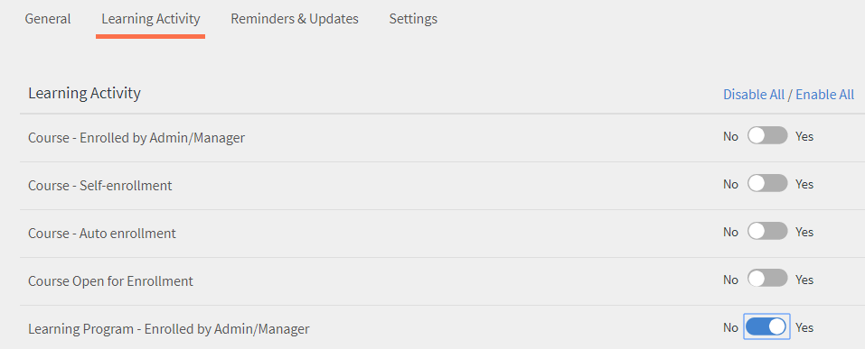
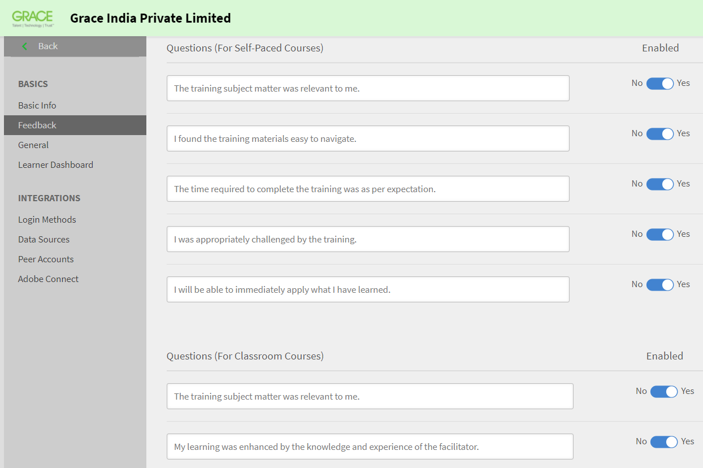

# Learning Managerデプロイメントガイド

## はじめに {#introduction}

Learning Managerは学習管理システム(LMS)の1つです。これを使用すると、トレーニングの専門家は、組織のニーズや目標に貢献する魅力的で追跡可能な学習教材を提供できます。 Learning Managerでは主に、トレーナーやマネージャーが学習者にコースや他の学習目標を特定の順序で割り当てることができるようになります。 このツールには、マルチフォーマットのFluidicプレーヤー、ゲーミフィケーション、バッジ、使いやすい学習者ダッシュボードなど、いくつかの強力な機能も用意されています。 ただし、これらの機能をすべて活用するには、まずLearning Managerの設定を行う必要があります。

このガイドでは、Learning Managerを起動し、実行するための手順を説明します。 このドキュメントでは、設定とセットアップの詳細についても説明します。 以下では、Learning Managerの使用を開始する方法について説明します。

## このガイドの対象者 {#whoisthisguideintendedfor}

Learning Managerユーザーは、管理者、作成者、インストラクター、マネージャー、学習者など、異なる立場で作業することができます。 このガイドは、組織やクライアントのためにLMSの設定を行う可能性が高い、以下のユーザーを対象としています。

* **IT管理者** - IT管理者として、組織内でLearning Managerのライセンス認証や統合を行うことができます。 IT管理者は、1人または複数のユーザーを追加できます。また、統合管理者の役割や、Learning Managerとサードパーティ製アプリケーションの統合を担当する管理者の役割も実行できます。
* **作成者** - Learning Manager作成者は、組織の学習要件として必要な学習コンテンツを作成できます。 作成者は、Learning Managerにアップロードする基本的なコンテンツの作成に関与します。

* **Learning Manager管理者** - Learning Manager管理者は、アプリケーションに関連する設定および設定アクティビティを実行します。 企業によっては、IT管理者がLearning Manager管理者の役割を兼任する場合もあります。

## Learning Managerの導入を開始する {#getstartedwithcaptivateprimedeployment}

Learning Managerを購入したら、受け取ったライセンスキーを使用してLearning Managerアカウントをアクティベートします。 次の図に示すように、次の設定に進みます。

## Learning Managerでのサイトの設定 {#configureyoursiteincaptivateprime}

Learning Managerで学習オブジェクトの追加と実装を開始する前に、いくつかの重要な設定を行う必要があります。 まず、組織に合わせてサイトを設定します。 サイトの設定は、次の手順で構成されます。

* 組織のブランディングとロゴを設定する
* 電子メールテンプレートの設定
* 基本アカウント設定の構成
* フィードバック設定の構成
* 学習者ダッシュボードの設定

### ブランディングとロゴの設定 {#setupbrandingandlogo}

管理者は、組織のブランディング要件に合わせてブランディングとテーマを設定できます。 サイトのブランディングとテーマを設定するには、次の操作を行います。

### ロゴとバナーの設定： {#settingthelogoandbanner}

ロゴとバナーの設定を使用して、Learning Managerに会社のロゴを表示します。 ブランディングオプションを設定して、URLに会社のドメインを設定し、組織名を表示し、組織のブランドに一致するカラースキームを表示します。 ブランディング設定を構成するには、次の操作を行います。

* 自分のLearning Managerアカウントに管理者としてログインします。
* 左ペインで、 **ブランディング**.
* ブランディングページで、次のオプションをクリックして設定できます。 **編集** 変更するオプションに対して、次の操作を行います。

   * **組織名** ：ここで指定した値が、サイトの各ページにあるバナーに表示される名前になります。
   * **サブドメイン**：この値がサイトのURLになります。
   * **ロゴのスタイル**：このフィールドの画像が、各ページの右上隅にロゴとして表示されます。 ロゴのみを表示するか、組織名を表示するか、ロゴと組織名の両方を表示するかを選択できます。

>[!NOTE]
>
>名前とロゴの設定は、ブランディングでのみ行うことができます。 ロゴまたは画像の位置は変更できません。

***Learning Managerでは、ロゴ画像の次のファイル形式をサポートしています。 .png、.jpeg、.jpg、.gif、.bmp***

### サイトのテーマの設定 {#settingthethemesforyoursite}

Learning Managerでは、テーマを使用してサイトの外観を変更できます。 アプリケーションには、次のカラーテーマが用意されています。

* Primeデフォルト
* 小石
* カーニバル
* 秋
* 冬の空

企業のブランディングに沿ったカラースキームを1つ選択できます。

1. Learning Managerの左側のナビゲーションペインで、次をクリックします **[!UICONTROL ブランディング]**.
1. を **テーマ** セクションをクリック **[!UICONTROL 編集]**. アプリケーションを使用すると、新しいテーマを選択できます。 テーマを選択すると、主要なインターフェイス要素に使用されているカラースキームをすぐに確認できます。

   

1. さらに、 **トップバーのカラー**, **アクセントカラー**、および **サイドバーの明るさ**.  これらの主要なインターフェイス要素には、独自のブランドカラーを使用できます。
1. テーマの既定の配色に値をリセットするには、[ **[!UICONTROL テーマをリセット]**. 主要なUI要素のカラーは、選択したテーマのデフォルトオプションに設定されます。
1. テーマを選択したら、 **[!UICONTROL ヒントを表示]** プレビューにラベルまたはヒントを表示します。

   

   スライドショーに複数の画像が表示されています **テーマ** セクションに追加します。 このスライドショーでは、テーマまたはカラースキームを即座にプレビューできます。 ホームページや学習者ダッシュボードなど、選択したページを即座にプレビューできます。

1. ブラウザで変更をプレビューする場合は、 **[!UICONTROL ライブプレビュー]**. ライブテーマのプレビューポップアップが表示されます。このポップアップでは、カラースキームを変更したり、デフォルトのオプションのまま続行したりできます。 ブラウザでオプションをプレビューするには、 **[!UICONTROL プレビュー]** このポップアップウィンドウで

   

1. 選択したオプションが一時的にサイトに適用されます。 選択したテーマと色の設定を保存するには、 **[!UICONTROL 適用]**.
1. テーマを選択して適用したら、 ****[!UICONTROL 保存]**** 選択を保存します。

## 電子メールテンプレートの設定 {#configureemailtemplates}

管理者が行う次の手順は、各種イベントに対する電子メールテンプレートの設定です。 ユーザーに送信する電子メールテンプレートを有効、無効および変更できます。 電子メールテンプレートには、主に次の3つのカテゴリがあります。

* 一般的な電子メールテンプレート：これらの電子メールは、一般的なイベントに対してトリガーされます。 例えば、ユーザーが初めてログインしたときのようこそ通知が表示されます。
* 学習オブジェクトまたは学習アクティビティに関連する電子メールテンプレート：これらの電子メールは、学習アクティビティが存在する場合に、学習者、作成者、またはマネージャーに送信されます。 コースの登録、教室への参加、コースの完了などでトリガーされる電子メールなどです。
* リマインダーとアップデート：これらの電子メールは、ユーザーがイベントのアップデートまたはリマインダーを必要としている場合にトリガーされます。 例えば、学習者が今後のコースに関するリマインダーを受け取った場合や、管理者が共有レポートに関する電子メール通知を受け取った場合などです。

管理者ダッシュボードから、これらの電子メール通知のいずれかを有効にして設定できます。 電子メールテンプレートを設定する方法については、次の手順を実行します。

1. 左側のナビゲーション・ペインで、 **[!UICONTROL **&#x200B;電子メールテンプレート&#x200B;**.]**
1. 次のいずれかのタブをクリックします。**[!UICONTROL **&#x200B;一般&#x200B;**/**&#x200B;学習アクティビティ&#x200B;**/**&#x200B;リマインダーとアップデート&#x200B;**.]** 例えば、 **[!UICONTROL **&#x200B;学習アクティビティ&#x200B;**.]**
1. 電子メールをトリガーするアクティビティのトグルボタンをクリックします。 この例では、 **[!UICONTROL **&#x200B;学習プログラム – 管理者/マネージャーが登録&#x200B;**.]**

   

   「正常に有効になりました」というポップアップメッセージが表示されます。 これで、マネージャーまたは管理者がコースに学習者を登録すると、このLearning Managerアカウントから学習者に電子メールが送信されるようになりました。

1. デフォルトの電子メールテンプレートを変更できます。 これを行うには、イベントをクリックします。 この例では、次をクリックします **[!UICONTROL 学習プログラム – 管理者/マネージャーが登録]**
1. を **[!UICONTROL テンプレートプレビュー]** ポップアップダイアログボックスには、次の2つのタブがあります。 [!UICONTROL 学習者] および [!UICONTROL マネージャー].

   

   これらの各タブで、電子メールの本文をクリックして内容を変更します。 電子メールテンプレートへの変更を保存するには、 **[!UICONTROL 保存]**.

   これで、マネージャーまたは管理者が学習者をコースに登録すると、その学習者とマネージャーに電子メール通知が送信されるようになりました。

   ***注意：変更は、選択したイベントに関連付けられている電子メールテンプレートに対してのみ適用されます。***

1. 電子メールテンプレートのアカウントURLまたは署名を変更できなかったことに注意してください。 を変更するには **[!UICONTROL アカウントURL]** または **[!UICONTROL 署名]**&#x200B;を選択し、 **[!UICONTROL 設定]** タブをクリックします。 このタブでは、電子メールバナー、電子メール署名、アカウントURLを変更できます。

   「アカウントURL」リンクは、すべての電子メールで、署名の直前に表示されます。 希望するURLを入力し、 **[!UICONTROL 保存]**. このURLは、社内ユーザーにのみ表示されます。

   電子メールバナーについては、次を選択してバナーの色を変更できます。  **[!UICONTROL **&#x200B;バナーの背景&#x200B;**.]** カスタム画像をバナーとして使用するには、 **[!UICONTROL カスタム画像]** オプションです。 クリック  **[!UICONTROL 保存]** 変更を行った後

   ***注意：電子メールバナーのカスタム画像サイズは1240 x 200 pxである必要があります。 推奨サイズより大きい画像はトリミングされます。***

   ***Learning Managerで電子メールバナーとして使用できるファイル形式は.jpg、.jpegおよび.pngのみです。***

   

1. オプションのマネージャーメールを有効にすることもできます。 次を選択した場合 **[!UICONTROL 有効にする]** チェックボックスをオンにすると、このPrimeアカウントからダイレクトレポートに電子メールが送信された場合に、マネージャーにもその電子メールが送信されます。

   ***注意：このタブの設定は、すべてのテンプレートに対してグローバルに適用されます。***

### 学習オブジェクト用の電子メールテンプレートの設定 {#configureemailtemplatesforalearningobject}

管理者は、グローバルレベルでの電子メールテンプレートの設定とは別に、特定の学習オブジェクトに関する電子メールテンプレートを設定することもできます。 この場合、電子メールテンプレートに加えた変更は、その学習目標にのみ適用されます。

このオプションは、作成者が学習オブジェクトを設定する際にも使用できます。

学習オブジェクトの電子メールテンプレートを設定するには：

1. 電子メールテンプレートを設定するコース、学習プログラム、または資格認定をクリックします。
1. 左ペインで、 **[!UICONTROL **&#x200B;電子メールテンプレート&#x200B;**.]** システムに、 ****[!UICONTROL テンプレートプレビュー]**** ポップアップダイアログボックス。
1. 電子メールテンプレートの件名または本文を変更し、「 」をクリックします**[!UICONTROL **保存**]**変更を適用します。
1. 変更をキャンセルするには、 **[!UICONTROL **&#x200B;元に戻す&#x200B;**.]**

### ユーザーが電子メールを受信できないように制限する {#restrictusersfromreceivingemails}

管理者は、Learning Managerからの電子メールを受信するユーザーと受信しないユーザーを選択できます。 これを行うには、 ****[!UICONTROL 制限付きユーザー]**** **の下の選択肢&#x200B;**[!UICONTROL 設定]** **tabキーを押します。 ユーザーは、名前、電子メールID、または一意のユーザーIDを使用して、このリストに追加できます。 このオプションにリストされたユーザーは、Learning Managerからの電子メール通信の受信が制限されます。

## アカウント設定の構成 {#configureyouraccountsettings}

Learning Managerでは、基本設定、フィードバック設定、一般設定、学習者ダッシュボードの設定など、アカウントに関するいくつかの設定を行うことができます。 次の手順では、これらの各設定を構成する方法について説明します。

### 基本設定を構成する {#configurebasicsettings}

1. Learning Managerホームページで、次をクリックします ****[!UICONTROL 設定]****. デフォルトでは、基本情報ページが表示されます。このページには、デフォルトの言語と場所のフィールドがあります。
1. クリック ****[!UICONTROL 変更]**** をクリックします。
1. 次のオプションを設定します。

   * **国**：このドロップダウンフィールドから国を選択します。
   * **タイムゾーン**：自分の居住地のタイムゾーンを設定します。
   * **ロケール**：使用する言語を選択します。 このフィールドで言語を変更すると、このアプリケーションを使用するすべてのユーザーに変更が適用されます。 ただし、各ユーザーは個別に言語を変更できます。
   * **会計年度の開始月**：組織の会計年度の開始月を選択します。

   

## フィードバック設定の構成 {#configurefeedbacksettings}

Learning Managerでは、学習者からコースに関するフィードバックを収集できます。 Learning Managerを使用して、学習者に関するフィードバックを収集することもできます。 フィードバックを送信してもらうには、まずL1タイプとL3タイプのフィードバックを設定する必要があります。

L3フィードバックは、マネージャーが提供する、学習者に関するフィードバックです。 このタイプのフィードバックを使用すると、学習者の成績を経時的に追跡できます。 L1フィードバックは、学習者が提供する、コースに関するフィードバックです。 このタイプのフィードバックは、管理者がコースに関する直接のフィードバックを収集するのに役立ちます。

管理者は、フィードバックの設定をグローバルに行うことができます。 これを行うには、次の手順に従います。

1. Learning Managerホームページで、次をクリックします **[!UICONTROL 設定]**.
1. 左側のペインで、をクリックします。 **[!UICONTROL 一般]**.
1. L1フィードバックを設定するには、 **[!UICONTROL L1フィードバック]** タブをクリックします。 必須の質問を1つ設定するオプションと、オプションの質問がいくつか表示されます。 学習者は、コースの完了後にこれらの質問に回答する一方でフィードバックを提供します。 質問は、学習者が1～5の範囲で回答できる内容にしてください。

   L1フィードバックの最初の部分は、学習者が友人や同僚にこのコースをどのように勧められるかを尋ねる必須の質問となります。

   ***注意：必須の質問を編集または変更することはできません。***

   

1. フィードバックアンケートの他の質問を設定するには、 ****[!UICONTROL セルフペースコース]****、または ****[!UICONTROL 教室コース]****. 質問をクリックすると、デフォルトの質問を編集できます。

   

1. デフォルトの質問を有効または無効にするか、要件に合わせてデフォルトの質問を完全に変更することができます。 例えば、デフォルトの「トレーニングの内容は、自分の仕事に関連するものだった」という質問を削除し、追加した「トレーニングは有用で関連性の高いものになるだろうと感じた」という質問に置き換えることができます。
1. 学習者向けの質問を確定した後、リマインダーの設定を変更できます。 デフォルトでは、コースを正常に完了した学習者に対して自動で送信されるリマインダーが設定されています。 このリマインダーは、学習者の回答があるまで2週間ごとに再送されるように設定されています。 リマインダーをクリックして既存のリマインダーを変更したり、新しいリマインダーを追加したりできます。

   

1. 次のオプションを設定して、リマインダーの設定を行います。

   * **送信するタイミング**：フィードバック要求をコースの完了時に送信するか、コースの完了後に送信するかを指定します。
   * **完了後の日数**：フィードバック要求を送信するまでの日数を指定します。 このフィールドは、選択した場合にのみ表示されます ****[!UICONTROL コースの完了後]****.

   * **繰り返し**：フィードバックリマインダーを再送する周期を毎日、毎週、または毎月のいずれかで指定します。 また、リマインダーを何週間送信するかを指定することもできます。

1. チェックマークをクリックしてリマインダーの設定を保存します。
1. フィードバックに関するすべての設定が確定したら、をクリックします**[!UICONTROL **保存**]**をクリックします。

## L3フィードバックの設定： {#configurel3feedback}

L3フィードバックには、学習者がコースを完了した後に、学習者のマネージャーに送信される質問が含まれています。 L3フィードバックを使用すると、管理者は学習者の行動やスキルの経時的な変化を追跡できます。 このフィードバックを設定するには、フィードバックページで ****[!UICONTROL L3フィードバック]**** タブをクリックします。 デフォルトの質問が1問表示されます。 マネージャーは、この質問に5段階の評価尺度で回答する必要があります。

L1フィードバックと同様に、L3フィードバックのリマインダーを設定できます。 既存のリマインダーを変更したり、新しいフィードバックリマインダーを追加したりできます。

フィードバックの質問とリマインダーの設定が完了したら、 ****[!UICONTROL 保存]**** をクリックして設定を適用します。

## フィードバックをインスタンスレベルで設定する {#configurefeedbackataninstancelevel}

前述の手順は、フィードバック設定をグローバルレベルで設定する手順の概略を示しています。 つまり、設定はすべてのコースに適用されます。 これらのグローバルな質問に加えて、管理者または作成者は、L1およびL3フィードバックに関する追加の質問をインスタンスレベルで設定できます。

フィードバックに関する設定をインスタンスレベルで変更するには、以下の手順に従います。

1. Learning Managerホームページで、次をクリックします **[!UICONTROL コース]**.
1. フィードバックに関する設定を変更するコースにカーソルを合わせます。 クリック [!UICONTROL **コースを表示**.]

   

1. コースの詳細ページで、をクリックします。 **[!UICONTROL インスタンスの既定値]** をクリックします。
1. を [!UICONTROL **言語**] ドロップダウンリストで、表示するフィードバックアンケートの言語を選択します。
1. 学習者からのフィードバックが必要な場合は、L1リアクションフィードバックを有効にします。 このセクションでは、質問を2つまで追加できます。 学習者は、これらの質問に対して記述的な回答を提供できます。
1. を選択します **[!UICONTROL 必須にする]** 一方または両方の質問に対する回答を必須にする場合は、このチェックボックスをオンにします。
1. を選択します **[!UICONTROL コース完了後すぐにアンケートを表示]** 学習者がコースを完了した直後にフィードバックアンケートを表示する場合。

   

1. L3行動変化フィードバックをインスタンスレベルで設定するには、 ****[!UICONTROL 有効にする]**** l3フィードバック。 定義済みの必須の質問と、任意の質問を入力できる空白の質問が表示されます。
1. コース受講後の学習者の改善点に関する定義済みの質問の場合、回答はリーカット尺度の形式になります。 つまり、マネージャーは「非常に同意できる」から「非常に同意できない」までの尺度でオプションを選択する必要があります。
1. マネージャーに対する2つ目の質問を指定します。 マネージャーは、この質問に対して記述的な回答を提供できます。
1. を選択します ****[!UICONTROL 必須にする]**** 2つ目の質問に対する回答を必須にする場合は、このチェックボックスをオンにします。

   

1. 必要に応じて、リマインダーの設定をインスタンスレベルで構成します。 ここでリマインダーの設定を構成しない場合は、グローバルなリマインダー設定が自動的に割り当てられます。
1. フィードバックの質問とリマインダーの設定が完了したら、をクリックします**[!UICONTROL **保存**]**設定を適用します。

   ***注意：フィードバックの設定は、資格認定には適用されません。***

## 一般設定の構成 {#configuregeneralsettings}

管理者は、Learning Managerの一般設定を使用して、アプリケーションの他の機能に影響する一般的な設定を構成できます。 例えば、一般設定を使用して、コースの有効性を学習者に表示するかどうかを指定できます。 一般設定を構成するには、次の操作を行います。

1. Learning Managerホームページで、次をクリックします ****[!UICONTROL 設定]****.
1. 左側のペインで、をクリックします。 ****[!UICONTROL 一般]****.
1. 「一般設定」ページでは、次のオプションを設定できます。

   これらのオプションが作用する機能は、それぞれ異なります。 必要に応じて、詳細な機能のそれぞれに対するクロスリンクを提供できます。

   * **コースの有効性を表示**：学習者がタイトルを見てこのオプションを有効にすると、コースの有効性を確認できます。
   * **モジュールリセットオプション**：学習者がモジュールをリセットできるようにする場合は、このオプションを有効にします。 その後、学習者は、モジュールに失敗した場合、またはモジュールを部分的に完了した後に再開する場合に、モジュールをリセットできます。
   * **コースの管理**：コースに対する変更を管理者が承認する前に、その変更が学習者に表示されるようにする場合は、このオプションを有効にします。
   * **ディスカッション掲示板**：学習者がコースに関するディスカッションボードを表示して参加できるようにする場合は、このオプションを有効にします。 有効にする場合 **ディスカッション掲示板** チェックボックスをオンにすると、学習者とインストラクターはコースに関するコメントを投稿できます。 ただし、コースレベルの設定によってこの機能が選択されていないことが示される場合は、管理者による設定よりもコースレベルの設定の方が優先されます。

   * **スキルオプションを検索**：学習者がピアおよびリーダーシップスキルを検索できるようにする場合は、このオプションを有効にします。
   * **一意の学習目標ID**：作成者が学習目標に一意のIDを追加できるようにする場合は、このオプションを有効にします。
   * **カタログリストを表示**：学習者が利用可能なすべてのカタログを表示できるようにする場合は、このオプションを有効にします。 このオプションは、学習者が学習オブジェクトのリストを絞り込むのに役立ちます。

   

## 学習者ダッシュボードの設定 {#configurelearnerdashboardsettings}

Learning Managerの学習者ダッシュボードでは、学習者は自分の達成、スキル、アナウンスとは別に、必須のコースや推奨されるコースを表示できます。 管理者は、学習者ダッシュボードの設定を変更することで、この学習者ダッシュボードの表示方法を決定できます。 これらの設定により、管理者は「学習者」ページでウィジェットを設定できるようになります。 これらの設定では、ウィジェットを学習者ダッシュボードに配置する方法と場所も指定します。 管理者は、設定を適用する前に学習者ダッシュボードのレイアウトをプレビューできます。

1. Learning Managerホームページで、次をクリックします **[!UICONTROL 設定]**.
1. 左側のナビゲーション・ペインで、 **[!UICONTROL **&#x200B;学習者ダッシュボード&#x200B;**.]**
1. 有効にするウィジェットを選択します。 ウィジェットの選択を解除すると、そのウィジェットはプレビューからすぐに削除されます。 学習者のダッシュボードには、このウィジェットは表示されません。
1. クリック ****[!UICONTROL 保存]**** をクリックして、設定を適用します。

   

1. デフォルト設定を適用するには、 **[!UICONTROL デフォルトに戻します。]** この場合、を除くすべてのウィジェット **[!UICONTROL ウェルカムメッセージと注釈アナウンス]** が表示されます。

   ***学習者ダッシュボードの設定を有効にした後でも、学習者は各自のダッシュボードでウィジェットを変更および移動できます。***

