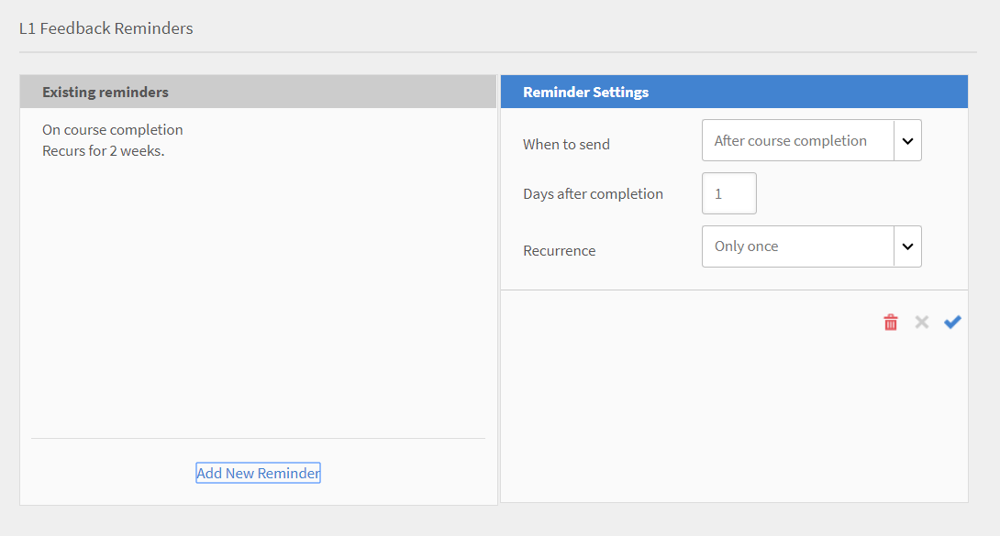
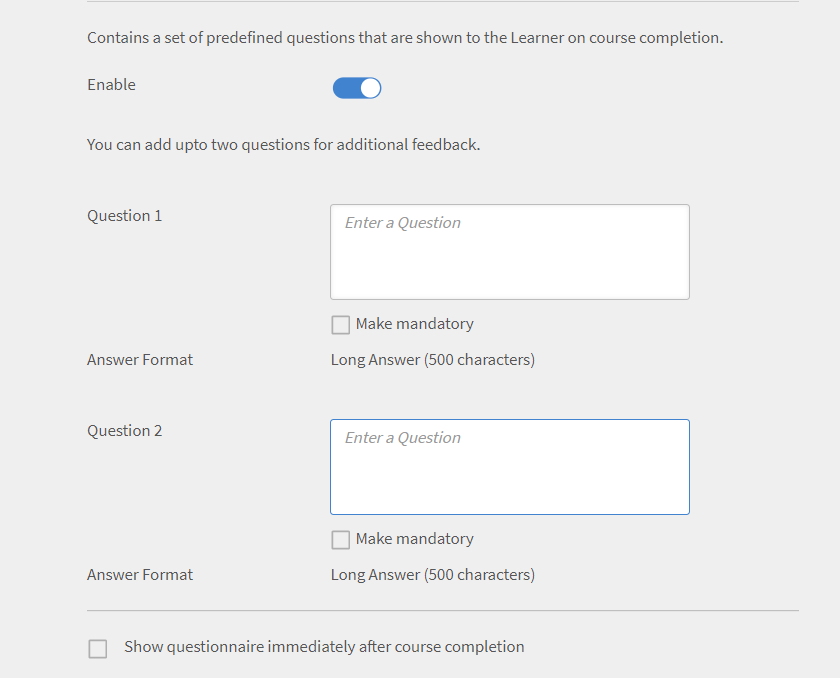

# Learning Manager 展開ガイド

## 概要 {#introduction}

Learning Managerは学習管理システム(LMS)の1つです。これを使用すると、トレーニングの専門家は、組織のニーズや目標に貢献する魅力的で追跡可能な学習教材を提供できます。 Learning Manager は主に、トレーナーやマネージャーが、学習者に特定の順序でコースや他の学習オブジェクトを割り当てるために使用します。このツールには、マルチフォーマットの Fluidic プレーヤー、ゲーミフィケーション、バッジ、使いやすい学習者ダッシュボードなど、複数の強力な機能も備わっています。 ただし、これらの機能を利用するには、最初に Learning Manager の設定を行う必要があります。

このガイドには、Learning Manager を起動し、実行するための手順が記載されています。また、設定に関する詳細な情報も記載されています。 このガイドを読んで、Learning Manager を始めましょう。

## 対象読者 {#whoisthisguideintendedfor}

Learning Manager は、管理者、作成者、インストラクター、マネージャー、学習者など、異なる立場で使用する LMS です。このガイドは、組織やクライアントのために LMS の設定を行う可能性が高い、以下のようなユーザーを対象としています。

* **IT管理者** - IT管理者として、組織内でLearning Managerのライセンス認証や統合を行うことができます。 IT 管理者は、1 人または複数人のユーザーを追加したり、統合管理者（Learning Manager とサードパーティ製アプリケーションの統合を担当する管理者）としての役割を実行したりできます。
* **作成者** - Learning Manager作成者は、組織の学習要件に必要な学習コンテンツを作成できます。 作成者は、Learning Managerにアップロードする基本的なコンテンツの作成に関与します。

* **Learning Manager管理者** - Learning Manager管理者は、アプリケーションに関連する設定を行います。 企業によっては、IT 管理者が Learning Manager の管理者を兼任する場合もあります。

## Learning Manager の導入を開始する {#getstartedwithcaptivateprimedeployment}

Learning Manager を購入したら、受け取ったライセンスキーで Learning Manager アカウントをアクティブ化してください。以下の図に示すように設定を進めます。

## Learning Manager でサイトを設定する {#configureyoursiteincaptivateprime}

Learning Manager に学習オブジェクトを追加し、実装する前に、いくつかの重要な設定を行う必要があります。組織に合うようにサイトを設定する作業から始めます。 この作業には、以下の手順が含まれます。

* 組織のブランディングとロゴに関する設定
* 電子メールテンプレートに関する設定
* アカウントに関する基本設定
* フィードバックに関する設定
* 学習者ダッシュボードに関する設定

### ブランディングとロゴを設定する {#setupbrandingandlogo}

管理者は、組織のブランディング要件に合わせてブランディングとテーマを設定できます。 サイトのブランディングとテーマを設定するには、以下の操作を行います。

### ロゴとバナーの設定 {#settingthelogoandbanner}

ロゴとバナーの設定を使用して、Learning Managerに会社のロゴを表示します。 ブランディングオプションを設定して、URLに会社のドメインを設定し、組織名を表示し、組織のブランドに一致するカラースキームを表示します。 ブランディングに関する設定を行うには、以下の操作を行います。

* 管理者として、自分の Learning Manager アカウントにログインします。
* 左ペインで、**「ブランディング」**&#x200B;をクリックします。
* 以下のオプションはブランディングページで設定可能です。変更するオプションの&#x200B;**「編集」**&#x200B;をクリックします。

   * **組織名** ：ここで指定した値が、サイトの各ページにあるバナーに表示される名前になります。
   * **サブドメイン**：この値がサイトのURLを決定します。
   * **ロゴのスタイル** ：このフィールドの画像が、各ページの右上隅にロゴとして表示されます。 ロゴのみを表示するか、組織名を表示するか、ロゴと組織名の両方を表示するかを選択できます。

>[!NOTE]
>
>名前とロゴの設定は、ブランディングでのみ行うことができます。 ロゴや画像の位置は変更できません。

***Learning Managerでは、ロゴ画像について次のファイル形式をサポートしています： .png、.jpeg、.jpg、.gif、.bmp***

### サイトのテーマの設定 {#settingthethemesforyoursite}

Learning Manager では、テーマを使用してサイトの外観を変更できます。以下のカラーテーマが選択できます。

* Prime デフォルト
* ペブル
* カーニバル
* オータム
* ウィンタースカイ

企業のブランディングに沿ったカラースキームを 1 つ選択できます。

1. Learning Manager の左側のナビゲーションペインで&#x200B;**[!UICONTROL 「ブランディング」]**&#x200B;をクリックします。
1. **テーマ**&#x200B;セクションで&#x200B;**[!UICONTROL 「編集」]**&#x200B;をクリックします。 新しいテーマを選択できます。 テーマの選択は、カラースキームを確認しながら行えます。カラースキームは、主要なインターフェイス要素に使用されます。

   

1. さらに、**上部バーの色**、**アクセントの色**、**サイドバーの明るさ**&#x200B;を編集できます。  これらの主要なインターフェイス要素には、独自のブランドカラーを使用できます。
1. デフォルトのカラースキームにテーマの値をリセットするには、**[!UICONTROL 「テーマをリセット」]**&#x200B;をクリックします。 主要な UI 要素の色は、選択したテーマのデフォルトオプションに設定されています。
1. テーマの選択後に&#x200B;**[!UICONTROL 「ヒントを表示」]**&#x200B;をクリックすると、プレビューにラベルまたはヒントが表示されます。

   

   **テーマ**&#x200B;セクションに複数の画像のスライドショーが表示されています。 このスライドショーでは、テーマやカラースキームを即座にプレビューできます。 ホームページや学習者ダッシュボードなど、選択したページを即座にプレビューできます。

1. ブラウザで変更をプレビューするには、**[!UICONTROL 「ライブプレビュー」]**&#x200B;をクリックします。 ライブテーマのプレビューポップアップが表示されます。このポップアップでは、カラースキームを変更したり、デフォルトオプションのまま維持したりできます。 ブラウザで自分の選択内容をプレビューするには、このポップアップウィンドウの&#x200B;**[!UICONTROL 「プレビュー」]**&#x200B;をクリックします。

   

1. 選択したオプションが一時的にサイトに適用されます。 選択したテーマと色の設定を保存する場合は、**[!UICONTROL 「適用」]**&#x200B;をクリックします。
1. テーマを選択して適用したら、****[!UICONTROL 「保存」]****&#x200B;をクリックして選択内容を保存します。

## 電子メールテンプレートの設定 {#configureemailtemplates}

管理者が行う次の手順は、各種イベントに対する電子メールテンプレートの設定です。 ユーザーに送信する電子メールテンプレートを有効化、無効化、修正することができます。 電子メールテンプレートには、以下の 3 つのメインカテゴリーが存在します。

* 一般的な電子メールテンプレート：これらの電子メールは、一般的なイベントに対してトリガーされます。 ユーザーの初回ログイン時に送信する歓迎用の通知などが例として挙げられます。
* 学習オブジェクトまたは学習アクティビティに関連する電子メールテンプレート：これらの電子メールは、学習アクティビティが存在する場合に、学習者、作成者、またはマネージャーに送信されます。 コースへの登録、クラスへの参加、コースの完了などでトリガーされる電子メールなどが例として挙げられます。
* リマインダーとアップデート：これらの電子メールは、ユーザーが何らかのイベントに対するアップデートまたはリマインダーを必要としている場合にトリガーされます。 学習者向けの次回のコースに関するリマインダーや、管理者向けのレポートの共有に関する電子メール通知などが例として挙げられます。

これらの電子メール通知の有効化と設定は、管理者ダッシュボードから行います。 電子メールテンプレートの設定方法を学習するには、以下の手順に従います。

1. 左側のナビゲーションウィンドウで、**[!UICONTROL **&#x200B;電子メールテンプレート&#x200B;**.]**&#x200B;をクリックします。
1. 次のタブのいずれかをクリックします： **[!UICONTROL **&#x200B;一般&#x200B;**/**&#x200B;学習アクティビティ&#x200B;**/**&#x200B;リマインダーとアップデート&#x200B;**。]**&#x200B;例として、**[!UICONTROL **&#x200B;学習アクティビティ&#x200B;**をクリックしたとします。]**
1. 電子メールをトリガーするアクティビティの切り替えボタンをクリックします。 この例では、**[!UICONTROL **&#x200B;学習プログラム – 管理者/マネージャーが登録&#x200B;**をクリックしたとします。]**

   

   「正常に有効になりました」というポップアップメッセージが表示されます。 これで、マネージャーまたは管理者がコースに学習者を追加すると、この Learning Manager アカウントからその学習者に電子メールが送信されるようになりました。

1. デフォルトの電子メールテンプレートは変更可能です。 これを行うには、イベントをクリックします。 この例では、**[!UICONTROL 学習プログラム – 管理者/マネージャーが登録]**&#x200B;をクリックします。
1. **[!UICONTROL テンプレートプレビュー]**&#x200B;ポップアップダイアログボックスに、次の2つのタブが表示されています。[!UICONTROL 学習者]と[!UICONTROL マネージャー]。

   

   これらの各タブで電子メールの本文をクリックして内容を変更します。 電子メールテンプレートに対する変更を保存するには、**[!UICONTROL 「保存」]**&#x200B;をクリックします。

   これで、マネージャーまたは管理者がコースに学習者を登録すると、その学習者およびマネージャーは電子メール通知を受信するようになりました。

   ***注意：変更は、選択したイベントに関連付けられている電子メールテンプレートにのみ適用されます。***

1. 電子メールテンプレートのアカウント URL または署名を変更できなかったことに注意してください。 **[!UICONTROL アカウント URL]** または&#x200B;**[!UICONTROL 署名]**&#x200B;を変更するには、**[!UICONTROL 「設定」]**&#x200B;タブをクリックします。 このタブでは、電子メールバナー、電子メール署名、アカウント URL を変更できます。

   「アカウント URL」リンクは、すべての電子メールで、署名の直前に表示されます。 希望するURLを入力し、「**[!UICONTROL 保存]**」をクリックします。 この URL は、社内ユーザーにのみ表示されます。

   電子メールバナーについては、「**[!UICONTROL **&#x200B;バナーの背景&#x200B;**」を選択してバナーの色を変更できます。]** **[!UICONTROL [ユーザー設定の画像]]**&#x200B;オプションを選択すると、ユーザー設定の画像をバナーとして使用することもできます。 変更を行ったら、**[!UICONTROL [保存]]**&#x200B;をクリックします。

   ***注意：電子メールバナーのカスタム画像サイズは1240 x 200 pxである必要があります。 推奨サイズより大きい画像はトリミングされます。***

   ***Learning Managerで電子メールバナーに使用できるファイル形式は.jpg、.jpegおよび.pngのみです。***

   

1. オプションのマネージャーメールを有効にすることもできます。 「**[!UICONTROL 有効にする]**」チェックボックスをオンにすると、このPrimeアカウントからダイレクトレポートに電子メールが送信された場合に、マネージャーにもその電子メールが送信されます。

   ***注意：このタブの設定は、すべてのテンプレートに対してグローバルに適用されます。***

### 学習オブジェクトに関する電子メールテンプレートを設定する {#configureemailtemplatesforalearningobject}

管理者は、グローバルレベルでの電子メールテンプレートの設定とは別に、特定の学習オブジェクトに関する電子メールテンプレートを設定することもできます。 この場合、電子メールテンプレートに加えた変更は、対象の学習オブジェクトに関連する電子メールテンプレートにのみ適用されます。

このオプションは、学習オブジェクトの設定時に作成者が利用することもできます。

学習オブジェクトに関する電子メールテンプレートを設定するには、以下の手順に従います。

1. 電子メールテンプレートの設定を変更するコース、学習プログラム、または資格認定をクリックします。
1. 左ペインで、**[!UICONTROL **&#x200B;電子メールテンプレート&#x200B;**をクリックします。]******[!UICONTROL テンプレートプレビュー]****&#x200B;ポップアップダイアログボックスが表示されます。
1. 電子メールテンプレートの件名または本文を変更し、**[!UICONTROL **「保存」**]**をクリックして変更を適用します。
1. 変更を取り消すには、**[!UICONTROL **&#x200B;元に戻す&#x200B;**をクリックします。]**

### ユーザーが電子メールを受信できないように制限する {#restrictusersfromreceivingemails}

管理者は、Learning Manager からの電子メールを受信するユーザーと受信しないユーザーを選択することができます。これを行うには、「**[!UICONTROL 設定]**」タブの「****[!UICONTROL 制限ユーザー**1**オプションを使用します。]****&#x200B;ユーザー名、電子メール ID、一意のユーザー ID を使用して、「おやすみモード」リストにユーザーを追加することができます。このオプションにリストされたユーザーは、Learning Manager からの電子メールの受信が制限されます。

## アカウント設定を変更する {#configureyouraccountsettings}

Learning Manager では、基本設定、フィードバック設定、一般設定、学習者ダッシュボードの設定など、アカウントに関するいくつかの設定が行えます。各設定の変更方法を以下で説明します。

### 基本設定を変更する {#configurebasicsettings}

1. Learning Manager ホームページで&#x200B;****[!UICONTROL 「設定」]****&#x200B;をクリックします。デフォルトでは、基本情報ページが表示されます。このページには、デフォルトの言語や場所のフィールドがあります。
1. ページの右上隅にある&#x200B;****[!UICONTROL 「変更」]****&#x200B;をクリックし、基本情報を編集します。
1. 以下のオプションを設定します。

   * **国**：このドロップダウンフィールドから国を選択します。
   * **タイムゾーン**：自分の居住地のタイムゾーンを設定します。
   * **ロケール**：使用する言語を選択します。このフィールドで言語を変更すると、このアプリケーションを使用するすべてのユーザーに変更が適用されます。 ただし、各ユーザーは個別に言語を変更できます。
   * **会計年度の開始月**：組織の会計年度の開始月を選択します。

   

## フィードバック設定を変更する {#configurefeedbacksettings}

Learning Manager では、学習者からコースに関するフィードバックを集めることができます。また、学習者に関するフィードバックを集めることもできます。フィードバックを送信してもらうには、L1 タイプと L3 タイプのフィードバックに関する設定を最初に行う必要があります。

L3 フィードバックは、マネージャーが提供する、学習者に関するフィードバックです。 このタイプのフィードバックを使用すると、学習者の成績を経時的に追跡できます。 L1 フィードバックは、学習者が提供する、コースに関するフィードバックです。 このタイプのフィードバックは、管理者がコースに関するフィードバックを直接集めるのに役立ちます。

管理者は、フィードバック設定をグローバルに変更することができます。 これを行うには、以下の手順に従います。

1. Learning Manager ホームページで&#x200B;**[!UICONTROL 「設定」]**&#x200B;をクリックします。
1. 左ペインで&#x200B;**[!UICONTROL 「一般」]**&#x200B;をクリックします。
1. L1フィードバックを構成するには、[**[!UICONTROL L1フィードバック]**]タブをクリックします。 必須の質問（1 問）と追加の質問を設定するオプションが表示されます。 学習者は、コースの完了後にこれらの質問に回答する形でフィードバックを提供します。 質問は、学習者が1～5の範囲で回答できる内容にしてください。

   L1フィードバックの最初の部分は、学習者が友人や同僚にこのコースをどのように勧められるかを尋ねる必須の質問となります。

   ***注意：必須の質問を編集または変更することはできません。***

   

1. フィードバックアンケートの他の質問を設定するには、****[!UICONTROL 「セルフペースコース」]****&#x200B;または&#x200B;****[!UICONTROL 「教室コース」]****&#x200B;の質問をクリックします。 質問をクリックすると、デフォルトの質問を編集できます。

   

1. デフォルトの質問は、有効と無効の切り替えが可能です。必要に応じて、デフォルトの質問を完全に書き直すこともできます。 例えば、デフォルトの「トレーニングの内容は、自分の仕事に関連するものだった」という質問を削除し、追加した「トレーニングは有用で関連性の高いものになるだろうと感じた」という質問に置き換えることができます。
1. 学習者向けの質問を確定してから、リマインダーの設定を変更できます。 デフォルトでは、コースを完了した学習者に対して自動で送信されるリマインダーが設定されています。 このリマインダーは、学習者の回答があるまで 2 週間ごとに再送されるようにも設定されています。 既存のリマインダーをクリックして変更したり、新しいリマインダーを追加したりできます。

   

1. リマインダーの設定は、以下のオプションから変更できます。

   * **送信のタイミング**：フィードバック要求をコースが完了した直後に送信するか、コースの完了後に改めて送信するかを指定します。
   * **送信までの日数**：フィードバック要求を送信するまでの日数を指定します。このフィールドは、****[!UICONTROL 「コースの完了後」]****&#x200B;を選択した場合にのみ表示されます。

   * **再送**：フィードバックリマインダーを再送する周期を毎日、毎週、または毎月のいずれかで指定します。リマインダーの再送周期は週単位で指定することもできます。

1. チェックマークをクリックしてリマインダーの設定を保存します。
1. フィードバックに関するすべての設定が確定したら、ページの右上隅にある**[!UICONTROL **保存**]**をクリックします。

## L3 フィードバックを設定する {#configurel3feedback}

L3フィードバックには、学習者がコースを完了した後に、学習者のマネージャーに送信される質問が含まれています。 L3フィードバックを使用すると、管理者は学習者の行動やスキルの経時的な変化を追跡できます。 このフィードバックに関する設定を行うには、フィードバックページで&#x200B;****[!UICONTROL 「L3 フィードバック」]****&#x200B;タブをクリックします。 デフォルトの質問が 1 問表示されます。 マネージャーは、この質問に5段階の評価尺度で回答する必要があります。

L1 フィードバックと同様に、L3 フィードバックについてもリマインダーを設定できます。 既存のリマインダーを変更したり、新しいフィードバックリマインダーを追加したりできます。

フィードバックの質問とリマインダーの設定が完了したら、****[!UICONTROL 「保存」]****&#x200B;をクリックして設定を適用します。

## フィードバックをインスタンスレベルで設定する {#configurefeedbackataninstancelevel}

前述の手順は、フィードバックに関する設定をグローバルレベルで変更するものでした。 つまり、すべてのコースに適用される設定の変更を行いました。 このようなグローバルな質問に加え、管理者または作成者は、L1 および L3 フィードバックのための追加的な質問をインスタンスレベルで設定することができます。

フィードバックに関する設定をインスタンスレベルで変更するには、以下の手順に従います。

1. Learning Manager ホームページで&#x200B;**[!UICONTROL 「コース」]**&#x200B;をクリックします。
1. フィードバックに関する設定を変更するコースにマウスオーバーします。 [!UICONTROL **コースを表示**.]をクリックします

   

1. コースの詳細ページで、構成セクションの&#x200B;**[!UICONTROL インスタンスの既定値]**&#x200B;をクリックします。
1. [!UICONTROL **言語**]&#x200B;ドロップダウンリストで、表示するフィードバックアンケートの言語を選択します。
1. 学習者からのフィードバックが必要な場合は、L1 リアクションフィードバックを有効にします。 このセクションでは、質問を 2 つまで追加できます。 学習者は、これらの質問に対して記述式で回答できます。
1. 一方または両方の質問に対する回答を必須にする場合は、**[!UICONTROL 「必須にする」]**&#x200B;チェックボックスをオンにします。
1. 学習者がコースを完了した直後にフィードバックアンケートを表示する場合は、**[!UICONTROL 「コース完了後すぐにアンケートを表示」]**&#x200B;を選択します。

   

1. L3行動変化フィードバックをインスタンスレベルで設定するには、L3フィードバックを&#x200B;****[!UICONTROL 有効]****&#x200B;にしてください。 定義済みの必須の質問と、自由に質問を入力できる空白の質問が表示されます。
1. コース受講後の学習者の改善点に関する定義済みの質問の場合、回答はリーカット尺度の形式になります。 したがって、マネージャーは「非常に同意できる」から「全く同意できない」までの尺度で回答を選択する必要があります。
1. マネージャーに対する 2 つ目の質問を設定します。 この質問に対し、マネージャーは記述式で回答を入力することができます。
1. 2 つ目の質問に対する回答を必須にする場合は、****[!UICONTROL 「必須にする」]****&#x200B;チェックボックスをオンにします。

   

1. 必要に応じて、リマインダーの設定をインスタンスレベルで変更できます。 ここでリマインダーの設定を変更しない場合は、グローバルな設定が自動で割り当てられます。
1. フィードバックの質問とリマインダーの設定が完了したら、**[!UICONTROL **[保存]**]**をクリックして設定を適用します。

   ***注意：フィードバックの設定は、資格認定には適用されません。***

## 一般設定を変更する {#configuregeneralsettings}

Learning Manager の一般設定では、このアプリケーションの他の機能に影響する一般的な設定を変更することができます。例えば、一般設定を変更することにより、コースの有効性を学習者に表示するかどうかを指定できます。 一般設定を変更するには、以下の手順に従います。

1. Learning Manager ホームページで&#x200B;****[!UICONTROL 「設定」]****&#x200B;をクリックします。
1. 左ペインで&#x200B;****[!UICONTROL 「一般」]****&#x200B;をクリックします。
1. 一般設定ページでは、以下のオプションを変更できます。

   これらのオプションが作用する機能は、それぞれ異なります。 必要に応じて、詳細な機能のそれぞれに対するクロスリンクを提供できます。

   * **コース受講により得られる効果の表示**：学習者がページを開いたときに、コースのタイトルにそのコースの有効性が表示されるようにする場合は、このオプションを有効にします。
   * **モジュールリセットオプション**：学習者が自分でモジュールをリセットできるようにする場合は、このオプションを有効にします。このオプションを有効にすることで、学習者は、モジュールに落第した場合や途中まで進めたモジュールを最初からやり直したい場合に、そのモジュールをリセットできるようになります。
   * **コースの管理**：コースに対する変更を管理者が承認する前に、その変更が学習者に表示されるようにする場合は、このオプションを有効にします。
   * **ディスカッションボード**：学習者がコースに関するディスカッションボードを表示して参加できるようにする場合は、このオプションを有効にします。**「ディスカッションボード」**」チェックボックスをオンにすると、学習者とインストラクターはコースに関するコメントを投稿できるようになります。 ただし、コースレベルの設定によってこの機能を選択できないようになっている場合は、管理者による設定よりもコースレベルの設定の方が優先されます。

   * **スキルオプションの検索**：学習者がピアおよびリーダーシップスキルを検索できるようにする場合は、このオプションを有効にします。
   * **固有の学習オブジェクト ID**：作成者が学習オブジェクトに固有の ID を追加できるようにする場合は、このオプションを有効にします。
   * **カタログリストの表示**：学習者が利用可能なすべてのカタログを表示できるようにする場合は、このオプションを有効にします。このオプションは、学習者が学習オブジェクトのリストを絞り込むのに役立ちます。

   

## 学習者ダッシュボードの設定を変更する {#configurelearnerdashboardsettings}

Learning Manager の学習者ダッシュボードでは、学習者は自分の達成状況、スキル、アナウンスとは別に、必須のコースや推奨されるコースを表示することができます。管理者は、学習者ダッシュボードの設定を変更することにより、その表示方法を決定することができます。 これらの設定項目を通じて、学習者ページに表示されるウィジェットの設定を行うこともできます。 また、学習者ダッシュボードにおけるウィジェットの表示方法や表示場所を指定することもできます。 管理者は、設定の適用前に学習者ダッシュボードのレイアウトをプレビューできます。

1. Learning Manager ホームページで&#x200B;**[!UICONTROL 「設定」]**&#x200B;をクリックします。
1. 左側のナビゲーションペインで、**[!UICONTROL **&#x200B;学習者ダッシュボード&#x200B;**.]**&#x200B;をクリックします。
1. 有効にするウィジェットを選択します。 ウィジェットの選択を解除すると、そのウィジェットはプレビューから直ちに削除されます。 学習者のダッシュボードには、そのウィジェットは表示されません。
1. ****[!UICONTROL 「保存」]****&#x200B;をクリックして設定を適用します。

   

1. 既定の設定を適用するには、**[!UICONTROL [既定値に戻す]をクリックします。]**&#x200B;この場合、すべてのウィジェットに&#x200B;**[!UICONTROL ウェルカムメッセージと注釈アナウンス]**&#x200B;が表示されます。

   ***学習者ダッシュボードの設定を有効にした後でも、学習者は各自のダッシュボードでウィジェットを変更および移動できます。***

