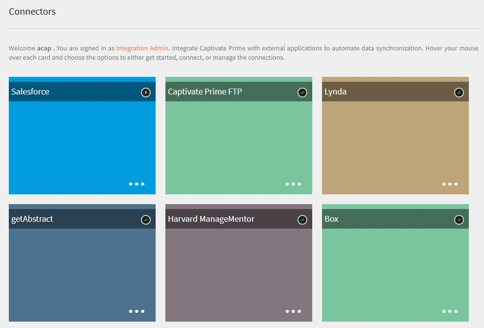

# Learning Manager コネクタ

コネクターを使用して Salesforce と Learning Manager を統合する方法、FTP コネクターを使用して Learning Manager と FTP を統合し、CSV を自動的にアップロードする方法について説明します。

企業には、Learning Manager と統合する必要のある他のアプリケーションやシステムがある場合があります。コネクタは、外部システムからLearning Managerにデータを読み込んだり、Learning Managerから外部システムにデータを書き出したりするなど、データベースの統合を実行するのに役立つユーティリティです。 2016 年 7 月のリリースでは、コネクターには Learning Manager のユーザーを外部システムから一括読み込みする機能しかありません。

Learning Manager は Salesforce および FTP コネクタを提供します。 Salesforce コネクターを使用すると、組織の統合管理者は Salesforce アプリケーションと Learning Manager を統合できます。統合者は、FTP コネクタを使用して、一連のユーザーをエンタープライズアプリケーションに自動読み込みすることもできます。

また、Learning Manager には Lynda、getAbstract および Harvard Management System のコネクターが用意されており、学習者は Lynda.com、getAbstract、Harvard ManageMentor の各コースにアクセスして使用することができます。

これらのコネクターを設定し、Learning Manager で使用する方法については、以下の説明を参照してください。

## Salesforce コネクタ {#sfconnector}

Salesforce コネクターは Learning Manager アカウントと Salesforce アカウントを接続して、データを自動的に同期します。Salesforceコネクターの機能は次のとおりです。

### マップ属性

統合管理者は Salesforce の列を選択し、それらを対応する Learning Manager のグループ化可能属性にマッピングできます。これは 1 度だけの作業です。 マッピングが完了すると、それ以降のユーザーの読み込みでは同じマッピングが使用されます。管理者がユーザーを読み込むために別のマッピングを使用したい場合は、再設定できます。

### 自動ユーザー読み込み

ユーザー読み込みプロセスにより、Learning Manager 管理者は Salesforce から従業員の詳細を取得し、その情報を Learning Manager に自動的に読み込ませることができます。この自動化により、CSV の作成および Learning Manager へのアップロードに伴う手作業を省略できます。

### 自動スケジュール

自動ユーザー読み込み機能と同時に自動スケジュール設定機能を使用すると、相乗効果を期待できます。Learning Manager 管理者は、組織のニーズに応じてスケジュールを設定できます。Learning Managerアプリケーションのユーザーは、スケジュールに従って最新の状態にすることができます。 Learning Manager アプリケーションで、同期が毎日実行されます。

### ユーザーのフィルタリング

Learning Manager 管理者は、読み込む前にユーザーにフィルタリングを適用できます。例えば、Learning Manager 管理者は、階層内のすべてのユーザーを 1 人以上の特定のマネージャーの管理下に読み込めます。

## Salesforce コネクターを構成する {#configuresalesforceconnector}

Learning Manager を Salesforce と統合するプロセスについて説明します。

### 前提条件 {#prerequisites}

まず Salesforce 組織の URL が手元にあることを確認してください。例えば、組織名が **myorg** の場合、Salesforce の URL は [https://myorg.salesforce.com](https://myorg.salesforce.com/) になります。Salesforce アカウントを Learning Manager に接続するために入力が必要な項目は、組織名のみです。

また、アカウントにログインできる適切な資格情報が手元にあることも確認してください。

## 接続の作成 {#createaconnection}

1. Learning Manager のホームページで、Salesforce カード / サムネイルの上にカーソルを移動します。メニューが表示されます。 メニューの&#x200B;**[!UICONTROL 接続]**&#x200B;項目をクリックします。

   

1. 組織の URL を入力するように促すダイアログが表示されます。 URLを入力した後、**[!UICONTROL [接続]]**&#x200B;をクリックします。
1. 接続が成功すると、概要ページが表示されます。

## マップ属性 {#mapattributes}

接続が正常に確立されたら、Salesforce の列を Learning Manager の対応する属性にマッピングできます。この手順は必須です。

1. マッピングページの左側にはLearning Managerの列が表示され、右側にはSalesforceの列が表示されます。 Learning Managerの列名にマッピングする適切な列名を選択します。

   

   左側に表示されているLearning Managerの列データは、アクティブフィールドから取得されます。 **manager**&#x200B;フィールドは、必ず電子メールアドレスの種類のフィールドにマップする必要があります。 コネクタを使用する前に、すべての列をマッピングすることが必須です。

1. マッピングが完了したら、**[!UICONTROL [保存]]**&#x200B;をクリックします。
1. これでコネクタは使用可能になりました。設定したアカウントは、管理者が読み込みをスケジュールしたり、オンデマンド同期を実行したりするための管理者アプリ内のデータソースとして表示されます。

## Salesforce コネクターの使用 {#usingsalesforceconnector}

Salesforce コネクターは Salesforce.com に接続して、設定どおりにユーザーを取得し、ユーザーを Learning Manager に追加します。

## Learning Manager FTP コネクタ {#ftpconnector}

FTP コネクターを使用すると、Learning Manager を任意の外部システムと統合して、データ同期を自動化できます。外部システムがデータを CSV 形式で書き出し、そのデータを Learning Manager FTP アカウントの適切なフォルダーに配置できることが期待されています。FTPコネクタの機能は次のとおりです。

Boxコネクターを使用して、データの移行、ユーザーの読み込み、データの書き出しをおこなうこともできます。 詳細については、「[Box コネクタ](third-party-connectors.md#main-pars_header_302653946)」を参照してください。

## データの読み込み {#dataimport}

ユーザー読み込みプロセスにより、Learning Manager 管理者は Learning Manager FTP サービスから従業員の詳細を取得し、その情報を Learning Manager に自動的に読み込ませることができます。この機能を使用すると、それらのシステムによって生成された CSV を FTP アカウントの適切なフォルダーに配置することによって、複数のシステムを統合できます。Learning Manager は CSV ファイルを取得し、ファイルをマージして、設定したスケジュールに従ってデータを読み込みます。詳細については、「スケジューリング」機能を参照してください。

**マップ属性**

統合管理者は CSV の列を選択し、その情報を Learning Manager のグループ化が可能な属性にマッピングできます。このマッピングは一度だけの作業です。マッピングが完了すると、その後のユーザーの読み込みでは同じマッピングが使用されます。管理者がユーザーを読み込むための別のマッピングを必要とする場合は、マッピングを再構成できます。

## データの書き出し {#exportdata}

「データの書き出し」では、ユーザースキルを FTP の場所に書き出すことにより、任意のサードパーティシステムと統合できます。

## スケジューリング {#scheduling}

管理者は、組織の要件に応じてタスクをスケジュール設定できます。Learning Manager アプリケーション内のユーザーは、設定されたスケジュールに従って最新の情報に更新されます。同様に、統合管理者は、外部システムと統合されるのに都合のいい時間にスキルの書き出しをスケジュール設定することができます。Learning Manager アプリケーションで、同期が毎日実行されます。

## Learning Manager FTP コネクターを構成する {#configurecaptivateprimeftpconnector}

Learning Manager を FTP コネクターと統合するプロセスについて説明します。

### 接続の作成 {#Createaconnection-1}

1. Learning Manager ホームページで、FTP カード / サムネイルの上にカーソルを移動します。メニューが表示されます。 メニューの&#x200B;**[!UICONTROL 接続]**&#x200B;項目をクリックします。

   

1. ダイアログが表示され、電子メール ID を入力するように求められます。 組織のLearning Manager FTPアカウントの管理責任者の電子メールIDを入力します。 電子メールIDを入力した後、**[!UICONTROL 接続]**&#x200B;をクリックします。
1. Learning Manager は、FTP に初めてアクセスする前にユーザーにパスワードの再設定を促す電子メールを送信します。ユーザーはパスワードをリセットし、Learning Manager FTP アカウントへのアクセスにそのパスワードを使用する必要があります。

   特定の Learning Manager アカウントに作成できる Learning Manager FTP アカウントは 1 つだけです。

   概要ページでは、統合の接続名を指定できます。 実行したいアクションを次のいずれかから選択してください。

   * 社内ユーザーの読み込み
   * ユーザースキルの書き出し - スケジュールの設定
   * ユーザースキルの書き出し - オンデマンド

   

## 読み込み

・+++内ユーザー

内部ユーザー読み込みオプションを使用すると、ユーザー読み込みレポートの生成を自動的にスケジュールすることができます。生成されたレポートは .CSV ファイルとして届きます。

+++

+++マップ属性

接続が正常に確立されたら、FTP フォルダー内に配置される CSV ファイルの列を Learning Manager の対応する属性にマッピングできます。この手順は必須です。

1. マップ属性ページの左側にはLearning Managerの予想される列が表示され、右側にはCSVの列名が表示されます。 最初は右側に空の選択ボックスがあります。**「ファイルを選択」**&#x200B;をクリックして、任意のテンプレートCSVを読み込みます。
1. 上記の手順で、右側の選択ドロップダウンリストにすべての CSV 列名が表示されます。Learning Managerの列名にマッピングする適切な列名を選択します。

   *マネージャーフィールドは、必ず電子メールアドレスの種類のフィールドにマップする必要があります。 コネクタを使用する前に、すべての列をマッピングすることが必須です。*

1. マッピングが完了したら、**[!UICONTROL [保存]]**&#x200B;をクリックします。

   これでコネクタは使用可能になりました。設定したアカウントは、管理者が読み込みをスケジュールしたり、オンデマンド同期を実行したりするための管理者アプリ内のデータソースとして表示されます。

+++

+++Learning Manager FTPコネクタの使用

1. 外部システムからのCSVファイルは次のパスに配置する必要があります。

   `code $OPERATION$/$OBJECT_TYPE$/$SUB_OBJECT_TYPE$/data.csv`

   **注意：** 2016年7月リリースでは、ユーザーの読み込みのみが許可されています。 したがって、FTPコネクタを使用するには、CSVファイルが次のフォルダーにあることを確認する必要があります。

   `code Home/import/user/internal/*.csv`

1. FTPコネクタでは、CSVファイルからすべての行が取得されるため、あるCSV内のユーザーに対応する行が他のCSVに表示されないことが重要です。
1. すべてのCSVには、マッピングで指定された列が含まれている必要があります。
1. プロセスを開始する前に、必要なすべてのCSVがフォルダーに存在している必要があります。

ユーザーを Learning Manager に読み込む際、管理者はユーザーが Learning Manager で管理されている方法も把握しておく必要があります。詳細については、[ユーザー管理のヘルプ](../integration-admin/feature-summary/migration-manual.md#usermanagement)を参照してください。

+++

## 書き出し

+++スキル

ユーザーのスキルレポートを書き出すには、2つのオプションがあります。

**[!UICONTROL ユーザースキル – オンデマンド]**：開始日を指定し、オプションを使用してレポートをエクスポートできます。レポートは、入力された日付から現在までの間に抽出されます。

**[!UICONTROL ユーザースキル - 設定]**：このオプションではレポートの抽出をスケジュールできます。「スケジュールを有効にする」チェックボックスを選択して、開始日時を指定します。レポートを生成して送信する間隔を指定することもできます。

+++

自分のFTPロケーションに書き出されたファイルが配置される書き出しフォルダーを開くには、次に示すように、ユーザースキルページで指定されたFTPフォルダーへのリンクを開きます。

自動書き出しされたファイルは、場所&#x200B;**Home/export/&#42;FTP_location&#42;**&#x200B;にあります

自動書き出しされたファイルは、**skill_achievements_&#42;のタイトルで利用できます。開始日は&#x200B;&#42;_から_&#42;まで&#42;.csv**&#x200B;です。

## Lynda コネクター {#lyndaconnector}

Lynda.com をご利用のエンタープライズのお客様の場合、Lynda コネクターを使用することにより、学習者が Learning Manager 内で Lynda コースを検索および使用できるようになります。API キーを使用して Lynda.com からコースを定期的に取得するようにコネクタを構成することができます。Learning Manager 内にコースが作成されると、ユーザーはコースを検索して使用できます。学習者の進行状況は Learning Manager 内で追跡できます。

### Lynda コネクターを構成する {#configurethelyndaconnector}

1. 統合管理者のダッシュボードから、Lynda をクリックします。

   「はじめに」、「接続」、「接続の管理」の 3 つのオプションがあるタイルが表示されます。

1. Lynda コネクターを初めて構成する場合は、「接続」をクリックします。

   このコネクターを構成する前に、Exavault FTP アカウントを設定してください。

1. 接続ページから、コネクターの名前を指定します。接続に使用する Appkey と秘密キーを入力してください。

   Appkey と秘密キーを入手するには、ベンダーにお問い合わせください。

1. 「保存」をクリックします。

   設定が保存されされました。アカウントの Lynda 接続が追加されます。ホームページで「接続の管理」をクリックして、いつでも設定を編集できるようになりました。

1. 接続が既に確立されている場合は、「接続を管理」をクリックしてすべての接続を表示します。

   このコネクタを構成する前に、アカウントの移行機能を有効にする必要があります。

1. 編集したい接続をクリックします。
1. 左ペインで、[Configure]をクリックします。 次のどちらかの操作を実行します。

   * このウィンドウから、アカウントの詳細と同期スケジュールを表示または編集します。このアカウントを有効にする場合は、「接続を有効にする」チェックボックスをオンにする必要があります。
   * 「編集」をクリックして資格情報を編集します。「リセット」をクリックして、このフィールドの更新を取り消します。
   * 同期をスケジュールするには、「スケジュールを有効にする」をクリックします。開始日時を入力してから、同期スケジュールの頻度を日数で入力できます。例えば、3 日ごとに同期を有効にします。

   「保存」をクリックして変更内容を保存します。

   

1. 左ペインで「オンデマンド実行」をクリックします。このオプションを使用すると、Lynda からユーザーフィードやその他の関連データを読み込むことができます。オンデマンド実行の開始日を入力し、「実行」をクリックして同期を実行します。開始日から現在までのすべてのデータが読み込まれます。

   * 同期中にアプリケーションのダウンタイムが発生する場合は、「実行中の Learning Manager へのアクセスを無効にする」をクリックします。
   * 「実行中の Learning Manager へのアクセスを有効にする」をクリックした場合でも、同期中にサービスが中断されることはありません。

   

1. 左ペインから「実行ステータス」をクリックすることで、いつでもこのコネクタのすべての実行の概要を時系列で表示できます。同期の開始日と期間、同期の種類（オンデマンド同期かどうか）および同期のステータス（同期が進行中か完了か）を表示できます。

   接続を削除して再作成すると、コネクターの以前の実行が再び表示されます。接続を削除する前にすべての実行を表示できます。

   最新の同期に対してのみ再実行ができます。

   

## getAbstract コネクター {#getabstractconnector}

getAbstract.com をご利用のエンタープライズのお客様の場合、getAbstract コネクターを使用することにより、学習者が getAbstract の要約を検索、使用できるようになります。Learning Manager 内で作成された学習者の完了レコードに基づいて、使用データを定期的に取得するようにコネクターを構成できます。Learning Manager でこのコネクターを構成する方法については、以下の説明を参照してください。

### getAbstract コネクタを構成する {#configurethegetabstractconnector}

1. 統合管理者のダッシュボードから、getAbstract をクリックします。

   タイルには、「はじめに」、「接続」、「接続の管理」の 3 つのオプションが表示されます。

1. getAbstract コネクターを初めて構成する場合は、「接続」をクリックします。

   このコネクターを構成する前に、Exavault FTP アカウントを設定してください。

   フィードにアクセスするには、この FTP 資格情報をコンテンツプロバイダと共有してください。

1. 「接続名」フィールドに接続名を入力します。

   クライアント ID フィールドとクライアント秘密フィールドに適切なキーを入力します。このコネクターの適切なキーを入手するには、ベンダーに問い合わせます。

   これらのキーは、クライアントが受講するコースのコースメタデータを取得するために必要です。

1. 接続が既に確立されている場合は、ホームページから getAbstract／接続の管理をクリックして既存の構成を表示および編集します。

   このコネクタを構成する前に、アカウントの移行機能を有効にする必要があります。

1. 設定を表示または編集する接続をクリックします。

   

1. 左ペインで、[Configure]をクリックします。 次のどちらかの操作を実行します。

   * このウィンドウから、アカウントの詳細と同期スケジュールを表示または編集します。このアカウントを有効にする場合は、「接続を有効にする」チェックボックスをオンにする必要があります。
   * 「編集」をクリックして資格情報を編集します。「リセット」をクリックして、このフィールドの更新を取り消します。
   * 同期をスケジュールするには、「スケジュールを有効にする」をクリックします。開始日時を入力してから、同期スケジュールの頻度を日数で入力できます。例えば、3 日ごとに同期を有効にします。

1. 「保存」をクリックします。

   設定は保存されました。アカウントに getAbstract の接続が追加されます。

1. 左ペインで「オンデマンド実行」をクリックします。このオプションを使用すると、getAbstract からユーザーのフィードおよびその他の関連データを読み込むことができます。オンデマンド実行の開始日を入力し、「実行」をクリックして同期を実行します。開始日から現在までのすべてのデータが読み込まれます。

   * 同期中にアプリケーションのダウンタイムが発生する場合は、「実行中の Learning Manager へのアクセスを無効にする」をクリックします。
   * 「実行中の Learning Manager へのアクセスを有効にする」をクリックした場合でも、同期中にサービスが中断されることはありません。

1. 左ペインから「実行ステータス」をクリックすることで、いつでもこのコネクタのすべての実行の概要を時系列で表示できます。同期の開始日と期間、同期の種類（オンデマンド同期かどうか）および同期のステータス（同期が進行中か完了か）を表示できます。

   接続を削除して再作成すると、コネクターの以前の実行が再び表示されます。接続を削除する前にすべての実行を表示できます。

   最新の同期に対してのみ再実行ができます。

   同期のタイプを問わず、同期が動作するために、同期に指定された日付の getAbstract FTP フォルダーにユーザーフィードがあることを確認します。

   次の Excel シートを参照してください。これは、getAbstract のユーザーフィードファイルのサンプルです。ファイル名は** report_export_yyyy_MM_dd_HHmmss.xlsx}または**0}report_export_yyyy_MM_dd.xlsx **の形式に従う必要があります。**
   [getAbstractユーザーフィードサンプルExcelシート](assets/report-export-20170401175342.xlsx)

## Harvard ManageMentor コネクター {#hmmconnector}

Harvard ManageMentor をご利用のエンタープライズのお客様の場合、Harvard ManageMentor コネクターを使用することにより、学習者が Harvard ManageMentor のコースを検索、使用できるようになります。このコネクターは Learning Manager 内でコースを作成するのに役立つほか、学習者の進行状況データを定期的に取得するように設定できます。このコネクターを構成するには、次の手順を実行します。

### Harvard ManagerMentor コネクターを構成する {#configuretheharvardmanagermentorconnector}

1. 統合管理者のダッシュボードから、Harvard ManageMentor をクリックします。

   タイルには、「はじめに」、「接続」、「接続の管理」の 3 つのオプションが表示されます。

1. Harvard ManageMentor コネクターを初めて構成する場合は、「接続」をクリックします。

   このコネクターを構成する前に、Exavault FTP アカウントを構成してください。

   フィードにアクセスするには、この FTP 資格情報をコンテンツプロバイダと共有してください。

1. 接続名フィールドに接続名を入力します。「接続」をクリックしてこの接続を保存します。
1. 接続が既に確立されている場合は、ホームページから Harvard ManageMentor／接続を管理をクリックします。編集したい接続をクリックし、既存の設定を編集します。

   このコネクターを構成する前に、アカウントの移行機能を有効にする必要があります。

   

1. 左ペインで、[Configure]をクリックします。 次のどちらかの操作を実行します。

   * このウィンドウから、アカウントの詳細と同期スケジュールを表示または編集します。このアカウントを有効にする場合は、「接続を有効にする」チェックボックスをオンにする必要があります。
   * 同期をスケジュールするには、「スケジュールを有効にする」をクリックします。開始日時を入力してから、同期スケジュールの頻度を日数で入力できます。例えば、3 日ごとに同期を有効にします。

1. 左ペインで「オンデマンド実行」をクリックします。このオプションを使用すると、Harvard ManageMentor からユーザーのフィードおよびその他の関連データを読み込むことができます。オンデマンド実行の開始日を入力し、「実行」をクリックして同期を実行します。この接続の開始日から現在までのすべてのデータが読み込まれます。

   * 同期中にアプリケーションのダウンタイムが発生する場合は、「実行中の Learning Manager へのアクセスを無効にする」をクリックします。
   * 「実行中の Learning Manager へのアクセスを有効にする」をクリックした場合でも、同期中にサービスが中断されることはありません。

   数日ごとに同期を自動化したい場合は、繰り返し日数フィールドに日数を指定します。同期はお使いのアカウントが Harvard ManageMentor からの要約とサマリの最新版で更新されることを保証します。

1. 左ペインから「実行ステータス」をクリックすることで、いつでもこのコネクタのすべての実行の概要を時系列で表示できます。同期の開始日と期間、同期の種類（オンデマンド同期かどうか）および同期のステータス（同期が進行中か完了か）を表示できます。

   接続を削除して再作成すると、コネクターの以前の実行が再び表示されます。接続を削除する前にすべての実行を表示できます。

   最新の同期に対してのみ再実行ができます。

   同期を成功させるには、Harvard ManageMentor の FTP フォルダーに次のファイルのいずれかが存在（複数可）することを確認してください。

   hmm12_metadata.xlsx： このファイルは、Harvard ManageMentor コネクターのコースメタデータを提供します。ファイルをアップロードするときは、必ず命名規則に従ってください。

   client_hmm12_20150125.xlsx：これは、Harvard ManageMentor コネクターのユーザーフィードです。ファイル名は、**client_hmm12_yyyyMMdd.xlsx** のような命名規則に従う必要があります。

   このコネクターについて、次の 2 つのサンプルユーザーフィードおよびコースフィードファイルを参照してください。
   [Harvard ManageMentorコネクタのコースメタデータファイル](assets/hmm12-metadata.xlsx) [Harvard ManageMentorコネクタのユーザーフィード](assets/client-hmm12-20170304.xlsx)

## Workday コネクタ {#workdayconnector}

Workday コネクターを使用すると、Learning Manager を Workday のテナントと統合して、データを自動的に同期できます。

### 読み込み

#### マップ属性

統合管理者はWorkdayの列を選択し、その列を対応するLearning Managerのグループ化可能属性にマッピングできます。 これは 1 度限りの作業です。マッピングが完了すると、それ以降のユーザーの読み込みでは同じマッピングが使用されます。管理者がユーザーを読み込むために別のマッピングを使用したい場合は、再設定できます。

#### 自動ユーザー読み込み

ユーザー読み込みプロセスにより、Learning Manager 管理者は Workday から従業員の詳細を取得し、その情報を Learning Manager に自動的に読み込ませることができます。

#### ユーザーのフィルタリング

Learning Manager 管理者は、読み込む前にユーザーにフィルタリングを適用できます。例えば、Learning Manager 管理者は、階層内のすべてのユーザーを 1 人以上の特定のマネージャーの管理下に読み込めます。

## 書き出し

ユーザースキルの書き出しにより、ユーザーはユーザースキルを Workday に自動的に書き出すことができます。

複数の Learning Manager アカウントからのスキルを、同じ Workday アカウントを使用して同時に書き出すことはできません。

## スケジューリング {#Scheduling-1}

管理者は、組織の要件に応じてタスクをスケジュール設定できます。Learning Manager アプリケーション内のユーザーは、設定されたスケジュールに従って最新の情報に更新されます。同様に、統合管理者は、外部システムと統合されるのに都合のいい時間にスキルの書き出しをスケジュール設定することができます。Learning Manager アプリケーションで、同期が毎日実行されます。

## Workday コネクタを構成する {#configureworkdayconnector}

**前提条件**：組織の Workday 管理者に依頼して、ISU_Permissions 文書で定義されている権限のある統合システムユーザー（ISU）を作成します。以下のリンクからコピーをダウンロードします。
[統合システムユーザー(ISU)のセキュリティのコピーをダウンロードします。](assets/isu-permissions-v1.pdf) Learning ManagerをWorkdayコネクタに統合するプロセスについて説明します。

1. Learning Managerホームページで、Workdayタイルにカーソルを合わせます。 メニューが表示されます。 メニューの&#x200B;**[!UICONTROL 接続]**&#x200B;項目をクリックします。

   

1. 新しい接続の資格情報を入力するように促すダイアログが表示されます。 接続する前に入力する必要があるフィールドは以下のとおりです。

   * 接続名：任意の接続名を入力してください。
   * ホスト URL：統合管理者は、該当 Workday 管理者からホスト URL の詳細を取得できます。
   * テナント：テナントは会社の内部です。 Workday 管理者からテナントの詳細が提供されます。
   * ユーザー名とパスワード： Workday管理者は、必要なセキュリティ権限を持つ統合システムユーザー(ISU)を作成し、統合管理者と共有します。

   注意：Learning Manager は Workday API のバージョン 28.1 を使用しています。

   

1. すべての関連フィールドに情報を入力したら、「接続」をクリックします。

   複数の Workday 接続を Learning Manager アカウントに同期させることもできます。

概要ページでは、統合の接続名を指定できます。 実行したいアクションを次のいずれかから選択してください。

* 社内ユーザーの読み込み
* ユーザースキルの書き出し - スケジュールの設定
* ユーザースキルの書き出し - オンデマンド

## 読み込み

### マップ属性 {#MapAttributes-1}

Workday コネクターを使用すると、Learning Manager と Workday を統合して、データを自動的に同期できます。すべてのアクティブユーザーを Workday から Learning Manager に読み込むことができます。ユーザーは FTP や Salesforce などの様々なデータソースから読み込むことができます。

ユーザーを読み込む前に、Learning Manager および Workday のユーザー属性をマッピングする必要があります。 概要ページで、読み込みの下の「社内ユーザー」オプションを使用してマップ属性を提供します。

「Adobe学習マネージャー」列にAdobe学習マネージャーの資格情報を入力します。 ドロップダウンを使用して、Workday の列に対して正しい資格情報を選択します。

現在 Learning Manager は、Workday から 44 のユーザー属性の読み込みをサポートしています。Learning Manager のアクティブフィールドを使用して、属性を追加します。

Workdayには4つの階層レベルがありますが、Learning Managerには2つの階層レベルがあります。 Workdayの4つのレベルは、スキルプロファイルカテゴリ、スキルプロファイル、スキルアイテムカテゴリ、およびスキルアイテムです。 Learning Managerのスキル名とレベルは、Workdayのスキルアイテムにマッピングされます。

+++サポートされているWorkday属性のリスト

wd:User_ID\
wd:Worker_ID\
wd:Personal_Data.wd:Name_Data.wd:Preferred_Name_Data.wd:Name_Detail_Data@wd:Formatted_Name\
wd:Personal_Data.wd:Name_Data.wd:Legal_Name_Data.wd:Name_Detail_Data@wd:Formatted_Name\
wd:Personal_Data.wd:Name_Data.wd:Legal_Name_Data.wd:Name_Detail_Data.wd:Prefix_Data.wd:Title_Descriptor\
wd:Personal_Data.wd:Name_Data.wd:Preferred_Name_Data.wd:Name_Detail_Data.wd:Prefix_Data.wd:Title_Descriptor\
wd:Personal_Data.wd:Name_Data.wd:Preferred_Name_Data.wd:Name_Detail_Data.wd:First_Name\
wd:Personal_Data.wd:Name_Data.wd:Preferred_Name_Data.wd:Name_Detail_Data.wd:Last_Name\
wd:Personal_Data.wd:Name_Data.wd:Legal_Name_Data.wd:Name_Detail_Data.wd:First_Name\
wd:Personal_Data.wd:Name_Data.wd:Legal_Name_Data.wd:Name_Detail_Data.wd:Last_Name\
wd:Personal_Data.wd:Contact_Data.wd:Address_Data.0@wd:Formatted_Address\
wd:Personal_Data.wd:Contact_Data.wd:Address_Data.0.wd:Postal_Code\
wd:Personal_Data.wd:Contact_Data.wd:Address_Data.0.wd:Country_Region_Descriptor\
wd:Personal_Data.wd:Contact_Data.wd:Phone_Data.0@wd:Formatted_Phone\
wd:Personal_Data.wd:Contact_Data.wd:Phone_Data.0.wd:Country_ISO_Code\
wd:Personal_Data.wd:Contact_Data.wd:Phone_Data.0.wd:International_Phone_Code\
wd:Personal_Data.wd:Contact_Data.wd:Phone_Data.0.wd:Phone_Number\
wd:Personal_Data.wd:Primary_Nationity_Reference.wd:ID.1.$\
wd:Personal_Data.wd:Gender_Reference.wd:ID.1.$\
wd:Personal_Data.wd:Identification_Data.wd:National_ID.0.wd:National_ID_Data.wd:ID\
wd:Personal_Data.wd:Identification_Data.wd:Custom_ID.0.wd:Custom_ID_Data.wd:ID\
wd:User_Account_Data.wd:Default_Display_Language_Reference.wd:ID.1.$\
wd:Role_Data.wd:Organization_Role_Data.wd:Organization_Role.0.wd:Organization_Role_Reference.wd:ID.1$\
wd:Employment_Data.wd:Worker_Job_Data.0.wd:Position_Data.wd:Position_Title\
wd:Employment_Data.wd:Worker_Job_Data.0.wd:Position_Data.wd:Business_Title\
wd:Employment_Data.wd:Worker_Job_Data.0.wd:Position_Data.wd:Business_Site_Summary_Data.wd:Name\
wd:Employment_Data.wd:Worker_Job_Data.0.wd:Position_Data.wd:Business_Site_Summary_Data.wd:Address_Data@wd:Formatted_Address\
wd:Employment_Data.wd:Worker_Job_Data.0.wd:Position_Data.wd:Job_Classification_Summary_Data.0.wd:Job_Classification_Reference.wd:ID.1$\
wd:Employment_Data.wd:Worker_Job_Data.0.wd:Position_Data.wd:Job_Classification_Summary_Data.0.wd:Job_Group_Reference.wd:ID.1$\
wd:Employment_Data.wd:Worker_Job_Data.0.wd:Position_Data.wd:Work_Space__Reference.wd:ID.1$\
wd:Employment_Data.wd:Worker_Status_Data.wd:Active\
wd:Employment_Data.wd:Worker_Status_Data.wd:Active_Status_Date\
wd:Employment_Data.wd:Worker_Status_Data.wd:Hire_Date\
wd:Employment_Data.wd:Worker_Status_Data.wd:Original_Hire_Date\
wd:Employment_Data.wd:Worker_Status_Data.wd:Retired\
wd:Employment_Data.wd:Worker_Status_Data.wd:Retirement_Date\
wd:Employment_Data.wd:Worker_Status_Data.wd:Terminated\
wd:Employment_Data.wd:Worker_Status_Data.wd:Termination_Date\
wd:Employment_Data.wd:Worker_Status_Data.wd:Termination_Last_Day_of_Work\
wd:Organization_Data.wd:Worker_Organization_Data.0.wd:Organization_Data.wd:Organization_Code\
wd:Organization_Data.wd:Worker_Organization_Data.0.wd:Organization_Data.wd:Organization_Name\
wd:Organization_Data.wd:Worker_Organization_Data.0.wd:Organization_Data.wd:Organization_Type_Reference.wd:ID.1$\
wd:Organization_Data.wd:Worker_Organization_Data.0.wd:Organization_Data.wd:Organization_Subtype_Reference.wd:ID.1$\
wd:Qualification_Data.wd:Education.0.wd:School_Name\
wd:Qualification_Data.wd:External_Job_History.0.wd:Job_History_Data.wd:Job_Title\
wd:Qualification_Data.wd:External_Job_History.0.wd:Job_History_Data.wd:Company\
wd:Management_Chain_Data.wd:Worker_Supervisory_Management_Chain_Data.wd:Management_Chain_Data.0.wd:Manager.Employee_ID

+++

## 書き出し

ユーザーが達成したすべてのスキルを Learning Manager から Workday に書き出すことができます。なお、Learning Manager はすべてのアクティブなユーザースキルのみを書き出し、廃止スキルは書き出しません。複数のLearning Managerアカウントを同じWorkdayコネクタに接続することもできます。 2つのLearning Managerアカウントのスキル名が同じ場合、Workdayの同じスキルにマッピングされます。 2つのLearning Managerアカウントが同じWorkdayアカウントを使用している場合は、Workdayでスキルを更新する前に、すべてのLearning Managerアカウントでスキル名を更新することをお勧めします。

+++ユーザースキル – 設定

このオプションではレポート抽出のスケジュール設定ができます。「この接続を使用してユーザースキル書き出しを有効にする」チェックボックスがオンになっていることを確認します。「スケジュールを有効にする」チェックボックスを選択して、開始日時を指定します。レポートを生成して送信する間隔を指定することもできます。「スケジュールを有効にする」チェックボックスをオンにして、開始日、時間、繰り返し設定（「n」日後）を入力します。完了したら、「保存」をクリックします。

+++

+++ユーザースキル – オンデマンド

開始日を指定し、オプションを使用してレポートを書き出すことができます。入力した日付から現在までのレポートが抽出されます。 レポートの生成を開始する日付を入力して「実行」をクリックします。

+++

+++ユーザースキル – 実行ステータス

ここでは、すべてのタスクの概要を表示し、それらのステータスレポートを取得できます。エラーレポートのリンクをクリックすると、エラーレポートをダウンロードできます。

+++

## miniOrange コネクタ {#miniorangeconnector}

miniOrange コネクターを使用して、Learning Manager と miniOrange のテナントを統合し、データを自動的に同期できます。

### 読み込み

#### マップ属性

統合管理者はminiOrange属性を選択し、対応するLearning Managerのグループ化可能属性にマッピングできます。 これは 1 度限りの作業です。マッピングが完了すると、それ以降のユーザーの読み込みでは同じマッピングが使用されます。管理者がユーザーを読み込むために別のマッピングを使用したい場合は、再設定できます。

#### 自動ユーザー読み込み

ユーザー読み込みプロセスにより、Learning Manager管理者はminiOrangeから従業員の詳細を取得し、その情報をLearning Managerに自動的に読み込ませることができます。

#### ユーザーのフィルタリング

Learning Manager 管理者は、読み込む前にユーザーにフィルタリングを適用できます。例えば、Learning Manager 管理者は、階層内のすべてのユーザーを 1 人以上の特定のマネージャーの管理下に読み込めます。

を設定するには   miniオレンジ   コネクタを接続するには、Learning Manager CSMチームに連絡してください。

## miniOrange コネクタを構成する {#configureminiorangeconnector}

1. Learning Managerホームページで、miniOrangeカード/サムネールにカーソルを合わせます。 メニューが表示されます。 メニューの&#x200B;**[!UICONTROL 接続]**&#x200B;オプションをクリックします。

   

1. 「接続」をクリックして新しい接続を確立します。miniOrangeコネクタページが表示されます。 マッピングしたいアカウントの詳細を入力してください。

   

1. miniOrnageユーザーをLearning Manager社内ユーザーとして直接読み込む場合、**[!UICONTROL 社内ユーザーの読み込み]**&#x200B;オプションを使用します。

   

1. 左側のマッピングページ内   画面の右側にLearning Managerの列が表示され、   側miniOrnage列が表示されます。 Learning Managerの列名にマッピングする適切な列名を選択します。

   

1. データソースを表示して編集するには、管理者として&#x200B;**[!UICONTROL 設定／データソース]**&#x200B;をクリックします。

   確立されたminiOrangeソースがリストされます。 フィルターを編集する必要がある場合は、[**[!UICONTROL 編集]**]をクリックします。

   

1. 読み込みが完了すると通知を受信します。ログの読み込みを表示または編集するには、**[!UICONTROL ユーザー／ログの読み込み]**&#x200B;をクリックします。

### 接続を削除する {#deleteaconnection}

確立されたminiOrange接続を削除するには、次の手順に従います。

## BlueJeans コネクター {#bluejeansconnector}

Learning ManagerをBlueJeansコネクターと統合し、BlueJeansを使用してクラスをホストできるようになりました。 BlueJeans では、オーディオやビデオ会議の通話、ビデオチャット、ウェビナーを開始できます。

コネクターを設定して使用するには、次の手順に従います。

1. Learning Managerホームページで、BlueJeansカード/サムネールにマウスを合わせます。 メニューが表示されます。 メニューから&#x200B;**[!UICONTROL [接続]]**&#x200B;オプションをクリックします。

   

1. BlueJeans コネクターページが開きます。アカウントの詳細をそれぞれのフィールドに入力し、Learning ManagerとBlueJeansを統合してユーザーフィードを同期できるようにします。 BlueJeans アカウントの管理者から詳細を取得できます。

   

   コネクターを有効にしながら、ユーザーが学習者として Learning Manager アカウントで使用している電子メール ID で、Learning Manager にフィードバックを提出できるようにします。

1. 接続が確立されたら、作成者として BlueJeans を会議システムとして使用した VC コースを作成します。

   

1. 管理者、マネージャー、学習者は、作成されたコースに学習者を登録できます。 登録時に、学習者は電子メールを受け取ります。学習者は自分の Learning Manager アカウントにログインしてプログラムの詳細を表示し、コースを受講できます。
1. コースを完了すると、完了レポートが Learning Manager に送信されます。管理者は、完了レポートを見て学習者の出席と得点を確認できます。

   

## Box コネクター {#boxconnector}

Box コネクターを使用すると、Learning Manager を任意の外部システムと統合して、データを自動的に同期できます。外部システムがデータをCSV形式で書き出し、そのデータをLearning ManagerのBoxアカウントの適切なフォルダーに配置できることが期待されています。 ボックスコネクタの機能は次のとおりです。

データ移行、ユーザー読み込み、およびデータ書き出しにFTPコネクターを使用することもできます。 詳しくは、 [Learning Manager FTP コネクタ。](third-party-connectors.md#main-pars_header_1427405935)

## データの読み込み {#DataImport-1}

ユーザー読み込みプロセスにより、Learning Manager 管理者は Learning Manager Box サービスから従業員の詳細を取得し、その情報を Learning Manager に自動的に読み込ませることができます。この機能を使用すると、それらのシステムによって生成された CSV を Box アカウントの適切なフォルダーに配置することによって、複数のシステムを統合できます。Learning Manager は CSV ファイルを取得し、ファイルをマージして、設定したスケジュールに従ってデータを読み込みます。詳細については、「スケジューリング」機能を参照してください。

**マップ属性**

統合管理者は CSV の列を選択し、その情報を Learning Manager のグループ化が可能な属性にマッピングできます。このマッピングは1回限りの作業です。 マッピングが完了すると、その後のユーザーの読み込みでは同じマッピングが使用されます。管理者がユーザーを読み込むための別のマッピングを必要とする場合は、マッピングを再構成できます。

## データの書き出し {#dataexport}

「データの書き出し」では、ユーザースキルを Box の場所に書き出すことにより、任意のサードパーティシステムと統合できます。

## レポートのスケジュール {#schedulereports}

管理者は、組織の要件に応じてタスクをスケジュール設定できます。Learning Manager アプリケーション内のユーザーは、設定されたスケジュールに従って最新の情報に更新されます。同様に、統合管理者は、外部システムと統合されるのに都合のいい時間にスキルの書き出しをスケジュール設定することができます。Learning Manager アプリケーションで、同期が毎日実行されます。

## Box コネクターを構成する {#configureboxconnector}

Learning Manager を Box コネクターと統合するプロセスについて説明します。

1. Learning Managerホームページで、Boxカード/サムネールにカーソルを合わせます。 メニューが表示されます。 メニューの接続項目をクリックします。

   

1. ダイアログが表示され、電子メール ID を入力するように求められます。 組織のLearning Manager Boxアカウントの管理責任者の電子メールIDを入力します。 電子メールIDを入力した後、「接続」をクリックします。

1. Learning Manager では、Box に初めてアクセスする前にユーザーにパスワードの再設定を促す電子メールが送信されます。ユーザーはパスワードをリセットし、Learning Manager Boxアカウントへのアクセスに使用する必要があります。

   特定のLearning Managerアカウントに作成できるLearning Manager Boxアカウントは1つだけです。

   概要ページでは、統合の接続名を指定できます。 実行したいアクションを次のいずれかから選択してください。

   * 社内ユーザーの読み込み
   * ユーザースキルの書き出し - スケジュールの設定
   * ユーザースキルの書き出し - オンデマンド

## 読み込み

・+++内ユーザー

内部ユーザー読み込みオプションを使用すると、ユーザー読み込みレポートの生成を自動的にスケジュールすることができます。生成されたレポートは .CSV ファイルとして届きます。

+++

+++マップ属性

接続が正常に確立されたら、Boxフォルダーに配置されるCSVファイルの列を、Learning Managerの対応する属性にマッピングできます。 この手順は必須です。

1. マップ属性ページの左側   画面の右側にLearning Managerの予想される列が表示されます   横にはCSV列の名前が表示されます。 最初は右側に空の選択ボックスがあります。「ファイルを選択」をクリックして、任意のテンプレートCSVを読み込みます。

1. 上記の手順で、右側の選択ドロップダウンリストにすべての CSV 列名が表示されます。Learning Managerの列名にマッピングする適切な列名を選択します。

   *マネージャーフィールドは、必ず電子メールアドレスの種類のフィールドにマップする必要があります。 コネクタを使用する前に、すべての列をマッピングすることが必須です。*

1. マッピングが完了したら、「保存」をクリックします。

   これでコネクタは使用可能になりました。設定したアカウントは、管理者が読み込みをスケジュールしたり、オンデマンド同期を実行したりするための管理者アプリ内のデータソースとして表示されます。

+++

+++Learning Manager Boxコネクターの使用

1. 外部システムからのCSVファイルは次のパスに配置する必要があります。

   `code $OPERATION$/$OBJECT_TYPE$/$SUB_OBJECT_TYPE$/data.csv`

   **注意：** 2016年7月リリースでは、ユーザーの読み込みのみが許可されています。 したがって、Boxコネクタを使用するには、CSVファイルが次のフォルダーに配置されていることを確認する必要があります。\
   `code Home/import/user/internal/*.csv`

1. Boxコネクタは、CSVファイルからすべての行を取得するため、1つのCSV内のユーザーに対応する行が、他のCSVに表示されないことが重要です。
1. すべてのCSVには、マッピングで指定された列が含まれている必要があります。
1. プロセスを開始する前に、必要なすべてのCSVがフォルダーに存在している必要があります。

ユーザーを Learning Manager に読み込む際、管理者はユーザーが Learning Manager で管理されている方法も把握しておく必要があります。詳細については、[ユーザー管理のヘルプ](../integration-admin/feature-summary/migration-manual.md#usermanagement)を参照してください。

+++

## 書き出し

+++スキル

ユーザーのスキルレポートを書き出すには、2つのオプションがあります。

ユーザースキル – オンデマンド：開始日を指定し、オプションを使用してレポートを書き出すことができます。レポートは、入力された日付から現在までの間に抽出されます

**[!UICONTROL ユーザースキル - 設定]**：このオプションではレポートの抽出をスケジュールできます。「スケジュールを有効にする」チェックボックスを選択して、開始日時を指定します。レポートを生成して送信する間隔を指定することもできます。

+++

Boxの場所に書き出されたファイルが配置される書き出しフォルダーを開くには、以下のように、ユーザースキルページで提供されているBoxフォルダーへのリンクを開きます。

自動書き出しされたファイルは、場所&#x200B;**Home/export/&#42;Box_location&#42;**&#x200B;にあります

自動書き出しされたファイルは、**skill_achievements_&#42;のタイトルで利用できます。開始日は&#x200B;&#42;_から_&#42;まで&#42;.csv**&#x200B;です。

Learning Managerチームが共有するBoxフォルダーのアクセス権限とコンテンツは、お客様が管理する必要があります。  また、フォルダー内のコンテンツはフランクフルト地域に物理的に保存されます。

## LinkedInLearning コネクター {#linkedinlearningconnector}

LinkedIn.com をご利用のエンタープライズのお客様の場合、LinkedInLearning コネクターを使用することにより、学習者が Learning Manager 内でコースを検索および使用できるようになります。API キーを使用してコースを定期的に取得するようにコネクタを設定することができます。Learning Manager 内にコースが作成されると、ユーザーはコースを検索して使用できます。学習者の進行状況は Learning Manager 内で追跡できます。

### LinkedIn コネクターを構成する {#configurelinkedinconnector}

1. 統合管理者のダッシュボードから、LinkedInLearning をクリックします。

   「はじめに」、「接続」、「接続の管理」の 3 つのオプションがあるタイルが表示されます。

1. LinkedInLearningコネクターを初めて設定する場合は、「接続」をクリックします。

   このコネクターを構成する前に、Exavault FTP アカウントを設定してください。

1. 接続ページから、コネクターの名前を指定します。接続に使用する Appkey と秘密キーを入力してください。

   Appkeyと秘密鍵を取得するには、ベンダーに連絡する必要があります。

1. 「保存」をクリックします。

   設定は保存されました。アカウントに LinkedInLearning の接続が追加されます。ホームページで「接続の管理」をクリックして、いつでも設定を編集できるようになりました。

1. 接続が既に確立されている場合は、「接続を管理」をクリックしてすべての接続を表示します。

   このコネクタを構成する前に、アカウントの移行機能を有効にする必要があります。

1. 編集したい接続をクリックします。
1. 左ペインで、[Configure]をクリックします。 次のどちらかの操作を実行します。

   * このウィンドウから、アカウントの詳細と同期スケジュールを表示または編集します。このアカウントを有効にする場合は、「接続を有効にする」チェックボックスをオンにする必要があります。
   * 「編集」をクリックして資格情報を編集します。「リセット」をクリックして、このフィールドの更新を取り消します。
   * 同期をスケジュールするには、「スケジュールを有効にする」をクリックします。開始日時を入力してから、同期スケジュールの頻度を日数で入力できます。例えば、3 日ごとに同期を有効にします。

   「保存」をクリックして変更内容を保存します。

1. 左ペインで「オンデマンド実行」をクリックします。このオプションを使用すると、LinkedIn からユーザーのフィードおよびその他の関連データを読み込むことができます。オンデマンド実行の開始日を入力し、「実行」をクリックして同期を実行します。 開始日から現在までのすべてのデータが読み込まれます。

   * 同期中にアプリケーションのダウンタイムが発生する場合は、「実行中の Learning Manager へのアクセスを無効にする」をクリックします。
   * 「実行中の Learning Manager へのアクセスを有効にする」をクリックした場合でも、同期中にサービスが中断されることはありません。

1. 左ペインから「実行ステータス」をクリックすることで、いつでもこのコネクタのすべての実行の概要を時系列で表示できます。同期の開始日と期間、同期の種類（オンデマンド同期かどうか）および同期のステータス（同期が進行中か完了か）を表示できます。

   接続を削除して再作成すると、コネクターの以前の実行が再び表示されます。接続を削除する前にすべての実行を表示できます。

   最新の同期に対してのみ再実行ができます。

