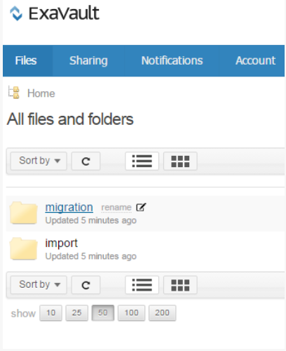

# Learning Managerデプロイメントガイド – セクション2

## 技術的な設定 {#technicalsetup}

Learning Managerアカウントの技術的な設定は、主にエンタープライズユーザーの場合に必要となります。 このドキュメントでは、組織のシングルサインオンの設定と、Learning Managerとサードパーティコネクタの統合について説明します。

### シングルログオンの設定 {#configuresinglesignon}

システム管理者は管理コンソールで、まず、エンドユーザーの認証を行う ID システムを定義し、設定する必要があります。 組織でLearning Managerのライセンスを購入する場合、それらのライセンスをエンドユーザーにプロビジョニングする必要があります。 そのためには、そのエンドユーザーを認証する方法が必要です。 以下の手順を実行して、ユーザーの SSO を構成します。

1. Learning Managerホームページで、**[!UICONTROL **&#x200B;設定&#x200B;**>**&#x200B;ログイン方法&#x200B;**をクリックします。]**

   

1. ユーザーの種類に応じて、**[!UICONTROL **&#x200B;社内ユーザー&#x200B;**または**&#x200B;社外ユーザー&#x200B;**を選択してください。]**

1. **[!UICONTROL **ログイン**]**ドロップダウンフィールドから、**[!UICONTROL **&#x200B;シングルサインオン&#x200B;**を選択します。]**

   

1. シングルサインオンの設定を構成するには、**[!UICONTROL **&#x200B;変更&#x200B;**をクリックしてください。]**

   

1. ****[!UICONTROL IDP による認証 URL]**** フィールドに、サービスプロバイダーが指定した認証 URL を入力します。

   

1. **2} **IDPメタデータXMLファイル&#x200B;**]******フィールドの横にある「[!UICONTROL **&#x200B;アップロード&#x200B;**]**」をクリックし、XMLファイルをアップロードします。**[!UICONTROL 
1. 「**[!UICONTROL **&#x200B;保存&#x200B;**.]**」をクリックします
1. アカウントに SSO 認証が正常に設定されました。 SSOを使用してLearning Managerアカウントにログインできます。

   ***Learning Managerで構成するSSOでは、SAML 2.0がサポートされている必要があります。***

## ユーザーデータの移行 {#migrationofuserdata}

管理者がLearning Managerを購入した場合、重要な手順の1つとして移行を実行する必要があります。 既存のトレーニングコンテンツとユーザーデータをLearning Managerに移行することが不可欠です。 以下の移行ワークフローに従うと、直感的に使用できる最新の LMS のメリットを活用でき、組織のレガシーデータを失うことはありません。

Learning Managerでは、ステップバイステップのウィザードを使用して、反復スプリントで既存のLMSから移行できます。 レガシーデータをAdobe Learning Managerに移行する際、各スプリントのステータスを完全に把握して、学習者のダウンタイムを確実にゼロにすることができます。

移行ワークフローを実行するには、統合管理者権限が必要です。 管理者は、統合管理者の役割を引き受けるか、統合管理者の役割を別のユーザーに割り当てることができます。

**Shaleenの助けを借りて、ビジュアルを作成できます。**

1. 前提条件
1. 既存のコンテンツとユーザーデータの評価
1. 既存の LMS からのデータの書き出しとマップ
1. 移行用の FTP フォルダーと BOX フォルダーの設定
1. 学習者をLearning Managerに転送する
1. Learning Managerへの学習コンテンツの転送
1. 残りのデータをLearning Managerに転送

### 前提条件 {#prerequisite}

移行プロセスを開始する前に、以下の前提条件を実行する必要があります。

* 既存のLMSからデータとコンテンツを抽出し、そのデータをLearning Managerで定義されているファイル形式に変換します。
* FTP コネクタと BOX コネクタを使用してユーザーを読み込みます。 統合管理者は、移行プロセスの前にコネクタが設定されていることを確認する必要があります。

***管理者は、データとコンテンツをLearning Managerの実稼働環境に移行する前に、体験版アカウントで移行プロセスをお試しいただくことをお勧めします。 ***

### データの評価と書き出し {#evaluatingandexportingdata}

統合管理者は、まず現在の LMS で使用できるデータを確認する必要があります。 統合管理者は、以下の学習目標のみを移行できます。

* モジュール
* コース
* モジュールバージョン
* コースのインスタンス
* コースモジュール
* スキル
* スキルレベル
* スキルコース
* 資格認定
* 資格認定コース
* 資格認定の確定
* 学習プログラム
* 学習プログラムコース
* 学習プログラムのインスタンス
* 学習プログラムのコースインスタンス
* 登録
* 資格認定の登録
* 学習プログラムの登録
* ユーザーコースのグレード

既存データの評価後、Learning Managerの標準のCSV仕様を使用して、このデータをマッピングする必要があります。 以下の ***csv-specifications.zip*** サンプルファイルをダウンロードします。このファイルには、この移行に必要な 7 つの Excel シートが含まれています。 これらの Excel シートには、仕様と、.csv ファイル内のフィールドを使用して既存のデータをマップする方法を理解していただくための説明が記載されています。

<!--
<Download link to the zip file>
-->

各 .csv ファイルに、各フィールドのデータが指定の形式で含まれていることを確認します。

<table> 
 <tbody> 
  <tr> 
   <th width="7%" valign="top">
<strong>番号</strong>
</th> 
   <th width="29%" valign="top">
<strong>Excel シート名</strong>
</th> 
   <th width="31%" valign="top">
<strong>コンテンツの説明</strong>
</th> 
   <th width="31%" valign="top">
<strong>メモ</strong>
</th> 
  </tr> 
  <tr> 
   <td>
1
</td> 
   <td>
module.xlsx
</td> 
   <td>
module.csv のメタデータ
</td> 
   <td>
 
</td> 
  </tr> 
  <tr> 
   <td>
2
</td> 
   <td>
course.xlsx
</td> 
   <td>
course.csv のメタデータ
</td> 
   <td>
移行後は複数の作成者名がアプリケーションで正確に表示されない場合があるため、特定のコースごとに作成者名を 1 つ指定するようにします。 
</td> 
  </tr> 
  <tr> 
   <td>
3
</td> 
   <td>
module_version.xlsx 
</td> 
   <td>
module_version.csvのメタデータ
</td> 
   <td>
コンテンツをアップロードした Box アカウントフォルダーの URL パスを指定します。 
</td> 
  </tr> 
  <tr> 
   <td>
4
</td> 
   <td>
course_instance.xlsx
</td> 
   <td>
course_instance.csvのメタデータ 
</td> 
   <td> </td> 
  </tr> 
  <tr> 
   <td>
5
</td> 
   <td>
course_module.xlsx
</td> 
   <td>
course_module.csvのメタデータ
</td> 
   <td> </td> 
  </tr> 
  <tr> 
   <td>
6
</td> 
   <td>
skill.xlsx
</td> 
   <td>
skill.csv のメタデータ
</td> 
   <td> </td> 
  </tr> 
  <tr> 
   <td>
7
</td> 
   <td>
skill_level.xlsx
</td> 
   <td>
skill_level.csvのメタデータ
</td> 
   <td> </td> 
  </tr> 
  <tr> 
   <td>
8
</td> 
   <td>
skill_course.xlsx
</td> 
   <td>
skill_course.csvのメタデータ
</td> 
   <td> </td> 
  </tr> 
  <tr> 
   <td>
9
</td> 
   <td>
Certification.xlsx
</td> 
   <td>
Certification.csvのメタデータ
</td> 
   <td> </td> 
  </tr> 
  <tr> 
   <td>
10
</td> 
   <td>
certification_course.xlsx
</td> 
   <td>
certification_course.csvのメタデータ
</td> 
   <td> </td> 
  </tr> 
  <tr> 
   <td>
11
</td> 
   <td>
certification_commit.xlsx
</td> 
   <td>
certification_commit.csvのメタデータ
</td> 
   <td> </td> 
  </tr> 
  <tr> 
   <td>
12
</td> 
   <td>
learning_program.xlsx
</td> 
   <td>
learning_program.csvのメタデータ
</td> 
   <td> </td> 
  </tr> 
  <tr> 
   <td>
13
</td> 
   <td>
learning_program_course.xls 
</td> 
   <td>
learning_program_course.csvのメタデータ 
</td> 
   <td> </td> 
  </tr> 
  <tr> 
   <td>
14
</td> 
   <td>
learning_program_instance.xlsx 
</td> 
   <td>
learning_program_instance.csv のメタデータ
</td> 
   <td> </td> 
  </tr> 
  <tr> 
   <td>
15
</td> 
   <td>
learning_program_instance_course_instance.xlsx 
</td> 
   <td>
learning_program_instance_course_instance.csv のメタデータ
</td> 
   <td> </td> 
  </tr> 
  <tr> 
   <td>
16
</td> 
   <td>
enrollments.xlsx
</td> 
   <td>
登録.csvのメタデータ
</td> 
   <td> </td> 
  </tr> 
  <tr> 
   <td>
17
</td> 
   <td>
certification_enrollment.xlsx
</td> 
   <td>
certification_enrollment.csvのメタデータ
</td> 
   <td> </td> 
  </tr> 
  <tr> 
   <td>
18
</td> 
   <td>
learning_program_enrollment.xlsx
</td> 
   <td>
learning_program_enrollment.csv のメタデータ
</td> 
   <td> </td> 
  </tr> 
  <tr> 
   <td>
19
</td> 
   <td>
User_course_grade.xlsx
</td> 
   <td>
User_course_grade.csv のメタデータ
</td> 
   <td>
必要に応じて、.csv ファイルに必要な学習者レコードデータを設定します。この情報がない場合、.csv ファイルを移行対象として処理しても、Learning Manager アプリケーションでデータが反映されない可能性があります。 
</td> 
  </tr> 
 </tbody> 
</table>

***Learning Managerでは、日付と時刻の値はUTF 8および32ビット形式でのみサポートされています。 2038-07-17T08:53:21.000Zまたは1980-04-17T08:13:25.322Z.***&#x200B;のような範囲外の日付をCSVファイルに指定すると、移行中にエラーが発生することがあります。

### CSV ファイルへのデータ読み込み時の依存関係 {#dependencieswhileimportingdatatocsvfiles}

既存データを標準の csv 形式に読み込む際は、以下の依存関係に注意してください。

* module_version.csv は module.csv に依存している
* course_instance.csv は course.csv に依存している
* course_module.csv は course.csv、module.csv および module_version.csv に依存している
* course_instance.csv は course.csv に依存している
* enrollment.csv は course.csv に依存している
* user_course_grade.csv は course.csv および module.csv に依存している
* skill_course.csv は course.csv に依存している
* skill_level.csv は skill.csv に依存している
* learning_program_instance.csv は learning_program および learning_program_course.csv に依存している
* learning_program_course.csv は learning_program.csv に依存している
* learning_program_enrollment.csv は learning_program および learning_program_instance.csv に依存している
* learning_program_instance_course_instance.csv は learning_program.csv、learning_program_instance.csv  および course_instance.csv に依存している
* certification_course.csvはcertification.csvおよびcourse.csvに依存している
* certification_commit.csvはcertification.csvおよびcertification_course.csvに依存している
* certification_enrollment.csv は certification.csv、certification_course.csv および certification_enrollment.csv に依存している

データの書き出し後、.csv ファイルをローカルコンピューターに保存します。 これで、FTP フォルダーまたは BOX フォルダーにファイルをドロップする準備ができました。

## 移行用の FTP フォルダーと BOX フォルダーの設定 {#setupftpandboxfoldersforthemigration}

すべてのコンテンツの実際の移行を計画して開始する前に、まず FTP フォルダーと BOX フォルダーを設定する必要があります。 これらのフォルダーは、.csv ファイルをドロップするために必要です。 FTPフォルダーとBOXフォルダーで.csvファイル形式のレガシーコンテンツが利用可能になると、Learning Managerでデータを使用できるようになります。

### FTP アカウントの設定 {#setupanftpaccount}

統合管理ホームページで、**[!UICONTROL ** CSV FTPフォルダーを要求&#x200B;**をクリックします。]**&#x200B;表示されるポップアップダイアログボックスで、電子メール ID を入力します。オンラインウィザードで Exavault FTP アカウントを作成します。 アカウントを作成するとすぐに、Exavault FTPで移行プロジェクトとスプリントプロジェクトのフォルダーを表示できます。

ExaVault のプロジェクトファイルとフォルダーのサンプルスナップショットについては、以下を参照してください。

FTPフォルダーのセットアップが正常に完了すると、「FTPフォルダーのセットアップが完了しました」というメッセージが表示されます。

## BOX アカウントの設定 {#setupaboxaccount}

BOX アカウントを作成し、BOX フォルダーを設定するには、以下の手順を実行します。

統合管理ホームページで、「移行」を選択します。

「セットアップ」セクションで Request for a Box フォルダーをクリックします。

****[!UICONTROL 電子メールの入力]****&#x200B;フィールドに、Box に接続するためのログイン手順を受け取る電子メール ID を入力します。

**[!UICONTROL **[接続]**.]**&#x200B;をクリックします

Box から共有フォルダーへのリンクを含む電子メールが届きます。Box アカウントがない場合は、「サインアップ」をクリックし、アカウントを作成します。ログインの指示が、統合管理者の電子メール ID に送信されます。

接続を保存すると、移行ページに「Boxフォルダーの設定が完了しました」というメッセージが表示されます。

## Learning Managerへのコンテンツの移行 {#migratingthecontenttocaptivateprime}

移行を開始する前に、次の点に注意する必要があります。

* 1 つのアカウントでアクティブにできる移行プロジェクトは常に 1 つのみです。プロジェクト内では、アクティブにできるスプリントは常に 1 つのみです。
* 既に進行中の実行を元に戻すことはできません。ただし、Learning Manager の各機能にある既存の削除オプションを使用すると、データやコンテンツの移行を元に戻すことができます。

移行プロジェクトが開始されるとすぐに、プロジェクトは「移行中」の状態になります。 この状態では、統合管理者以外のユーザーはLearning Managerにログインできません。

コンテンツフォルダーへのトレーニングコンテンツのアップロード:

統合管理ホームページで、**[!UICONTROL 「移行」]**&#x200B;をクリックします。

移行ホームページに、組織内で既に作成されている移行プロジェクトが表示されます。

ページの右上隅にある**[!UICONTROL **新規**]**をクリックして、移行プロジェクトを作成します。

***FTPフォルダーをまだ作成していない場合は、FTPフォルダーのExavaultアカウントを作成するように求められます。 これは、移行プロジェクトの作成を開始する前に行う必須の手順です。 ***

****[!UICONTROL 移行プロジェクトを作成]****&#x200B;ページで、プロジェクトの名前を指定します。

プロジェクトのタグ、コースカタログを指定し、移行プロジェクトの説明を入力します。 移行データ項目は、この移行プロジェクトタグを使用して識別されます。特定のコースカタログが存在しない場合は、ドロップダウンからデフォルトのカタログを選択します。移行プロジェクトを使用して移行するすべてのコースが、ここで選択するカタログに含まれます。 カタログを選択しない場合、移行したすべてのコースはデフォルトのカタログに含まれます。

**[!UICONTROL 「作成」]**&#x200B;をクリックします。

スプリントの構成ページで、移行プロジェクトのスプリントを作成します。 Learning Managerの移行プロセスで、スプリントは既存のLMSから移行するように選択した一連の移行項目を定義します。

スプリントの名前を指定し、スプリントの説明を入力します。

Learning Managerアプリケーションとユーザーリストを同期するには、****[!UICONTROL 「前回の実行後に追加または修正されたユーザー」チェックボックス]****&#x200B;をオンにします。 コンテンツとデータをLearning Managerアプリケーションに移行する場合、この操作は不要な場合があります。 ただし、前回のスプリントを移行してから最新のスプリントを移行するまでに長時間経過している場合は、ユーザーリストを同期することをお勧めします。この手順により、Learning ManagerデータベースをLMSユーザーと同期させることができます。

***enrollment.csvとuser_course_grade.csvを移行する場合は、同期手順を実行することをお勧めします。 この手順により、Learning Managerデータベースを移行データベースと同期させることができます。また、レコードがスプリントに移行されるすべてのユーザーが移行データベースで利用可能になります。***

「**[!UICONTROL **&#x200B;次へ&#x200B;**.]**」をクリックします

**[!UICONTROL **開始**]**をクリックして、アップロードされたデータとコンテンツを使用して、スプリントの移行を開始します。 Learning Managerでスプリントの実行を開始してFTPフォルダーとコンテンツフォルダーを同期する前に、****[!UICONTROL 「更新」]****&#x200B;をクリックします。

スプリントの移行プロセス中はいつでも「****[!UICONTROL 停止]****」をクリックして、スプリントの移行を中止できます。

スプリントデータ項目とコンテンツごとに移行ステータスが表示されます。 移行スプリントを実行する際は、成功した項目と失敗した項目の数を確認します。

モジュールコンテンツをアップロードする場合は、コンテンツフォルダーのパスが*module_version.csv *ファイルに指定されていることを確認してください。 この手順を実行しない場合は、移行中にエラーが発生する可能性があります。例えば、動画などのセルフペースのモジュールコンテンツをアップロードする場合は、 *module_version.csv *ファイルでBox URL相対パスを指定する必要があります。

移行の進捗状況のサンプルスナップショットについては、以下を参照してください。スナップショットに表示されているように、移行データ項目ごとに処理されたレコードの数を表示できます。成功および失敗した項目のステータスも表示できます。失敗した項目に対して「エラーレコードをダウンロード」をクリックすると、エラーログをダウンロードして表示できます。CSV の問題を修正し、FTP でもう一度アップロードすることができます。

移行プロジェクトのすべてのスプリントのリストを表示するには、左側のナビゲーションペインで**[!UICONTROL **スプリント**]**をクリックします。 すべてのスプリントのリスト、各スプリントの実行数、開始日、期間、完了ステータスのサンプルスナップショットについては、以下を参照してください。

移行プロジェクトのすべてのスプリントのリストを表示するには、左側のナビゲーションペインで**[!UICONTROL **スプリント**]**をクリックします。 すべてのスプリントのリスト、各スプリントの実行数、開始日、期間、完了ステータスのサンプルスナップショットについては、以下を参照してください。

移行プロジェクトのすべてのスプリントのリストを表示するには、左側のナビゲーションペインで**[!UICONTROL **スプリント**]**をクリックします。 すべてのスプリントのリスト、各スプリントの実行数、開始日、期間、完了ステータスのサンプルスナップショットについては、以下を参照してください。

***移行プロジェクトを完了とマークする前に、プロジェクト内のすべてのスプリントが完了していることを確認してください。 移行プロジェクトを完了とマークすると、プロジェクトに戻ってスプリントを作成することはできません。 そのプロジェクトを修正することはできません。 別の移行プロジェクトを作成し、それにスプリントを追加することのみが可能です。***

組織のレガシー LMS から学習データとコンテンツを移行したら、データとコンテンツが適切に読み込まれたことを確認します。 確認するには、管理者としてログインし、読み込んだモジュール、コースデータおよびコンテンツの可用性を検証します。

移行に役立つリソースとして、以下を参照してください。

* 移行の問題に関するトラブルシューティング
* CSV アップロードに関する FAQ

