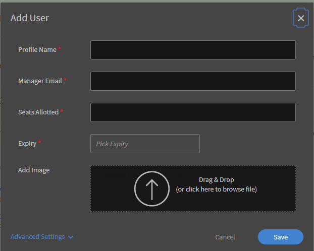
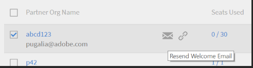
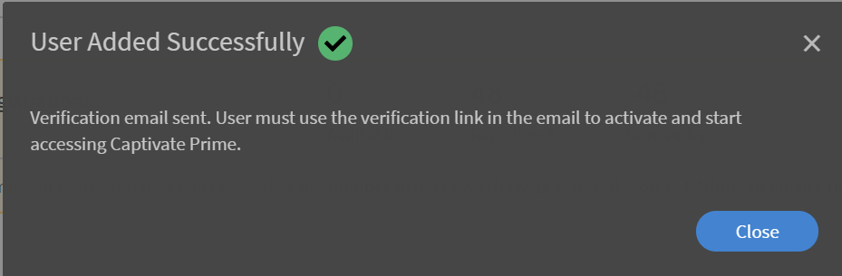

# Learning Manager でのユーザーの設定

## 社内ユーザーと社外ユーザー {#internalandexternalusers}

Learning Manager を含むあらゆる LMS で、ユーザーの管理は重要な側面です。 Learning Manager では、ユーザーを社内ユーザーと社外ユーザーに分類できます。 社内ユーザーとは、特定の組織またはグループに属するユーザーのことです。 通常、企業内のユーザーは社内ユーザーです。 これらのユーザーには、マネージャーまたは管理者が割り当てた、特定の期限がある特定の学習目標があります。

これに対して、社外ユーザーは通常、特定の Learning Manager アカウントの一時的なユーザーです。 これらのユーザーは、電子メールで受け取る一時的な外部リンクをクリックして、特定の学習目標にアクセスできます。 通常、社外ユーザーのプロファイルには有効期限があります。 例えば、Java の資格認定を行う組織で、資格認定のための関連コースを完了するために、一時的にログインするユーザーを使用する場合があります。 通常、社外ユーザー向けのクラスルームトレーニングやコースも容量が限られています。

Learning Manager で社内ユーザーと社外ユーザーを追加する方法については、以下の説明を確認してください。

## 外部ユーザーの設定 {#setupexternalusers}

管理者は、パートナー組織の従業員などの外部ユーザーを Learning Manager アカウントに追加できます。 社外ユーザーを追加するには、次の手順に従います。

1. **から&#x200B;[!UICONTROL **Administrator**]**ログインページで、「 」をクリックします**[!UICONTROL **ユーザー**]**左側のナビゲーションペイン内。
1. **内&#x200B;[!UICONTROL **ユーザー**]**ページ、**をクリック&#x200B;[!UICONTROL **外部**]**左側のナビゲーションペイン内。 社外ユーザーのリストが含まれる社外ユーザーページが表示されます（該当する場合）。
1. **をクリック&#x200B;[!UICONTROL **追加**]**をクリックします。

   

1. **内&#x200B;[!UICONTROL **ユーザーを追加**]**ポップアップダイアログボックスでは、次のフィールドは必須です。

   * **[!UICONTROL **プロファイル名**:]**作成する社外プロファイルの名前を指定します。
   * **[!UICONTROL **&#x200B;マネージャーの電子メール&#x200B;**:]** 外部ユーザーのマネージャーの電子メールアドレスを指定します。
   * **[!UICONTROL **&#x200B;割り当て済みの席&#x200B;**:]** コースに登録できる学習者の数を指定します。
   * **[!UICONTROL **&#x200B;有効期限&#x200B;**:]** 有効期限の日付を指定します。有効期限が過ぎると、外部ユーザーはコースを登録したり使用したりできなくなります。

1. クリック **[!UICONTROL **&#x200B;詳細設定&#x200B;**.]**
1. 社外プロファイルを作成する際に、必要に応じて次のオプションを設定します。

   * **[!UICONTROL **&#x200B;画像を追加&#x200B;**:]** 目的の画像をドラッグ&amp;ドロップします。 この画像は、ユーザーの学習者ページに表示されます。
   * **[!UICONTROL **&#x200B;ログイン要件&#x200B;**:]** ユーザーがログインする必要がある日数を指定します。 社外ユーザーの学習者は、このログイン期間を過ぎると、学習目標にアクセスして利用することができなくなります。
   * **[!UICONTROL **&#x200B;許可されたドメイン&#x200B;**:]** コンマで区切ってドメインを指定します。 指定されたドメインを持つユーザーのみがアカウントに登録できます。
   * **[!UICONTROL **&#x200B;メール確認が必要です&#x200B;**:]** ユーザーに確認用メールを送信する場合は、このチェックボックスをオンにします

1. **[!UICONTROL 「保存」]**&#x200B;をクリックします。

   

   URL を含むポップアップダイアログボックスが表示されます。 この URL をコピーして社外ユーザーに送信できます。 デフォルトでは、この URL を含む電子メールがユーザーに送信されます。

1. 外部プロファイルを追加すると、その外部プロファイルが **[!UICONTROL **&#x200B;外部ユーザーページ&#x200B;**(** Administrator **>**&#x200B;ユーザー&#x200B;**>**&#x200B;外部&#x200B;**)を参照してください。]** これらのユーザーの人数制限、有効期限、ログイン要件も表示されます。
1. ユーザー名をクリックすると、いつでも社外ユーザーの設定を編集できます。 **[!UICONTROL 社外登録を編集]**&#x200B;ダイアログボックスが表示されます。 設定を変更し、 **[!UICONTROL **&#x200B;保存&#x200B;**.]**
1. 社外プロファイルの横にある電子メールアイコンまたは URL をコピーアイコンをクリックすることで、いつでもウェルカムメールを再送信したり、URL をコピーしたりできます。

   

## 社外ユーザープロファイルの一時停止 {#pausetheexternaluserprofile}

外部ユーザーグループを Learning manager に追加した後で、外部ユーザーの登録プロセスを一時停止することもできます。一時停止すると、社外ユーザーの登録プロセスがブロックされます。ただし、このプロセスは、ユーザーがまだ招待を受け入れて登録していない場合にのみ機能します。

外部ユーザーグループを一時停止するには、「 」をクリックします**[!UICONTROL **アクション**]**ページの右上隅にある **[!UICONTROL 一時停止]**.

## 社外ユーザープロファイルの再開 {#resumeexternaluserprofile}

どの時点でも、「再開」オプションを選択して一時停止を取り消すことができます。**をクリック&#x200B;[!UICONTROL **アクション**]**ページの右上隅にあるを選択し、 **[!UICONTROL 履歴書]**.

**[!UICONTROL 外部ユーザーの状態]**

Learning Managerでは、社外ユーザーに次の状態が適用されます。

* **非アクティブ状態**  – この状態では、社外ユーザーの登録は期限切れです。 管理者は、ユーザー追加のワークフローで社外ユーザーを追加するときに、社外ユーザーの有効期限を設定します。
* **アクティブ状態**  – この状態の場合、社外ユーザーはLearning Managerアプリケーションに登録したり、アプリケーションにログインしたりできます。
* **一時停止状態** - この状態では、社外ユーザーの登録プロセスはブロックされます。ただし、既存のユーザーは引き続きログインできます。

## 社内ユーザーの設定 {#setupinternalusers}

管理者は、企業や組織のユーザーを設定する場合があります。 このようなユーザーは社内ユーザーとも呼ばれます。 社内ユーザーは、シングルサインオンまたは Adobe ID を使用してアプリケーションにログインできます。 これにより、ユーザーは必要に応じて学習目標にアクセスして使用できます。 組織の社内ユーザーを設定する場合、次の 3 つの方法があります。

* CSV を使用したユーザーの一括追加
* セルフ登録によるユーザーの追加
* 単一の社内ユーザーの追加

## CSV ファイルを使用したユーザーの追加 {#addingusersusingacsvfile}

ユーザー数が多い場合は、この方法を選択して社内ユーザーを追加できます。 CSV を使用してユーザーを初めて追加する場合は、CSV データの内容をアプリケーションラベルにマッピングする必要があります。 その後、新しいユーザーを追加したり、ユーザーデータを更新したりする際に、同じマッピングが保持されます。 社内ユーザーを一括で追加するには、次の手順を実行します。

1. を **[!UICONTROL 管理者ホーム]** ページをクリック**[!UICONTROL **ユーザー**]**左側のナビゲーションペイン内。
1. クリック **[!UICONTROL **&#x200B;追加&#x200B;**>** CSVのアップロード&#x200B;**.]**
1. ポップアップダイアログボックスで、 **[!UICONTROL **&#x200B;読み込み&#x200B;**.]**
1. CSV ファイルを保存した場所を参照します。 **[!UICONTROL 「開く」]**&#x200B;をクリックします。
1. CSV ファイルを読み込み、CSV ファイルの内容をアプリケーションラベルにマッピングします。 この手順は、CSV ファイルを初めてアップロードする場合にのみ適用されます。
1. **をクリック&#x200B;[!UICONTROL **保存**]**マッピングを保存します。
1. **をクリック&#x200B;[!UICONTROL **追加**]**アプリケーションデータに既にマッピングされているCSVファイルをアップロードします。

### アップロード用の CSV ファイルを作成する際の考慮事項： {#considerationswhencreatingthecsvfileforupload}

社内ユーザーをアップロードするためのCSVファイルを作成する場合、データの入力が必要な必須フィールドとして、「従業員名」、「従業員メール」、「従業員のプロファイルまたは役職」、「マネージャ階層」が表示されます。

各従業員の名前と電子メールは、アプリケーションデータに直接マッピングできます。 CSV ファイルに指定される電子メールを、マネージャーの電子メールとして指定する必要があります。 CSV ファイルの作成時にマネージャー ID を定義するか、CSV ファイルのアップロード時にマネージャー ID に対応する電子メール ID を指定できます。

***IDを従業員のマネージャーIDとして追加する前に、マネージャーがCSVファイルに従業員として追加されていることを確認します。***

***CSVファイルを正常にアップロードするために、エントリ間に余分なスペースがないことを確認します。***

CSV ファイルのサンプルスナップショットについては、以下を参照してください。

サンプルのCSVファイルをダウンロードするには、 `<give link to zip file>`.

<!--Zip file reference, no source file-->

### ルートユーザーの設定 {#settinguprootuser}

ユーザーの一括読み込みの自動化

## セルフ登録によるユーザーの追加 {#addingusersthroughselfregistration}

社内ユーザーを一括で追加する方法以外に、セルフ登録でユーザーを追加することもできます。 セルフ登録を使用すると、従業員が自分自身を Learning Manager アカウントの学習者として登録できます。 セルフ登録プロファイルを作成すると、一意の URL が作成されます。 この URL を従業員と共有して、従業員が Learning Manager に登録できるようにします。

1. **[!UICONTROL 管理者ホーム]**&#x200B;ページの左側のナビゲーションペインで、**[!UICONTROL 「ユーザー」]**&#x200B;をクリックします。
1. クリック **[!UICONTROL **&#x200B;追加&#x200B;**>**&#x200B;セルフ登録&#x200B;**.]**

   

1. **[!UICONTROL ユーザーを追加]**&#x200B;ポップアップダイアログボックスで、**[!UICONTROL 「プロファイル名」]**&#x200B;フィールドに従業員の名前を入力します。
1. を **[!UICONTROL マネージャーの名前]** フィールドに、従業員のマネージャの名前を入力します。
1. 必要に応じて、**[!UICONTROL 画像を追加]**&#x200B;フィールドを使用して、従業員のプロファイル画像を追加できます。
1. **[!UICONTROL 「保存」]**&#x200B;をクリックします。

   

   プロファイルが正常に作成されたことを示すポップアップダイアログボックスが再度表示されます。 このダイアログボックスには、一意の URL も含まれます。

1. この URL を従業員と共有すると、従業員は学習者としてセルフ登録できます。

   

## Learning Manager での単一ユーザーの追加 {#addsingleusersincaptivateprime}

アカウントに社内ユーザーを追加する 3 つ目の方法は、単一ユーザーの追加です。 少数のユーザーを追加する場合は、この手順が最適です。 単一ユーザーを追加するには、次の手順を実行します。

1. **[!UICONTROL 管理者ホーム]**&#x200B;ページの左側のナビゲーションペインで、**[!UICONTROL 「ユーザー」]** をクリックします。
1. クリック **[!UICONTROL **&#x200B;追加&#x200B;**>**&#x200B;シングルユーザー&#x200B;**.]**

1. ユーザーを追加ポップアップダイアログボックスで、ユーザーについて次の詳細を指定します。

   * **[!UICONTROL 名前]** **[!UICONTROL :]** 従業員または社内ユーザーの名前を指定します。 このフィールドは必須です。

   * **[!UICONTROL 電子メール]** **[!UICONTROL :]** 従業員の電子メールIDを指定します。 このフィールドは必須です。

   * **[!UICONTROL プロフィール]** **[!UICONTROL :]** 従業員の名称または役職を指定します。

   * **[!UICONTROL **&#x200B;マネージャーの名前&#x200B;**:]** マネージャーの名前を指定します。 ここで指定するデータベースに、マネージャーが既に追加されている必要があります。
   * **[!UICONTROL ** DOJ **:]** 従業員の入社日を指定します。
   * **[!UICONTROL **場所**:]**従業員の事業所を指定します。 例えば、組織が複数の地域に分散している場合は、従業員の所在地を指定します。

   

1. **[!UICONTROL 「追加」]**&#x200B;をクリックします。
1. ユーザーが正常に追加されたことを示すメッセージが表示されます。 ユーザーは、指定された電子メール ID で確認リンクを受信します。 ユーザーはこのリンクをクリックしてアカウントを有効にすると、Learning Manager にアクセスできるようになります。

   

## Learning Manager でのユーザーグループの管理 {#managingusergroupsincaptivateprime}

ユーザーグループは、定義されたカテゴリに関連する一連のユーザーです。 管理者はユーザーグループを使用し、属性に基づいて学習者を素早く選択できます。 さらに、ユーザーのグループにロゴやカタログをすばやく割り当てて、ユーザーの進行状況に関するカスタマイズされたレポートを生成できます。

Learning Managerには、カスタムおよび自動生成の2種類のユーザーグループがあります。 学習者をアカウントに追加すると、アカウント内のユーザーの役割とプロパティに基づいて、一部のデフォルトグループが自動的に作成されます。 これらのグループは自動生成されます。 例えば、すべての学習者またはすべての作成者が含まれるグループが作成されます。

***自動生成されたグループの名前と説明は編集できません。***

Learning Manager で自動生成されたユーザーグループを表示するには、左側のペインで&#x200B;**[!UICONTROL 「自動生成」]**&#x200B;をクリックします。 アプリケーションに、アカウントで使用可能なすべての自動生成ユーザーグループのリストが表示されます。

Learning Manager で選択したユーザーリストを使用して、カスタムグループを作成することもできます。 カスタムグループでは、ユーザーグループの名前、説明、属性を指定できます。 Learning Managerで作成するカスタムグループは、本質的に動的です。 つまり、新しいユーザーが同様の属性で追加されると、そのユーザーは自動的にこれらのユーザーグループに追加されます。

## カスタムユーザーグループの作成 {#createcustomusergroups}

1. Learning Manager の管理者ホームページで、**[!UICONTROL 「ユーザー」]**&#x200B;をクリックします。
1. カスタムユーザーグループページで、**をクリックします。[!UICONTROL **追加**]**をクリックします。

   **[!UICONTROL ユーザーグループを追加]**&#x200B;ダイアログボックスが表示されます。

   

1. ユーザーグループの名前と説明を指定します。 例えば、製品開発チームのユーザーを含む「開発ユーザー」などです。
1. ユーザーをカスタムユーザーグループに追加するには、ユーザーの名前またはプロファイルを **[!UICONTROL **&#x200B;ユーザーを追加&#x200B;**フィールドに入力します。]**
1. カスタムグループにさらにユーザーを追加するには、 **[!UICONTROL **&#x200B;さらにユーザーを追加&#x200B;**.]**
1. すべてのユーザーを追加したら、「 」をクリックします**[!UICONTROL 保存]**カスタムユーザーグループを保存します。

