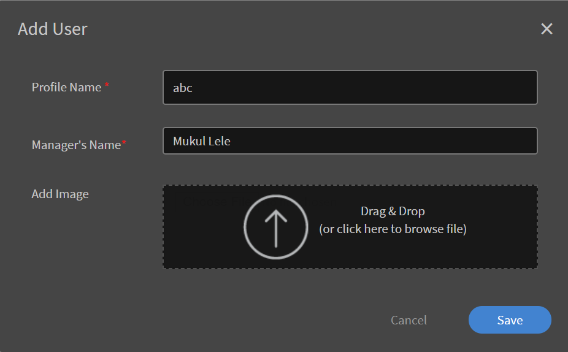

# Learning Managerでのユーザーの設定

## 社内ユーザーと社外ユーザー {#internalandexternalusers}

Learning Managerを含むLMSでは、ユーザーの管理が重要な側面です。 Learning Managerでは、ユーザーを社内と社外に分類できます。 内部ユーザーとは、特定の組織またはグループに属するユーザーのことです。 通常、企業内のユーザーは内部ユーザーです。 これらのユーザーは、マネージャーまたは管理者によって割り当てられた、特定の期限が設定された特定の学習目標を持っています。

これに対して、社外ユーザーは通常、特定のLearning Managerアカウントの一時的なユーザーです。 これらのユーザーは、電子メールで受け取る一時的な外部リンクをクリックして、特定の学習目標にアクセスできます。 通常、外部ユーザープロファイルには有効期限があります。 例えば、Javaの資格認定を行う組織には、一時的にログインして関連するコースを完了してから資格認定を試行するユーザーがいることがあります。 通常、社外ユーザー向けの教室トレーニングやコースの容量も限られています。

Learning Managerで社内ユーザーと社外ユーザーを追加する方法については、以下の説明を参照してください。

## 外部ユーザーの設定 {#setupexternalusers}

管理者は、パートナー組織の従業員などの外部ユーザーをLearning Managerアカウントに追加することができます。 社外ユーザーを追加するには、次の手順に従います。

1. **から&#x200B;[!UICONTROL **Administrator**]**ログインページで、「 」をクリックします**[!UICONTROL **ユーザー**]**左側のナビゲーションペイン内。
1. **内&#x200B;[!UICONTROL **ユーザー**]**ページ、**をクリック&#x200B;[!UICONTROL **外部**]**左側のナビゲーションペイン内。 外部ユーザーのリストが含まれる「外部ユーザー」ページが表示されます（該当する場合）。
1. **をクリック&#x200B;[!UICONTROL **追加**]**をクリックします。

   

1. **内&#x200B;[!UICONTROL **ユーザーを追加**]**ポップアップダイアログボックスでは、次のフィールドは必須です。

   * **[!UICONTROL **プロファイル名**:]**作成する社外プロファイルの名前を指定します。
   * **[!UICONTROL **&#x200B;マネージャーの電子メール&#x200B;**:]** 外部ユーザーのマネージャーの電子メールアドレスを指定します。
   * **[!UICONTROL **&#x200B;割り当て済みの席&#x200B;**:]** コースに登録できる学習者の数を指定します。
   * **[!UICONTROL **&#x200B;有効期限&#x200B;**:]** 有効期限の日付を指定します。有効期限が過ぎると、外部ユーザーはコースを登録したり使用したりできなくなります。

1. クリック **[!UICONTROL **&#x200B;詳細設定&#x200B;**.]**
1. 社外プロファイルを作成するときに、必要に応じて次のオプションを設定します。

   * **[!UICONTROL **&#x200B;画像を追加&#x200B;**:]** 目的の画像をドラッグ&amp;ドロップします。 この画像は、ユーザーの学習者ページに表示されます。
   * **[!UICONTROL **&#x200B;ログイン要件&#x200B;**:]** ユーザーがログインする必要がある日数を指定します。 外部ユーザーがこのログイン期間を超えた場合、学習者は学習目標にアクセスしたり使用したりすることはできません。
   * **[!UICONTROL **&#x200B;許可されたドメイン&#x200B;**:]** コンマで区切ってドメインを指定します。 指定されたドメインを持つユーザーのみがアカウントに登録できます。
   * **[!UICONTROL **&#x200B;メール確認が必要です&#x200B;**:]** ユーザーに確認用メールを送信する場合は、このチェックボックスをオンにします

1. クリック **[!UICONTROL をクリックします。]**

   

   URLを示すポップアップダイアログボックスが表示されます。 このURLをコピーして外部ユーザーに送信できます。 デフォルトでは、このURLを含む電子メールがユーザーに送信されます。

1. 外部プロファイルを追加すると、その外部プロファイルが **[!UICONTROL **&#x200B;外部ユーザーページ&#x200B;**(** Administrator **>**&#x200B;ユーザー&#x200B;**>**&#x200B;外部&#x200B;**)を参照してください。]** これらのユーザーの人数制限、有効期限、ログイン要件も表示されます。
1. 外部ユーザーの設定をいつでも編集するには、ユーザー名をクリックします。 この **[!UICONTROL 社外登録を編集]** ダイアログボックスが表示されます。 設定を変更し、 **[!UICONTROL **&#x200B;保存&#x200B;**.]**
1. 外部プロファイルの横にある電子メール/コピーURLのアイコンをクリックして、ウェルカムメールの再送信やURLのコピーをいつでも行うことができます。

   

## 社外ユーザープロファイルの一時停止 {#pausetheexternaluserprofile}

社外ユーザーグループをLearning Managerに追加した後で、社外ユーザーの登録プロセスを一時停止することもできます。 一時停止すると、社外ユーザーの登録プロセスはブロックされます。 ただし、このプロセスは、ユーザーが招待を受け入れてまだ登録していない場合にのみ機能します。

外部ユーザーグループを一時停止するには、「 」をクリックします**[!UICONTROL **アクション**]**ページの右上隅にある **[!UICONTROL 一時停止]**.

## 社外ユーザープロファイルの再開 {#resumeexternaluserprofile}

任意の時点で、[再開]オプションを選択して、いつでも閉塞を取り消すことができます（中断）。 **をクリック&#x200B;[!UICONTROL **アクション**]**ページの右上隅にあるを選択し、 **[!UICONTROL 履歴書]**.

**[!UICONTROL 外部ユーザーの状態]**

Learning Managerでは、社外ユーザーに次の状態が適用されます。

* **非アクティブ状態**  – この状態では、社外ユーザーの登録は期限切れです。 管理者は、外部ユーザーの有効期限を設定し、ユーザーの追加ワークフローを使用して外部ユーザーを追加します。
* **アクティブ状態**  – この状態の場合、社外ユーザーはLearning Managerアプリケーションに登録したり、アプリケーションにログインしたりできます。
* **一時停止**  – この状態では、社外ユーザーの登録プロセスはブロックされます。 ただし、既存のユーザーは引き続きログインできます。

## 社内ユーザーの設定 {#setupinternalusers}

管理者は、企業や組織のユーザーを設定することができます。 これらのユーザーは、内部ユーザーとも呼ばれます。 社内ユーザーは、シングルサインオンまたはAdobe IDを使用してアプリケーションにログインできます。 これにより、ユーザーは必要に応じて学習目標にアクセスして使用できます。 組織の内部ユーザーを設定するには、次の3つの方法があります。

* CSVを使用したユーザーの一括追加
* セルフ登録によるユーザーの追加
* 単一の内部ユーザーの追加

## CSVファイルを使用したユーザーの追加 {#addingusersusingacsvfile}

ユーザー数が多い場合は、この方法を選択して内部ユーザーを追加できます。 CSVを使用してユーザーを初めて追加する場合は、CSVデータのコンテンツをアプリケーションラベルにマッピングする必要があります。 その後、新しいユーザーを追加したり、ユーザーデータを更新したりすると、同じマッピングが保持されます。 内部ユーザーを一括で追加するには、次の手順を実行します。

1. を **[!UICONTROL 管理者ホーム]** ページをクリック**[!UICONTROL **ユーザー**]**左側のナビゲーションペイン内。
1. クリック **[!UICONTROL **&#x200B;追加&#x200B;**>** CSVのアップロード&#x200B;**.]**
1. ポップアップダイアログボックスで、 **[!UICONTROL **&#x200B;読み込み&#x200B;**.]**
1. CSVファイルの保存場所を参照します。 クリック **[!UICONTROL 開く]**.
1. CSVファイルを読み込み、CSVファイルの内容をアプリケーションラベルにマッピングします。 この手順は、CSVファイルを初めてアップロードする場合にのみ適用されます。
1. **をクリック&#x200B;[!UICONTROL **保存**]**マッピングを保存します。
1. **をクリック&#x200B;[!UICONTROL **追加**]**アプリケーションデータに既にマッピングされているCSVファイルをアップロードします。

### アップロード用のCSVファイルを作成する際の考慮事項： {#considerationswhencreatingthecsvfileforupload}

社内ユーザーをアップロードするためのCSVファイルを作成する場合、データの入力が必要な必須フィールドとして、「従業員名」、「従業員メール」、「従業員のプロファイルまたは役職」、「マネージャ階層」が表示されます。

各従業員の名前と電子メールは、アプリケーションデータに直接マッピングできます。 CSVファイルに指定されている電子メールをマネージャーの電子メールとして指定する必要があります。 CSVファイルの作成時にマネージャーIDを定義するか、CSVファイルのアップロード時にマネージャーIDに対応する電子メールIDを指定できます。

***IDを従業員のマネージャーIDとして追加する前に、マネージャーがCSVファイルに従業員として追加されていることを確認します。***

***CSVファイルを正常にアップロードするために、エントリ間に余分なスペースがないことを確認します。***

CSVファイルのサンプルスナップショットについては、次を参照してください。

サンプルのCSVファイルをダウンロードするには、 `<give link to zip file>`.

<!--Zip file reference, no source file-->

### rootユーザーの設定 {#settinguprootuser}

ユーザーの一括読み込みの自動化

## セルフ登録によるユーザーの追加 {#addingusersthroughselfregistration}

社内ユーザーを一括で追加する以外に、セルフ登録でユーザーを追加することもできます。 セルフ登録を使用すると、従業員が自分自身をLearning Managerアカウントの学習者として登録できます。 セルフ登録プロファイルを作成すると、一意のURLが作成されます。 このURLを従業員と共有して、従業員がLearning Managerに登録できるようにします。

1. を **[!UICONTROL 管理者ホーム]** ページをクリック **[!UICONTROL ユーザー]** をクリックします。
1. クリック **[!UICONTROL **&#x200B;追加&#x200B;**>**&#x200B;セルフ登録&#x200B;**.]**

   

1. を **[!UICONTROL ユーザーを追加]** ポップアップダイアログボックスで、従業員の名前を **[!UICONTROL プロファイル名]** フィールドに入力します。
1. を **[!UICONTROL マネージャーの名前]** フィールドに、従業員のマネージャの名前を入力します。
1. 必要に応じて、次の方法で従業員のプロファイル画像を追加できます **[!UICONTROL 画像を追加]** フィールドに入力します。
1. クリック **[!UICONTROL 保存]**.

   

   プロファイルが正常に作成されたことを示すポップアップダイアログボックスが再度表示されます。 このダイアログボックスには、一意のURLも生成されます。

1. このURLを従業員と共有すると、従業員が学習者としてセルフ登録できるようになります。

   

## Learning Managerでのシングルユーザーの追加 {#addsingleusersincaptivateprime}

シングルユーザーの追加は、アカウントに内部ユーザーを追加できる3番目の方法です。 少数のユーザーを追加する場合は、この手順が最適です。 1人のユーザーを追加するには：

1. を **[!UICONTROL 管理者ホーム]** ページをクリック **[!UICONTROL ユーザー]** をクリックします。
1. クリック **[!UICONTROL **&#x200B;追加&#x200B;**>**&#x200B;シングルユーザー&#x200B;**.]**

1. ユーザーの追加ポップアップダイアログボックスで、ユーザーについて次の詳細を指定します。

   * **[!UICONTROL 名前]** **[!UICONTROL :]** 従業員または社内ユーザーの名前を指定します。 このフィールドは必須です。

   * **[!UICONTROL 電子メール]** **[!UICONTROL :]** 従業員の電子メールIDを指定します。 このフィールドは必須です。

   * **[!UICONTROL プロフィール]** **[!UICONTROL :]** 従業員の名称または役職を指定します。

   * **[!UICONTROL **&#x200B;マネージャーの名前&#x200B;**:]** マネージャーの名前を指定します。 ここで指定するデータベースに、マネージャーが既に追加されている必要があります。
   * **[!UICONTROL ** DOJ **:]** 従業員の入社日を指定します。
   * **[!UICONTROL **場所**:]**従業員の事業所を指定します。 例えば、組織が複数の地域に分散している場合は、従業員の所在地を指定します。

   

1. クリック **[!UICONTROL 追加]**.
1. ユーザーが正常に追加されたことを示すメッセージが表示されます。 ユーザーは、指定された電子メールIDの確認リンクを受信します。 ユーザーはこのリンクをクリックしてアカウントを有効にし、Learning Managerへのアクセスを開始できます。

   

## Learning Managerでのユーザーグループの管理 {#managingusergroupsincaptivateprime}

ユーザーグループは、定義されたカテゴリに関連する一連のユーザーです。 管理者はユーザーグループを使用し、属性に基づいて学習者を素早く選択できます。 さらに、ユーザーのグループにロゴやカタログをすばやく割り当てて、ユーザーの進行状況に関するカスタマイズされたレポートを生成できます。

Learning Managerには、カスタムおよび自動生成の2種類のユーザーグループがあります。 学習者をアカウントに追加すると、アカウント内のユーザーの役割とプロパティに基づいて、一部のデフォルトグループが自動的に作成されます。 これらのグループは自動生成されます。 例えば、すべての学習者またはすべての作成者が含まれるグループを作成できます。

***自動生成されたグループの名前と説明は編集できません。***

Learning Managerで自動生成されたユーザーグループを表示するには、左側のペインで **[!UICONTROL 自動生成]**. アプリケーションに、アカウントで使用可能なすべての自動生成ユーザーグループのリストが表示されます。

Learning Managerで選択したユーザーリストを使用して、カスタムグループを作成することもできます。 カスタムグループでは、ユーザーグループの名前、説明、属性を指定できます。 Learning Managerで作成するカスタムグループは、本質的に動的です。 つまり、新しいユーザーが同様の属性で追加されると、そのユーザーは自動的にこれらのユーザーグループに追加されます。

## カスタムユーザーグループの作成 {#createcustomusergroups}

1. Learning Manager管理者ホームページで、次をクリックします **[!UICONTROL ユーザー]**.
1. カスタムユーザーグループページで、**をクリックします。[!UICONTROL **追加**]**をクリックします。

   システムには、 **[!UICONTROL ユーザーグループを追加]** ダイアログボックスに表示されます。

   

1. ユーザーグループの名前と説明を指定します。 たとえば、製品開発チームのユーザーを含む開発ユーザーなどです。
1. ユーザーをカスタムユーザーグループに追加するには、ユーザーの名前またはプロファイルを **[!UICONTROL **&#x200B;ユーザーを追加&#x200B;**フィールドに入力します。]**
1. カスタムグループにさらにユーザーを追加するには、 **[!UICONTROL **&#x200B;さらにユーザーを追加&#x200B;**.]**
1. すべてのユーザーを追加したら、「 」をクリックします**[!UICONTROL 保存]**カスタムユーザーグループを保存します。

