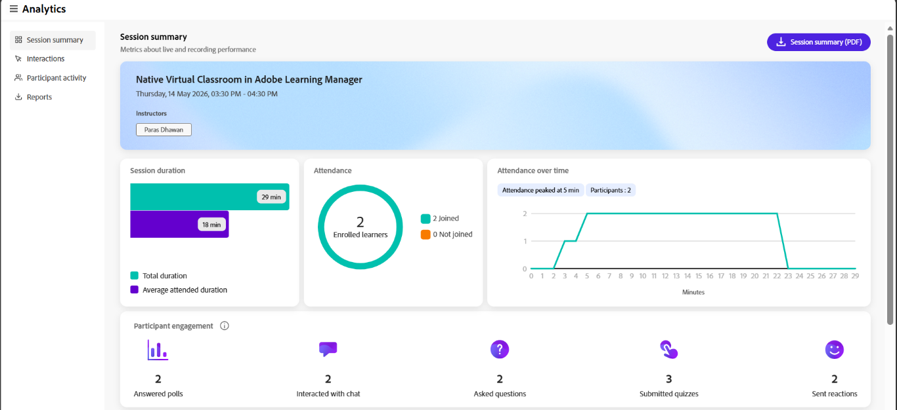
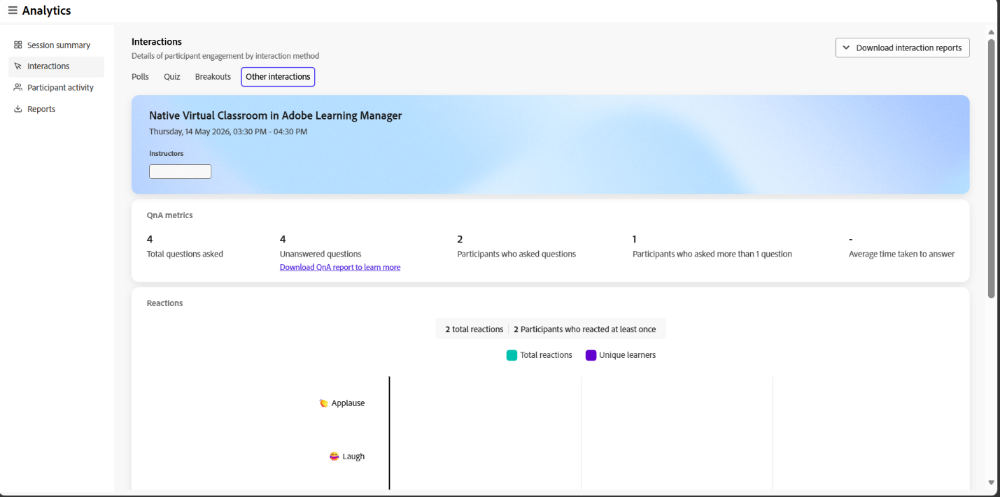

# セッションダッシュボードのコンポーネント

## 概要

Live Hubのセッションダッシュボードには、セッションパフォーマンスと学習者のエンゲージメントに関する詳細なインサイトを提供する複数のセクションがあります。

各コンポーネントは、インストラクターが参加を分析し、学習者の行動を理解し、ライブハブセッションの有効性を評価するのに役立ちます。

## セッションの概要

セッションの概要では、ライブおよび録画されたセッションの概要（セッション録画を含む）が表示されます。 登録済み学習者と参加済み学習者の数、セッション期間、一定期間の出席、参加者のエンゲージメント、記録ビューなどの詳細が含まれます。

**セッションの概要(PDF)**&#x200B;を選択して、概要をダウンロードします。

*[セッションの概要(PDF)]を選択して、概要をダウンロードします。*

次の詳細を表示できます。

* **セッション期間**：合計ライブセッション期間と学習者全体の平均出席期間を表示します。

* **出席**：登録されている学習者の数と、参加した学習者および参加しなかった学習者の数を表示します。

* **一定期間の出席** ：セッション全体の出席の変化を表示します。出席のピークや参加者数も表示されます。

* **参加者のエンゲージメント** ：学習者がセッション中にどのようにエンゲージメントしたかを表示します。これには、回答済みの世論調査の数、チャットでのやり取り、質問、提出されたクイズ、送信されたリアクションなどが含まれます。

### 録画

セッション録画に関連するインサイトを表示します。 これらのインサイトは、学習者のエンゲージメントと記録の消費を理解するのに役立ちます。 また、記録をダウンロードして、さらに分析するためのレポートにアクセスすることもできます。

* **視聴回数の合計**：録画が視聴された回数の合計と、一意の閲覧者の数。

* **ライブセッションにも参加した視聴者**:ライブセッションに参加し、後で録画を視聴した学習者の数。 **リストのダウンロード**&#x200B;を選択して、学習者リストを表示します。

* **平均表示時間**：学習者が記録を視聴した平均時間。

*レコーディングのインサイトを表示するセッションダッシュボードビュー。*

記録オプションから、次のアクションを実行できます。

* **ダウンロード**&#x200B;を選択して、録画をダウンロードします。

* **レコーディングを編集**&#x200B;を選択して、レコーディングを変更します。 録音プレーヤーで録音が開きます。

## インタラクション

学習者がインタラクションを行い、インタラクションからセッションに参加する方法を表示します。 エンゲージメントツール全体にわたって、投票への回答、Q&amp;Aメトリックス、出席者の反応を追跡できます。

左側のパネルで「**インタラクション**」を選択して、出席者の参加方法を表示します。

インタラクションダッシュボードは、次のタブで構成されています。

### 投票

「投票」タブでは、投票に追加された質問と回答を確認できます。 また、「**投票**」タブから、すべての投票のインタラクションに関するレポートをダウンロードすることもできます。 レポートには、次の情報が含まれます。

* 参加者の詳細（名、姓、メールアドレスなど）

* 投票番号、投票の種類、および投票質問。

* 投票に対する各参加者の回答。

*投票のやり取りを表示するセッションダッシュボードビュー。*

### クイズ

このタブでは、ライブセッション中のクイズ指標を表示できます。 次のパネルが含まれています。

* クイズのインタラクションのレポートをZIP形式でダウンロードします。

* クイズを送信した学習者、未完了の学習者、未試行の学習者を示す図を表示します。

* クイズ内の質問の数。 **[リストの表示]**&#x200B;を選択して、すべての質問を表示します。

* **詳細レポートを表示**&#x200B;を選択して、参加者レポートを質問リスト、質問、リーダーボード、および個々の回答ごとに表示します。

* 回答の平均精度です。 **リーダーボードを表示**&#x200B;を選択して、スコアを表示します。

* クイズの試行にかかった平均時間。

*クイズのインタラクションを表示するセッションダッシュボードビュー。*

## 部分断面図

ライブクラス中に学習者がブレークアウトセッションに参加した方法を表示します。 このセクションでは、ブレイクアウトアクティビティの概要と、各ブレイクアウトセッションに関する詳細なインサイトを提供します。

* **ブレイクアウトセッション**:セッション中に実行されたブレイクアウトセッションの総数。

* **ブレークアウトの期間**：すべてのブレークアウトセッションの期間の合計です。

* **ブレークアウト間の参加者**:ブレークアウトセッションに参加した参加者の数。

**ブレークアウトレポート(PDF)**&#x200B;を選択して、レポートをダウンロードします。

*ブレークアウトセッションのインサイトを表示するセッションダッシュボードビュー。*

各ブレイクアウトセッションについて、セッション名、期間および開始時間を表示できます。 次の情報も表示できます。

* **参加者**:ブレイクアウトセッションの参加者の総数。

* **参加者分布**：参加レベル別の参加者の内訳。 使用可能なレベルは、「高」、「中」、「低」です。

* **部屋**：作成されたブレークアウト部屋の数。

**詳細の表示**&#x200B;を選択してブレークアウトセッションを展開し、ルームレベルのインサイトを確認します。 **詳細を非表示**&#x200B;を選択して、もう一度折りたたみます。

### 小会議室の詳細

展開されたビューでは、各部屋に次の情報が表示されます。

* **説明**：会議室の参加者に与えられたプロンプトまたはアクティビティ。

* **チャットのトランスクリプト**: **チャットのトランスクリプト**&#x200B;を選択して、会議室で交換されたチャットを表示します。

* **会議室のインストラクター**：各インストラクターの名前、ブレークアウトの時間、話し時間が一覧表示されたテーブルです。

* **会議室の参加者**：各参加者の名前、ブレークアウトの時間、話し時間、および参加レベルを一覧表示するテーブルです。

*ブレイクアウトルームのインストラクターと参加者の詳細を一覧表示した表。*

## その他のインタラクション

右上のドロップダウンから「**インタラクションレポートをダウンロード**」を選択して、**Q&amp;A**&#x200B;と&#x200B;**リアクション**&#x200B;のレポートをダウンロードします。

*対話レポートをダウンロードするオプションを表示するセッションダッシュボードビュー。*

### Q&amp;Aメトリクス

Q&amp;Aメトリックの次の属性の表示

* 質問の合計数。

* 未回答の質問の数。

* 質問を行った出席者の数。

* 上位の見込み客になる可能性のある、複数の質問を行った出席者の数。

* 質問への回答にかかる平均時間。

### 反応

セッション中の学習者の反応（同意、不一致、拍手、笑いなど）を表示します。

グラフに次の詳細を表示します。

* 反応の合計。

* 少なくとも1回は反応した出席者の数。

* 合計クリック数。

* 一意の出席者。

* 一意の参加者が行ったすべてのリアクションの合計クリック数をグラフで表示します。

## 参加者のアクティビティ

「**参加者アクティビティ**」セクションには、セッション中の個々の学習者のエンゲージメントが統合されたビューで表示されます。 インストラクターが参加レベルを分析し、様々なアクティビティにわたって学習者のインタラクションを追跡するのに役立ちます。

左パネルから「**参加者アクティビティ**」を選択して、学習者レベルの詳細なインサイトを表示します。 **参加者のアクティビティレポート(CSV)**&#x200B;を選択して、完全なレポートをダウンロードします。

*参加者の活動レポートの詳細を示すテーブル。*

この表には、学習者アクティビティに関する次の情報が表示されます。

* **参加者の詳細**：参加者の名前とメールID。

* **出席期間**：参加者が参加したセッションの割合。

* **回答済みの投票**：参加者が回答した投票の数。

* **送信されたクイズ**：参加者が送信したクイズの数。

* **全体的なクイズスコア**：参加者がクイズで獲得したスコア。

* **発表時間**：参加者がセッション中に話した時間。

* **カメラ時間**：学習者のカメラがアクティブであった時間。

* **質問** ：参加者が質問した質問の数。

* **リアクション**：参加者が共有したリアクションの数。

* **疑いの反応がある**：参加者がセッション中に疑いを示した回数。

## レポート

インストラクターとして、集中管理されているハブから様々なアクティビティのレポートをダウンロードします。 これらのレポートには、ライブおよび録画されたパフォーマンス中の参加者のやりとりとエンゲージメントが記録されます。

レポートをダウンロードするには、次の手順に従います。

1. 左パネルから、「**レポートをダウンロード**」を選択します。

1. すべてのアクティビティの統合レポートをダウンロードするには、[**すべて(.zip)**]を選択します。

   
   *[すべてダウンロード(.zip)]を選択して、結合されたレポートをダウンロードします。*

1. 各レポートの横にあるダウンロードアイコンを選択して、個別にダウンロードします。
