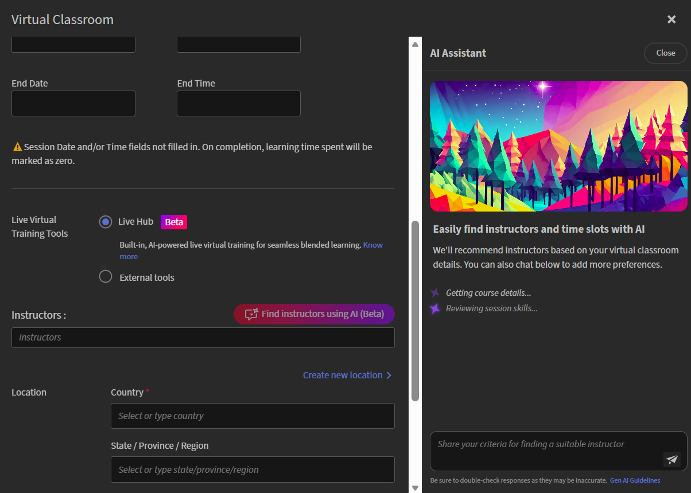

# ライブハブ（ベータ版）セッションの作成

ライブハブを使用して、Adobe Learning Managerコース内でインストラクターによるライブトレーニングを実施します。 ライブハブセッションとセルフペースコンテンツを組み合わせて、ブレンドされた学習体験を作成できます。

バーチャルクラスルームモジュールをコースに追加する場合、ライブセッションをホストするバーチャルトレーニングツールを選択します。 Adobeに組み込まれたAI利用のバーチャルトレーニングソリューションである&#x200B;**Live Hub**&#x200B;を選ぶか、**Adobe Connect**&#x200B;などの外部プロバイダーを使用できます。

>[!NOTE]
>
> ライブハブは、管理者がライブハブ設定で有効にしている場合にのみ、ライブのバーチャルトレーニングツールオプションとして表示されます。 有効になっていない場合は、Adobe Connectなどの外部プロバイダーを使用してください。 詳細については、[Live Hubを有効にする](../administrators/feature-summary/enable-live-hub.md)を参照してください。

ライブハブコースを作成すると、次の操作を実行できます。

* コースに1つ以上のライブハブセッションを追加します。

* インストラクターを手動で選択するか、AIを活用したインストラクターの推奨事項を使用します。

* 1つのデフォルトインスタンスでコースを設定するか、異なるスケジュールやオーディエンスに対して複数のインスタンスを作成します。

この記事では、Live Hubコースの作成、インストラクターの割り当て、コースインスタンスの設定を行う方法について説明します。

## ライブハブコースの作成

バーチャルクラスルームモジュールを追加すると、デフォルトのインスタンスが自動的に作成されます。 これは、1つのセッションまたはすべての学習者に対する標準スケジュールを配信する場合に便利です。

ライブハブコースを作成するには：

1. 作成者としてAdobe Learning Managerにログインします。

1. **「コースの作成」**&#x200B;を選択します。

1. **コースカタログ**&#x200B;ページで、**追加**&#x200B;を選択し、次の詳細を入力します。

   1. コース名

   1. 簡単な説明

   
   *コースにモジュールを追加する前に、コース名と簡単な説明を入力してください。*

1. **モジュール**&#x200B;セクションで&#x200B;**コンテンツ** / **モジュールを追加**&#x200B;を選択します。  **モジュールタイプの選択**&#x200B;ポップアップウィンドウが表示されます。

1. **バーチャルクラスルーム**&#x200B;を選択して、タイトル、説明、タイムゾーン、開始日と終了日、開始時刻と終了時刻などのコースの詳細を入力します。

1. **ライブ仮想トレーニングツール**&#x200B;で&#x200B;**ライブハブ**&#x200B;を選択します。

   
   *Live Hubを選択して、セッションに対してAIを活用したインストラクターの推奨事項を有効にします。*

1. 次のいずれかのオプションを使用して、インストラクターを追加します。

   1. **インストラクター**&#x200B;のフィールドにインストラクター名を入力します。

   1. 「**AIを使用したインストラクターの検索**」を選択して、AI推奨のインストラクターを表示します。 詳しくは、[インストラクターファインダーを使用したインストラクターの追加](#add-instructors-using-instructor-finder)をご覧ください。

1. **追加** > **保存**&#x200B;を選択します。

1. 「**コーススキル**」セクションで必要なスキルを選択します。

1. **スキルレベル**&#x200B;を選択し、**最大クレジット数**&#x200B;を確認または更新してください。

   
   *学習者がコースを完了して獲得する単位を定義するためのスキルとスキルレベルを割り当てます。*

1. **保存**/**Publish**&#x200B;を選択します。 Adobe Learning Managerでコースが正常に作成されました。

## コースインスタンスの作成

管理者は、コースのインスタンスを1つ以上作成して、様々な対象者、スケジュール、または場所に提供することができます。 各インスタンスには独自のセッション詳細があるため、同じコースの各インスタンスに異なるインストラクター、インストラクターファインダーの推奨事項およびタイミングを割り当てることができます。

コースインスタンスを作成するには：

1. 作成者としてAdobe Learning Managerにログインします。

1. コースを開いて、左パネルから&#x200B;**インスタンス**&#x200B;を選択します。

   
   *既定のインスタンスは、バーチャル教室モジュールを追加すると自動的に作成されます。*

1. **[新しいインスタンスの追加]**&#x200B;を選択します。

1. **インスタンス名**、**開始日**、および&#x200B;**完了期限**&#x200B;を入力します。 **詳細オプションの表示**&#x200B;を選択して、追加の設定を構成します。

   
   *インスタンス名、開始日、および完了期限を入力して、新しいコースインスタンスを作成します。*

1. 「**保存**」を選択します。  新しいインスタンスが&#x200B;**インスタンス**&#x200B;リストに追加されます。

   
   *新しいインスタンスは、インスタンスリストの既定のインスタンスと共に表示されます。*

1. **セッション**&#x200B;の下の番号を選択して、**セッションの詳細**&#x200B;を表示します。

   
   *セッションの詳細には、まだ設定が必要なタイミング、インストラクター、場所のフィールドが表示されます。*

1. セッション詳細の横にある編集（鉛筆）アイコンを選択して、セッション設定パネルを開きます。

   
   *特定のセッションインスタンスのスケジュール、インストラクター、および場所を構成します。*

1. 「**インストラクター**」フィールドに、名前を手動で入力するか、**AIを使用してインストラクターを検索**&#x200B;して、AIが推奨するインストラクターを指定します。 詳しくは、[インストラクターファインダーを使用したインストラクターの追加](#add-instructors-using-instructor-finder)をご覧ください。

1. **場所**&#x200B;の詳細を入力し、**保存**&#x200B;を選択します。 セッションが更新され、設定された日時、インストラクター、場所の詳細が表示されます。

## インストラクターFinderを使用したインストラクターの追加

インストラクターを手動で検索して追加する代わりに、**インストラクターファインダー**&#x200B;を使用して、AIを活用したインストラクターによるセッションの推奨事項を受け取ることができます。 インストラクターファインダーは、コースの詳細と必要なスキルに基づいてインストラクターを照合します。また、組織の休日カレンダー、インストラクターの空き状況、インストラクターの利用状況も考慮して、最適なインストラクターを提案します。 詳しくは、[インストラクターを追加および管理](./instructor-management.md)をご覧ください。

>[!NOTE]
>
> インストラクターファインダーは、管理者がライブハブ設定でインストラクターファインダーアシスタントを有効にしている場合にのみ表示されます。 詳細については、[Live Hubを有効にする](../administrators/feature-summary/enable-live-hub.md)を参照してください。

インストラクターファインダーを使用してインストラクターを追加するには：

1. **バーチャルクラスルーム**&#x200B;モジュールの&#x200B;**インストラクター**&#x200B;セクションに移動します。

1. **AIを使用してインストラクターを検索**&#x200B;を選択します。  右側に&#x200B;**AIアシスタント**&#x200B;パネルが開きます。

   
   *AIアシスタントパネルを使用して、セッションの詳細に基づいてインストラクターと時間帯の推奨事項を取得します。*

1. 推奨インストラクターのリストを確認します。 インストラクターファインダーは、コーススキルとセッション要件に基づいて、インストラクターを推奨します。 Recommendationsでは、インストラクターの空き状況、利用状況、組織の休日カレンダーについても検討します。 詳しくは、**インストラクターの管理**&#x200B;をご覧ください。

1. 割り当てるインストラクターに移動し、「**追加**」を選択します。  選択したインストラクターが、**インストラクター**&#x200B;のフィールドにタグとして追加されます。

## コースへの学習者の登録

学習者は、次の2つの方法でライブハブコースに登録できます。

1. **管理者**&#x200B;は、組織の要件に基づいて、学習者をコースに登録します。 詳細については、[コースインスタンスと学習パスの作成](https://experienceleague.adobe.com/en/docs/learning-manager/using/admin/courses)を参照してください。

1. 学習者は、**カタログ**&#x200B;ページからコースに直接登録できます。 コースがセルフ登録用に設定されている場合、学習者はすぐに登録され、**学習状況**&#x200B;からコースにアクセスできます。 詳細については、[学習状況](https://experienceleague.adobe.com/en/docs/learning-manager/using/learner/courses)を参照してください。

登録後、学習者はコースに追加され、Adobe Learning Managerアカウントに通知を受け取ります。 アカウントの電子メール通知の設定によっては、学習者が電子メールでコースへの参加の招待を受け取る場合もあります。

## ライブハブのルームブランディングのカスタマイズ

管理者は、組織のブランディングに合わせてライブハブルームの外観をカスタマイズできます。 Adobe Learning Managerの&#x200B;**テーマ**&#x200B;設定を使用して、ライブハブセッション全体でブランドカラー、ロゴ、ビジュアルスタイルを適用します。

カスタマイズされたブランディングは、一貫した学習体験を作成し、ライブトレーニングセッションに組織のアイデンティティを反映させるのに役立ちます。

テーマの構成の詳細については、[カラーテーマ](../administrators/feature-summary/themes.md#color-themes)の記事を参照してください。
