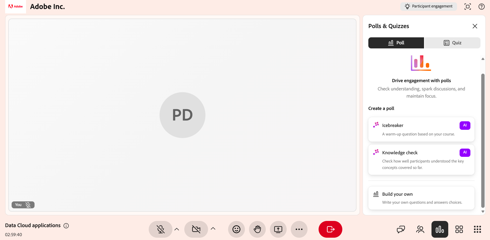
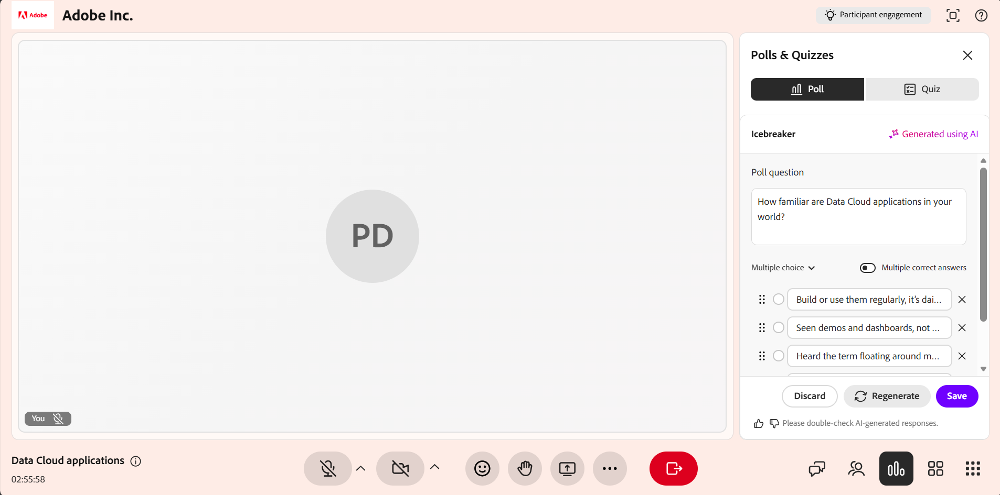

# 投票を作成して開始する

投票を使用して、ライブハブセッションをよりインタラクティブで魅力的にします。 **投票とクイズ**&#x200B;パネルでは、複数選択や短回答などの質問の種類を選択して投票を手動で作成したり、**Icebreaker**&#x200B;と&#x200B;**ナレッジチェック**&#x200B;のオプションを指定したAIを使用して投票を生成したりできます。

ライブセッションでは、投票を開始して閉じたり、回答をリアルタイムで監視したり、参加者の回答を確認したり、学習者と結果を共有するかどうかを選択したりできます。 この記事では、ライブハブセッション中に投票を作成、管理、および共有する方法について説明します。

## 投票を手動で作成

ライブセッション中に投票を作成して質問し、学習者から回答を収集できます。 事前または即時に投票を作成して、理解度を確認し、フィードバックを収集して、参加を促すことができます。

ポーリングを手動で作成するには、次の手順に従います。

1. コントロールバーからを選択します。

1. [**投票**]タブを選択し、[**独自に作成**]を選択します。

   
   *投票を手動で作成するには、[投票]タブで[自分で作成]を選択してください。*

1. 「**投票**」タブで、ドロップダウンから次のいずれかの質問タイプを選択します。

   1. 多肢選択

   1. 短い答え

1. 選択した質問タイプに基づいて投票を設定します。

   1. **複数選択** ：各回答オプションを個別の行に入力します。 デフォルトでは、3つのオプションフィールドを使用できます。 次の操作を実行できます。

      1. さらにオプションを追加するには、[**オプションの追加**]を選択します。

      1. 複数の選択を許可するには、**複数の正解**&#x200B;を有効にします。

   1. **短い回答**：回答オプションは必要ありません。 学習者はテキストフィールドに回答を入力します。

1. 「**保存**」を選択します。

## AIを使用した投票の作成

**投票とクイズ**&#x200B;パネルでAI支援オプションを使用すると、投票の質問を手動で作成せずに生成できます。 次の2種類のAI投票タイプを使用できます。

* **Icebreakerポーリング**:セッションの開始時または休憩の後に再開するときに参加を促すための入門的または会話的な質問を生成します。

* **ナレッジチェックの投票**:ナレッジチェックの質問を生成して、インストラクターが学習者がトピックにどの程度従っているかを理解し、必要に応じてアプローチを調整できるようにします。

### アイスブレーカー投票の作成

アイスブレーカーの投票を作成して、セッションの開始時に学習者を参加させます。 Icebreakerのポーリングにより、インストラクターは学習者の環境設定、期待値、または以前の知識を理解し、セッションの早い段階での参加を促すことができます。

Icebreakerポーリングを作成するには：

1. コントロールバーからを選択します。

1. 「**投票**」タブを選択してから、「**Icebreaker poll**」を選択します。

1. 生成された質問と回答のオプションを確認し、必要に応じて変更します。 次の操作を実行できます。

   * 質問を編集する

   * 既存の回答オプションを更新または削除します。

   * 質問の種類を&#x200B;**短い回答**&#x200B;に変更します。

   * **[オプションの追加]**&#x200B;を選択して、追加の選択肢を含めます。

   * 複数選択問題の場合は、**複数の正解**&#x200B;を有効にします。

   
   *[投票]タブでAIを使ってアイスブレーカー投票を生成し、カスタマイズします。*

1. （オプション） **投票を再生成**&#x200B;を選択して、新しい質問を生成します。

1. （オプション）生成されたコンテンツに対してフィードバックを提供するには、「親指を上げる」または「親指を下げる」オプションを使用します。

1. 「**保存**」を選択します。

### 知識調査の投票の作成

ナレッジチェックの投票を作成して、セッション中の学習者の理解度を評価し、学習者がトピックをどの程度理解しているかを評価します。 これらのアンケートは、インストラクターが知識のギャップを特定し、重要な概念を検証し、学習者の回答に基づいてセッションのペースやフォーカスを調整するのに役立ちます。

ナレッジ・チェック投票を作成する手順は、次のとおりです。

1. コントロールバーからを選択します。

1. [**投票**]タブを選択し、[**ナレッジチェック**]を選択します。

1. 生成された質問と回答のオプションを確認し、必要に応じて変更します。 次の項目を変更できます。

   * 質問を編集する

   * 既存の回答オプションを更新または削除します。

   * 質問タイプを変更します。

   * **[オプションの追加]**&#x200B;を選択して、追加の選択肢を含めます。

   * 複数選択問題の場合は、**複数の回答がある**&#x200B;を有効にします。

   
   *[投票]タブでAIを使用してナレッジチェックの投票を生成およびカスタマイズします。*

1. （オプション）現在の質問を新しい質問に置き換えるには、**投票を再生成**&#x200B;を選択します。

1. （オプション）生成されたコンテンツに対してフィードバックを提供するには、「親指を上げる」または「親指を下げる」オプションを使用します。

1. 「**保存**」を選択します。

## 世論調査を始める

投票を作成して保存すると、**投票とクイズ**&#x200B;パネルの「**投票**」タブに表示されます。 セッション中はいつでも保存した投票にアクセスして起動し、学習者を引き付けたり、回答をリアルタイムで収集したりできます。

投票を開始する手順は、次のとおりです。

1. コントロールバーからを選択します。

1. [**投票**]タブを選択します。

1. リストから保存済みの投票を選択します。

1. **[投票の開始]**&#x200B;を選択します。

>[!NOTE]
>
> 投票は学習者に表示され、インストラクターは投票結果をリアルタイムで表示できます。 学習者は、投票の実施中でも回答を更新できます。

*セッション中に回答の収集を開始するには、[投票の開始]を選択します。*

## 投票結果を参加者と共有する

セッション中はいつでも投票結果を参加者と共有できます。 **すべての参加者に結果を共有**&#x200B;を選択して、結果をリアルタイムで表示します。 結果が共有されると、投票には&#x200B;**Results live**&#x200B;タグが表示されます。これは、学習者が投票の結果を表示できることを示します。

*投票結果をリアルタイムで表示するには、[すべての参加者に結果を共有する]を選択してください。*

## 投票を閉じる

参加者による回答が不要になった場合は、投票を終了できます。

投票を閉じるには、次の手順に従います。

1. コントロールバーからを選択します。

1. 「**投票**」タブでアクティブな投票に移動します。

1. **投票の終了**&#x200B;を選択します。

*回答の収集を停止して投票を終了するには、[投票の終了]を選択してください。*

投票が終了すると、投票質問の上に&#x200B;**クローズ**&#x200B;状態が表示されます。

## 投票の結果を表示

インストラクターは、セッション中に投票の結果を確認することができます。 これらの結果は、学習者が回答を送信または更新するたびにリアルタイムで更新されます。 デフォルトでは、投票ビューには各オプションの回答の全体的な分布が表示されます。

応答の詳細を表示するには、次の手順に従います。

1. [**投票**]タブを開きます。

1. アクティブな投票または閉じた投票を選択します。

1. **回答を表示**&#x200B;を選択します。

ポップアップウィンドウが開き、参加者名、選択された回答、複数の回答を許可する質問の複数のエントリが表示されます。

*投票応答ウィンドウで参加者名と選択した回答を表示します。*

学習者は、回答の送信または更新時に投票結果をリアルタイムで表示できます。

## 非公開の投票の管理

投票が閉じられた後、投票のオプションメニュー（3つのドット）から投票を管理できます。 これらのオプションを使用すると、投票を再利用したり、コピーを作成したり、セッションから削除したりできます。

クローズされた投票を管理する手順は、次のとおりです。

1. から、[**ポーリング**]タブを選択します。

1. 閉じた投票に移動し、オプション(**...**)を選択します メニュー。

   
   *オプションメニューを使用して、閉じた投票をリセット、複製、または削除します。*

1. 次のいずれかのオプションを選択します。

| **オプション** | **説明** |
|----|----|
| **リセット** | ポーリング自体を変更せずに、ポーリングに対するすべての応答を完全に削除します。 これを使用して同じポーリングを再実行し、新しい応答セットを収集します。 |
| **複製** | Q&amp;Aオプションも含めて投票のコピーを作成するので、最初から作成し直すことなく、再利用や調整を行うことができます。 |
| **削除** | ポーリングとそのすべての応答をセッションから完全に削除します。 この操作は元に戻せません。 |

>[!NOTE]
>ポーリングの複製、削除、またはリセット中にエラーが発生した場合は、[Live Hubのトラブルシューティングガイド](../kb/troubleshooting-guide-for-live-hub.md#poll-tab-issues)で、一般的なエラーメッセージの一覧とそれらの解決方法を参照してください。
